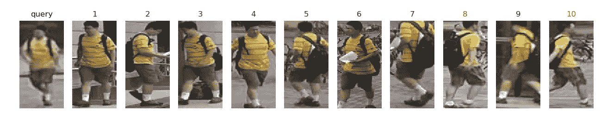
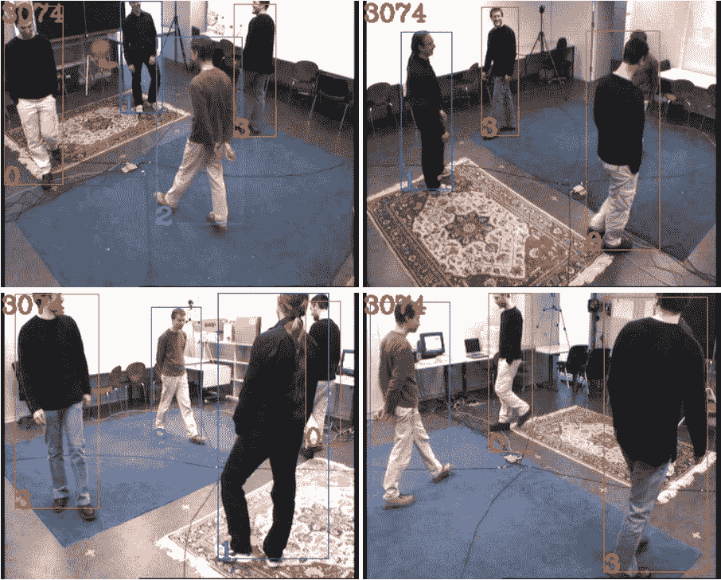
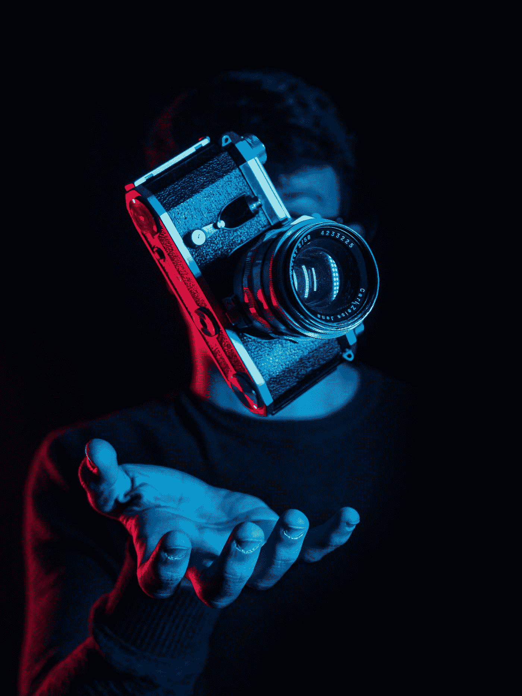

# 为什么我们都需要重新鉴定身份？

> 原文：<https://towardsdatascience.com/why-we-need-person-re-identification-3a45d170098b?source=collection_archive---------20----------------------->

## 从不同角度和位置深入了解如何识别人

弗兰基·查马基在 [Unsplash](https://unsplash.com?utm_source=medium&utm_medium=referral) 上拍摄的照片

在这篇文章中，我将向您简要介绍跟踪和重新识别领域，但不涉及技术细节。在谈论重新识别之前，有必要提一下什么是身份识别(跟踪)及其工作原理。追踪是安全人员的职责，唯一的区别是机器完成了所有的工作。因此，计算机要么从监控摄像头接收一些预先录制的视频，要么接收实时视频，并试图区分人和对他们进行分类。在跟踪的帮助下，我们可以看到场景中每个人的形状，并识别他们的运动。这一切都很好，但在现实世界的场景中，跟踪还有几个问题...

# 多人跟踪问题

(图片由作者提供，由 Person reID project 制作)

虽然追踪可以让我们接收场景中任何人的所有运动轨迹，并区分不同的人，但当我们有多个摄像头时，问题就开始出现了。例如，如果同一个人穿过购物中心，在摄像机前脱下夹克，他将不会被认出来。不同的姿势、服装、背包和其他细节会搞乱我们的模型，把同一个人当成两个不同的人。

# 重新鉴定

(图片由作者提供，采用多摄像头物体跟踪方法制作)

R 问题的关键是找到代表一个人的特征。最近的许多模型使用深度学习的模型来提取特征并实现良好的性能。由于卷积神经网络(CNN)强大的特征学习能力和拟合能力，一些先进的方法是基于 CNN 提出的。

# reID 的良好实践

朱利叶斯·德罗斯特在 Unsplash 上的照片

根据熊等人[3]的研究，有几种方法可以建立一个精确的 CNN 模型或改进现有的模型。这些方法在不同的重新识别方法上进行了测试，并被认为是普遍成功的。让我们简要地看一下这些实践，因为它们可以帮助我们定义一个好的重新识别模型应该是什么样子。

## 1.在全局池层之后使用批处理规范化

这是一个相当技术性的概念，所以总的来说，我们试图在训练中防止过度适应。*过度拟合*是指我们对一个数据集进行了过多的优化，其他的例子会因此变得不准确。

在批量标准化中，我们的目标是使用最小速度均值和方差来标准化每个神经元的输出。因为训练过程中的某些特征是一般化的，这允许我们在不同的数据集上应用相同的模型。

## 2.使用一个全连接层进行身份分类

在 CNN 中，通常有两个完全连接的层。第一个问题扮演了减少特征尺寸的“瓶颈”的角色。第二层执行身份分类。

作者建议去掉“瓶颈”层，因为它会降低性能，并直接使用第二层。此外，它还有助于防止过度拟合。

## 3.使用亚当进行 CCN 优化

Adam 是最近提出的随机目标函数的优化方法。与最常用的 SGD 相比，Adam 处理低阶矩，这使我们能够平滑梯度之间的变化。正如您可能已经想到的，这也有助于防止过度拟合，并减轻对预训练模型的干扰。

# 重新鉴定申请

(Accuware Inc .的视频)

它最典型的应用场景是某种视频监控。当多个摄像机位于购物中心、停车场、大学或任何其他位置，并且我们希望确保安全时。通过使用重新识别和跟踪模型，我们能够跟踪一个人正在走的路，并确保没有任何非法或不适当的事情发生。这种系统唯一担心的是隐私，但公共场所的监控已经在发挥作用，因此增加人员跟踪不会改变这种情况。

此外，可以跟踪车辆和其他物体。通过这种方式，可以分析路况并进一步改进。

# 结论

如果计算机的力量被明智而及时地使用，犯罪和其他非法行为可以被阻止，罪犯也很容易被追踪。尽管这种模型的开发仍在进行中，但它们的改进令人难以置信地令人印象深刻，并且应用广泛。

# 更多资源

以下是该领域中一些受欢迎的项目，供了解 Python 的每个人参考:

 [## mhttx 2016/多摄像机-物体跟踪-通过将表示转换到俯视图

### 基于深度度量学习将表示转移到“俯视图”。通过将主成分分析应用于“俯视图”的可视化…

github.com](https://github.com/Mhttx2016/Multi-Camera-Object-Tracking-via-Transferring-Representation-to-Top-View)  [## 开阳州/深-人-里德

### Torchreid 是一个深度学习的人再识别的库，用 PyTorch 写的。它的特点:多 GPU 训练…

github.com](https://github.com/KaiyangZhou/deep-person-reid)  [## layumi/Person _ reID _ baseline _ pytorch

### 一个小巧、友好、强大的 Person-reID 基线代码(基于 pytorch)。现在我们已经支持:Float16 保存 GPU…

github.com](https://github.com/layumi/Person_reID_baseline_pytorch) 

# **参考文献:**

[1]Person _ reID _ baseline _ py torch(2020)。从 https://github.com/layumi/Person_reID_baseline_pytorch[取回](https://github.com/layumi/Person_reID_baseline_pytorch)

[2]通过深度度量学习的多相机对象跟踪(2018)。检索自[https://github . com/mhttx 2016/Multi-Camera-Object-Tracking-via-transfer-presentation-to-Top-View](https://github.com/Mhttx2016/Multi-Camera-Object-Tracking-via-Transferring-Representation-to-Top-View)

[3]熊福林，肖，杨，曹，郑，龚，方，周，周建堂(2018).建立有效的 CNN 基线模型进行身份识别的良好实践。 *arXiv 预印本 arXiv:1807.11042* 。

[4]Accuware 的 CCTV 行人识别和跟踪技术(2017)。从 https://www.youtube.com/watch?v=nuhBnlHKAK0[取回](https://www.youtube.com/watch?v=nuhBnlHKAK0)