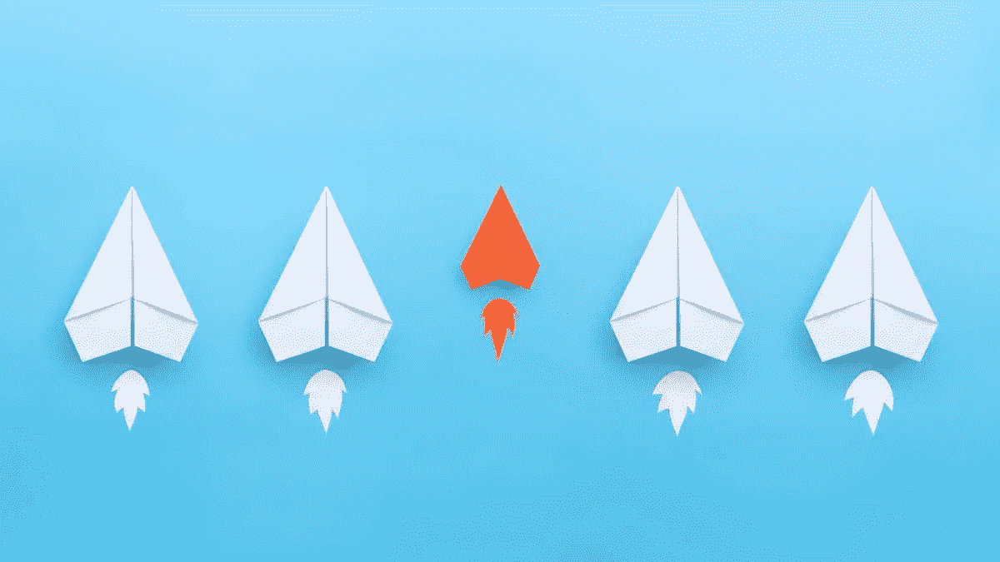

# 为什么我们需要微型人工智能？

> 原文：<https://towardsdatascience.com/why-we-need-tiny-ai-bb04af9e48ae?source=collection_archive---------27----------------------->

图片由 Adobe Stock 授权的 [Worawut](https://stock.adobe.com/contributor/207159640/worawut?load_type=author&prev_url=detail) 制作

**我们都知道算法每天都在变得越来越智能，但它们也变得越来越环保了吗？**

一点也不，这正在成为一个严重的问题。因此，研究人员正在努力寻找开发更小算法的新方法。

在这篇文章中，我们将讨论为什么微型人工智能是确保人工智能未来的重要一步。

人工智能在过去的几年里展示了许多突破。深度学习是那些为许多提供高精度的人工智能系统提供动力的突破之一。得益于深度学习，算法可以扫描医学图像并识别肿瘤，甚至在复杂的交通模式中导航自动驾驶汽车，并将文献从几乎任何语言翻译成另一种语言。

人工智能每天都变得越来越精确，但高精度背后隐藏着环境成本。

麻省大学阿姆赫斯特分校的研究人员最近进行了一项[研究](https://arxiv.org/pdf/1906.02243.pdf)，揭示了算法的训练是多么耗费精力。根据这项研究，训练一个算法可能会消耗一辆普通汽车一生二氧化碳排放量的 5 倍，或者相当于纽约和旧金山之间大约 300 次往返飞行。

> 为了追求高精度，我们似乎已经失去了对能效的关注。

艾伦研究所的研究科学家罗伊·施瓦茨和他的合著者在一篇名为《绿色人工智能》的论文中建议人工智能研究人员应该努力将能效作为准确性和其他衡量标准的评估标准。

最近的一篇文章引用了 Schwartz 的话说“我们不想达到人工智能成为全球变暖的重要因素的状态。”

这就是微型人工智能可以帮忙的地方。

# 什么是 Tiny AI？

微型人工智能是用来描述人工智能研究社区努力减少算法大小的术语，特别是那些需要大量数据集和计算能力的算法。Tiny AI 研究人员开发了一种称为蒸馏方法的方法，这种方法不仅可以减少模型的大小，还可以加速推理并保持高水平的准确性。使用这些蒸馏方法，模型可以显著缩小，缩小倍数可达 10 倍。此外，一个小得多的算法可以部署在边缘上，而无需将数据发送到云，而是在设备上做出决定。

以伯特为例。BERT 是由谷歌的 Jacob Devlin 和他的团队开发的预训练语言模型(PLM)。这个算法非常有用，因为它有助于你写作。它可以做到这一点，因为与以前的模型不同，BERT 理解单词和上下文。因此，BERT 可以提出写作建议或完成您的句子。

但是伯特是个大模特。麻省理工科技评论[报道](https://www.technologyreview.com/f/614473/tiny-ai-could-supercharge-autocorrect-voice-assistants-on-your-phone/)更大版本的 BERT 有 3.4 亿个数据参数。此外，训练它一次所需要的电量相当于一个美国家庭 50 天的用电量。

伯特成了微型人工智能研究人员的完美目标。在最近的一篇文章中，华为[的研究人员声称](https://arxiv.org/pdf/1909.10351.pdf)他们能够将 BERT 的大小减少 7.5 倍，同时将速度提高 9.4 倍

他们称他们的新模型为 TinyBERT。但是，TinyBERT 和 BERT 相比有多好呢？作者声称 TinyBERT 的表现达到了它的老师 BERT 的 96%。

随着这些进步的发展，我们将看到微型人工智能的许多好处。一方面，现有的服务，如语音助手和摄像头，将不需要在云和本地设备之间传输数据。

另一方面，微小的 AI 将使我们有可能在边缘设备上部署复杂的算法。例如，使用智能手机的医学图像分析。或者没有云的自动驾驶。最重要的是，将数据存储在 edge 上也提高了数据的隐私性和安全性。

考虑到人工智能的爆炸式增长，让研究人员和工程师研究和测量训练和部署他们的算法对环境的影响是很重要的。

让我们不要只是努力建立更精确的模型。让我们也考虑一下它们对环境的影响。否则，我们可能会发现自己又多了一项破坏我们星球的技术。

*原载于 2020 年 2 月 28 日*[*https://www . rapid digital . ventures*](https://rapiddigital.ventures/what-is-tiny-ai/)*。*