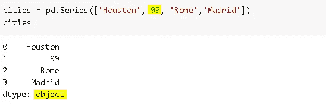

# 为什么我们需要使用 Pandas 新的字符串数据类型而不是文本数据的对象

> 原文：<https://towardsdatascience.com/why-we-need-to-use-pandas-new-string-dtype-instead-of-object-for-textual-data-6fd419842e24?source=collection_archive---------27----------------------->

伊洛娜·弗罗利希在 [Unsplash](https://unsplash.com/s/photos/panda?utm_source=unsplash&utm_medium=referral&utm_content=creditCopyText) 上的照片

我们必须用数值来表示每一位数据，以便由机器学习和深度学习模型进行处理和分析。然而，字符串通常不会有一个好的和干净的格式，需要大量的预处理。

Pandas 提供了许多函数和方法来处理文本数据。在这篇文章中，我们将关注字符串的数据类型，而不是字符串操作。使用合适的数据类型是充分利用 Pandas 的第一步。文本数据目前有两种数据类型，**对象**和**字符串类型。**

在 pandas 1.0 之前，只有“object”数据类型用于存储字符串，这导致了一些缺点，因为非字符串数据也可以使用“object”数据类型存储。Pandas 1.0 引入了一种新的特定于字符串数据的数据类型，即**string type**。到目前为止，我们仍然可以使用 object 或 string type 来存储字符串，但是在将来，我们可能会被要求只使用 string type。

> 这里需要注意的一点是，对象数据类型仍然是字符串的默认数据类型。要使用 StringDtype，我们需要显式声明它。

我们可以传递“**字符串**或 **pd。用于选择字符串数据类型的 Dtype 参数的 string type()**参数。

我们还可以使用 astype 函数将“对象”数据类型转换为“字符串”数据类型:

尽管默认类型是“object ”,但出于一些原因，建议使用“string”。

*   对象数据类型的范围更广，允许存储几乎任何东西。因此，即使我们在应该是字符串的地方有非字符串，我们也不会得到任何错误。

*   拥有专用的数据类型总是更好。例如，如果我们用“字符串”数据类型尝试上面的例子，我们会得到一个 TypeError。

*   拥有专用的数据类型允许特定于数据类型的操作。例如，如果使用了“对象”数据类型，我们不能使用 **select_dtypes** 只选择文本列。Select_dtypes(include="object ")将返回任何具有对象数据类型的列。另一方面，如果我们对文本数据使用“string”数据类型，select_dtypes(include="string ")将给出我们所需要的。

就目前的性能而言，“字符串”数据类型并不优于“对象”。但是，预计随着未来的增强,“字符串”数据类型的性能将会提高，内存消耗将会减少。因此，对于文本数据，我们应该已经在使用“字符串”而不是“对象”了。

感谢您的阅读。如果您有任何反馈，请告诉我。