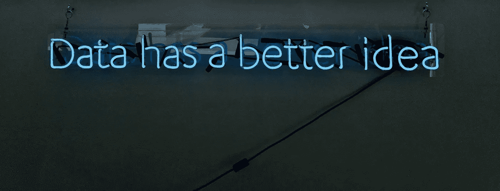
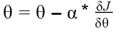
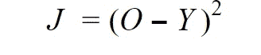
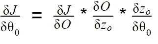
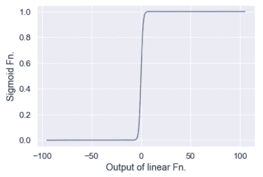
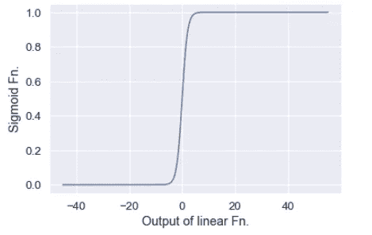
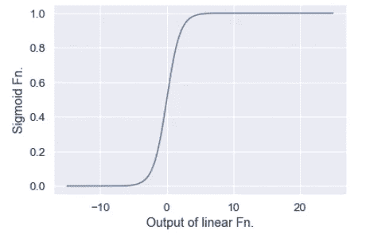
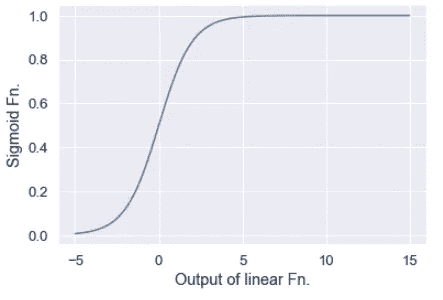

# 为什么正规化有效

> 原文：<https://towardsdatascience.com/why-we-should-always-consider-regularization-3767062709e8?source=collection_archive---------66----------------------->

## *正规化背后的直觉*



由[弗兰基·查马基](https://unsplash.com/@franki?utm_source=medium&utm_medium=referral)在 [Unsplash](https://unsplash.com?utm_source=medium&utm_medium=referral) 上拍摄的照片

当我们训练机器学习模型或神经网络时，我们会看到有时我们的模型在训练数据上表现得非常好，但在测试或验证数据时却无法给出预期的输出。模型性能如此不同的许多原因之一是在模型训练期间学习的大权重，从而导致过度拟合。较大的权重会导致我们的模型不稳定，测试数据的微小变化会导致较高的误差。除此之外，大重量还会在训练的梯度下降步骤中造成问题。为了惩罚这些大的权重，我们将它们调整为较小的值。

但是为什么将权重调整到一个较低的值会有效呢？？

让我们来探讨为什么权重的较低值实际上是必要的背后的直观逻辑。

# 首先是一些数学

梯度下降算法根据模型产生的误差更新权重。



梯度下降函数-作者图片

> 上述等式中的导数部分表示误差函数的斜率或误差函数相对于权重的变化。

这个导数部分经常用链式法则来计算。假设我们使用平方误差函数来计算误差，并对我们的线性输出应用 sigmoid 激活函数来获得最终输出。


以 H 为输入的线性函数-作者图片


Sigmoid 激活函数-作者图片



平方误差函数-作者图片

根据链式法则，我们需要计算:

1.  误差函数相对于激活函数输出的斜率。
2.  激活函数相对于线性输出的斜率。
3.  最后，线性函数的斜率与权重相关。



链式法则-作者图片

> 模型的权重值在梯度下降的权重更新步骤中起着非常关键的作用。

我们通过一个简单的例子来理解这一点。

# 主要的戏剧

sigmoid 函数是用于确定模型输出的非常常见的激活函数。

上面给出的代码针对给定的 x 值*绘制了一个简单的 sigmoid 函数，用于形式为 *y=mx+c* 的线性输出。m'* 照常代表我们所说的线的斜率或我们模型的权重。

现在，我们将了解不同的斜率值如何影响我们的 sigmoid 函数。

```
plot_sigmoid(0.001)
```

产出 1:



输出 1 -作者的图像

```
plot_sigmoid(0.0005)
```

产出 2:



输出 2 -作者的图像

```
plot_sigmoid(0.0002)
```

产出 3:



输出 3 -按作者分类的图像

```
plot_sigmoid(0.0001)
```

产出 4:



输出 4 -按作者分类的图像

从以上 4 幅图中，我们可以观察到，随着线性函数中斜率或权重的降低，sigmoid 函数的陡度也随之降低。

对于输出 1，我们可以看到 sigmoid 函数的值从 0 快速变为 1。因此，该函数任意点的斜率大多保持接近 0 或 1。

> 这导致梯度下降步骤中的不便，因为它将导致权重几乎没有变化，从而减慢我们的模型的学习，并最终无法达到我们的误差函数的最小尖端，或者有时太大的变化可能导致错过误差函数的最小值。

现在，在其他 3 个输出中，我们随后降低了斜率值，并观察到输出函数的陡度也降低了。sigmoid 函数值开始从 0 到 1 逐渐变化，并忽略斜率的快速变化，这种变化有利于梯度下降步骤。现在，权重以更加一致的方式更新，从而实现误差函数的最小值。

很明显，当使用期望的正则化技术来训练模型时，为什么大的权重需要被惩罚并被带回到较低的值。