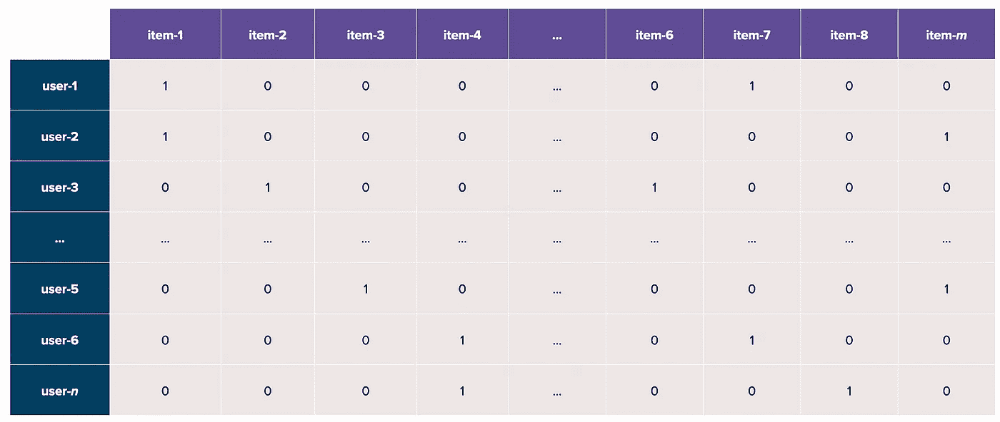
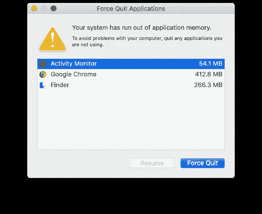
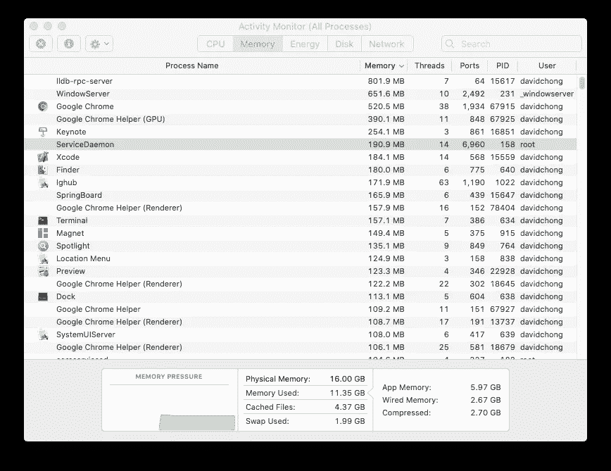
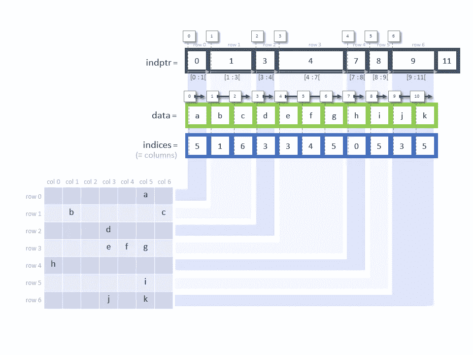

# 为什么我们在推荐系统中使用稀疏矩阵

> 原文：<https://towardsdatascience.com/why-we-use-sparse-matrices-for-recommender-systems-2ccc9ab698a4?source=collection_archive---------23----------------------->

## SciPy 的稀疏模块介绍


诺德伍德主题公司在 [Unsplash](https://unsplash.com?utm_source=medium&utm_medium=referral) 上拍摄的照片

在推荐系统中，我们通常使用非常稀疏的矩阵，因为项目领域非常大，而单个用户通常与项目领域的非常小的子集进行交互。以 YouTube 为例，用户通常会观看数百甚至数千个视频，相比之下，YouTube 的语料库中有数百万个视频，导致稀疏度超过 99%。

这意味着当我们在一个矩阵中表示*用户*(作为行)和*项目*(作为列)时，结果是一个由许多零值组成的极其稀疏的矩阵(见下文)。



稀疏用户-项目矩阵(来源按作者)

在现实生活中，我们如何最好地表示这样一个稀疏的*用户-项目*交互矩阵？

**为什么我们不能只使用 *Numpy 数组*或 *Pandas DataFrames* ？**

为了理解这一点，我们必须了解计算的两个主要约束条件— **时间**和**内存**。前者就是我们所知的“*一个程序运行*需要多少时间”，而后者是“*程序使用了多少 ram* ”。前者非常简单，但对于后者，确保我们的程序不消耗所有内存是非常重要的，尤其是当我们处理大型数据集时，否则我们会遇到著名的“*内存不足*”错误。



来源:stack exchange by[alessandro 308](https://apple.stackexchange.com/questions/158639/your-system-has-run-out-of-application-memory-how-is-that-possible)

是的，我们电脑上的每个程序和应用程序都使用一些内存(见下图)。当我们运行矩阵计算，并希望将这些稀疏矩阵存储为 *Numpy 数组*或 *Pandas DataFrame* 时，它们也会消耗内存。



Mac 的活动监视器(来源作者)

为了形式化这两个约束，它们被称为**时间**和**空间复杂度**(内存)。

## 空间复杂性

当处理稀疏矩阵时，将它们存储为完整的矩阵(从这一点上称为 ***密集*** 矩阵)是非常低效的。这是因为一个完整的数组为每个条目的*占用一块内存，所以一个`n x m`数组需要`n x m`块内存。从简单的逻辑角度来看，存储这么多零根本没有意义！*

从数学的角度来看，如果我们有一个`100,000 x 100,000`矩阵，这将需要我们有`100,000 x 100,000 x 8 = 80 GB`的内存来存储这个矩阵(因为每个 *double* 使用 8 个字节)！

## 时间复杂度

除了空间复杂性之外，密集矩阵也恶化了我们的运行时。我们将用下面的例子来说明。

那么我们如何表示这些矩阵呢？

# 介绍… SciPy 的稀疏模块

在 Python 中，稀疏数据结构是在 *scipy.sparse* 模块中有效实现的，它主要基于 *Numpy* 数组。实现背后的思想很简单:不是将所有值存储在一个密集的矩阵中，而是以某种格式存储非零值(例如，使用它们的行和列索引)。

在我们深入 CSR 之前，让我们比较一下使用 *numpy 数组*和*稀疏矩阵*在时间和空间复杂度上的效率差异。

```
import numpy as np
from scipy import sparse
from sys import getsizeof# **Matrix 1**: *Create a dense matrix (stored as a full matrix).*
A_full = np.random.rand(600, 600)# **Matrix 2**: *Store A_full as a sparse matrix (though it is dense).*
A_sparse = sparse.csc_matrix(A_full)# **Matrix 3**: *Create a sparse matrix (stored as a full matrix).*
B_full = np.diag(np.random.rand(600))# **Matrix 4**: *Store B_full as a sparse matrix.*
B_sparse = sparse.csc_matrix(B_full)# Create a square function to return the square of the matrix
def square(A):
    return np.power(A, 2)
```

然后我们计算这些以不同形式存储的不同矩阵的时间，以及它们使用了多少内存。

```
%timeit square(A_full)
print(getsizeof(A_full))>>> 6.91 ms ± 84.5 µs per loop (mean ± std. dev. of 7 runs, 100 loops each)
>>> 2880112%timeit square(A_sparse)
print(getsizeof(A_sparse))>>> 409 ms ± 11.5 ms per loop (mean ± std. dev. of 7 runs, 1 loop each)
>>> 56%timeit square(B_full)
print(getsizeof(B_full))>>> 2.18 ms ± 56.5 µs per loop (mean ± std. dev. of 7 runs, 100 loops each)
>>> 2880112%timeit square(B_sparse)
print(getsizeof(B_sparse))>>> 187 µs ± 5.24 µs per loop (mean ± std. dev. of 7 runs, 10000 loops each)
>>> 56
```

显然，当我们使用*稀疏*模块存储稀疏矩阵时，可以获得时间和空间方面的最佳性能。

## 压缩稀疏行(CSR)

尽管在 *SciPy* 中有许多类型的稀疏矩阵，如键的字典(DOK)和列表的列表(LIL)，我将只涉及 ***压缩稀疏行*** (CSR)，因为它是最常用和广为人知的格式。

**CSR** (还有 CSC，又名压缩稀疏列)用于一次写入多次读取任务[1]。为了有效地表示稀疏矩阵，CSR 使用三个 numpy 数组来存储一些相关信息，包括:

1.  `data`:非零值的值——这些非零值存储在稀疏矩阵中
2.  `indices`:列索引的数组—从第一行开始(从左到右)，我们标识非零位置并返回它们在该行中的索引。在下图中，第一个非零值出现在第 0 行第 5 列，因此 5 作为第一个值出现在`indices`数组中，后面是 1(第 1 行，**第 1 列**)。
3.  `indptr`:代表索引指针，返回一个行开始的数组。这个定义让我困惑，我选择这样解释:它告诉我们每行包含多少个值。在下面的例子中，我们看到第一行包含一个值`a`，因此我们用`0:1`对其进行索引。第二行包含两个值`b, c`，我们从`1:3`开始索引，依此类推。`len(indptr) = len(data) + 1 = len(indices) + 1`因为对于每一行，我们用开始和结束索引来表示它(类似于我们如何索引一个列表)。



来源:StackOverflow 作者 [Tanguy](https://stackoverflow.com/questions/52299420/scipy-csr-matrix-understand-indptr)

## 构建 csr_matrix 有哪些方法？

**创建一个全矩阵并将其转换为稀疏矩阵**

```
some_dense_matrix = np.random.random(600, 600)
some_sparse_matrix = sparse.csr_matrix(some_dense_matrix)
```

如前所述，这种方法效率不高，因为我们必须先获得这个密集矩阵，这非常耗费内存，然后才能将其转换为稀疏矩阵。

**创建一个空的稀疏矩阵**

```
# format: csr_matrix((row_len, col_len))
empty_sparse_matrix = sparse.csr_matrix((600, 600))
```

注意，我们**不应该**创建一个空的稀疏矩阵并随后填充它们，因为`csr_matrix`被设计为一次写入多次读取。写入`csr_matrix`将是低效的，应该考虑其他类型的稀疏矩阵，如列表的列表*列表*在操纵稀疏结构方面更有效。

**用数据创建一个稀疏矩阵**

```
# **method 1**
# format: csr_matrix((data, (row_ind, col_ind)), [shape=(M, N)])
# where a[row_ind[k], col_ind[k]] = data[k]data = [3, 9, 5]
rows = [0, 1, 1]
cols = [2, 1, 2]sparse_matrix = sparse.csr_matrix((data, (rows, cols)), 
                                  shape=(len(rows), len(cols))
sparse_matrix.toarray()>>> array([[0, 0, 3],
           [0, 9, 5],
           [0, 0, 0]], dtype=int64)# **method 2**
# format: csr_matrix((data, indices, indptr), [shape=(M, N)])
# column indices for row i: indices[indptr[i]:indptr[i+1]]
# data values: data[indptr[i]:indptr[i+1]]data = [3, 9, 5]
indices = [2, 1, 2]
indptr = [0, 1, 3, 3]sparse_matrix = sparse.csr_matrix((data, indices, indptr))
sparse_matrix.toarray()>>> array([[0, 0, 3],
           [0, 9, 5],
           [0, 0, 0]], dtype=int64)
```

希望这有助于你开始使用稀疏矩阵！

***支持我！*** —如果你喜欢我的内容并且*没有*订阅 Medium，请考虑支持我并通过我在这里的推荐链接[订阅](https://davidcjw.medium.com/membership) ( *注意:你的一部分会员费将作为推荐费*分摊给我)。

## 参考

[1][Python 中的稀疏数据结构](https://rushter.com/blog/scipy-sparse-matrices/)

[2] [复杂性和稀疏矩阵](http://www.acme.byu.edu/wp-content/uploads/2015/11/Vol1Lab4Complexity.pdf)