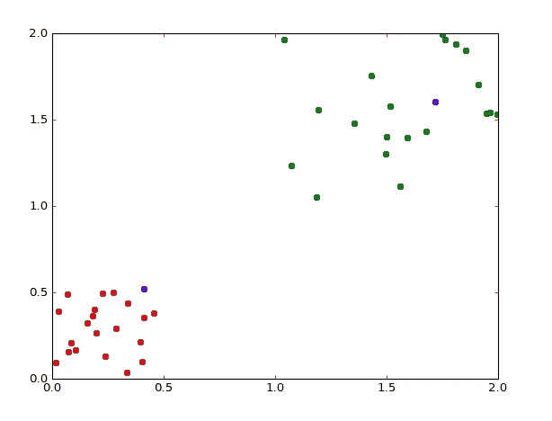
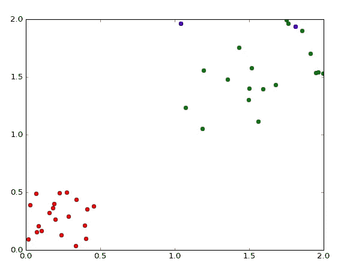
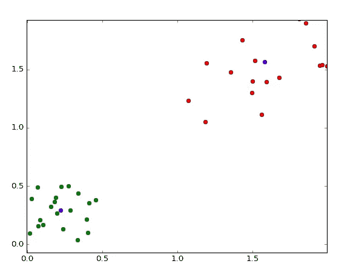

# 为什么我们使用无监督学习(从头开始使用 K 均值聚类)

> 原文：<https://towardsdatascience.com/why-we-use-unsupervised-learning-with-k-means-clustering-from-scratch-1401efdd6fde?source=collection_archive---------34----------------------->

## 为什么无监督学习是一个伟大的工具，却不能产生定量的结果。


在数据科学世界中，监督学习是一个有趣的话题，不从事数据科学的人通常不会强调这一点，此外，这也是许多数据科学家自己经常忽视的一个想法。对此有一个解释，因为对于许多就业机会来说，无监督学习根本不重要。当然，有时它会发挥作用，但在大多数情况下，企业不会投资做他们永远不知道结果的研究。在不知道结果的情况下做研究正是无监督形容词在这种情况下的应用，所以如果我们不知道我们的模型输出了什么，那么我们怎么能在它的预测和发现中找到价值呢？

# 分析

无监督学习算法的主要功能是分析。使用无监督学习算法来探索您的数据可以告诉您许多关于所述数据的某些属性的信息。例如，聚类分析可以显示某些连续值是如何分组的，不管它们是相关还是不相关。您可以使用无监督学习来发现数据中的自然模式，这些模式仅通过统计分析或比较值并不明显。

无监督学习算法在图像识别和基因组学中也有自己的优势。在基因组学中，它们可以用来对遗传学进行聚类或分析基因组数据序列。无监督学习用于建模概率密度，这对生物信息学学科非常有用。

无人监管的另一个好处是，不需要任何人工干预就可以非常容易地收集分析数据。典型的机器学习，无论是强化的还是监督的，都需要手动绘制标签，以便正确理解模型的结果。有监督学习和无监督学习的区别如下:

## 无监督学习

*   不太准确
*   不需要标记数据
*   最少的人力

## 监督学习

*   高度准确
*   有一致的目标
*   需要带标签的数据
*   需要人的努力

# 示例:Kmeans 聚类

聚类是最常用的无监督学习方法。这是因为这通常是可视化探索和发现更多数据的最佳方式之一。有几种不同类型的集群，包括:

*   **层次集群**:通过创建一个集群树来构建集群的多层次结构。
*   **k 均值聚类**:根据到聚类质心的距离将数据划分为 k 个不同的聚类。
*   **高斯混合模型**:将聚类建模为多元正态密度成分的混合物。
*   **自组织地图**:使用学习数据拓扑和分布的神经网络。
*   **隐马尔可夫模型**:利用观测数据恢复状态序列。

在今天的例子中，我们将学习 klearn 中提供的 Kmeans 集群。在 K-均值聚类中，对于每个点 x:

*   找到最近的质心 c
*   将点 x 分配给群集 j

然后对于每个聚类 j (=1..k):

*   新的质心 c 等于在前一步骤中分配给聚类 j 的所有点 x 的平均值。

虽然这个模型在 sklearn.cluster 的 KMeans 类下可用，但今天我将编写自己的函数来计算 K 均值聚类。我们将从创建一个能够测量欧几里德长度的函数开始。这就像使用 Numpy 的 linalg 一样简单。

```
import numpy as np
def euclidian(a, b):
    return np.linalg.norm(a-b)
```

我还导入了 Matplotlib.pyplot 和 Matplotlib.animation，以便将来对我们的集群进行可视化:

```
import matplotlib.pyplot as plt
# animation
import matplotlib.animation as animation
```

因为我将使用文本数据，所以我使用 numpy 的这个函数来加载它:

```
def load_dataset(name):
    return np.loadtxt(name)
```

现在是时候做我们实际的 K 均值函数了。首先，我们将添加参数 k、ε和距离(在我们的例子中是欧几里得的。)之后，我们将为质心创建一个空列表，并设置距离算法以使用之前的欧几里德函数。

```
def kmeans(k, epsilon=0, distance='euclidian'):
    history_centroids = []
    #set the distance calculation type 
    if distance == 'euclidian':
        dist_method = euclidian
```

接下来，我们将加载数据集并检查数据集的形状，以获得实例(观察)的数量和特征的数量

```
dataset = load_dataset('durudataset.txt')
num_instances, num_features = dataset.shape
```

现在，我们将使用 Numpy.random 中的随机数来定义 k 原型:

```
prototypes = dataset[np.random.randint(0, num_instances - 1, size=k)]
```

之后，我们会将它们添加到质心历史列表中:

```
history_centroids.append(prototypes)
```

现在，我创建了这些列表来存储我们的质心聚类，并在每次迭代中跟踪它们:

```
prototypes_old = np.zeros(prototypes.shape)
belongs_to = np.zeros((num_instances, 1))
norm = dist_method(prototypes, prototypes_old)
iteration = 0
```

然后，我们将按照我之前陈述的公式执行 for 循环:

```
while norm > epsilon:
        iteration += 1
        norm = dist_method(prototypes, prototypes_old)
        for index_instance, instance in enumerate(dataset):
            dist_vec = np.zeros((k,1))
            for index_prototype, prototype in enumerate(prototypes):
                #compute the distance between x and centroid
                dist_vec[index_prototype] = dist_method(prototype, instance)
            belongs_to[index_instance, 0] = np.argmin(dist_vec)

        tmp_prototypes = np.zeros((k, num_features))
```

当范数大于ε时，对于数据集中的每个实例，我们将定义一个 k 大小的距离向量。然后对于每个质心，我们将计算 x 和质心之间的差。接下来，我们将遍历我们的原型列表，并获取分配给该原型的所有点。然后，我们将找到这些点的平均值，这将为我们提供新的质心。最后但同样重要的是，我们将把相应的值添加到列表的索引中。

```
for index in range(len(prototypes)):
            instances_close = [i for i in range(len(belongs_to)) if belongs_to[i] == index]
            prototype = np.mean(dataset[instances_close], axis=0)
            #add our new centroid to our new temporary list
            tmp_prototypes[index, :] = prototype
```

最后，我们可以将我们的临时原型设置为等于我们的最终质心列表。为了创建一个 Matplotlib 动画，我还会在这里添加质心列表的历史。

```
prototypes = tmp_prototypes
history_centroids.append(tmp_prototypes)
return prototypes, history_centroids, belongs_to
```

对于最终的函数，如下所示:

```
def kmeans(k, epsilon=0, distance='euclidian'):
    history_centroids = []
    if distance == 'euclidian':
        dist_method = euclidian
    #set the dataset
    dataset = load_dataset('durudataset.txt')
    num_instances, num_features = dataset.shape 
    prototypes = dataset[np.random.randint(0, num_instances - 1, size=k)]
    history_centroids.append(prototypes)
    prototypes_old = np.zeros(prototypes.shape)
    belongs_to = np.zeros((num_instances, 1))
    norm = dist_method(prototypes, prototypes_old)
    iteration = 0
    while norm > epsilon:
        iteration += 1
        norm = dist_method(prototypes, prototypes_old)
        for index_instance, instance in enumerate(dataset):
            dist_vec = np.zeros((k,1))
            for index_prototype, prototype in enumerate(prototypes):
                dist_vec[index_prototype] = dist_method(prototype, instance)
            belongs_to[index_instance, 0] = np.argmin(dist_vec)

        tmp_prototypes = np.zeros((k, num_features))
        for index in range(len(prototypes)):
            instances_close = [i for i in range(len(belongs_to)) if belongs_to[i] == index]
            prototype = np.mean(dataset[instances_close], axis=0)
            #add our new centroid to our new temporary list
            tmp_prototypes[index, :] = prototype
        prototypes = tmp_prototypes
        history_centroids.append(tmp_prototypes)
    return prototypes, history_centroids, belongs_to
```

现在，如果我们决定绘制它，我的结果看起来有点像这样:



> 很酷，对吧？

# 结论

虽然非监督学习可能不会像大多数监督学习模型那样受到喜爱或使用，但仅仅因为结果没有被标记并不意味着不能从数据中学习到很多信息。无监督学习是探索和真正理解数据如何分组以及不同特征如何相互作用的一个很好的工具。虽然在很多情况下，数据科学家可能会偏离使用无监督学习有点远，但很容易明白为什么它有时会非常有益！