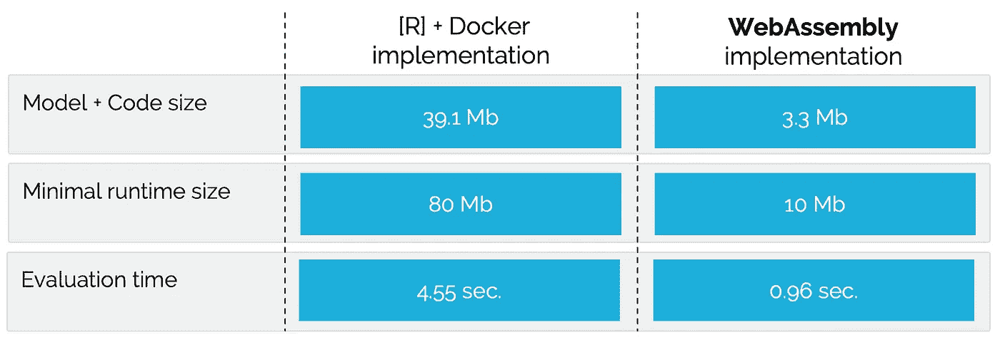
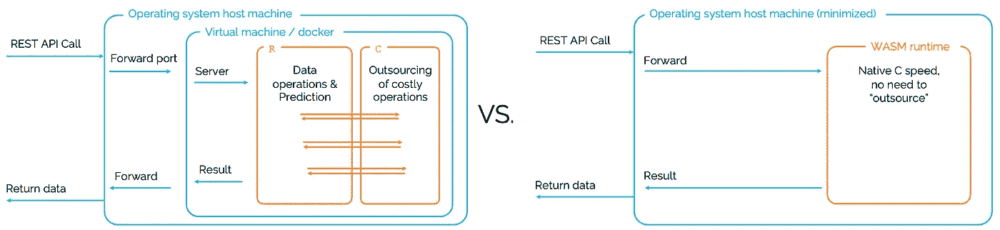

# 为什么要用 WebAssembly 把 scikit-learn 放到浏览器里？

> 原文：<https://towardsdatascience.com/why-would-you-use-webassembly-to-put-scikit-learn-in-the-browser-77671e8718d6?source=collection_archive---------21----------------------->

## 老实说。我不知道。但是我确实认为 WebAssembly 是 ML/AI 部署的一个很好的目标(在浏览器和其他地方)。

在我自己的学术工作中，以及在与各种公司和医院的合作中，我经常面临将经过验证的模型投入生产的挑战。部署证明是困难的；这是[阻碍在各个领域采用许多有用模型的主要障碍之一](/stop-training-more-models-start-deploying-them-using-webassembly-49a3f178569e)。在尝试了各种解决方案后，[我们](https://www.scailable.net)决定使用 WebAssembly 二进制文件进行模型部署。现在，这种选择并不总是被理解:许多数据科学家还没有听说过 [WebAssembly](https://webassembly.org) ，即使他们听说过，他们也大多将其与浏览器中的运行任务联系在一起。此外，感兴趣的读者会很快找到像 [pyodide](https://hacks.mozilla.org/2019/04/pyodide-bringing-the-scientific-python-stack-to-the-browser/) 这样的项目，虽然非常有趣，但却让读者误解了通过将整个 python 堆栈移动到浏览器中就可以完成模型部署:我们并不这么认为。我们简单地将 WebAssembly 视为一个安全、可移植、高效的编译目标，可以在任何地方部署合适的模型。在这篇文章中，我将试着解释我们选择这项技术的原因。

# 需求:当将模型投入生产时，我们想要什么？

选择一项技术通常受益于一套好的需求(如果你愿意的话，可以称为需求):我们希望我们的技术做什么？以下是我们为 AI/ML 模型部署考虑的一些事情:

> **注意:**我在这里非常宽泛地对待“模型”的概念；这可能包括预处理和后处理。实际上，当生成推理时,“模型”通常只是对一些输入数据执行的一组操作，从而导致一些输出。

1.  *我们希望对那些创建和验证模型的人的工作实践产生最小的影响。*实际上，如果构建和验证有用模型的数据科学家/研究人员也可以使用他们的首选工具进行部署，那将是一件好事。应该很容易。
2.  *我们希望部署的模型计算效率高(即速度快)。*在训练期间，执行速度可能不是一个大问题(尽管[训练速度很可能是](/speed-up-your-algorithms-part-1-pytorch-56d8a4ae7051))，但当我们想要重复生成推理时，这将是一个问题。一旦你在一秒钟内评估一个模型数千次，如果它运行得很快就好了。
3.  *我们希望部署的模型具有较小的内存占用。在部署中，如果推理不仅在时间上有效，而且在内存上也有效，那就太好了。一个小而快速的任务最终改善了用户体验，降低了成本，并且[节省了大量能源](/the-carbon-footprint-of-ai-research-812d9c974a5c)。*
4.  *我们希望部署的模型是可移植的。*当我们将模型从服务器转移到物联网设备、手机和网络浏览器时，我们不应该不得不重建模型。
5.  *我们希望部署的模型是安全且可验证的。*模型应在沙盒中安全运行，并且应能够验证正确的模型是否可用。
6.  *我们希望能够轻松地试验已部署的模型。*一旦部署了模型，应该可以轻松地 A/B 测试模型的各种版本。

# 使用 WebAssembly 部署

鉴于上述迫切需要，我们研究了几种技术，从使用 docker 容器将 [jupyter 笔记本投入生产，到在`c`或`rust`中重建我们的模型并为各种运行时编译可执行文件，到使用当前提供的不断增长的产品套件之一使模型投入生产更容易(即](/how-to-create-and-deploy-a-kubeflow-machine-learning-pipeline-part-1-efea7a4b650f) [pyTorch](https://medium.com/datadriveninvestor/deploy-your-pytorch-model-to-production-f69460192217) 、 [TFX](https://www.tensorflow.org/tfx) 、 [Lambda](https://aws.amazon.com/blogs/machine-learning/deploying-machine-learning-models-as-serverless-apis/) 、 [Azure](https://docs.microsoft.com/en-us/learn/modules/register-and-deploy-model-with-amls/) 等)。).都以这样或那样的方式失败了。Docker 容器允许您简单地复制现有的 Python 堆栈、包、模型等等，但是生成的容器通常臃肿而缓慢。重建是高效的，但是耗时的。现有的云服务在某些方面表现不错，但并非所有方面都是急需的。因此，我们创建了自己的模型部署流程。

## 我们使用 WebAssembly 的部署流程

在检查[我们使用 WebAssembly](https://www.scailable.net) 的部署流程是否符合需求之前，我想我应该解释一下相关的步骤:

1.  我们允许数据科学家使用他们最喜欢的`python`或`R`包/工具来拟合模型。
2.  使用我们的简单包，例如`python`的`[sclblpy](https://pypi.org/project/sclblpy/)`包，数据科学家可以直接从他们喜欢的工作空间上传存储的模型(或管道)。
3.  上传模型后，我们自动“分解”它——也就是说，我们剥离所有不必要的细节——并将最基本的必需品转换成 WebAssembly 二进制文件。不可否认，这一步很有挑战性，构建起来让我们很头疼，但是幸运的是，对于每个模型类，只需要做一次。一旦完成，已知模型类的每个模型都可以自动优化并传输到 WebAssembly。( ***举个例子:*** *假设你用* `*scikit-learn*` *拟合一个线性回归模型。在这种情况下，一个存储的模型对象包含了许多对于推断来说并不重要的信息:我们有效地剥离了该对象以创建一个只包含所需向量操作的 WebAssembly 二进制文件)。*
4.  在生成一个遵循 WASI 标准的`.wasm`二进制文件[后，它可以在任何地方运行。我们通常会在服务器上托管二进制文件，并创建一个 REST 端点来执行推理任务，但是我们也在浏览器和边缘部署了模型对象。](https://hacks.mozilla.org/2019/03/standardizing-wasi-a-webassembly-system-interface/)

这就是我们结束的过程。

## 什么是 WebAssembly？

我想简单地离题解释一下 WebAssembly 是有用的。根据官方 [WebAssembly 页面](https://webassembly.org)、*“web assembly(缩写 Wasm)是一种基于堆栈的虚拟机的二进制指令格式。Wasm 旨在作为编程语言的可移植编译目标，支持客户端和服务器应用程序在 web 上的部署。”*现在，虽然这是真的，但随着 [WASI](https://hacks.mozilla.org/2019/03/standardizing-wasi-a-webassembly-system-interface/) 的出现，以及我们在 [Wasmer](https://wasmer.io) 的朋友提供的精彩开源工具，这个定义看起来太有限了:WASI 二进制文件可以在任何地方运行。因此，对我们来说，WebAssembly 是一个编译目标，它可以有效地提供以本机速度运行的可执行文件，放在非常小且高效的容器中，几乎可以在任何地方运行。

所以，让我们检查一下这是否合适…

## 需求 1:易用性

我们目前能够使用一行代码将模型转换为 WebAssembly。这里有一个超级简单的例子:

我们可以对几乎所有的`sklearn`、`statsmodels`和`xgboost`都这样做。你可以使用`[sclblpy](https://pypi.org/project/sclblpy/)` [包](https://pypi.org/project/sclblpy/)来完成。

> 最近，我们开始支持 [ONNX](https://onnx.ai) 上传，有效地覆盖了您想要部署的几乎任何模型或管道。

**是的，我们认为这个过程很简单。**

## 需求 2:计算效率

虽然 WebAssembly“承诺”高效快速，但看看实际数字总是好的。我们适合自动财产估价的 BART 模型(AVM)；[点击这里查看演示应用](https://www.scailable.net/demo/avm/)。当使用 Docker 容器部署 fitted 模型时，生成 1000 个后验绘制对于一次往返需要 4.5 秒多一点(即，包括网络延迟)。使用我们的 WebAssembly 部署始终如一地做同样的事情只需不到一秒钟。我们一直在寻找这样的速度提升:[查看这篇文章，了解更多基准](https://www.scailable.net/demo/bench/)(我们也密切关注 [WebGPU](https://gpuweb.github.io/gpuweb/) ，这是一个快速发展的补充标准，将使我们能够为我们的 CPU 优化 WebAssembly 二进制文件添加 GPU 支持)。

**所以，是的，WebAssembly 模型部署很快**。然而，理解为什么它通常比现有的基于`r`或`python`的推理要快得多是有好处的。在某种程度上，速度的提高来自于转向编译的、较低级的语言(即，强类型、更好的内存管理、强编译器优化等)。).然而，这些改进只是故事的一部分:WebAssembly 模型部署还允许我们剥离许多相关的“层”:

使用 docker 容器(左)和使用 WebAssembly(右)的模型部署；剥离这些层大大提高了执行速度。

由于每一层都需要时间和资源来运行，所以剥离它们最终会在延迟、能耗和计算成本方面带来巨大的好处。

## 需求 3:内存占用

我们希望模型在内存方面更小。并且，考虑到上面提出的层的分析，不仅仅是模型“包”本身应该小；如果整个运行时能尽可能的小而高效就好了。在 AVM 演示的基础上，这似乎工作得很好:在`R`我们把 BART 模型本身降低到大约 40Mb，运行时间降低到大约 80Mb(两者都需要一些努力)。使用 WebAssembly 部署，我们最终得到的模型“包”只有 3Mb 多一点，而运行时只有 10Mb。所以总共是 120Mb 对 13Mb。**是的，WebAssembly 模型部署占用的内存很少。**

## 需求 4:便携性

小而快创造了新的机会。WebAssembly 模型的可移植性允许在服务器、浏览器、[或边缘设备上运行它们。这产生了新的用例:我们在无人机上部署了物体识别模型(绕着港口飞行，识别](https://www.scailable.net/demo/bench/)[货运集装箱的维护状态](https://www.antwerpmanagementschool.be/en/research/creating-smart-ecosystems/innovative-digital-ecosystems/research/speed-1))。我们还在用户的浏览器上运行了推荐模型，我们能够将模型发送到医院(用于放射诊断目的),而不是将敏感的患者数据发送到中央服务器。**便携性。检查。**

## 需求 5:安全且可验证

一个经常出现的问题是“我们如何确保返回的推论是有效的”？使用 WebAssembly 二进制文件的一个好处是，我们可以广泛地验证模型的输入和输出，并整合功能。随后可以使用简单的校验和来验证生成的二进制文件；我们可以确保在正确的地方交付正确的型号。

接下来是验证，我们显然希望模型包不会对周围的计算环境造成任何伤害；幸运的是，这就是 WebAssembly 的设计目的；它本质上是沙箱化的和安全的。

**所以，是的，这一次也成功了。**

## 渴望 6:简单的实验

一旦部署差距被弥合，世界不会停止。通常，一个已部署的模型只是所有模型的一个实例，这些模型可能是为特定问题而设计的。如果测试一个模型的不同版本很容易，那就太好了。WebAssembly 二进制文件使这个过程变得简单:一旦一个模型成为一个独立的、易于发布和易于运行的“包”，用两个二进制文件建立 A/B 测试(或者甚至建立自适应方案，例如 [Thompson 在多个竞争模型](https://journals.sagepub.com/doi/full/10.1177/2158244019851675)上采样)就变得简单了。

**适当的沙盒和可移植性使实验变得容易。**

# 包裹

我们有很多将模型投入生产的经验。基于这一经验，我们最终开发了一个新的平台，通过 WebAssembly 简化了模型部署；对我们来说，这符合所有的条件。也就是说，一个技术解决方案永远不会完全解决“模型部署的问题”。每当我们试图弥合从模型训练和验证到实际使用之间的差距时，我们都会面临组织、法律、财务和伦理方面的问题。我们不能说所有这些都可以轻易解决。但是，我们确实认为从技术上来说，部署问题是可以解决的，WebAssembly 提供了解决相关挑战的完美工具。

## 放弃

*值得注意的是我自己的参与:我是 Jheronimus 数据科学院* [*的数据科学教授，也是可扩展的*](https://www.jads.nl/)**的联合创始人之一。因此，毫无疑问，我对 Scailable 有既得利益；我有兴趣让它成长，这样我们就可以最终将人工智能投入生产并兑现它的承诺。这里表达的观点是我自己的。**