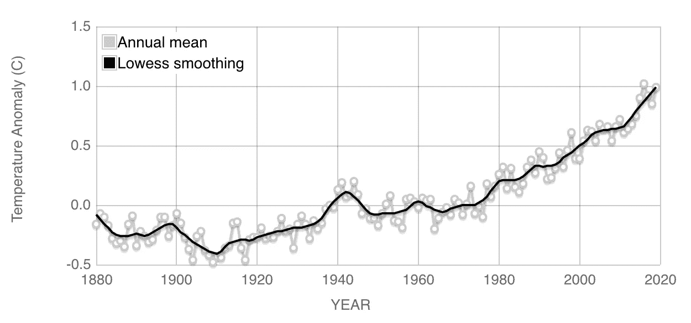
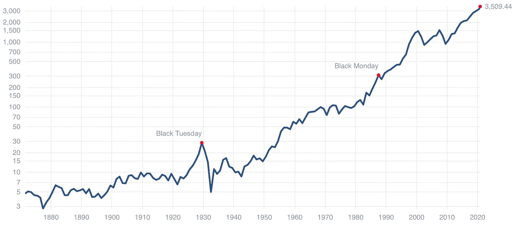
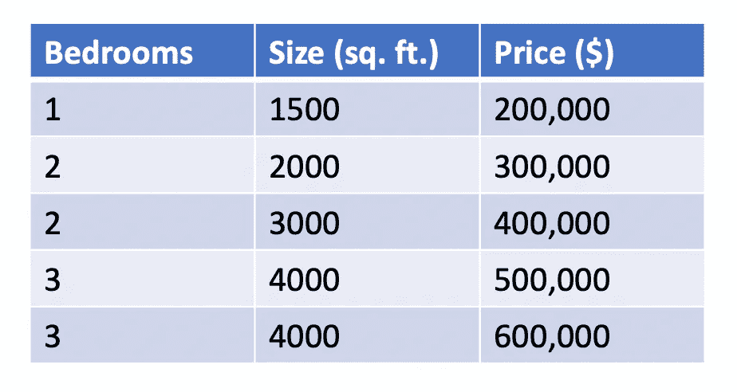
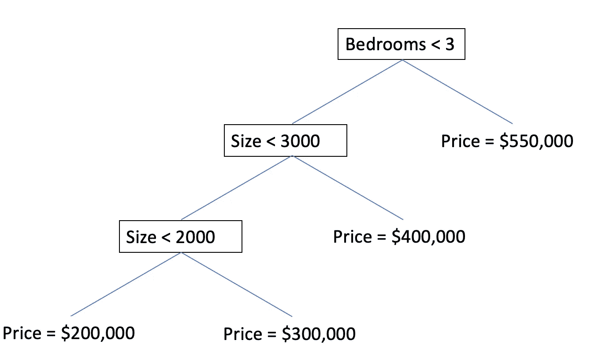
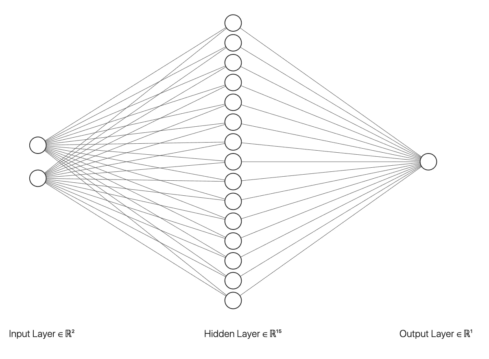

# 为什么 XGBoost 不能解决你所有的问题。

> 原文：<https://towardsdatascience.com/why-xgboost-cant-solve-all-your-problems-b5003a62d12a?source=collection_archive---------9----------------------->

## [入门](https://towardsdatascience.com/tagged/getting-started)

## XGBoost 和其他基于树的算法的一个关键限制。

由[谢尔盖·科洛米耶茨](https://unsplash.com/@drkolomiyets?utm_source=unsplash&utm_medium=referral&utm_content=creditCopyText)在 [Unsplash](https://unsplash.com/s/photos/tree-algorithms?utm_source=unsplash&utm_medium=referral&utm_content=creditCopyText) 上拍摄的照片

如果你曾经在 Kaggle 上参加过机器学习比赛，或者浏览过数据科学社区撰写的文章或论坛，你可能听说过 XGBoost。这种算法已经赢得了许多 Kaggle 竞赛，并且有许多基准研究表明 XGBoost 始终优于其他算法。XGBoost 是并行的，并且比其他梯度增强实现运行得更快，这一事实增加了它的吸引力。

对于那些不熟悉这个工具的人来说， [XGBoost](https://xgboost.readthedocs.io/en/latest/) (代表“极端梯度提升”)是一个高度优化的框架，用于[梯度提升](https://en.wikipedia.org/wiki/Gradient_boosting)，**一种迭代地组合几个弱学习器(如决策树)的预测的算法，以产生一个更强大、更健壮的模型**。自 2014 年问世以来，XGBoost 已经成为许多数据科学家和机器学习实践者的首选算法。

> *“有疑问的时候用 XGBoost”——*[*Avito*](https://www.kaggle.com/c/avito-context-ad-clicks)*上下文 Ad 点击预测比赛上 Kaggle*

这听起来可能好得难以置信，对吗？XGBoost 对于许多任务来说无疑是强大而有用的，但是有一个问题…事实上，这个问题不仅影响 XGBoost，而且影响所有基于树的算法。

# 基于树的模型不擅长外推

这可能是所有基于树的模型固有的根本缺陷。不管你有一个决策树，一个有 100 棵树的随机森林，还是一个有 1000 棵树的 XGBoost 模型。由于基于树的模型划分任何给定问题的输入空间的方法，这些算法在进行预测时很大程度上**无法外推超出训练数据**限制的目标值。在分类任务中，这通常不是一个大问题，但在涉及预测连续输出的回归任务中，这绝对是一个限制。

如果训练数据集只包含 0 到 100 之间的目标值，则基于树的回归模型将很难预测出该范围之外的值。以下是一些预测性任务的例子，在这些任务中，外推很重要，而 XGBoost 可能并不奏效…

## 预测气候变化对全球气温的影响

在过去的 100 年里，全球气温上升的速度越来越快。想象一下，试图使用 1900 年到 2020 年的数据来预测未来 20 年的全球气温。像 XGBoost 这样的基于树的算法将受到今天全球最高温度的限制。如果气温继续上升，该模型肯定会低估未来 20 年全球气温的上升。

从 1880 年到 2020 年的全球温度异常。来源:[美国宇航局 GISS](https://climate.nasa.gov/vital-signs/global-temperature/)

## 预测股票市场指数(如标准普尔 500)的价格

如果我们观察一个受欢迎的股票市场指数如标准普尔 500 在过去 50 年的趋势，我们会发现该指数的价格经历了高点和低点，但最终会随着时间的推移而上涨。事实上，根据历史数据，标准普尔 500 的平均年回报率约为 10%，这意味着价格平均每年上涨约 10%。尝试使用 XGBoost 预测标准普尔 500 的价格，您会发现它可能会预测价格下降，但无法捕捉数据中的整体上升趋势。公平地说，预测股票市场价格是一个极其困难的问题，即使是机器学习也没有解决，但关键是，XGBoost 无法预测超出训练数据中存在的范围的价格上涨。

标准普尔 500 历史价格。来源:标准普尔转载自 multpl.com 的[。](https://www.multpl.com/s-p-500-historical-prices)

## 预测网络流量

这个任务是我几年前参加的下面这个 [Kaggle 比赛](https://www.kaggle.com/c/web-traffic-time-series-forecasting)的目标。正如 XGBoost 可能无法捕捉全球气温或股票价格的增长趋势一样，如果一个网页正在传播，那么即使增长趋势很明显，XGBoost 也可能无法预测该页面的流量增长。

# **树木不擅长外推背后的数学原理**

决策树获取输入空间并将其划分为子部分，每个子部分对应一个单一的输出值。即使在回归问题中，决策树也使用有限的规则集来输出有限的可能值集中的一个值。由于这个原因，用于回归的决策树总是难以对连续函数建模。考虑下面的例子，决策树可以用来预测房子的价格。请记住，我下面创建的数据集是完全虚构的，并且只用于证明一个观点。

一个简单的房价数据集。

如果我们使用这个小数据集来训练决策树，下面的树可能最终成为我们预测房价的模型。

一种简单的房价预测决策树。

显然，这不是一个很好的模型或数据集，但它展示了决策树回归的一个基本问题。根据数据集，似乎卧室的数量和房子的大小与其价格正相关。换句话说，有更多卧室的大房子比有更少卧室的小房子要贵。这似乎合乎逻辑，但决策树永远不会预测低于 20 万美元的价格或高于 55 万美元的价格，因为它已经**将无限的输入空间划分为有限的可能性集**。由于决策树回归模型根据平均值为树叶赋值，请注意，由于有两栋 4000 平方英尺的三居室房屋，决策树预测了这两栋房屋在这种情况下的平均价格($550，000)。即使数据集中存在价值 600，000 美元的房子，决策树也无法识别价值 600，000 美元的房子。

即使像 XGBoost 这样的模型计算了 1000 个决策树的加权平均值，每个决策树也将被限制为仅预测一组范围的值，因此，加权平均值也被限制为取决于训练数据的预定范围的值。

# 基于树的模型擅长做什么

虽然基于树的模型不擅长外推，但它们仍然擅长解决广泛的机器学习问题。XGBoost 通常不能很好地预测未来，但它非常适合以下任务:

*   **分类问题，尤其是那些与现实世界业务问题相关的问题**，如欺诈检测或客户流失预测。许多决策树的组合的基于规则的逻辑可以检测用于处理这些分类问题的合理的和可解释的模式。
*   **有许多分类变量的情况**。决策树基于规则的逻辑能够很好地处理包括具有诸如*是/否、真/假、*或*小型/中型/大型等类别的特征的数据。*
*   **训练集中存在的目标值的范围或分布可以预期与真实世界测试数据的范围或分布相似的问题。**这个条件可以适用于几乎每一个训练数据被正确采样的机器学习问题。一般来说，*机器学习模型的质量受到训练数据质量的限制*。如果数据集中房屋的价格范围在 30 万美元到 40 万美元之间，则无法训练 XGBoost 有效预测房价。显然会有很多房子比训练集中的房子更便宜也更贵。对于像预测房价这样的问题，你可以用更好的训练数据来解决这个问题，但是如果你试图预测未来的股票价格，XGBoost 根本就行不通，因为我们对未来目标值的范围一无所知。

# 你应该用什么来代替推断

对于预测或任何涉及外推的机器学习问题，**神经网络通常会优于基于树的方法**。与基于树的算法不同，神经网络能够拟合任何连续函数，从而允许它们捕捉数据中的复杂趋势。在神经网络背后的理论中，这种说法被称为 [**通用逼近定理**](https://en.wikipedia.org/wiki/Universal_approximation_theorem) 。这个定理本质上是说**一个** **神经网络只要有一个任意大小的隐藏层，就能以任何期望的精度水平逼近任何连续函数**。基于这个定理，神经网络可以捕捉股票价格的上升趋势或全球气温的上升，并可以预测训练数据范围之外的值。

只有一个任意大小的隐藏层的神经网络可以逼近任何连续函数。作者使用 [NN SVG](http://alexlenail.me/NN-SVG/LeNet.html) 创建的图像。

对于时间序列预测问题，如预测全球气温，具有 LSTM(长短期记忆)单元的递归神经网络可以非常有效。事实上，LSTMs 通常可以很好地处理序列数据，我甚至在本文的[中使用它们进行文本分类。](/fake-news-classification-with-recurrent-convolutional-neural-networks-4a081ff69f1a)

## 这是否意味着神经网络比 XGBoost 更好？

不，不一定。对于某些问题，神经网络比 XGBoost 更好，但肯定不是所有问题。在机器学习中，没有免费的午餐，任何算法的优势都需要付出代价。

事实上，虽然神经网络的泛化能力是一个优势，但它也是一个弱点，因为神经网络可以拟合任何函数，也可以很容易地过度拟合训练数据。神经网络也倾向于需要大量的训练数据来做出合理的预测。有趣的是，**与基于树的算法相比，使神经网络如此强大的复杂性也使它们更加难以解释和诠释**。

这个故事的寓意是**不是所有的算法都是平等的，但是每个算法都有缺陷，没有一个算法在所有机器学习问题和商业用例中都是普遍优越的**。

# 摘要

*   XGBoost 是一个非常复杂的算法，但是像其他基于树的算法一样，当涉及到外推的任务时，它就有所欠缺。
*   对于各种各样的现实世界的机器学习问题，XGBoost 仍然是一个很好的选择。
*   神经网络，尤其是具有 LSTMs 的递归神经网络通常更适合于时间序列预测任务。
*   机器学习中没有免费的午餐，每种算法都有自己的优缺点。

# 来源

1.  T.陈，C. Guestrin， [XGBoost:一个可扩展的树增强系统](https://arxiv.org/abs/1603.02754)，(2016)，第 22 届 ACM SIGKDD 国际会议。
2.  Kaggle， [Avito 上下文广告点击量](https://www.kaggle.com/c/avito-context-ad-clicks)，(2015)，Kaggle 比赛。
3.  美国宇航局戈达德太空研究所(GISS)，[全球气温](https://climate.nasa.gov/vital-signs/global-temperature/)，(2020)，《全球气候变化:地球的生命体征》。
4.  标准普尔， [S & P 500 历史价格](https://www.multpl.com/s-p-500-historical-prices)，(2020)，multpl.com。
5.  维基百科，[通用逼近定理](https://en.wikipedia.org/wiki/Universal_approximation_theorem)，(2020)，维基百科免费百科。