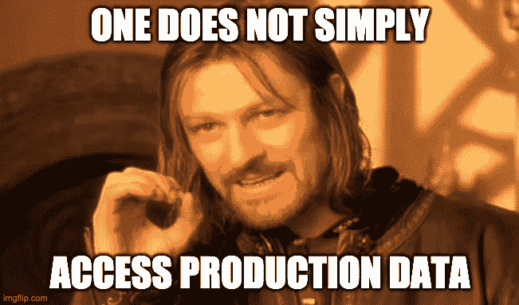
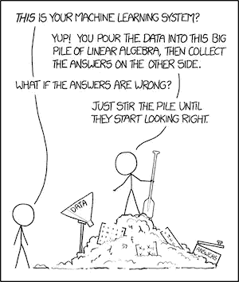

# 测试准确度越来越低？像这样比较训练集和测试集

> 原文：<https://towardsdatascience.com/why-you-may-be-getting-low-test-accuracy-try-this-quick-way-of-comparing-the-distribution-of-the-9f06f5a72cfc?source=collection_archive---------8----------------------->

如果你是一名数据科学家，这可能发生在你身上:你在学习过程中为你的模型获得了极好的结果，但是当使用测试集时，或者在部署到生产中之后，你得到了低得多的分数:一切都出错了。

来源: [makeameme](https://makeameme.org/meme/its-the-end-5bd7db)

我是不是太适合了？我的代码有问题吗？我是不是患上了[数据泄露](https://machinelearningmastery.com/data-leakage-machine-learning/)？

有时，测试集中的数据分布与训练/验证集中的数据分布非常不同。也许你正在处理时间序列，测试数据属于我们 2020 年 4 月后的世界🦠.也许你需要在数据科学面试中取得好成绩。

这个问题也会发生，尤其是当您部署一个在运行时工作的模型时。事情是这样的:

1.  你跟踪用户数据。您使用的跟踪系统通常会有一些错误，您会有不正确的或丢失的值。
2.  您可以使用这些数据来训练模型并将其部署到生产中。
3.  由于生产中的数据具有不同的分布，您的模型可能表现不佳。

不幸的是，如果测试集不在您的能力范围之内——例如，它是生产数据，而您无法访问它——那么解决方案就是获得运行时可用数据的更忠实的表示。这很有挑战性。

资料来源:imgflip

***然而*** ，如果你有访问测试集的权限，检查测试集的分布是否与训练集的分布相似是相当容易的。你是怎么做到的？

当然，随着更多的机器学习。

来源:可爱的 [XKCD](https://xkcd.com/1838/) (CC BY-NC 2.5)

这个想法非常简单:构建一个随机森林模型(或任何其他分类器)，其目标是对“训练”或“测试”中的数据点进行分类。*您不应该能够正确地决定一行是属于训练集还是测试集，它们应该是不可区分的。因此，*如果我们的模型表现太好，那么您可以将低测试分数归咎于与训练集具有**不同分布**的测试集。

这里有一个完整的工作示例。试试吧！

当正确创建训练和测试数据集时，分类器的平均准确度从 0.93 下降到 0.53。这正是我们所期待的！如果你稍微挖掘一下，你会发现(剧透一下)测试数据包含了 86%的目标变量等于‘virginica’的行。这就是问题所在。

还有其他方法来测试 2 个数据集的分布相似性。一个这样的例子是 Kolomogorov-Smirnov 测试，它是您分别应用于每一列的东西。我将在以后的文章中更多地讨论这个问题——优点、缺点、发现这个问题后该做什么，以及当你在进行 NLP 和工作嵌入时会发生什么。

**更新**:帖子现已上线:[https://medium . com/@ Billy . mosse/why-you-may-get-low-test-accuracy-try-this-simp statistical-tests-30585 b7ee 4 fa](https://medium.com/@billy.mosse/why-you-may-be-getting-low-test-accuracy-try-this-simpstatistical-tests-30585b7ee4fa)

祝你黑客生涯愉快，并保持健康！

*学到了什么？单击👏说“谢谢！”并帮助他人找到这篇文章。*