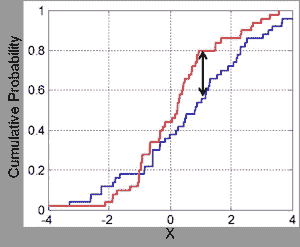

# 为什么你可能得到较低的测试精度:试试 Kolmogorov-Smirnov

> 原文：<https://towardsdatascience.com/why-you-may-be-getting-low-test-accuracy-try-this-simpstatistical-tests-30585b7ee4fa?source=collection_archive---------53----------------------->

## Kolmogorov-Smirnov 帮助比较训练集和测试集的分布。首先使用 Mahalanobis 进行单词嵌入。

[在之前的一篇文章中，](/why-you-may-be-getting-low-test-accuracy-try-this-quick-way-of-comparing-the-distribution-of-the-9f06f5a72cfc)我描述了一个当你获得高训练分数但低测试分数时可以尝试的巧妙技巧。这个想法是，也许你的测试集与训练集有不同的分布，你可以通过一点(更多)机器学习的帮助，实际上知道是否是这种情况。

在文章的最后，我提到这个问题也可以通过统计测试来解决:主要是 Kolmogorov-Smirnov 统计。它是如何工作的？

Kolmogorov-Smirnov 统计检验(所谓的“零”)假设，即从相同的**连续**分布中抽取两个独立的(数字)样本。它在 [SciPy](https://docs.scipy.org/doc/scipy/reference/generated/scipy.stats.ks_2samp.html#scipy.stats.ks_2samp) 中有一个 Python 实现。

让我们试一试。我们首先将数据非随机分为训练集和测试集，因此我们可以尝试 Kolmogorov-Smirnov 测试:

数据集包含列 **sepal_length** 、 **sepal_width** 、 **petal_length** 和 **petal_width** 。这可以通过运行以下命令来检查:

```
X.columns
```

那我们现在怎么办？Kolmogorov-Smirnov 试验必须在每个连续柱上分别进行。例如，让我们在 sepal_width_column 上进行:

```
stats.ks_2samp(X_train.sepal_length, X_test.sepal_length)
```

该行比较了 **X_train.sepal_length** 和 **X_test.sepal_length** 的分布。它们是相同的吗？

我们得到以下输出:

```
Ks_2sampResult(
statistic=**0.5511895215183106**, pvalue=**9.307408288528052e-09**
)
```

**统计值**给了我们两个分布之间的**距离**的概念。对于那些稍微了解统计学的人来说，它无非是经验累积分布函数之间的距离的上确界:



来源:[维基百科](https://commons.wikimedia.org/wiki/File:KS2_Example.png#mw-jump-to-license) (CC0)

基本上，这个值越大，分布的差异就越大。在我们的例子中，0.55 是一个很大的数字，因为 ECDF 输出 0 到 1 之间的*概率值。这是有意义的:如果你检查我们如何创建 **X_train** 和 **X_test** ，我们让参数 shuffle 在分割期间为假，以模拟数据的非随机分割。*

另一方面， **pvalue** 给了我们一个统计检验的重要性的概念。它告诉你我们应该有多信任这个测试。在这种情况下， **9.3 e09** 是一个真正接近于零的值——e09 的意思是乘以 10^(-9)——所以我们处于安全区(通常如果低于 0.05，甚至 0.1 就足够了，这取决于上下文)。

为了结束这一部分，让我们看看如果随机选择训练和测试集会发生什么(在我们的例子中，删除 **shuffle=False** 选项就足够了)。所以，把这一行改成:

```
#We remove the shuffle=False option and add a specific random_state so that you get the same random splitX_train, X_test, y_train, y_test = train_test_split(
 X, y, test_size=0.33**, random_state = 42**)stats.ks_2samp(X_train.sepal_length, X_test.sepal_length)
```

我们得到以下结果:

```
Ks_2sampResult(statistic=**0.16813686180165732**, pvalue=**0.3401566277318967**)
```

**0.168** 的统计值表明我们可能有一个稍微不同的分布，但是我们不能拒绝零假设，即分布实际上是相同的，因为**p 值**不够小(它应该小于 0.1)。

太好了。这让我们可以比较列数据的分布。但只是一维数据。如果我们处理的是不能真正拆分成列的矢量数据，会发生什么？例如，如果我们的数据集由 NLP 单词嵌入组成呢？在这种情况下，列是非独立的，每个列本身没有太多意义。

好吧，同样，我们可以使用我在文章开头提到的这个简洁的[机器学习技巧](http://Ks_2sampResult(statistic=0.16813686180165732, pvalue=0.3401566277318967))，它非常适合矢量数据的分布。正如帖子所解释的，基本想法是*尝试*通过机器学习模型将数据点分类为训练或测试，例如随机森林。如果你成功了，这意味着集合有不同的分布。换句话说，你*不应该*能够成功。

还有其他方法。您可以转换数据，使其成为一维数据。例如，您可以计算向量的长度，然后将 Kolmogorov-Smirnov 应用于的*。当然，在任何这些转换过程中，您都会丢失信息，因此，如果测试结果告诉您两个数据集具有相同的分布，您不应该过于相信测试结果。*

一个不仅仅是计算向量长度的简单转换是计算数据的每一对数据点的 [Mahalanobis 距离](https://docs.scipy.org/doc/scipy/reference/generated/scipy.spatial.distance.mahalanobis.html)。当然，您可以(也应该)尝试进行多种转换，这样您就可以从不同的角度测试您的数据。

Mahalanobis 距离背后的一个可能的直觉是，它计算 2 个向量点之间的距离，就像我们都知道并喜爱的正常欧几里德距离(又名，尺子)，但*知道*这 2 个点是属于特定分布的随机向量。

事实上，当计算两个向量点之间的马氏距离时，你必须通过一个叫做*协方差矩阵的东西。*这个对象是您用来描述您正在使用的发行版的。

这个协方差矩阵是从分布中计算出来的，并且在 Python 中有一个实现。现在，假设我们正在处理一个训练集 X 和一个测试集 Y。我们不应该计算两个不同的协方差矩阵(一个用于 X，一个用于 Y ),但我们需要处理 X 和 Y 的**联合**的协方差矩阵。请相信我，否则，您将丢失更多信息，并且无法检测到分布中的某些差异(用数学术语来说，您将无法检测到分布的……协方差中的差异)。)

我们得到以下结果:

```
 Ks_2sampResult(statistic=**0.13218600000000003**,
 pvalue=**0.0**)
```

所以分布略有不同，这是肯定的*—*p 值很低，四舍五入为零。

如果我们在两种情况下使用完全相同的分布，我们可能会发现如下数字:

```
Ks_2sampResult(statistic=**0.008912000000000031**, 
pvalue=**6.42297518848271e-35**)
```

(当然，有随机性，所以这些玩具的例子你可能会得到不同的结果)。但是，检查一下**统计值**与之前相比有多低。

总而言之:

*   有时，模型中的低测试分数可能是因为测试数据与训练数据的分布不同。
*   您可以通过对数据集的每一列应用 Kolmogorov-Smirnov 统计测试来检查这一点。Python 中有一个实现，你也可以借用我的代码示例。
*   如果你正在处理具有非独立列的数据集，比如单词嵌入，你**不应该**使用 Kolmogorov-Smirnov。你应该首先转换你的数据，使它是一维的。例如，你可以计算所有向量的范数，但是如果你使用马氏距离会更好。对此也有一个 Python 实现，您可以再次借用我的代码示例。

黑客快乐！

*学到了什么？单击👏说“谢谢！”并帮助他人找到这篇文章。*