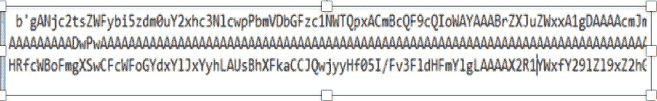
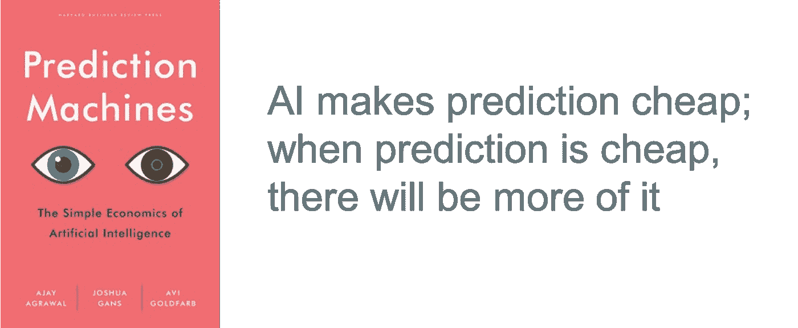

# 为什么需要像对待数据一样对待人工智能模型

> 原文：<https://towardsdatascience.com/why-you-need-to-treat-ai-models-like-data-e34563c4e3e4?source=collection_archive---------61----------------------->

## 为什么像对待数据一样对待模型是一种非常战略性的方法

亚历山大·辛恩在 [Unsplash](https://unsplash.com/s/photos/markus-spiske-rwkhlvk-bsm-unsplash?utm_source=unsplash&utm_medium=referral&utm_content=creditCopyText) 上的照片

这里有一个非常抽象的问题——人工智能或数据科学模型看起来像什么？我们在日常生活中都在使用数据科学模型。大多数不是数据科学家的人都经历过数据科学模型，但从未见过。所以，让我来揭示这个秘密。可能看起来很吓人。这是数据科学模型的样子

这是一个加密成字母数字字符的数学公式。但是不要搞错，这个看起来很奇怪的东西是让你的企业成功并击败竞争对手的秘密武器。它可以通过一些先进的高级分析来帮助您执行业务运营。各种业务案例，如增加收入的产品推荐、防止收入损失的欺诈检测、保护资产价值的资产故障预测，都有预测模型支持

因为模型在创造商业价值中是如此重要，我们需要小心处理它们。让我们看看处理这些模型的不同方式

# 最糟糕的护理—留在笔记本电脑上的模型:

最糟糕的是，这些模型被留在笔记本电脑上，通常是在最初创建的地方。想象一下，把你的企业秘制酱当成一个被遗弃在孤岛上的人。这种情况多少有点可比性。

照片由[约翰·苏](https://unsplash.com/@johnsoo1016?utm_source=unsplash&utm_medium=referral&utm_content=creditCopyText)在 [Unsplash](http://s/photos/abandone-pc?utm_source=unsplash&utm_medium=referral&utm_content=creditCopyText) 拍摄

不幸的是，这种情况发生了很多次。数据科学家使用笔记本电脑或个人电脑上的分析工具创建的模型仍然存在。大量的努力和脑力被用来创建它们，它们包含了企业成功的关键因素。然而，由于它们保留在本地机器上，并且从未被操作，这是对如此美丽的数据科学作品可能发生的最糟糕的事情

# 变得更好——将模型放入容器

更好的方法是将模型放在 docker 容器中。通过这种方式，你离以更好、更合理的方式对待模型更近了一步。您现在将模型放入容器中，这意味着它们在容器中是安全和隔离的，并且更易于操作。

威廉·费尔克在 [Unsplash](http://s/photos/containers?utm_source=unsplash&utm_medium=referral&utm_content=creditCopyText) 上的照片

虽然模型在一个安全的容器中，但它仍然是孤立的。这意味着，如果您想要使用该模型，您需要将数据发送到 docker 容器，并使用 API 来获取结果。这意味着数据移动增加了，这可能不是所有业务运营都希望出现的情况

# 战略方法——像对待数据一样对待模型

近来，数据已经成为任何公司的宝贵资产。许多技术进步都是将数据作为一种宝贵的资产来管理，例如，数据仓库和大数据存储平台都围绕着保持数据的安全、可管理并使其易于使用来为企业带来好处

因此，如果我们开始将模型视为数据，我们就可以利用数据管理的所有优势，并将其应用于模型。通过像对待数据一样对待模型，我们确保模型也会像数据一样对业务运营具有战略意义。

以下几点说明了为什么将模型视为数据是一个有趣的命题

## 模型是由数据构成的

模型不是凭空产生的，也不是用魔杖创造的。它们是通过将算法应用于数据而创建的。你可以把它看作是数据的数学投影。因此，将它们视为数据的一部分是有意义的。

## 模型结果需要数据来理解它们

假设你的模型在未来几天提醒你一个关键的资产故障。为了能够采取任何行动，您需要了解关于该资产的更多细节，例如其位置和价值。您还需要评估是否有必要进行紧急维修或冒险等待下一次定期维护。

正如你现在意识到的，模型的输出只是一个警报触发器。真正的行动需要完成，而将模型输出转换成有形的东西需要关于有问题的资产的数据。因此，如果您将您的模型作为数据的一部分，即作为表中的数据存储在系统中，您可以轻松地将模型的输出与其他数据集成，这使模型输出变得有意义，也使其更具可操作性

## 管理数百万个模型

在《预测机器》(predictionmachines.ai)一书中，作者写道，人工智能预测变得越来越便宜，这意味着我们将更多地使用它。这也意味着会有越来越多的车型。

预测机器. ai

需要数百万模型的用例不是科幻小说。准确的零售库存预测需要每个商店中每种产品的模型。欺诈检测需要对正常的客户行为进行建模，以便预测任何偏离正常行为的情况。由于客户 X 的正常行为可能不同于客户 Y 的正常行为，您将需要与客户一样多的模型。

随着企业管理数以百万计的产品和数以百万计的客户，突然之间拥有数以百万计的模型的需求变得不可避免。

在这种情况下，最好将模型视为数据，并将所有大数据管理原则也应用于模型

## 模型是您企业的知识产权——保护好它们

模型是由数据构成的，它们编码了您的企业如何工作。例如，欺诈检测模型对您打算如何检测欺诈进行编码。这是贵公司的知识产权，因此应该妥善管理和保管。

想象一下，欺诈检测模型被盗并被解密，甚至更糟的是，解密后的模型被放在互联网上，让每个人都知道你是如何检测欺诈的。突然之间，您将很容易受到欺诈攻击。

然而，管理像数据这样的模型并将数据的所有安全原则应用于模型将有助于使您的知识产权更加安全。

## 管理模型的经济性

开发一个模型是有成本的，管理你的模型并保持其可操作性也是有成本的。如果你投资专门的系统来管理模型，你就增加了模型的成本。所以你需要仔细考虑创建和管理一个模型的总成本。

正如好的模型来自好的和集成的数据，如果你有一些好的模型，你已经有了一个数据管理平台。因此，如果您还利用数据管理平台来管理您的模型，您将保持模型的总体成本较低。从长远来看，这有助于保持模型的经济性和盈利性

现在，您已经看到了为什么管理像数据这样的模型是有意义的，让我简要地描述一下其中的内容。这些是你想把模型当作数据的一些构件

**模型库** —这是一个存储模型数据的地方。通常，它是一个具有专门字段的表，用于保存模型加密定义

**模型元数据** —模型看起来很奇怪，人类很难读懂。你需要某种元数据来描述这个模型是关于什么的。这就是使用模型元数据的地方。它包含诸如模型的用途、使用哪种算法以及关于模型准确性的信息

**模型传承**——像数据一样，你也需要知道模型是如何构建的，以及它是如何被使用的。您需要获取用于构建模型的数据信息。这在可追溯性或审计情况下非常有用

**设计模式**将外部模型引入数据库——模型就像数据。其中大多数都源自数据管理平台之外。如果您必须像管理数据一样管理模型，您需要将它们放入数据库中。这需要设计模式，设计模式描述了将外部模型引入数据库的不同方式

总之，如果你像对待数据一样对待模型，它们将会像有价值的资产一样被管理。

# 额外资源

# 网站(全球资讯网的主机站)

你可以访问我的网站进行零编码分析。https://experiencedatascience.com

请**订阅**每当我发布一个新故事时，请随时关注。

 [## 每当 Pranay Dave 发表文章时，您都会收到电子邮件。

### 每当 Pranay Dave 发表文章时，您都会收到电子邮件。注册后，如果您还没有，您将创建一个中型帐户…

pranay-dave9.medium.com](https://pranay-dave9.medium.com/subscribe) 

你也可以通过我的推荐链接加入 Medium。

 [## 通过我的推荐链接加入 Medium—Pranay Dave

### 作为一个媒体会员，你的会员费的一部分会给你阅读的作家，你可以完全接触到每一个故事…

pranay-dave9.medium.com](https://pranay-dave9.medium.com/membership) 

**Youtube 频道**
这里是我的 Youtube 频道
[https://www.youtube.com/c/DataScienceDemonstrated](https://www.youtube.com/c/DataScienceDemonstrated)的链接