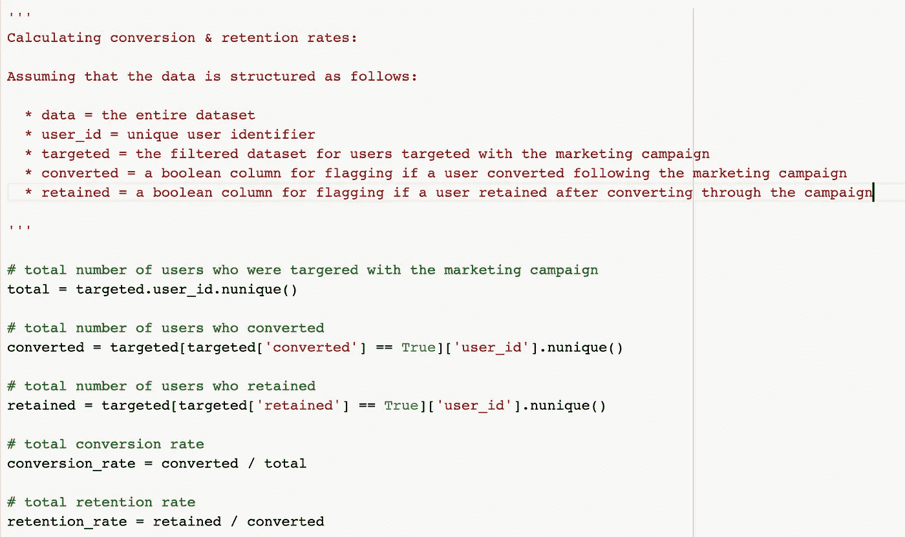
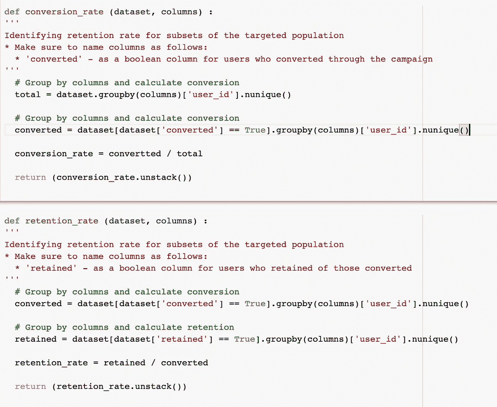
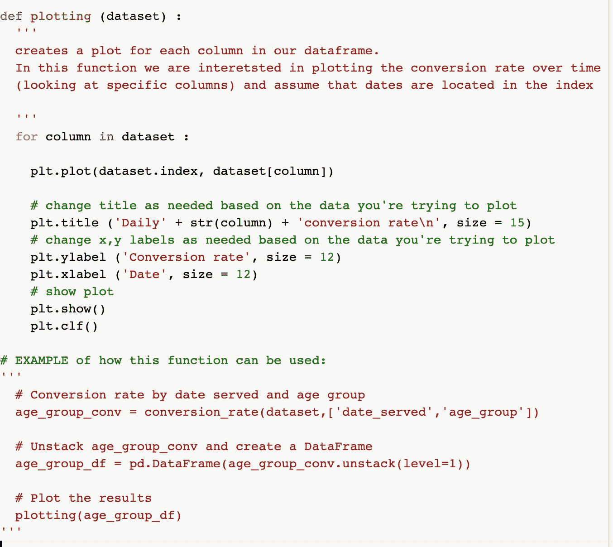
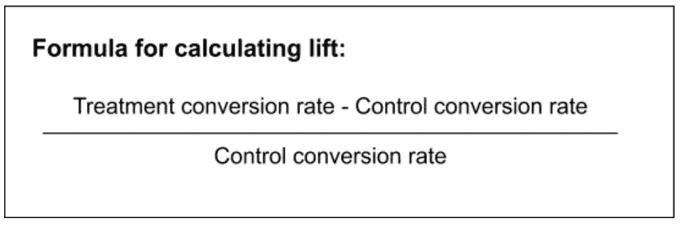
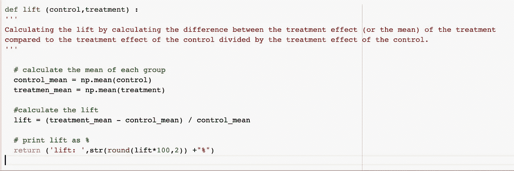

# 为什么应该使用 Python 分析营销活动

> 原文：<https://towardsdatascience.com/why-you-should-be-analyzing-your-marketing-campaigns-with-python-453f3a3528e7?source=collection_archive---------17----------------------->


照片由[威龙 A](https://unsplash.com/@wyron?utm_source=medium&utm_medium=referral) 在 [Unsplash](https://unsplash.com?utm_source=medium&utm_medium=referral) 上拍摄

像大多数小孩一样，我最喜欢的生日游戏之一是 piata。我会急切地等待轮到我，在我被蒙住眼睛的时候露出最灿烂的笑容，手里拿着球棒走上前去，疯狂地挥棒打开一边，释放里面储存的所有美丽的糖果。显然，蒙着眼睛试图击中目标被证明是一项几乎不可能完成的任务，这令人难以置信地沮丧，因为你知道肯定有东西藏在那个皮囊里。

**试图在没有数据的情况下建立一个成功的营销活动，就相当于蒙住眼睛时希望击中目标。**不幸的是，从事营销工作常常会有这种感觉。许多营销团队努力获得足够的分析师资源，以成功采用数据驱动的方法开展增长型营销活动:识别用户群、发现增长机会、开发流失和保留预测模型，并最终设计和分析绩效&影响。如果没有数据，这些活动产生的任何影响都将是纯粹的运气。

我不喜欢蒙着眼睛做手术。我相信数据，你也应该相信。

于是我投入了时间和精力，自己去学习如何挖掘和分析营销数据。作为一名能够进行深入、有意义的数据分析的成长型营销人员，我能够识别营销和增长机会，设计快速实验，及时分析结果，并根据实验结果提出其他营销活动想法，而无需依赖数据科学家或分析师。

这并不容易。我花了将近两年的时间精通 SQL、Python 和统计学，达到了能够正确分析和解释增长型营销数据的水平。作为一名营销人员，达到这种水平的分析能力让我大开眼界，现在我已经达到了这一水平，我想帮助其他营销人员也摘掉眼罩。

**事实是，你不必成为数据科学家来有效地分析营销活动**，但是你需要精通统计学(尤其是频率学家)来设计和解释实验。如果你刚刚开始，我建议你先学习统计学的入门课程。如果您已经精通基础统计学，那么投资学习基本的 Python 函数，这将有助于您更高效、更深入地分析营销活动。

营销活动最常见的实验形式是 A/B 测试，也称为“假设测试”。虽然 Mixpanel 或 Amplitude 等程序提供了一些用于分析活动绩效的“现成”解决方案，但即使是在最基础的层面上使用 Python，也能让您探索数据中不同部分之间更复杂的关系，识别可能的错误或问题，并通过自动化节省时间。

让我们更详细地了解一下如何开始部署 Python 进行营销分析:

# 简化您的探索性数据分析(EDA)

每个分析都是从了解你的数据开始的。这包括(但不限于):了解数据的结构化方式，删除不需要的列，解决空值问题，运行汇总统计并通过创建段或组来探索可能的关系，最后通过绘制数据进行可视化探索。

由于您将利用的大多数功能都包含在您进行的每个 EDA 中，您可以创建一个模板，或者使用我在这里创建的[的模板](https://colab.sandbox.google.com/drive/1SgwAH7OVlaqLfyj6-IXPBlFrr00beYTZ?usp=sharing)，以使探索您的数据变得简单而快速。

# **发现数据中的关系**

每个营销活动都有特定的目标，大多数活动都将关注转化率指标。假设您正在发送一封电子邮件，让用户知道您的产品有限时折扣。为了正确分析您的活动的影响，您需要定义转化率指标，例如兑换了电子邮件目标折扣的用户的转化率，以及兑换折扣后继续使用该产品的用户的转化率。

你的活动可能会使一些用户比其他人更容易转化，所以你需要对不同的人群进行重复分析，以确定影响的差异。

使用 Python，您可以定义一个循环，该循环遍历您的人口的不同部分，并计算每个部分的转换率。您的细分可以是年龄组、参与度或任何其他感兴趣的细分。Python 允许你在更精细的层次上快速探索转化，这是每个成功的营销活动所需要的。如果没有 Python，您会发现自己要花费大量时间重复类似的分析。

现在让我们把这些原则付诸实践。

## 步骤 1:定义转换率和保留率的公式

转换率的计算方法是转换的用户总数除以目标用户总数。在本例中，我们将假设数据已经清除了空值，并进行组织，以便标记每个用户，如果他们是活动中的目标，如果他们在活动后转换，和/或如果他们在活动后被保留。



转化率和保留率计算示例(图片由作者提供)

对您的数据运行这些公式将会得出总体转化率和保留率。如果你是作为实验的一部分进行这种分析，你应该将你的结果与对照进行比较，或者将结果与活动设计中定义的其他基准进行比较。

## 步骤 2:使用自动化功能加速您的分析

一旦您对您的营销活动表现有了一个总体的了解，您将想要更深入地了解并发现在整个营销活动期间您的人群的子群体之间的表现差异，以及比较您的人群的某些特征。

这就是使用 Python 可以真正加快分析速度的地方。使用自定义函数，您可以分析您的群体中任何所需子群体的转化率和保留率，例如不同的语言、服务日期或您的目标群体的任何其他相关特征。

首先，创建接受任何数据集和列的自定义函数，并返回每个段的转换率和保留率。您可以通过使用“分组依据”功能来实现这一点。然后，您可以像在步骤 1 中那样计算转化率和保留率，并将结果作为新的数据帧返回。请注意，您可能需要首先拆分结果。您的函数应该类似于以下内容:



自定义转化率和保留率函数示例(图片由作者提供)

虽然您可以将这两个函数合并成一个函数，但我通常更喜欢将它们分开——您可能希望探索影响每个函数特定性能的不同特性。例如，在某些情况下，您可能会发现某些群体的转换率较低，但他们的保留率较高，您需要进一步探索可能分别影响每个比率的功能。

## 步骤 3: **使用自定义绘图功能来检测关系，并识别数据中可能的不一致**

使用表格格式来探究不同功能和细分市场的影响可能会让人感到力不从心。使用绘图功能直观地(快速地)检测影响整体结果的波动和潜在关系通常更容易。您可以定义自定义绘图函数，以节省时间并简化调试。



自定义绘图功能示例(图片由作者提供)

数据波动可能有多种原因。在某些情况下，您可能会发现用户在一周的某些天或一天中的某些时间进行不同的转换。在其他情况下，您可能会注意到某些语言的表现差异，这可能表明与活动翻译相关的问题，以及活动是否以正确的语言提供给用户。你甚至可以确定需要使用不同类型的视觉效果、颜色或触发器，以便在不同的市场更好地定位活动。

深入数据并解决不一致可能需要更高级的编码，这超出了本文的范围。我将在以后的另一篇文章中探讨如何处理这些问题。与此同时，如果您发现数据中有任何可能的不一致，我建议您咨询您组织内的分析师。当我建立我的分析技能时，我发现来自我的分析师同行的输入是绝对无价的。

# 识别重要性和提升

当你开始发现你的目标人群中的子群体的关系和转换率时，你需要计算提升率——这将使你了解你的活动实际上增加了转换率。如果你以假设检验(也称为 A/B 检验)的形式设计你的活动，你首先需要将数据分成相关的对照组和治疗组，然后分别计算每组的转化率。在此基础上，您将计算治疗组转换率和对照转换率之间的差值，除以对照转换率。



升力计算公式(图片由作者提供)

使用 Python，我们可以为此定义一个函数:



自定义升力计算函数的示例(图片由作者提供)

最后，如果不理解它们的统计意义，你所揭示的转化率和保留率以及提升将毫无意义。要做到这一点，你需要进行 T 检验。T 检验有几种类型，取决于你的实验和活动的设计。在这种情况下，我们来看一个双样本 T 检验计算。T 检验将为我们提供一个 T 统计量和一个 P 值，它将决定得到一个至少和你最终得到的结果一样极端的结果的可能性。也就是说，这个活动的结果是随机的结果，还是这个活动确实有影响力？

一般来说，在 95%的显著性水平上，至少 1.96 的 T 统计被认为是统计学显著的。我们的 P 值需要小于 0.05 才能认为我们的结果具有统计学意义。

使用 SciPy 库时，在 Python 中运行 T-test 实际上非常简单。它应该类似于以下内容:

```
# t-tetst for two independent samples
from scipy.stats import ttest_indt= ttest_ind(control,treatment)print (t)
```

为了最准确地了解您的宣传活动取得成功的群体，重要的是要估计提升，以及这些结果在您的目标人群的子群体和人口统计数据中是否具有统计显著性。未能揭示占目标人群的子群的提升和统计意义，可能会导致对您的活动的整体影响的错误结论。

如果你想了解更多关于使用 python 进行假设检验，以及分析 lift 和显著性水平的信息，你可以在我的文章[“使用 Python 设计 A/B 测试的成长型营销人员指南”](/a-growth-marketer-guide-to-designing-a-b-tests-using-python-5c0729d8eacc)中了解更多。

# 总而言之

虽然许多营销团队可能缺乏足够的分析师资源，但每个团队仍然可以采取更加数据驱动的营销方法。营销人员，特别是那些专注于增长型营销的营销人员，可以通过提高他们在统计和编码语言(如 Python)方面的熟练程度来开发更有意义的活动并正确分析其影响，从而大大受益。

在这篇文章中，我们介绍了使用 Python 可以如何帮助你:(1)快速发现影响产品使用的数据关系，(2)加快对每个活动的分析，这将允许你进行更多的试验，以及(3)优化你的活动，以提高转化率和保留率。

花时间学习成为最好的成长型营销者所需的工具。你会发现奖励甚至比那块旧皮纳塔糖还要好。


图片由[拍摄](https://pixabay.com/users/kliempictures-3066210/)经由[pixabay.com](https://pixabay.com/photos/pi%C3%B1ata-party-celebration-birthday-1937444/)