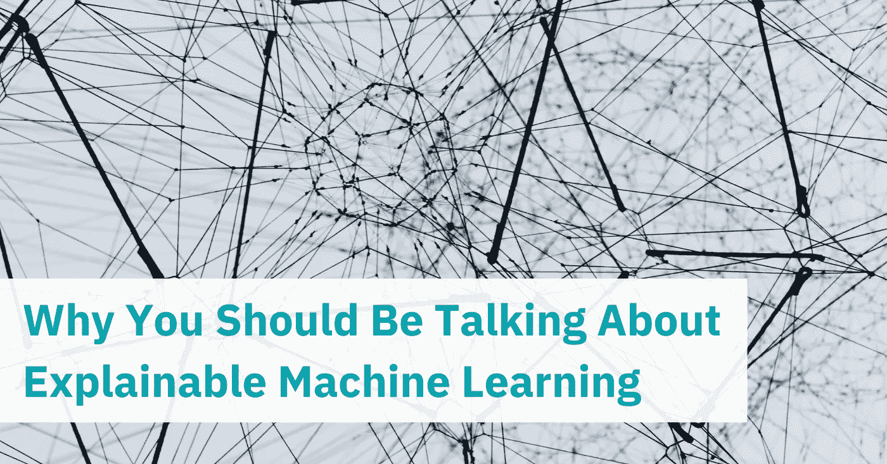

# 为什么你应该谈论可解释的机器学习

> 原文：<https://towardsdatascience.com/why-you-should-be-talking-about-explainable-machine-learning-eb9430d11312?source=collection_archive---------68----------------------->

## 随着我们对机器学习的依赖增加，我们对它的理解也必须增加。

艾莉娜·格鲁布尼亚克在 [Unsplash](https://unsplash.com/?utm_source=unsplash&utm_medium=referral&utm_content=creditCopyText) 上的照片

## 那么问题出在哪里？

*简而言之:大多数机器学习(ML)模型都没有得到很好的理解，随着经济越来越依赖 ML 结果，人工智能驱动的技术中预测不佳和系统性歧视的风险也在增加。*

长回答:

众所周知，几乎所有的大中型公司都是在数据的基础上做出决策的。大多数公司在某种程度上直接(通过内部开发)或间接(使用第三方软件)利用人工智能。我们现在已经到了“人工智能”不再是一个时髦词的地步——大多数公司对它的使用只是假设。

然而，所有人工智能的根源在于机器学习。传统上，机器学习模型是“黑匣子”，数据输入其中，预测出来，而开发人员不知道如何或为什么。一个模型的准确性足以让人相信它是可信的。

> “随着 ML 现已内置于大多数应用程序中，数据驱动的系统性歧视和不公平预测实践的风险达到了前所未有的高度。”

考虑一笔因种族、性别、宗教或性取向而被拒绝的房屋贷款。这样的场景虽然不公平也很荒谬，但并不少见。类似的例子在几乎每个行业都很普遍——想象一下这种歧视在医疗保健、银行和保险等行业的影响！幸运的是，这种情况通常不是由恶意意图引起的，而是由发展中的数据科学家遗漏的有偏见的数据引起的。有了正确的技术和正确的应用，我们就可以告别歧视性的技术，迎来一个公平、没有偏见的 ML 驱动的世界。

## 进入可解释的机器学习

> 随着世界对 ML 的依赖越来越深，我们对预测是如何以及为什么在逐个模型的基础上产生的理解必须成熟。

可解释机器学习(EML)是下一代机器学习，它为 ML 模型提供可解释性和可解释性。正是这种技术将极大地降低有偏见和歧视性的机器学习的风险，并帮助组织和经济体做出更好的决策和更有效地运营。

那么我所说的可解释性和可解释性是什么意思呢？这两个术语经常(并且错误地)互换使用，但是在 ML 评估中，有几个关键的区别。

**可解释性**

可解释性用人类可以理解的语言回答了模型内部机制背后的“是什么”和“为什么”,带来了几个有价值的好处:

*   非技术领域专家对模型功能的理解
*   预测误差的发现
*   识别以前未见过的概念(给定观察到的事件，可能会发生什么未观察到的事件)
*   更好地理解何时存在不确定性、偏见或不公平

**可解释性**

可解释性回答了模型如何在不了解其内部机制的情况下获得给定的输出，有助于揭示数据科学家经常忽略的关键问题的答案:

*   如果你改变特定的输入参数，会导致相同的、更好的还是更坏的结果吗？
*   如果情况发生变化，事件还会发生吗？

> “可解释的机器学习有效地充当了翻译器，允许其用户理解甚至改变结果。”

如果你曾经作为数据科学家工作过，或者与数据科学家一起工作过，你几乎肯定会思考这样一个问题:“为什么模型会做出这样的预测？”或者“我们能做什么来改变这个预测的结果？”。根据我自己的经验，能够清楚而自信地回答这些问题与微调模型的超参数一样重要，如果不是更关键的话。为什么？有几个原因。

## EML 带来了什么

**1。模型评估领域的专业知识**

优秀的模型在开发时会考虑统计技能、计算机科学专业知识和特定于手头问题的领域知识的组合(你们都看过经典的维恩图)。因此，有效的模型在评估时也应该使用这三个领域。EML 邀请技术含量较低的团队成员加入到模型评估和解释的对话中——到目前为止，这一直是纯粹的统计学问题。随着这些额外的大脑加入到等式中，领域专业知识的透镜被引入到 ML 评估工具包中。

**2。影响结果**

如果一个预测是不利的，如果你不明白为什么它是不利的，你怎么知道如何改变结果？假设你开发了一个近乎完美的模型，能够以 98%的准确率预测客户流失(无论你的客户是否会离开)。您将您的预测传达给客户团队，他们注意到如果您不采取任何行动，您的最高价值客户几乎肯定会离开。如果你不知道他们为什么可能会离开，这有什么用？你不是应该能知道是哪些变量导致了这个预测吗？这是你能控制的吗？

> “EML 不仅阐明了为什么我们可以期待某些结果，还让我们了解这些结果是如何受到影响的。”

**3。高管买入**

如果你不能简单地解释或证明你的预测，决策者为什么要相信你的预测呢？当一位拥有 20 年行业经验的高管质疑一项违背其直觉的预测时，他不太可能接受“该模型在验证数据上的准确率达到 90%，因此你可以相信它”作为答案。能够用他们的语言直观地证明和解释为什么一个模型达到了一个特定的结果，这是高管买入的关键。

**4。公民数据科学家的崛起**

加上自动机器学习(AutoML)，EML 允许技术含量较低的人进行准确、无偏见和歧视的日常机器学习任务。通过消除日常机器学习任务对高技术数据科学家的需求，EML 正在推动一个“公民数据科学家”的新时代，并允许技术专家专注于更复杂的问题、行动和结果。

## 下一代

传统上，数据科学项目主要围绕收集正确的数据、清理和设计正确的功能，以及选择和调整正确的模型。下一代公平、自动化和可解释的机器学习才刚刚开始。

EML 正在通过将技术含量较低的工人与复杂的 ML 模型联系起来，并将数据劳动力市场从能够构建 ML 模型的人转移到能够理解它们、解释它们并采取行动的人，来增强公民数据科学家的能力。有了它，我们可以创造一个由人工智能驱动的世界，这个世界是公平的，没有偏见和歧视。