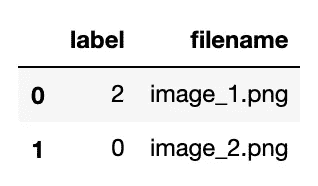
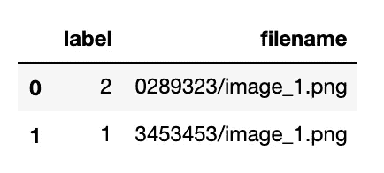
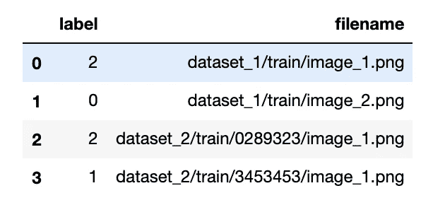

# 为什么应该使用 Pandas 数据框架进行关于图像分类问题的 Keras 培训

> 原文：<https://towardsdatascience.com/why-you-should-be-using-pandas-dataframes-for-keras-trainings-on-image-classification-problems-db220134cbc6?source=collection_archive---------51----------------------->

## 停止使用 flow_from_directory，改用 flow_from_dataframe。

正如我在[之前的文章](/organize-and-document-your-machine-learning-or-any-research-project-with-notion-623d52fae972)中看到的，缺乏组织的研究项目可能会很艰巨。周围有如此多的资源，有时会减慢研究的进程。

在这篇文章中，我将关注由图像组成的数据集，尤其是那些用于图像分类问题的数据集。我们将看到在使用 Pandas 数据框架时，在这种数据集上启动 Keras 训练有哪些优势。


照片由[米卡·鲍梅斯特](https://unsplash.com/@mbaumi?utm_source=medium&utm_medium=referral)在 [Unsplash](https://unsplash.com?utm_source=medium&utm_medium=referral) 上拍摄

Keras 提供了一种在处理神经网络时使用大型数据集的方法:无论是在训练阶段还是评估阶段。这是 [Keras 预处理模块](https://keras.io/preprocessing/image/)，它有几个从磁盘加载数据并动态预处理数据的方法。最常见的方法是`flow_from_directory()`，这是一个非常简单的工作流程，因为你只需要将你的图像文件分成每个类的文件夹。生成器会将每个文件夹作为要训练的类。是的，这非常简单，但它涉及到必须开发耗时的脚本来为每个训练数据集版本将图像从一端复制或移动到另一端。

*   但是，如果你决定为一个特定的实验做一些修改，比如把一个班分成两个班，那该怎么办呢？— **数据集版本化**
*   如果您想用来自两个或更多数据集的图像组成一个数据集，该怎么办？— **多个数据集的组合**
*   如果因为你的网络模型有两个输出，你想同时训练两个标签怎么办？— **多任务问题**

我们将会看到如何使用熊猫图书馆来帮助缓解这些问题。

Keras 有一个生成器函数，使用 Pandas dataframe 从磁盘加载数据:`flow_from_dataframe()`。此数据帧必须有一列，您可以在其中为每个项目指定图像文件名。有了这个和`directory`参数，Keras 将按如下方式为每个图像文件构建路径:`os.path.join(directory, <filename_column>)` 此时，您可以忘记将文件组织在类的文件夹中的想法，取而代之的是，您可以将它们都放在同一个文件夹中。

下面的每一节都试图通过使用这个`flow_from_dataframe()`方法来回答前面三个问题中的一个。

# 数据集版本化

我在处理数据集时的工作流程是手动创建一个版本控制系统:每个版本都是我为特定实验所做的任何修改的结果:添加额外的数据、修改标签、修正等等。

这导致具有由数据帧更清楚地表示的不同数据集版本，而不是必须创建单独的文件夹，在该文件夹中用新的类结构复制图像。最重要的是，大文件(图像)仍然在同一个目录中。因此，您可以拥有由相同图像的不同组合组成的多个数据集版本(csv 文件)。

# 多个数据集的组合

正如我之前提到的，Keras 通过使用`directory`参数和文件名列组成了要读取的图像的路径。最新的必须有文件名，但它也可以包含子路径。Keras 将执行连接，而不询问是否只有文件名。这对于您在线下载的数据集来说非常强大，这些数据集具有特殊的结构，其中图像位于不同的子目录中。此外，通过这种方式，我们可以轻松地构建一个数据集版本，其中包含来自不同来源的图像，而不必将它们移动到同一个文件夹中。

让我们看一个例子:

假设数据集 1 和数据集 2 具有以下图像路径:

```
/media/datasets/dataset_1/train/image_1.png
/media/datasets/dataset_1/train/image_2.png/media/datasets/dataset_2/train/0289323/image_1.png
/media/datasets/dataset_2/train/3453453/image_1.png
```

数据集 1 具有所有图像都在同一目录下的结构: *dataset_1/train/** 。但是，数据集 2 不同，它有子文件夹，图像文件名本身是重复的(“image_1.png”)，所以我们需要将这个子文件夹添加到文件名列中。这是两个数据帧及其相应的 Keras 方法调用:



数据集 1(左)和数据集 2(右)的数据框

要创建一个合并的版本(数据集 3)，我们只需要从两条路径变得不同的地方添加路径:“*数据集 _ 1/”*和“*数据集 _ 2/”*。



包含不同来源文件的合并数据集示例

对于本例，我们必须将`flow_from_dataframe()`中的目录参数设置为公共路径，以便 Keras 能够组合适用于两个数据集的路径。

这里我建议创建一个文件夹，例如 dataset_3，用符号链接指向两个数据集:

```
~/datasets $ mkdir dataset_3
~/datasets $ cd dataset_3
~/datasets/dataset_3 $ ln -s ~/datasets/dataset_1/train dataset_1
~/datasets/dataset_3 $ ln -s ~/datasets/dataset_2/train dataset_2
~/datasets/dataset_3 $ ls -l
dataset_1 -> /home/sruiz/datasets/dataset_1/train
dataset_2 -> /home/sruiz/datasets/dataset_2/train
```

这只是出于组织的目的，因为两个数据集不同的基本路径将是: */home/datasets/dataset_3* ，而不是更一般的: */home/datasets。*但是，如果数据集位于不同的位置，并且它们不共享任何基本路径，并且您不想移动它们，那么它也会非常有用。

# 多任务问题

在一个任务中，当训练一个多任务问题时，使用数据框架是不可协商的。这指的是可以为一个输入预测多个输出的网络模型:例如，如果一幅图像有一只猫或一只狗以及它的皮肤颜色。

对于这类问题，我们需要在训练步骤中为每个输入设置两个标签。因此，将文件分离到每个标签的文件夹中的方法，尽管[也有可能](https://www.pyimagesearch.com/2018/05/07/multi-label-classification-with-keras/)，涉及到每个标签组合有一个文件夹。这可能会导致创建大量的文件夹。

一个数据框架的好处是，你可以有一个标签猫/狗的列和另一个皮肤颜色的列。将`flow_from_dataframe()`方法用于双输出网络时，您只需在`y_col`参数中指定标签在哪些列中:

感谢阅读。

塞尔吉奥·鲁伊斯([@塞尔楚](https://twitter.com/serchu))

[](/organize-and-document-your-machine-learning-or-any-research-project-with-notion-623d52fae972) [## 用概念组织和记录你的机器学习(或任何)研究项目

### 由于缺乏组织和文档，研究可能会很困难。

towardsdatascience.com](/organize-and-document-your-machine-learning-or-any-research-project-with-notion-623d52fae972)