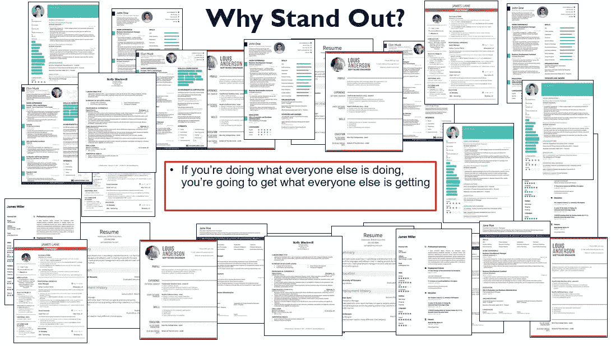

# 作为一名数据科学家，你为什么应该建立自己的个人品牌

> 原文：<https://towardsdatascience.com/why-you-should-build-your-personal-brand-as-a-data-scientist-c686bbc2b8ef?source=collection_archive---------29----------------------->

[(来源)](https://www.pexels.com/photo/photography-of-person-walking-on-road-1236701/?utm_content=attributionCopyText&utm_medium=referral&utm_source=pexels)

当我刚开始从事数据科学时，在数据科学领域找工作时，我和其他人一样。

长话短说，我去了**求职门户** , **投了几百份简历**应聘各种数据科学家岗位，**“希望”最好的**。

不出所料，大多数时候我都被拒绝了，到了一定程度，我的收件箱就塞满了电子邮件，比如:

> 感谢您申请 ___ 的数据科学家职位。不幸的是…
> 
> 感谢您申请 ___ 的数据科学家职位。由于我们收到了大量的申请，我很抱歉地通知你…

我很沮丧，想知道这里出了什么问题。

我完全按照大学时代别人告诉我的去做。

> “嘿，阿德蒙德，你需要取得好成绩，获得一些你所在行业的相关实习经验，润色你的简历，去工作门户网站申请工作，你就没事了。”

对不起…我不好。

最重要的是，我正面临着一段艰难的时期，甚至连一个面试的机会都没有。

## 🚀我人生的转折点

[(来源)](https://www.pexels.com/photo/man-standing-on-top-of-rock-at-daytime-673018/?utm_content=attributionCopyText&utm_medium=referral&utm_source=pexels)

**但当我开始活跃在 [**LinkedIn**](https://www.linkedin.com/in/admond1994/) 上，通过学习和分享数据科学社区时，出现了一个转折点**。

我从来没有意识到，作为一名数据科学家，我实际上是在打造自己的个人品牌。

从那以后，也有一些招聘人员/猎头和公司在找我，希望我能成为数据科学家。

更令人惊讶的是，机遇之门向我敞开了——[**说话**](https://www.admondlee.com/data-science-speaker)[**写作**](https://www.admondlee.com/data-science-blog)[**商务**](https://www.admondlee.com/data-science-and-analytics-services) 和工作岗位。

这些机会不仅帮助我发现了自己的潜力，走出了自己的舒适区，还将我的职业生涯，甚至生活带到了一个全新的水平，这是我以前认为不可能的。

现在，如果你问我，有没有一件事我希望在我的职业生涯中早点学会…

> 这将是**建立我的个人品牌**。

在这篇文章结束时，我希望你能理解为什么作为一名数据科学家建立个人品牌如此重要，并希望能激励你开始采取行动！😄

让我们开始吧。

# 那么…什么是个人品牌？

如果你只是谷歌一下，个人品牌有很多定义。

但下面是我对个人品牌的理解。

P **个人品牌是关于做你自己——真实的自己，有你的信念、你自己的故事和经验，在你的领域展示专业知识和权威。**

个人品牌不是仅仅为了打动招聘经理或雇主而伪造自己的品牌和经历。

你看。每个人都是独特的。每个人都有不同的视角、不同的心态和不同的信仰。

除了你自己，你不需要成为别人。个人品牌是关于你是谁，以及人们如何看待你，即使你不在那里。

建立个人品牌的最好方式就是做你自己。

你的价值观是什么？你的信仰和主张是什么？你为什么要这么做？你的动力是什么？

对我来说，我的使命是 [**让每个人都能接触到数据科学**](https://www.admondlee.com/my-story) 以及使用数据赋予人们和企业清晰的洞察力。

这是我的信念，也是激励我的动力。你呢？

## 为什么苹果和耐克是世界上最成功的公司？

[为什么苹果和耐克是世界上最成功的公司？](https://www.youtube.com/watch?v=keCwRdbwNQY)

那是因为他们的 [**品牌和他们所信仰的**](https://www.youtube.com/watch?v=keCwRdbwNQY) 。句号。

🍎苹果公司相信有激情的人可以让世界变得更好。

✔️ **耐克**表彰伟大的运动员，他们也表彰伟大的运动员。

苹果和耐克都很少谈论他们的产品，人们仍然在购买它们，因为人们喜欢他们的品牌，相信他们的愿景。

这与建立我们的个人品牌非常相似。当人们想到你时，他们会如何看待你？你的品牌和信念是吸引人们/公司的原因。

我们每个人都有自己的品牌，不管是有意还是无意。这就是为什么我们要有自我意识，在更深的层次上发现自己是很重要的。

# **为什么你现在应该作为一名数据科学家建立自己的个人品牌？**

## 1.更多的工作机会

如果现在还不明显，建立个人品牌是在不久的将来获得工作机会的长期策略。

当你开始建立自己的个人品牌时，招聘人员/公司不会马上找你。

建立和赢得**信任、信誉和关系**需要时间。

但是一旦你在自己的领域建立了自己的个人品牌……相信我，随着你将自己定位为所在领域的权威(这里指的是数据科学)，工作机会会逐渐向你走来。

你猜怎么着？你不再需要向不同的求职网站提交数百份——有时甚至数千份——简历，希望得到他们的回复。

## 2.与志同道合的人建立关系网

在建立个人品牌的过程中，你可能会利用社交媒体平台(LinkedIn、Medium 等)。)为他人提供内容和增加价值，让它为你说话。

因此，你也将有机会与志同道合的专业人士交流。

这意味着它允许你**继续向他人学习**，同时能够超越地域限制与他人分享你的激情和知识。

## 3.更多地了解自己

你看。谈论建立个人品牌很容易。

但是要真正理解你的价值观是什么，你相信什么…那是另一回事。

需要诚实、残酷和彻底的**自我分析和自我认识**才能在更深的层次上真正发现自己。

你会开始质疑自己所做的一切，并试图理解背后的原因。

这里的好消息是，你也将能够**了解和发现更多关于你自己的东西来激励和推动你前进**。

## 4.激励和帮助他人

归根结底，建立个人品牌不是你一个人的事。

而是激励和帮助他人。

这是关于你如何用你的热情、专业知识和信念帮助他人。

能够帮助他人是我收到的最好礼物之一，因为帮助数据科学爱好者了解更多该领域的知识以及用数据科学解决方案帮助企业的成就感是无价的。

# 最后的想法

[(来源)](https://www.pexels.com/photo/action-adventure-climbing-daylight-303040/?utm_content=attributionCopyText&utm_medium=referral&utm_source=pexels)

感谢您的阅读。

我希望到现在为止，你已经理解了作为一名数据科学家建立个人品牌的重要性，并希望能激励你开始采取行动！😄

如果你认为数据科学是你的**长期职业道路**，那么在数据科学领域打造你的个人品牌就是你的**长期战略**，让你的职业生涯更上一层楼。

事实上，我最近创建并推出了一门在线课程— [**数据科学家个人品牌工具包**](https://thelead.io/data-scientist-personal-brand-toolkit?utm_medium=instructor&utm_source=admond) —从头开始，指导你如何作为一名数据科学家建立个人品牌。

这些正是我用来在数据科学领域建立个人品牌的步骤、框架和策略，并最终获得大量工作和其他机会。看看就知道我什么意思了。

一如既往，如果您有任何问题或意见，请随时在下面留下您的反馈，或者您可以随时通过[我的网站](https://www.admondlee.com/)或 [LinkedIn](https://www.linkedin.com/in/admond1994/) 联系我。在那之前，下一篇文章再见！😄

# 关于作者

[**Admond Lee**](https://www.linkedin.com/in/admond1994/) 目前是[**Staq**](https://www.trystaq.com)**—**的联合创始人/首席技术官，该平台是东南亚首屈一指的商业银行应用编程接口平台。

想要获得免费的每周数据科学和创业见解吗？

你可以在 [LinkedIn](https://www.linkedin.com/in/admond1994/) 、 [Medium](https://medium.com/@admond1994) 、 [Twitter](https://twitter.com/admond1994) 、[脸书](https://www.facebook.com/admond1994)上和他联系。

 [## 阿德蒙德·李

### 让每个人都能接触到数据科学。Admond 正在通过先进的社交分析和机器学习，利用可操作的见解帮助公司和数字营销机构实现营销投资回报。

www.admondlee.com](https://www.admondlee.com/)