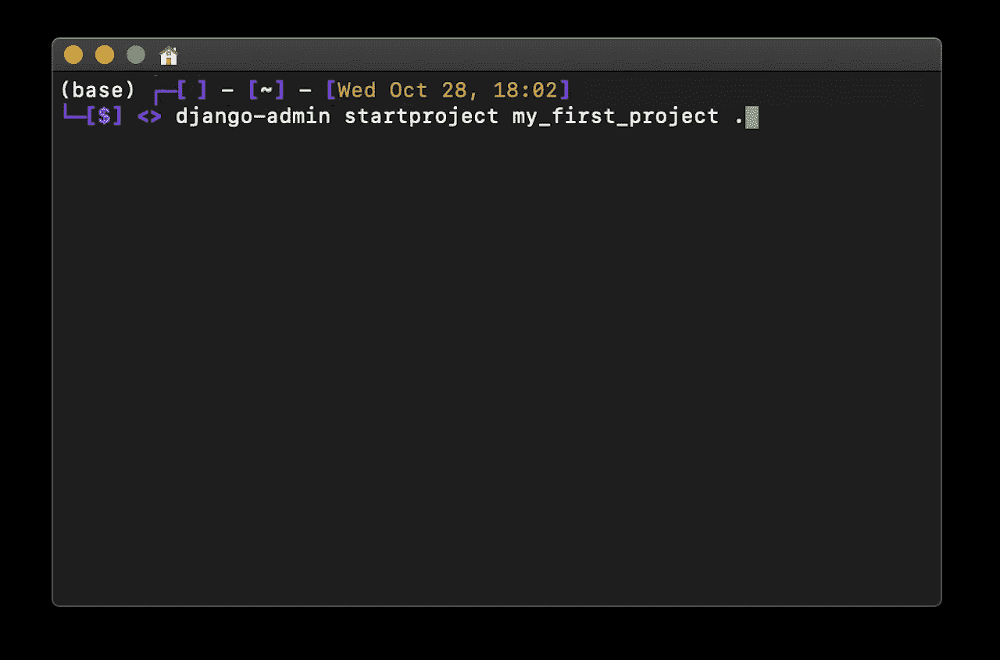

# 为什么您应该在下一个 API 项目中选择 Django 而不是 Flask

> 原文：<https://towardsdatascience.com/why-you-should-choose-django-over-flask-for-your-next-api-project-81802dfcf088?source=collection_archive---------15----------------------->

## Patrick 的博客—数据科学

## 解释为什么 Django 应该是你最喜欢的 python 后端框架

启动 Django 项目的终端命令。试试看！(图片来源:我自己的电脑。)

很多人都在使用 Django 或 Flask 中的一个，有些人甚至强烈建议使用其中一个框架来构建 REST API。几个月前我从弗拉斯克搬到了姜戈，我再也不会回去了。我想看看我是否能让其他人做出好的决定！

## Django ORM 知道你的数据库的进出

如果您使用 Flask，您可能试图提供一些需要数据的功能，因此需要数据库。您可能从 SQLite 开始，因为将 Flask 配置到数据库看起来有点混乱或者至少很耗时，因为您可能依赖 SQLAlchemy 之类的 ORM 来管理您的数据库连接，除非您想耍流氓并使用 f 字符串编写 SQL 查询(祝您好运！).因为您是从 SQLite 开始的，所以在进行转换时，当您需要更专业的东西(如 MySQL 或 PostgreSQL)时，您会感到很困难。

使用 Django，您可以免费获得 SQL 连接。只需[遵循文档](https://docs.djangoproject.com/en/3.1/ref/databases/)就可以了，它会告诉你需要哪种数据库引擎，你是否需要 MySQL、PostgreSQL、MariaDB、Oracle，甚至玩具项目的 SQLite。引擎会为您管理连接。

你想要一个数据库表？如果你知道基本的 python 类，你就拥有了你所需要的一切！无需编写查询来创建您的表！指定一个从 django.db.models.Model 继承的类来定义数据库表，指定类属性来以一种非常可定制的方式定义所有可能的列类型，允许您使用一行程序功能进行跟踪，例如:

*   整数字段、字符字段、文本字段、布尔字段、多项选择字段、浮点字段……对于 PostgreSQL，您甚至可以获得 JSONField。
*   外键管理，以便您知道当相关模型被删除时，关系会发生什么(不再有死关系！)
*   列定义重用:只需将字段构造为函数，并调用它们来定义新的模型列！
*   模型继承通过 python 类继承以一种非常强大的方式进行管理(这里有一些陷阱，但是通过阅读好的文档，您可以避免所有的陷阱)。

您能想象通过使用 SQLAlchemy 来解决这些特性所解决的问题吗？就我个人而言，我认为这是浪费时间！

## Django shell 是你的新朋友:一个关于 Django 经理的小故事

您负责公司的数据库，您正在开会，您的同事正在讨论一些与业务相关的话题。他们很恼火，因为他们还没有从业务分析部门得到他们的报告，他们只想在做出重要决定之前回答一个关于销售数据的非常具体的问题。

在那次会议中，你仍然穿着睡衣，你的相机关着，因为你还没有洗澡，但你知道如何找到这个问题的答案，因为你知道数据在哪里。您在终端中打开 VSCode，“python manage.py shell”并连接到 Django shell。在两行简短的代码中，您导入了包含订单的 Django 模型，并使用 [django-pandas](https://github.com/chrisdev/django-pandas) 作为模型的管理器，直接从模型中实例化了一个 dataframe，该管理器负责执行 SQL 查询、加载所有销售数据，并将所有数据转换为 dataframe。干净利落。您导入 matplotlib，对销售的 pandas 系列应用“hist”方法，并键入 plt.show()。你截图，在会上拍。在你的同事还没来得及想出该问谁之前，他们已经看到了全年的销售额。

你能想到 Flask & SQLAlchemy 有这样的设置吗？我不这么认为！

[Django 管理器](https://docs.djangoproject.com/en/3.1/topics/db/managers/)是一种强大的方式，不仅可以预先编写 SQL 查询，还可以以各种方式转换数据，帮助您随时理解数据，只需一个终端命令。当然，没有什么可以阻止您将这些命令放在 REST API 端点之后，以便将处理过的数据提供给最终用户！我即兴创作了这个情节，但是我可以让我的 Django 管理器运行任意的 python 代码，这样它甚至可以位于一个 API 端点之后，并且如果我愿意的话(如果这样的特性需要可重用的话)，将数据或图像发送到 web 服务器。

## 别再和姜戈重复发明轮子了

如今，大多数 web 编程问题都已解决。这并不意味着，如果你试图建立一个技术栈，你不必实现这些问题的解决方案。在 Flask 中，实现取决于您！这意味着……**大量的编码**。您将最终编写代码来管理

*   数据库查询(如上所述，还包括分页、缓存查询等。)
*   认证系统
*   端点管理(权限、资源、节流等。)
*   设置配置
*   序列化 SQL 数据和反序列化 HTTP 请求数据
*   验证请求数据以避免损坏数据库
*   等等等等。

在 Django 中，你不会通过写代码来解决这些问题。通过编写描述功能的配置，你挑选出已经实现的解决方案。这有一个很大的优势:你不需要解决已经解决的问题，你只需要从 Django 生态系统中挑选你的问题的解决方案。Django 非常清楚，如果有一个共同的问题，你需要一个解决方案，你需要一个维护和最新的解决方案，你可以足够灵活地配置它来满足你的需求，但不要太灵活，你可能会因为调整太多而遇到问题。以我的经验来看，每次我试图过多地调整 Django，要么是我在处理一个非常新的问题(在数据科学主题中可能会发生，但通常非常罕见)，要么是我在最佳实践方面做错了什么，5 分钟后我就会被踢出局！

## 以有意义的方式组织你的代码

Django 有一个很棒的项目和应用系统来帮助组织和重用代码。有一个[可重用 Django 应用的巨大生态系统](https://djangopackages.org/categories/apps/)，所以你可以向你的应用添加功能(认证， [Django REST 框架](https://www.django-rest-framework.org/)用于将你的 Django 应用变成一个成熟的 API，[表单 UI 组件](https://github.com/django-crispy-forms/django-crispy-forms)用于 Django 模板，用 [django-pandas](https://github.com/chrisdev/django-pandas) 将你的数据库模型变成 pandas 数据框架，等等)。如果你自己想出了一个新的有用的功能，你也可以把你的 django 应用作为开源应用发布，让人们在他们的项目中重用它。很厉害！

## 用 Django 做你的后端，任何前端都放在它前面！

关于 Django 有一件小事要提一下:它有一个内置的前端框架，叫做 Django templates，但对于需要处理大量功能的网站来说，这确实是一个可怕的框架。当你看到 Django 网站时，你可以直观地看到网页本身的良好效果，但代码通常远远不够专业。我们说的是大型 HTML 文件和脚本标签，用于使用任何外部 JavaScript，这使得您的代码极难管理。React、Angular、Vue、Ember 等 JavaScript 前端框架解决了做前端的问题，这些框架都有一个共同点:它们都是用 JavaScript 编写的，因为浏览器是用 JavaScript 编写的，所以优化有很多好处。通过用 Python 和 Django 的 Jinja2 的等价物做事，许多已经作为开源库存在的功能不能在前端使用，必须在 Django 中重新发明，由于“我不是 JavaScript”的障碍，这通常不是一个好方法。

但是不用担心！以我的拙见，至少在未来 10 年内，前端将会而且应该用 JavaScript 来完成，因为这是浏览器所使用的，代码需要在浏览器中运行。所以你可以用美妙的 [Django REST 框架](https://www.django-rest-framework.org/)把你的后端变成一个后端 API(这就是为什么它在一开始就对 Flask 有竞争力！)并在它前面附加任何你想要的前端。这就给了你任何你想要的选择，而且有很多选择，每一个都有它的优点和缺点！

我希望这篇文章激励你们中的一些人去尝试 Django。如果你有任何问题或者想和我分享你的 Django API 项目，请联系我；我很乐意在 LinkedIn/Medium 上联系！