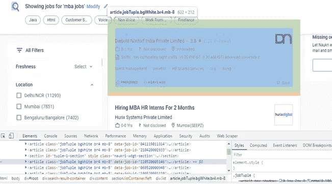
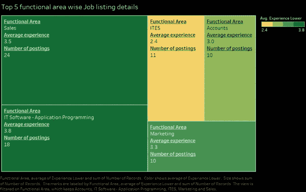

# 为什么你应该考虑自动化你的求职需求

> 原文：<https://towardsdatascience.com/why-you-should-consider-automating-your-job-search-needs-6ab2eeaeb7f7?source=collection_archive---------45----------------------->

## 使用数据提取和自动化技术识别工作机会


作者图片

免责声明:以下文章仅用于教育目的。**所有提取的数据都在 Naukri.com 网站上公开**,无需任何形式的登录即可访问。如果你想了解刮痧的合法性，我建议你试试这篇文章。

完整代码的 Github 链接可以在[这里](https://github.com/devrup-csv/jobsearch/blob/master/fullcode.py)找到。

[](/web-scraping-is-now-legal-6bf0e5730a78) [## 网络抓取现在是合法的

### 这对于数据科学家来说意味着什么

towardsdatascience.com](/web-scraping-is-now-legal-6bf0e5730a78) 

感谢 Covid19，LinkedIn 上疯人院。你可以看到人们对潜在的工作机会感兴趣的评论贴在左右和中间。大约有 100 家甚至更多的猎头公司和公司人力资源部门正在 LinkedIn 上发布他们的工作要求。让我们称这些帖子为我们的直接链接。直接链接是好的，它们是真实的，很可能你的申请会直接发送到发布它的人或他的公司。对这样的帖子发表评论甚至可能导致对你的 LinkedIn 个人资料的真正审查，如果你非常幸运，还会有反馈！现在是第二个环节。简历上写着将才能与机遇联系起来的人。他们大多分享这些直接链接，并试图将候选人重定向到这些链接。最后是第三个环节。LinkedIn 上的工作页面。从互联网上收集数据，大部分是像 Naukri 这样的招聘网站。所有这些可能都不会让你失去动力，你仍然会继续战斗！！

Giphy.com 图片由[提供](https://giphy.com/gifs/getting-playlist-RRerwvHrb0nxm)

有趣的是，当他们说你必须在 Instagram 上跟踪他们才能获得特定的工作列表时。或者直接评论他们的帖子来获取申请链接。这是数字营销 101，他们正在尝试做的事情，即跨平台竞选，这里也没有什么错，除了花了一整天寻找工作的候选人现在必须去 Instagram，看看哪个朋友在吃 foodgasm 或谁在山顶上不能再快乐了，然后寻找适用于他的工作的链接。然后就是你自己在这些各种各样的招聘网站上直接搜索。在应用了大约 10 个过滤器之后，包括你正在寻找的经验工资位置标准，你仍然剩下大约 2k 个结果。

图片由[Giphy.com](https://giphy.com/gifs/Friends-friends-tv-the-one-with-rachels-crush-QvvFf4PnlkGyoZrM38?utm_source=iframe&utm_medium=embed&utm_campaign=Embeds&utm_term=https%3A%2F%2Fcdn.embedly.com%2Fwidgets%2Fmedia.html%3Fsrc%3Dhttps%3A%2F%2Fgiphy.com%2Fembed%2FQvvFf4PnlkGyoZrM38%2Ftwitter%2Fiframe&%3Bdisplay_name=Giphy&%3Burl=https%3A%2F%2Fmedia.giphy.com%2Fmedia%2FQvvFf4PnlkGyoZrM38%2Fgiphy.gif&%3Bimage=https%3A%2F%2Fi.giphy.com%2Fmedia%2FQvvFf4PnlkGyoZrM38%2Fgiphy.gif&%3Bkey=a19fcc184b9711e1b4764040d3dc5c07&%3Btype=text%2Fhtml&%3Bschema=giphy)

在一个有如此多信息的市场中，被如此多的团体分发和再分发，有时对个人来说变得难以承受。2 天的积极申请和评论“感兴趣”之后，你失去了你的魔力，也许会沉浸在下一个趋势网飞系列。

作为学生，我们只能希望，在我们迄今发出的数百份申请中，很少有人能找到合适的工作，帮助我们获得梦想中的工作。但是，如果您愿意尝试几行通用 python 代码，有一种更聪明的方法来处理这些事情。

进入**硒**和**美素汤。**

图片由[Giphy.com](https://giphy.com/gifs/bruce-soup-almighty-kfQRyUQnE63PG)

如果你是一个 IT 人员，你可能已经使用它们来测试客户网站。如果您需要立即从网站上大规模收集公开可用的数据，这两个 python 库就是您的面包和黄油。这些类型的提取很大程度上取决于这样一个事实，即你要寻找的信息大多会在网站上的固定位置找到。通过异常处理，可以管理多达 2-3 个不同位置的位置变化，但超过这个范围的变化就会成为问题。

> “任何阅读这篇文章的列表网站所有者，如果你不想让你的公开数据被轻易抓取，试着在 DOM 中尽可能随机化你的数据的位置。这应该让我们这些微不足道的废物感到沮丧！!"

一个没有大量 CSS 样式或 javascript 启用按钮的网页可以只使用 Beautifulsoup 和 requests 来抓取。一旦 requests 命令成功加载了感兴趣的整个页面，Beautifulsoup 就会下载整个 DOM。但是，如果您的数据位于某个点，只有在单击特定项目后才会被披露，即启用了 JavaScript，那么您将需要 selenium 来拯救。一个更复杂的抓取库，它不只是请求，它可以点击，输入搜索关键词，设置过滤器，基本上模仿人类通过自动化 chrome 驱动程序实例可以完成的所有操作。

现在来谈这个问题。以 Naukri 的网站为例。在找工作的时候，你很可能会应用一定数量的过滤器，比如你想要的薪水、你的经验和你感兴趣的领域，然后浏览结果。**这个页面在一个特定的框中包含了每个列表，如果您右键单击并检查元素，您可以看到页面上的所有列表都包含在特定 div 和类名的相同地址**下。



定位主要元素(图片由作者提供)

如果一个页面上有 10 个列表，我们可以**将所有这些地址保存为一个 python 列表元素，并逐个循环提取**我们需要的数据。让我们称它们为汤吧。

定位所有相似的盒子

Soup.find_all 查找并存储所有相似的地址作为一个列表，而 Soup.find 可以解析特定列表项中的单个对象来提取数据。基本上，这就是美丽的声音。现在**如果有大约 60 页的结果被分发，你需要从 selenium 中调用一个驱动程序的实例，找到点击进入下一页的按钮的地址，然后点击它。点击命令**

处理不同的页面提取

是的，现在你可能会问我做这些的最终结果是什么。所以是时候来点激励了。


作者图片

下面是夏洛克用他的烟斗向你解释在 naukri.com 的工作列表中什么样的技能最受欢迎。

因此，很明显，如果你正在寻找技术技能，SAP 可能是一个很好的技能。另一方面，销售技巧似乎引领着上市，紧随其后的是审计。数据分析和风险合规性也不甘落后。

这是另一个生动的可视化图，根据我们给出的标准，向您展示了拥有最多工作列表的前 5 个行业。它还显示了这些工作所要求的平均经验。



作者图片

在浏览了过去 10 天发布的大约 3000 份工作后，所有的可视化都是从 Naukri 选择的 120 份工作中形成的。所有这些工作都符合最低工资标准，或者公司有很高的玻璃门评级。你的脚本可以在几个小时内完成这一切，并为你提供这些可视化效果(主要是单词云)。

想象一下，一旦你制作了这个爬虫，并在其他各种网站上运行，每周都会有这样的洞察力。

图片由[giphy.com](https://giphy.com/gifs/Friends-season-1-episode-11-friends-tv-lPF1CyJXXcTZmUrP2J)

好吧，那就回到编码上。

一旦您确定了您的数据可以出现在每个母地址项中的所有不同类型的地址，您只需**在主循环中实例化一个 python 字典，继续使用格式为 d['您的键名']=value 的相关键保存字典中的每个数据点，如果您的数据有任何机会出现在 2-3 个以上的位置，则通过 try 和 except 命令处理异常，然后在填充了所有所需数据后将每个字典附加到一个列表**。请记住，当您将列表作为数据框对象进行检索时，这些键将成为 CSV 文件的列名。

数据析取

现在，为了根据标准选择公司，你可以简单地放一个 if-else 语句，并规定你字典中的最低工资关键字和最低经验必须有一定的数字，你才能认为它是一家好公司。我将持有这些公司的变量命名为 gem(是的，有时你需要让你的代码变得乏味！！).一旦他们满足了这些条件，我们就可以使用 requests 和 BeautifulSoup 在 google 中搜索他们的 glassdoor 评论，方法与我们上面讨论的固定位置数据提取方法非常相似。

选择感兴趣的公司的逻辑流程

如果你考虑打开自己的 LinkedIn 页面，并帮助其他人寻找工作，你可以通过切换驱动程序句柄在新标签中打开 LinkedIn

```
driver.execute_script("window.open('about:blank','tab2');")
driver.switch_to.window("tab2")
driver.get("Your Linkedin page link")
input("please login linkedin")
```

然后**在你的 LinkedIn 页面中找到 post 元素，提到它的 XPath 并通过 driver.find_element.click 函数点击它。**您可以使用这个 XPath 元素位置和传递 keys 方法来完整地键入您的整个消息，并将其发布到 LinkedIn 上。**这里应该使用 time . sleep**不仅是为了让页面在每次点击后正确加载，也是为了防止你的程序运行过快。否则 LinkedIn 可能会大动干戈，向你抛出他们的违规条款！！

在 LinkedIn 上发帖

发布完成后，不要忘记切换标签，这样你的程序就可以继续搜索。这可以通过 driver.switch_to.window()来实现

一旦 CSV 文件组装完成，你就可以使用任何带有透明背景的图片作为你的 wordcloud 的蒙版。假设你想形成一个包含所有 JDs 的词云。您可能希望对文本进行如下预处理。我将感兴趣的文本保存在 jobs 变量下。

为词云预处理文本

这段代码基本上**从文本中删除所有符号、数字、链接、停用词和其他不相关的对象，将单词词条化回其根源**，例如，将 analytical 转换为 analytics。

你可以使用 imagecolourgenerator 来生成和原始图片相似的颜色，但是不要期望有同样的活力。最后，画出你的文字云来看看这些见解。下面是求职自动化的应用。

现在你知道了。你自己的爬虫，配有 LinkedIn 求职自动器，它可以自己发布更新，还可以给你提供与你的求职需求相关的急需的见解。所以，下次当其中一个页面告诉你去关注他们的 Instagram 或 twitter 账号，以获得特定工作的链接时，你可以给他们你自己研究过的工作链接，并告诉他们关注你。这涉及的范围很广。同一个程序稍加修改，甚至可以用来自动化你在几个网站的申请过程。我建议**不要使用机器人发帖，因为 LinkedIn 对网站流量的进入方式有非常严格的规定**，自动 chromedriver 可能会违反这些规定。根据自己的需要使用它，并且记住只提取公开可用的数据。祝好运和成功。