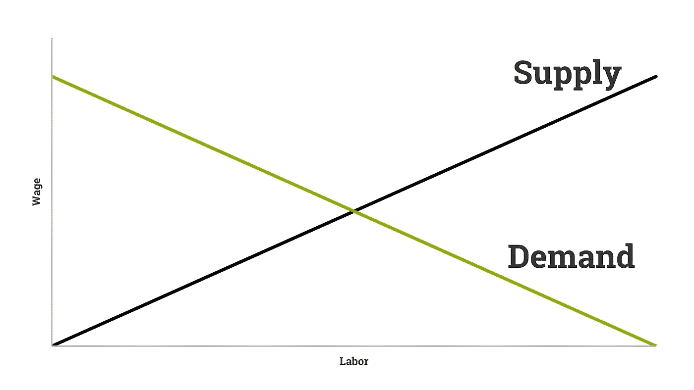
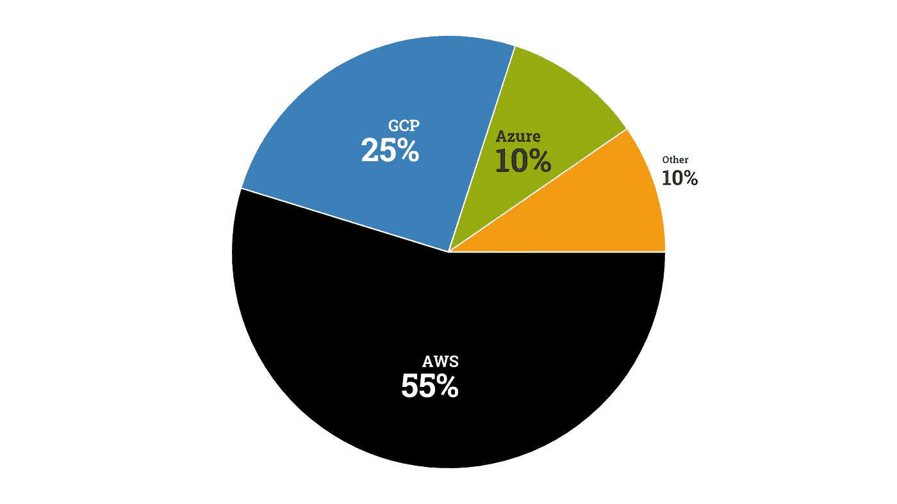

# 为什么你应该获得谷歌新的机器学习证书

> 原文：<https://towardsdatascience.com/why-you-should-get-googles-new-machine-learning-certificate-56af4204744f?source=collection_archive---------1----------------------->

## 不要错过去⛵️的船

杰西卡·鲁斯切洛在 [Unsplash](https://unsplash.com?utm_source=medium&utm_medium=referral) 上的照片

谷歌刚刚打开了新的 [ML 工程师证书](https://cloud.google.com/certification/machine-learning-engineer)的大门。在你开始之前，请记住，这是面向那些希望展示他们在分布式模型培训和扩展到生产等主题上的能力的专业人士的。

没有实际工作经验的学生最好先做动手项目。

# 从哪里开始

拿到这个证书并不容易。事实上，查看[考试指南](https://cloud.google.com/certification/guides/machine-learning-engineer)，你需要非常深入的六个领域的知识，包括高度专业化的主题，如权限问题、数据集血统和数据可行性。

这就是为什么谷歌建议你有 3 年以上使用 GCloud 产品的经验。如果你*确实*符合这一特征，那么这个证书就非常有价值，原因很简单。还没人有。

提醒你经济学中最基本的一课:随着供给增加，需求减少。

按作者。

直觉上，如果有 1000 个职位空缺和 600 个 ML 工程师证书持有者，他们将比有 6000 或 60000 个证书持有者更容易找到工作并获得高薪。

由于测试版注册刚刚开放，现在有 0 人拥有此证书。然而，由于谷歌是人工智能、云计算的领导者，也是世界上最大的科技公司之一，用不了多久，你就会看到这些新的认证随处可见。

事实上，著名的人工智能研究员吴恩达在他的 Coursera 课程中拥有多达 400 万的学习者。与此同时，全球仅有[17100 名](https://app.apteo.co/workspaces/2300510291097552329) ML 工程师。

虽然从这些课程中学习很棒，而且在某些情况下，获得这些课程的认证可能会有所帮助，但它们远不如几年前有价值。

所以，如果你想进入 ML 工程，最好不要犹豫谷歌的新机会。如果你想要一份更一般的[数据科学工作](https://www.apteo.co/post/100-companies-hiring-data-scientists-right-now)，看看这个指南:

 [## 不常见的数据科学工作指南

### 数据科学竞争异常激烈。以下是如何用“蓝海”策略取胜。

towardsdatascience.com](/the-uncommon-data-science-job-guide-3e215ba552bf) 

# 可供选择的事物

按 [ScaleGrid](https://scalegrid.io/blog/2019-open-source-database-report-top-databases-public-cloud-vs-on-premise-polyglot-persistence/) 统计。作者可视化。

请注意，谷歌云是*而不是*最受欢迎的云平台——该奖项属于 AWS，它拥有自己的[机器学习证书](https://aws.amazon.com/certification/certified-machine-learning-specialty/)。

乍一看，从职业角度来看，选择 AWS 是更好的选择。然而，如果我们去 LinkedIn 搜索“AWS 认证的机器学习”(包括报价)，我们会得到近 2000 个结果。这些人是经过认证的人，他们(1)有一个 LinkedIn，并且(2)愿意在他们的个人资料中添加它的确切名称。

记住前面的内容，只有非常有限的 ML 工程职位可供选择，所以要想有竞争力，你需要找到一个更少探索的利基。

目前持有人数为 0，获得谷歌专业机器学习工程师证书是一个“蓝海”战略:这是一个广阔、开放的空间，没有竞争。获得 Coursera 证书是另一个极端，是一种“红海”策略:水里有数百万条鲨鱼。AWS 证书位于中间。

# 不仅仅是证书

归根结底，重要的是要记住证书不是一切。事实上，它们甚至不应该是你申请的核心——它们应该是对基于实践技能和经验的强有力的描述的补充。

 [## 跳过证书，改为这样做

### 创建深刻的分析，分享您的工作，并获得关注。

hackernoon.com](https://hackernoon.com/dear-aspiring-data-scientists-skip-the-certificates-do-this-instead-ubu3u8x) 

你可以用一个简单的过程来增加你的个人资料的趣味，那就是挑选一个你感兴趣的话题，分析相关的数据，创造有洞察力的视觉效果和评论，并与你的网络分享。

数据科学几乎可以惠及任何行业——无论你是对[流失分析](https://www.apteo.co/use-cases/churn)、[推动电子商务销售](https://www.apteo.co/use-cases/ecommerce)感兴趣，还是对[人员分析](https://www.apteo.co/use-cases/hr)感兴趣，选择一个适合你的主题并传播你的知识。

错误的做法是在社交媒体上分享证书。

# 结论

证书并不是万能的，但新的谷歌专业机器学习工程师证书对于寻求职业发展的专业人士来说是一个很好的选择。