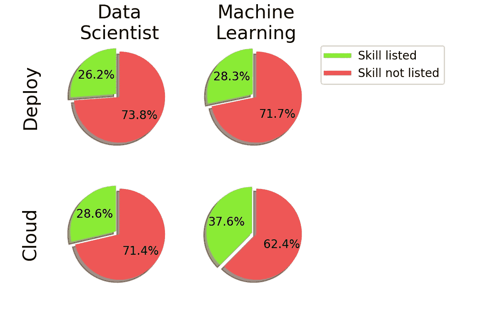
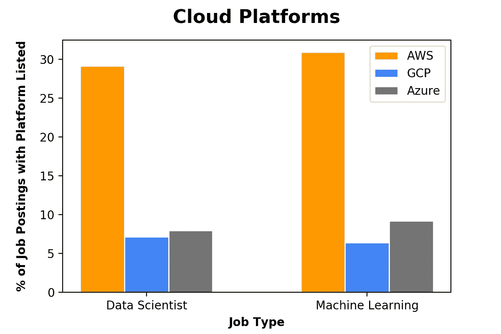
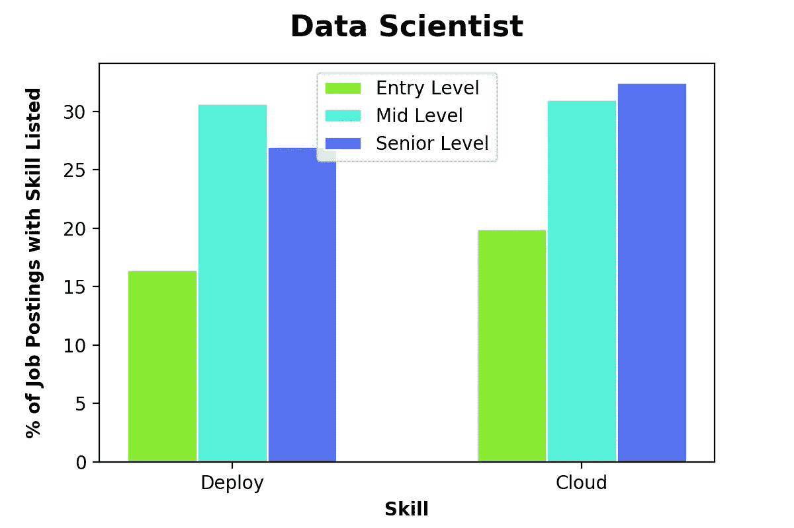
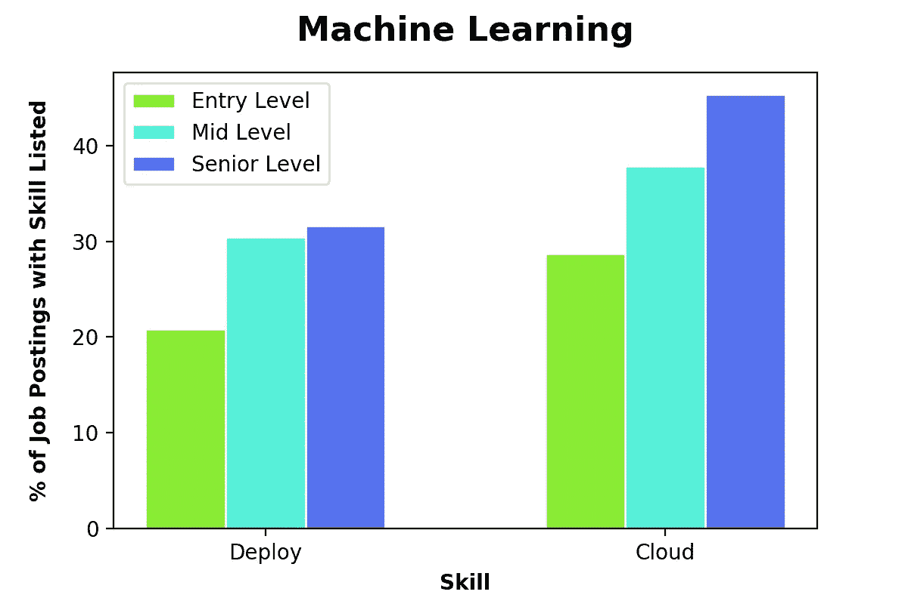

# 为什么您应该知道如何在云中部署您的模型

> 原文：<https://towardsdatascience.com/why-you-should-know-how-to-deploy-your-models-in-the-cloud-41d1c85a8df0?source=collection_archive---------38----------------------->

## 使用 Indeed.com 的招聘信息来展示数据科学家和机器学习工程师了解如何部署模型和导航云平台的重要性

来自 Pixabay.com

增长数据科学的技能，特别是机器学习，是一个漫长的过程。在过去的几年里，我参加了统计学和线性代数课程，完成了 ML 和深度学习的在线课程，并用 python 建立了模型。但是在所有这些工作之后，我意识到我缺少一项非常重要的技能…虽然我对处理数据和构建模型感到很舒服，但我没有将该模型实际部署到生产中的经验。

随着机器学习领域的不断发展和成熟，公司开始要求他们的数据科学团队提供更多切实的成果。而且，在一些情况下，这已经转化为公司需要他们的数据科学家更多的软件工程技能，特别是在 ML 模型的持续集成和部署领域。虽然这些技能最初似乎遥不可及，但大多数公司都在使用云技术来完成这些任务。对我们来说足够幸运的是，任何拥有设备和互联网连接的人都可以访问这些云平台。

为了展示对这些技能的需求，我编写了一个脚本，通过抓取[Indeed.com](https://www.indeed.com/)来查看不同术语在任何给定搜索的招聘信息中出现的频率。使用这个脚本，我搜索了美国十个最大的“技术中心”的**数据科学家**和**机器学习**职位(加利福尼亚州旧金山|纽约州纽约|华盛顿州西雅图|德克萨斯州奥斯汀|马萨诸塞州波士顿|伊利诺伊州芝加哥|华盛顿州 DC |加利福尼亚州圣何塞|马里兰州巴尔的摩|弗吉尼亚州阿灵顿)。这两个搜索中的每一个都在所有这些城市中发布了招聘信息，并用于创建下图。这些图表展示了*部署*和*云*这两个词在这些搜索中出现的频率。此外，我对不同的云技术进行了更深入的研究，以比较公司对具备三大云平台技能的候选人的需求频率:Amazone Web Services (AWS)、谷歌云平台(GCP)和微软 Azure。

在 Indeed.com 的数据科学家和机器学习职位发布中，关键词**部署**和**云**的出现频率。

Indeed.com 数据科学家和机器学习职位发布中的云平台频率。

上图描述了在部署模型和在云环境中工作时对技能组合的需求。虽然不是大多数，但相当大比例的招聘信息都在寻找具备这些能力的候选人。此外，鉴于数据科学家通常将大部分时间花在问题的模型构建(而不是模型实现)方面，提高这些技能可以让你从其他候选人中脱颖而出。此外，如果你正在寻找机器学习方面的角色，部署模型和在云环境中工作的需求甚至更高。

最后，我深入研究了这些招聘信息，比较了不同经验层次对这些技能的需求。下图显示，随着您努力晋升到更高级别的职位，尤其是从初级职位晋升到中级职位，部署和云技能变得越来越重要。

Indeed.com 数据科学家的招聘信息列出了各种经验水平的频率部署和云技能。

频率部署和云技能被列在 Indeed.com 机器学习的各种经验水平的招聘广告上。

上面的图表说明了你可以通过学习部署 ML 模型和在云平台上有效工作来实现的职业机会。但是，即使抛开所有这些专业优势，学习和发展这些技能也是令人兴奋的。因此，我决定开始一个博客系列，讨论将 ML 模型部署到产品中的所有不同方法。在这一系列的博客文章中，我将为每种部署方法提供一个简短的后续活动，并提供我对易用性的反馈。

下面列出了我当前关于 ML 部署的文章，并给出了您希望看到的任何平台/技术的建议！

*   [使用 SKLearn 估算器在 AWS 上部署 scikit-learn 模型](https://medium.com/@lannersq/deploying-a-scikit-learn-model-on-aws-using-sklearn-estimators-local-jupyter-notebooks-and-the-d94396589498)

> *注:这篇博文收集的数据是 2020 年 2 月 12 日从 Indeed.com 收集的。*