# 为什么您现在应该学习 CatBoost

> 原文：<https://towardsdatascience.com/why-you-should-learn-catboost-now-390fb3895f76?source=collection_archive---------8----------------------->

## CatBoost 正在永远改变机器学习的游戏，变得更好。

# 介绍

当我在为一个关于机器学习的培训设计内容时，我最终翻遍了 CatBoost 的文档。我在那里，被这个非常有能力的框架所困惑。它不仅可以在您提供的任何数据集上构建最准确的模型之一— *需要最少的数据准备* — CatBoost 还提供了迄今为止最好的开源解释工具，以及快速生产模型的方法。

这就是为什么 CatBoost 正在彻底改变机器学习的游戏，永远。这就是为什么学习使用它是提升技能和作为数据科学家保持相关性的绝佳机会。但更有趣的是，CatBoost 对数据科学家(像我一样)的现状构成了威胁，他们喜欢在给定数据集的情况下构建高度精确的模型，这应该是乏味的。CatBoost 正在改变这种情况。它让每个人都可以进行高度精确的建模。

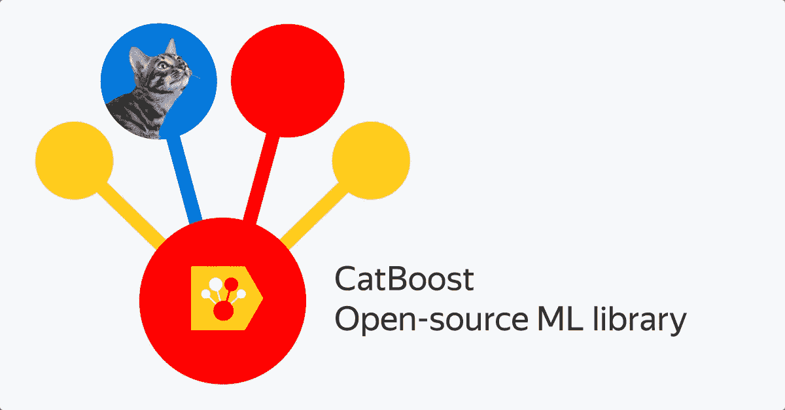

图片取自 CatBoost 官方文档:【https://catboost.ai/ 

# 以极快的速度构建高度精确的模型

## 装置

你试过在笔记本电脑上安装 XGBoost 吗？你知道这有多痛苦。在另一端安装 CatBoost 是小菜一碟。快跑吧

```
pip install catboost
```

这就够了。

## 需要数据准备

不像*今天可用的大多数*机器学习模型，CatBoost 需要最少的数据准备。它处理:

*   缺少数值变量的值
*   非编码分类变量。
    *注意，必须事先为分类变量填充缺失值。常见的方法是用新的“缺失”类别或最常见的类别替换 NAs。*
*   仅对于 GPU 用户，它也处理文本变量。
    *不幸的是，我无法测试这项功能，因为我在一台没有 GPU 的笔记本电脑上工作。[编辑:即将推出的新版本将在 CPU 上处理文本变量。有关 CatBoost 团队负责人的更多信息，请参见评论。]*

## 建筑模型

与 XGBoost 一样，您可以使用熟悉的 sklearn 语法以及一些特定于 CatBoost 的附加特性。

```
from catboost import CatBoostClassifier # Or CatBoostRegressor
model_cb = CatBoostClassifier()
model_cb.fit(X_train, y_train)
```

或者，如果您想要一个关于模型如何学习以及它是否开始过度拟合的酷炫视觉效果，请使用 *plot=True* 并将您的测试集插入到 *eval_set* 参数中:

```
from catboost import CatBoostClassifier # Or CatBoostRegressor
model_cb = CatBoostClassifier()
model_cb.fit(X_train, y_train, **plot**=**True**, **eval_set**=**(X_test, y_test)**)
```

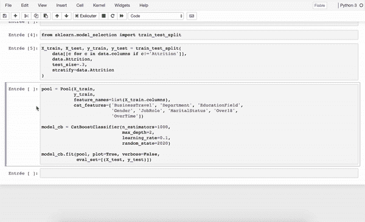

请注意，您可以同时显示多个指标，甚至更人性化的指标，如准确度或精确度。此处列出了支持的指标[。请参见下面的示例:](https://catboost.ai/docs/concepts/loss-functions-classification.html)

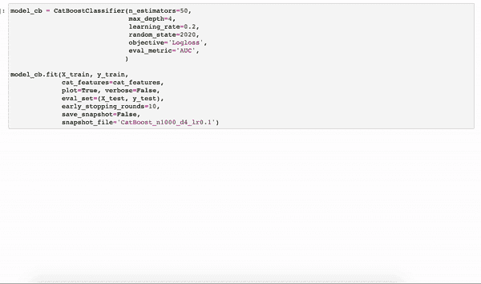

在训练时监测训练集和测试集的 Logloss 和 AUC

您甚至可以使用交叉验证，观察您的模型在不同分割上的精确度的平均值和标准偏差:

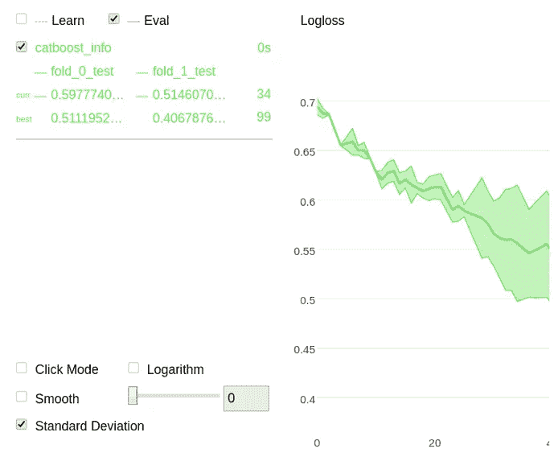

更多官方文档信息:[https://catboost . ai/docs/features/visualization _ jupyter-notebook . html # visualization _ jupyter-notebook](https://catboost.ai/docs/features/visualization_jupyter-notebook.html#visualization_jupyter-notebook)

## 微调

CatBoost 与我已经写过一篇文章的 XGBoost 非常相似。为了适当地微调模型，首先将 *early_stopping_rounds* 设置为一个有限的数字(比如 10 或 50 ),并开始调整模型的参数。有关梯度增强的关键参数的更多信息，如*学习速率*和*估计器数量*，你可以阅读我以前的文章(XGBoost 的参数与 CatBoost 的非常相似):

[](/fine-tuning-xgboost-in-python-like-a-boss-b4543ed8b1e) [## 像老板一样在 Python 中微调 XGBoost

### XGBoost(或极端梯度推进)不再被引入，只是在太多的数据科学中被证明是相关的…

towardsdatascience.com](/fine-tuning-xgboost-in-python-like-a-boss-b4543ed8b1e) 

## 训练进行得很快。非常快。

**不带 GPU**

从他们的[基准](https://catboost.ai/#benchmark)中，您可以看到 CatBoost 比 XGBoost 训练得更快，与 LightGBM 相对相似。众所周知，LightGBM 训练速度非常快。

**带 GPU**

当谈到 GPU 时，真正的奇迹发生了。

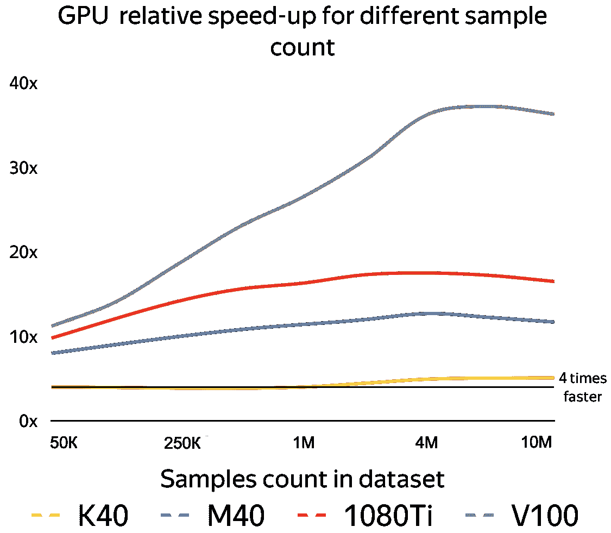

即使像 K40(2013 年发布)这种比较老的 GPU，训练时间至少也要分 4 次。使用最新的 GPU，训练时间最多可以除以 40 倍。来源:[https://catboost . ai/news/catboost-enables-fast-gradient-boosting-on-decision-trees-using-GPU](https://catboost.ai/news/catboost-enables-fast-gradient-boosting-on-decision-trees-using-gpus)

# 解释你的模型

CatBoost 的作者已经明白的一件事是，这不仅仅是一个准确性游戏。既然有 XGBoost 和 LightGBM 可用，为什么还要使用 CatBoost 呢？好吧，说到解释，CatBoost 提供的开箱即用是无可匹敌的。

## 特征重要性

如果这个图能被大多数人理解，那么用来计算特性重要性的基本方法有时会产生误导。CatBoost 提供了三种不同的方法:**预测值变化**、**损失函数变化**和**内部特征重要性**。一切都在这里[详述](https://catboost.ai/docs/concepts/fstr.html)。

## 本地解释

对于本地解释，CatBoost 附带了 SHAP，这是通常被视为唯一可靠的方法。

```
shap_values = model.get_feature_importance(Pool(X, y), **type='ShapValues'**)
```

在本教程之后，你可能会得到经典的本地解释和特性重要性的输出。

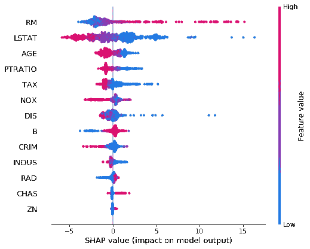

## 边际影响

那是迄今为止我最喜欢的东西。随着高精度的商品化(特别是随着 AutoML 的兴起)，如今在更深层次上理解这些高精度模型变得越来越重要。

根据经验，以下情节已成为模型分析的标准。CatBoost 在其包中直接提供了它。

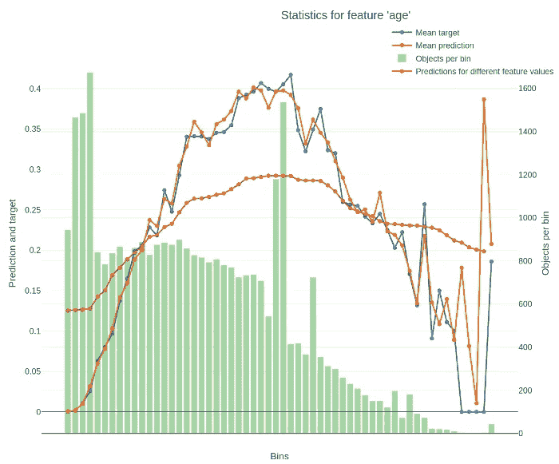

在这片土地上你观察到

*   绿色表示数据的分布
*   蓝色表示每个箱上的平均目标值
*   橙色表示每个条柱的平均预测值
*   红色表示部分依赖

# 在生产中使用 CatBoost 模型

在生产中实现您的模型从未如此容易。以下是如何导出您的 CatBoost 模型。

使用。save_model()方法为您提供了以下文档:

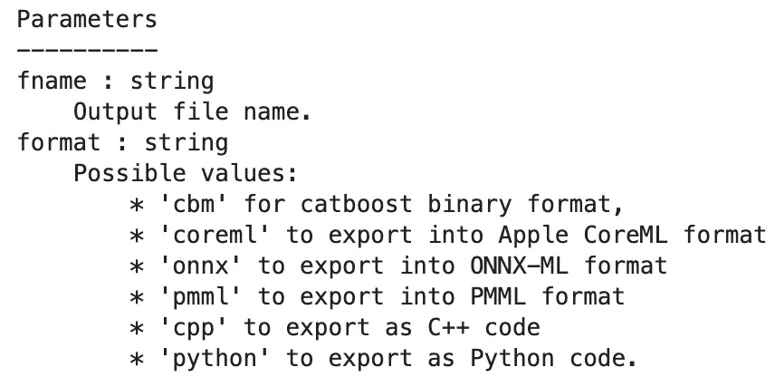

## Python 和 C++导出

```
model_cb.save_model(‘model_CatBoost.py’, **format=’python’**, pool=X_train)
```

就是这样。你会过得很愉快的。您的回购中的 py 文件如下所示:

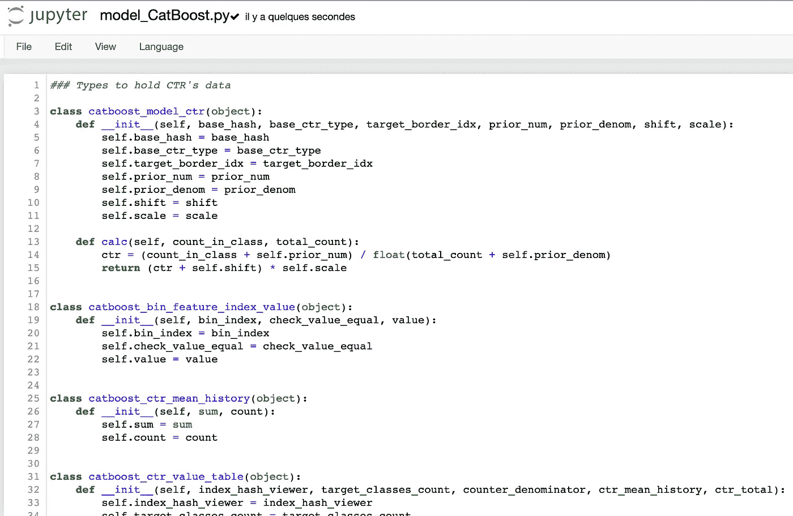

模型可以生产了！你不需要在制作新乐谱的机器上设置特定的环境。就 Python 3 就行了！

请注意，文档中提到 Python 评分方法“与本地 CatBoost 应用程序方法相比，性能较差，尤其是在大型模型和数据集上。”

## 二进制导出

显然这是获得新数据最快的选择。另存为。cbm 文件。

使用以下代码重新上传您的模型:

```
from catboost import CatBoostmodel = CatBoost()model.load_model('filename', format='cbm')
```

# 其他有用的提示

## 详细= 50

在大多数模型中，通常会有一个详细的输入，以便查看训练过程的进展情况。CatBoost 也有，但是比其他的稍微好一点。例如，使用 verbose=50 将每 50 次迭代显示一次训练错误，而不是每次迭代都显示一次，如果有很多树的话，这会很烦人。

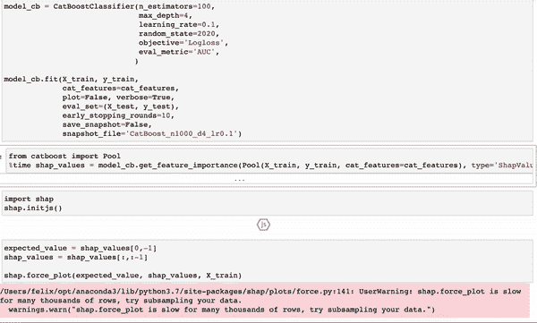

使用 verbose=True

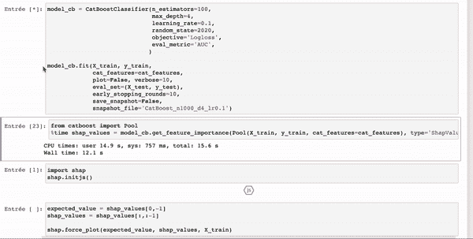

使用 verbose=10 训练相同的模型。更好检查。

注意，还会显示剩余时间。

## 模型比较

微调模型需要时间。通常，您可能有几个使您的模型准确的好参数列表。为了更进一步，您甚至可以比较模型如何学习不同的参数集，以帮助您在最终的参数列表中做出选择。

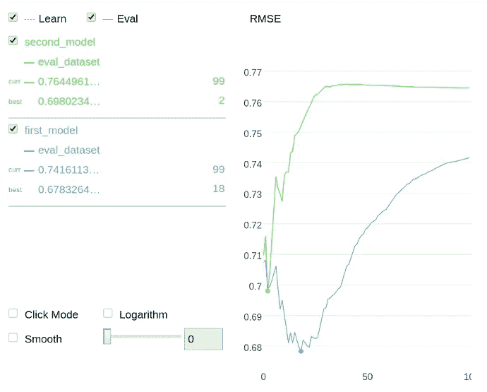

轻松比较 CatBoost 模型。来自官方文件的说明[这里](https://catboost.ai/docs/concepts/python-reference_catboostregressor_modelcompare.html)

## 训练时保存模型

你数据集很大，还怕训练时间太长？不再害怕。您可以在训练时保存您的模型，因此训练过程中的任何中断并不意味着您的模型需要完全重新训练！关于快照选项[的更多信息，请点击](https://catboost.ai/docs/features/snapshots.html#snapshots)。

## 教育材料

谁在学校太酷了？文档中的训练材料非常有用，即使你认为你对梯度增强树了如指掌。他们有关于如何使用和理解 CatBoost 的笔记本和视频。我最喜欢的一个肯定是 NeurIPS 2018 大会上的一个(这个[链接](https://catboost.ai/docs/concepts/educational-materials-videos.html)上的第二个视频)。

# 结论

看起来我们都等了很长时间才让这样的东西进入开源世界。如果你觉得这篇文章有帮助，不要犹豫，给一些掌声，收到它们总是感觉很好；)