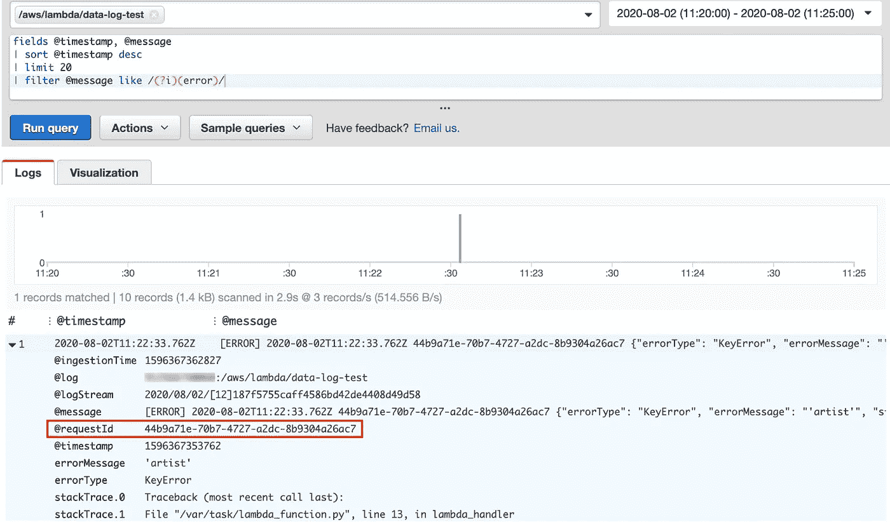
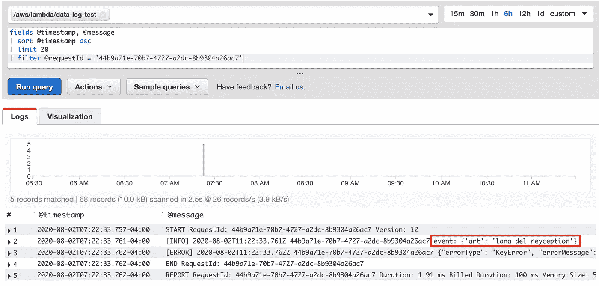

# 为什么永远不要在 Lambda 函数中打印()

> 原文：<https://towardsdatascience.com/why-you-should-never-ever-print-in-a-lambda-function-f997d684a705?source=collection_archive---------2----------------------->

## 如何识别 AWS Lambda 新手，就像*那样*

图片来源:[卢卡·罗米欧](http://www.lucaromeo.com)

# 两个 Lambda 用户的故事

## 故事#1:业余爱好者

前一刻一切都很好，然后…砰！你的 Lambda 函数引发了一个异常，你得到了警告，一切都立刻改变了。

关键系统可能会受到影响，因此快速了解根本原因非常重要。

现在，这不是一些低容量的 Lambda，您可以通过滚动 CloudWatch 日志，以纯手动的方式找到错误。因此，您转而使用 CloudWatch Insights 对日志组运行查询，过滤错误:

CloudWatch Insights 错误查询过滤

看起来我们找到了错误！虽然很有帮助，但不幸的是，它忽略了与失败调用相关的任何其他日志消息。

根据上面显示的信息，也许——仅仅是也许——你可以找出根本原因。但更有可能的是，你不会自信。

你是否告诉人们你不确定发生了什么，如果问题再次发生，你会花更多时间调查？我很怀疑

因此，您可以转到 CloudWatch Logs 日志流，过滤相关时间戳的记录，并开始手动滚动日志消息，查找特定出错调用的完整细节。

**解析时间:**1–2 小时
**λ享受使用指数:**低

## 故事#2:专业人士

同样的 Lambda 函数，同样的误差。但是这次日志记录和错误处理得到了改进。顾名思义，这涉及到用更好的东西代替`print()`语句。

那是什么，这个 Lambda 函数看起来像什么？让我们先来看看对于专业人员来说错误调试是什么样子的，然后再来看看代码。公平吗？

同样，我们从一个洞察查询开始:

CloudWatch Insights 查询，再次过滤错误

我们再次在日志中找到错误，但与上次不同的是，日志事件现在包含了来自 Lambda 调用的`@requestId`。这允许我们运行第二个 Insights 查询，根据 requestId 进行过滤，以查看我们感兴趣的确切调用的完整日志集！

@requestId 上的 CloudWatch Insights 查询过滤

现在我们得到 5 个结果，它们一起描绘了这个请求所发生的全部犯罪现场情况。最有帮助的是，我们可以立即看到触发 Lambda 的确切输入。由此我们可以推断出发生了什么，或者用完全相同的输入事件在本地运行 Lambda 代码进行调试。

**解析时间:**10–20 分钟
**λ享受使用指数:**高！

# 代码显示

我想想象我的读者坐在座位的边缘，乞求从上面的故事中知道业余和专业代码之间的区别。

不管这是真的还是假的，这是业余爱好者 Lambda:

当然，为了便于说明，这是有意简化的。错误是通过简单地传递不带`artist`作为键的事件字典而生成的，例如:`event = {'artisans': 'Leonardo Da Vinci'}`。

现在是专业的 Lambda，它执行相同的基本功能，但是改进了`print()`语句和错误处理。

有意思！那么，我们为什么要使用日志模块和格式化异常回溯呢？

## 可爱的 Lambda 测井

首先，python 的 Lambda 运行时环境包括一个[定制的记录器](https://docs.aws.amazon.com/lambda/latest/dg/python-logging.html#python-logging-lib)，可以很好地利用它。

它的特点是[有一个格式化程序](https://www.denialof.services/lambda/)，默认情况下，在每个日志消息中包含`aws_request_id`。这是一个关键特性，它允许一个 Insights 查询，就像上面显示的过滤单个`@requestId`的查询，显示一个 Lambda 调用的全部细节。

## 异常处理

接下来，您可能会注意到奇特的错误处理。虽然看起来吓人，但使用`sys.exec_info`是[检索 python 中异常信息的标准方式](https://docs.python.org/3/library/logging.html#logging.Logger.debug)。

在检索到异常名称、值和 stacktrace 之后，我们将其格式化为一个 json 转储的字符串，这样这三者都出现在一个日志消息中，关键字[自动解析为字段](https://docs.aws.amazon.com/AmazonCloudWatch/latest/logs/CWL_AnalyzeLogData-discoverable-fields.html#CWL_AnalyzeLogData-discoverable-JSON-logs)。这也使得基于特定错误创建定制指标变得容易，而不需要复杂的字符串解析。

最后，值得注意的是，相比之下，用默认的 Lambda 记录器记录一个没有任何格式的异常会导致一个不幸的多行回溯，如下所示:

多行异常追溯示例

# 包扎

我希望如果你的 Lambda 函数现在看起来更像业余 Lambda，这篇文章会激励你升级你的舞蹈并成为职业选手！

在我让您离开之前，我应该警告您，用适当的日志记录替换 print 语句的缺点是，您会丢失 Lambda 的本地执行所生成的任何终端输出。

有一些巧妙的方法可以解决这个问题，比如在一个`lambda_invoke_local.py`类型的文件中包含环境变量或一些设置代码。如果感兴趣，请告诉我，我很乐意在以后的文章中讨论细节。

最后，作为最后一点启发，不需要运行 Cloudwatch Insights 查询来调试自己，应该可以针对 Lambda 错误度量设置一个警报，在处于“In Alarm”状态时通知 SNS 主题。然后，另一个 Lambda 可以触发 SNS 主题，自动运行与 Pro 相同的调试洞察查询，并在 Slack 或其他地方返回相关日志。

会很酷，不是吗？