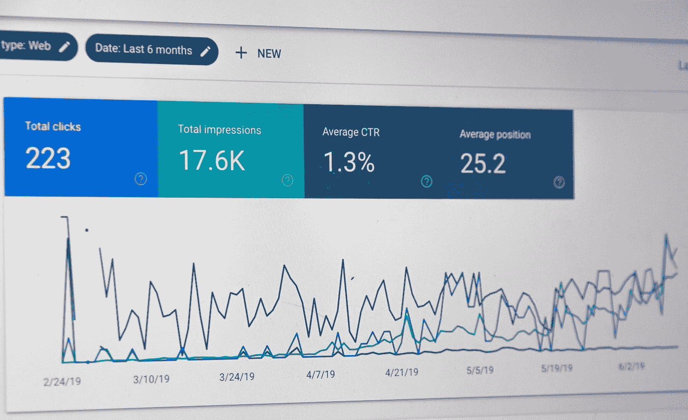
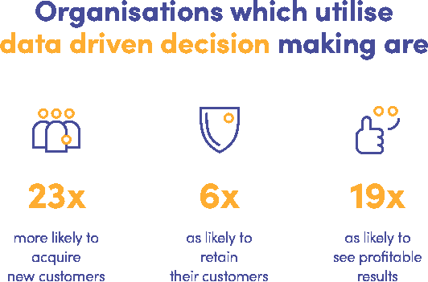
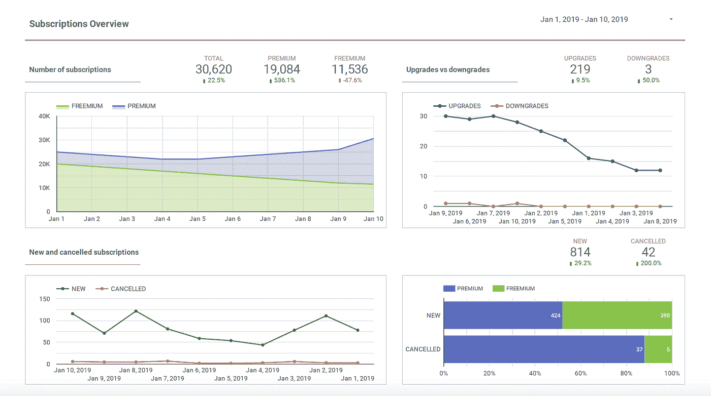

# 为什么您永远不应该满足于开箱即用的分析

> 原文：<https://towardsdatascience.com/why-you-should-never-settle-for-out-of-the-box-analytics-10f2e2addf79?source=collection_archive---------53----------------------->

## 信任预定义的分析仪表板会导致业务灾难

预先制作的工具提供了一个有限的、不完整的场景，可能会对你的业务产生误导。图片由 [Miquido](https://www.miquido.com/) 提供

人类有很多天赋，但完美的决策绝对不是其中之一。谈到业务增长，你真的能相信自己的直觉吗？你可能更愿意依靠事实和数据，对吗？

你当然会。幸运的是，市场也知道这一点，并提供了许多解决方案，让您可以跟踪和分析您的应用程序。你可以从谷歌分析、Firebase、Mixpanel 和脸书分析等工具中进行选择。

它们中的每一个都提供了许多预定义的仪表板，这可能是一个很好的起点。尽管如此，满足于他们提供的见解是导致商业灾难的最可靠途径之一。在这篇文章中，我会告诉你为什么。

# 商业智能的真正目的是什么？

[商业智能](https://www.miquido.com/blog/business-intelligence-pipeline-aws-case-study/) (BI)基本上是将收集到的数据以领域定制仪表板的形式转化为可操作的见解。整个过程都是数据驱动，使得决策更高效、更有力、更准确。

## 商业智能在软件开发过程中有什么帮助？

[你为什么应该关心适当的分析和商业智能？原因很简单。作为一个利益相关者，你想知道你的应用程序表现如何。为此，您需要回答一些重要问题，例如:](https://www.miquido.com/blog/business-oriented-data-science/)

*   使用了哪些功能？
*   哪些内容受欢迎，哪些不受欢迎？
*   重点目标人群的转化率如何？
*   用户如何遵循应用的关键路径？
*   他们何时以及为什么会流失？
*   他们什么时候被激活，你如何让他们参与进来？

即使是最好的分析工具的基本集成也不会立即给你许多特定领域的统计数据。例如，集成 Firebase 给你活跃用户的数量，他们的人口统计，设备甚至打开的屏幕。但这并没有直接回答上述问题，不是吗？安装数量或每月活跃用户的信息很重要，但这些很少是应用程序的实际目标。

## 为什么您需要的不仅仅是一个预制的解决方案？

这些工具是通用的，适合每个人。这意味着它们不是为任何人量身定做的。他们不能从不同来源(如应用数据库、CRM 或市场分析)汇总数据，也不能向您展示您的应用程序特有的指标。这些工具提供了一个有限的、不完整的情况，可能会对您的业务产生误导。他们通常也没有能力深入研究收集的数据，试图理解呈现的结果。

谷歌分析仪表板。照片由 [Webaroo](https://unsplash.com/@webaroo?utm_source=unsplash&utm_medium=referral&utm_content=creditCopyText) 拍摄

不要误解我的意思。这些工具很棒，我推荐使用它们。它们只需要适当定制。如果您想要获得关于内容、货币化(如订阅)或用户参与度的详细信息，您需要仔细规划和实施定制分析活动。下一步是利用收集的事件和存储在应用数据库中的数据构建定制的 BI 仪表盘。这种仪表板可以用来直观显示直接回答这些问题的最重要的数字。

# 从定义对您的业务重要的指标开始

## 数据驱动决策的影响

麦肯锡全球研究所对数据驱动的决策过程进行了[研究](https://www.mckinsey.com/business-functions/mckinsey-analytics/our-insights/the-age-of-analytics-competing-in-a-data-driven-world)。让我们看看它们如何影响使用它们的组织。

这些发现清楚地证实了检查你的关键指标确实是必须的。但是你有没有停下来真正考虑过哪些数字定义了你产品的成功？正如增长黑客所说，你的北极星或增长函数是什么？

在你开始构建你的分析之前，你必须清楚地陈述你的基本指标。大多数产品将分享一些收入增长的共同组成部分。这些可能是新用户的获取、激活和保留。尽管如此，每个应用都有自己的一套影响收入的特定业务因素。

## 如何识别影响你收入的因素

确定与用户体验你的应用的核心价值最直接相关的行动。对于优步，可能是已完成的乘坐、乘坐次数、重新预订乘坐的乘坐者人数。对脸书来说，它可能是被接受的邀请的数量或增加的帖子、评论和反应的数量。

分析工具提供的基本指标显然是有价值的。它们可能包括页面浏览量、安装数量或会话数量。然而，更重要的是跟踪对你的产品有影响的指标。像 Google Analytics 这样的工具提供了数百张图表。不幸的是，它们往往更令人困惑，而不是有所帮助。

# 仔细规划您的分析

在这一点上，你可能很想决定“跟踪一切”并在以后理解它。这是一个很常见的错误。这样做会直接导致灾难。

## 你需要数据科学家做什么？

你可能会认为你可以很容易地对应用程序中发生的一切有一个完整的了解。你只需要要求你的开发团队为每个按钮和每个动作发送事件，对吗？嗯……没有。

当然，开发人员会很乐意添加选定的 SDK，并为每个动作实现事件发送。但是如果他们没有更大的想法会发生什么呢？他们只会不顾一切地发送他们认为可能重要的信息。你最终肯定会得到大量的数据，但这些数据是非结构化的、混乱的，而且很可能会丢失关键参数。这就是为什么让数据科学家参与到流程中并制定数据收集计划如此重要的原因。

## 什么是数据收集计划？

数据收集计划基本上是需要从应用程序发送的所有事件的文档。一个数据科学家只需要几天的工作就可以准备一份。这种努力在开发期间得到了回报。这样，开发人员可以简单地遵循文档，而不必考虑事件实现。

从我自己的经验中，我发现了什么在这里最有效。与数据科学团队一起召开数据收集和利用研讨会，开始制定您的计划。在此会议期间，您确认您的数据收集目标。然后，您检查您的产品，建立数据点并确定关键指标。最后，您可以讨论它们将如何呈现在仪表板上。这样的会议将把误解的风险降到最低。

# 想象什么是重要的

## 清晰的数据呈现是成功的关键

在参与了几十个软件项目后，我发现决策者都太倾向于在商业智能上偷工减料。这是一个遗憾，因为 BI 是他们可以用来做出决策、推动增长和打造成功产品的唯一工具。这种态度通常基于一个错误的假设，即如果他们对产品的想法是正确的，它就一定会成功。但现实却大相径庭。所有成功的产品都是通过数据驱动的实验不断改进的。市场是残酷的——你打盹，你就输了。这就是持续跟踪应用程序的关键指标如此重要的原因。然而，如果没有熟练的仪表板定制，您将会得到大量的非结构化日志。你将经历信息过载，这只会阻碍你使用商务智能。

## 如何避免信息过载

你需要的是第一眼就能清楚地看到最重要的参数。这样，您就能够轻松地更深入地利用您的数据。这需要定制仪表板。基于这些分析，您可以构建商业智能仪表板。它们将让你了解用户如何与应用程序互动，得出结论，并将其应用到你的商业模式中。在某种程度上，你可以使用 Google Analytics 或 Firebase 等分析工具来做到这一点。但是，通常情况下，您需要组合来自许多不同数据源的结果，并创建定制的 BI 仪表板。下面你可以看到一个非常简单，但信息量大，在谷歌数据工作室创建的自定义仪表板的例子。

在 Data Studio 中创建的自定义仪表板示例

可以想象，对于一个有经验的数据科学家来说，创建这样的仪表板相对容易。在 Tableau、Graphana、Google Data Studio 或 Power BI 等工具中创建一个通常需要几天时间。与软件产品实现的整体努力相比，这几乎是微不足道的。当您考虑它们的附加价值时，定制仪表板绝对不能妥协。

# 不要盲目地去市场

我怎么强调都不为过，当应用程序上线时，至少有分析功能是多么重要。否则，你将失去在最需要的时候获得关键信息的唯一机会，也就是在市场上验证应用的时候。就所需的实施时间而言，适当的数据分析出奇地便宜。然而，不知何故，它经常被满足于最简单的解决方案的企业所忽视。

你需要以一种容易传达你的应用程序如何运行的方式来收集和可视化你的数据。不要退而求其次。你不想发现自己落后了，甚至不知道原因。就像没有持续监控关键飞行参数的适当仪器，飞行员无法驾驶飞机一样，没有正确的数据分析和展示，你将会盲目飞行。

如果您想为您的企业发现可能的分析解决方案，请随时给我们 hello@miquido.com 公司写信。