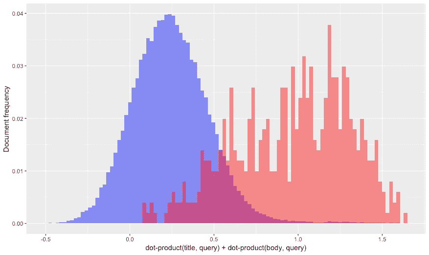
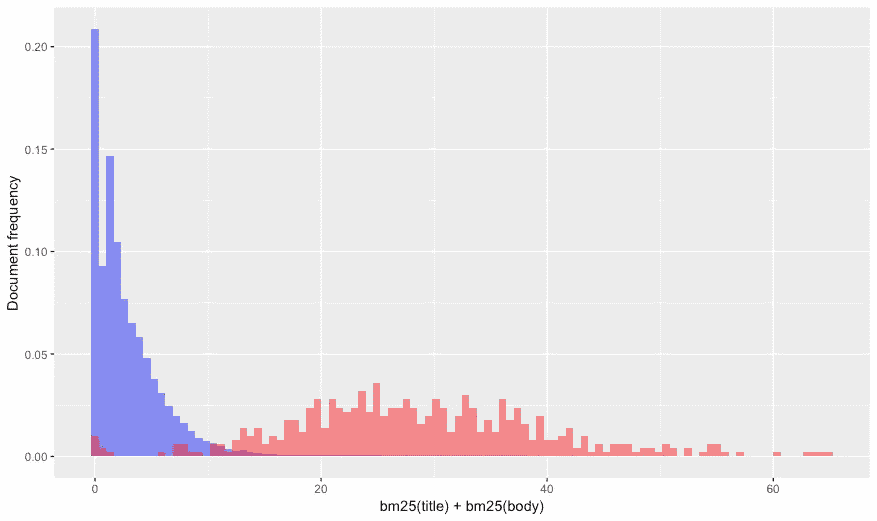
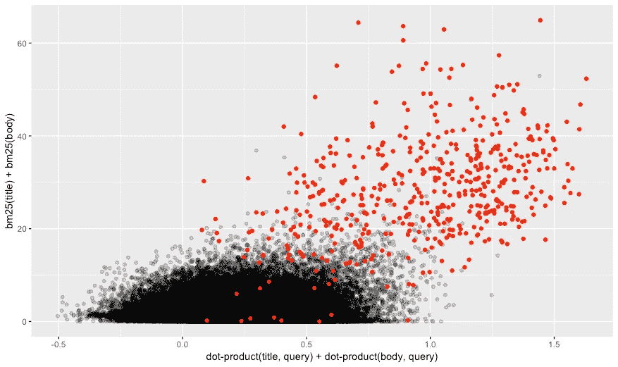

# 为什么不应该用 MARCO 女士来评估语义搜索

> 原文：<https://towardsdatascience.com/why-you-should-not-use-ms-marco-to-evaluate-semantic-search-20affc993f0b?source=collection_archive---------34----------------------->

## 其他广泛使用的数据集可能也不多

如果我们想要研究语义向量(预训练或未训练)的能力和局限性，我们应该理想地优先考虑不太偏向术语匹配信号的数据集。这篇文章表明，MS MARCO 数据集比我们预期的更偏向于这些信号，并且由于类似的数据收集设计，相同的问题可能存在于许多其他数据集中。

照片由[免费使用声音](https://unsplash.com/@freetousesoundscom?utm_source=unsplash&utm_medium=referral&utm_content=creditCopyText)在 [Unsplash](https://unsplash.com/s/photos/doing-it-wrong?utm_source=unsplash&utm_medium=referral&utm_content=creditCopyText)

[MARCO 女士](https://microsoft.github.io/msmarco/)是微软发布的大规模数据集集合，旨在帮助推进与搜索相关的深度学习研究。当我们决定创建一个[教程](https://docs.vespa.ai/documentation/tutorials/text-search.html)展示如何用 [Vespa](https://vespa.ai/) 设置一个文本搜索应用时，这是我们的第一选择。这引起了社区的广泛关注，很大程度上是因为排行榜的激烈竞争。此外，作为一个大型的、具有挑战性的带注释的文档集，它检查了当时所有的框。

在第一篇基础搜索教程之后，我们发布了一篇博客文章和一篇教程，讲述如何在 Vespa 中使用 ML 来改进文本搜索应用。到目前为止一切顺利。我们的第一个问题出现在我们编写关于如何使用(预训练的)语义嵌入和近似最近邻搜索来改进应用程序的第三个教程时。在这一点上，我们开始意识到全文排序 MS MARCO 数据集可能不是最好的方法。

在更仔细地查看数据后，我们开始意识到数据集高度偏向于术语匹配信号。我的意思是，比我们预期的要多得多。

# 但是我们知道这是有偏见的…

在我们继续研究数据之前，我们必须说我们预料到了数据集中的偏差。根据 MS MARCO 数据集论文中的[，他们通过以下方式构建数据集:](https://arxiv.org/abs/1611.09268)

1.  Bing 搜索日志中的抽样查询。
2.  过滤掉非问题查询。
3.  使用 Bing 从其大规模网络索引中检索每个问题的相关文档。
4.  从这些文档中自动提取相关段落
5.  人类编辑然后注释包含回答问题的有用和必要信息的段落

看看第 3 步和第 4 步(也许还有第 5 步)，在数据集中发现偏差就不足为奇了。公平地说，我认为这种偏见在文献中被认为是一个问题。令人惊讶的是我们观察到的偏见程度，以及这可能如何影响涉及语义搜索的实验。

# 语义嵌入设置

我们的主要目标是说明如何通过使用术语匹配和语义信号来创建开箱即用的语义感知文本搜索应用程序。这与 Vespa 执行[近似最近邻搜索](https://docs.vespa.ai/documentation/tutorials/text-search-semantic.html#approximate-nearest-neighbor-ann-operator)的能力相结合，将允许用户大规模构建这样的应用。

在接下来呈现的结果中，我们使用 [BM25 分数](https://docs.vespa.ai/documentation/reference/bm25.html)作为我们的术语匹配信号，并且使用[句子 BERT 模型](https://github.com/UKPLab/sentence-transformers#getting-started)来生成嵌入以表示语义信号。使用更简单的术语匹配信号和其他语义模型(如通用句子编码器)可以获得类似的结果。更多细节和[代码](https://github.com/vespa-engine/sample-apps/tree/master/text-search)可以在[教程](https://docs.vespa.ai/documentation/tutorials/text-search-semantic.html)中找到。

# 组合信号

我们从一个合理的基线开始，它只包含术语匹配信号。接下来，当我们在应用程序中只使用语义信号时，我们得到了有希望的结果，只是为了检查设置的完整性，并确认嵌入中确实包含相关信息。在那之后，明显的后续步骤是合并两个信号。

Vespa 在这里提供了很多可能性，因为我们可以在匹配阶段和排序阶段结合术语匹配和语义信号。在匹配阶段，我们可以对语义向量使用`nearestNeighbor`操作符，并使用大量通常用于术语匹配的操作符，如常用的`AND`和`OR`语法，来组合查询标记或[有用的近似](https://docs.vespa.ai/documentation/using-wand-with-vespa.html)，如`weakAND`。在排序阶段，我们可以使用 BM25 和 [Vespa 张量评估框架](https://docs.vespa.ai/documentation/tensor-user-guide.html)等众所周知的排序功能，对输入信号做任何我们想做的事情，如语义嵌入。

当我们开始尝试所有这些可能性时，我们开始质疑 MS MARCO 数据集对于这种类型的实验的有用性。最主要的一点是，尽管语义信号在孤立的情况下表现不错，但是当考虑到术语匹配信号时，这种改善就会消失。

我们期望术语匹配和语义信号之间有一个重要的交集，因为两者都应该包含关于查询文档相关性的信息。*然而，语义信号需要补充术语匹配信号才能有价值，因为它们的存储和计算成本更高。这意味着它们应该匹配相关文档，否则这些文档将不会被术语匹配信号匹配。*

然而，就我们所见，情况并非如此。所以，我们决定更仔细地研究这些数据。

# 术语匹配偏差

为了更好地调查发生了什么，我们从 Vespa 收集了相关和随机文档的查询文档数据。例如，下图显示了查询和标题嵌入之间以及查询和正文嵌入之间的点积和的经验分布。蓝色直方图显示了随机(因此可能与查询不相关)文档的分布。红色直方图显示了相同的信息，但现在的条件是文档与查询相关。

嵌入的点积分数的经验分布。给定一组查询，蓝色表示随机(不相关)文档，红色表示相关文档。

不出所料，我们在相关文档上的平均得分要高得多。太好了。现在，让我们看一个类似的 BM25 分数的图表。结果是相似的，但在这种情况下更加极端。相关文档具有高得多的 BM25 分数，以至于几乎没有相关文档具有低到足以被排除在词语匹配信号的检索之外的信号。这意味着，在考虑了术语匹配之后，几乎没有相关文档需要通过语义信号进行匹配。即使语义嵌入是信息性的，也是如此。

BM25 分数的经验分布。给定一组查询，蓝色表示随机(不相关)文档，红色表示相关文档。

在这种情况下，我们所能期望的最好结果是，对于相关的文档，两个信号都是正相关的，这表明两个信号都携带了关于查询文档相关性的信息。这似乎确实是下面散点图中的情况，该散点图直观地显示了 BM25 分数和相关文档的嵌入分数(红色)之间的相关性比一般人群的分数(黑色)之间的相关性强得多。

嵌入的点积分数与 BM25 分数的散点图。给定一组查询，黑色表示随机(不相关)文档，红色表示相关文档。

# 备注和结论

在这一点上，一个合理的观察是，我们正在谈论预先训练的嵌入，并且如果我们针对手边的特定应用对嵌入进行微调，我们可以获得更好的结果。很可能是这种情况，但至少有两个重要的因素需要考虑:成本和过度拟合。资源/成本考虑很重要，但更明显的是要认识到这一点。你要么有钱去追求，要么没钱。如果你这样做了，你仍然应该检查一下你得到的改进是否值得。

在这种情况下，主要问题与过度配合有关。使用通用语句编码器和语句 BERT 等大而复杂的模型时，不容易避免过拟合。即使我们使用整个 MS MARCO 数据集，这被认为是一个大的和重要的最近发展，以帮助推进围绕 NLP 任务的研究，我们也只有大约 300 万个文档和 30 万个带标签的查询可以处理。相对于如此庞大的模型，这不一定很大。

另一个重要的观察结果是，与 BERT 相关的架构在相当长的一段时间内一直占据着 MSMARCO 排行榜的主导地位。安娜·罗杰斯[写了一篇很好的文章](https://hackingsemantics.xyz/2019/leaderboards/)，讲述了当前使用排行榜来衡量自然语言处理任务中模型表现的趋势所面临的一些挑战。重要的一点是，我们在解释这些结果时应该小心，因为很难理解性能是来自于架构创新还是为了解决任务而部署的过多资源(读取过拟合)。

但是，尽管有这些评论，*这里最重要的一点是，如果我们想研究语义向量的能力和局限性(预训练或未训练)，我们应该理想地优先考虑不太偏向术语匹配信号的数据集*。这可能是一个显而易见的结论，但我们目前不清楚的是在哪里可以找到这些数据集，因为由于类似的数据收集设计，这里报告的偏差可能存在于许多其他数据集中。