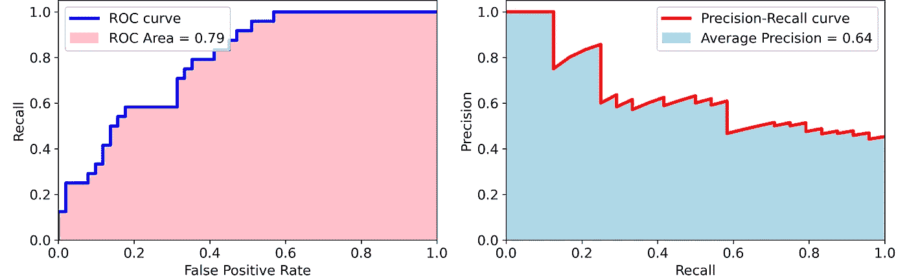
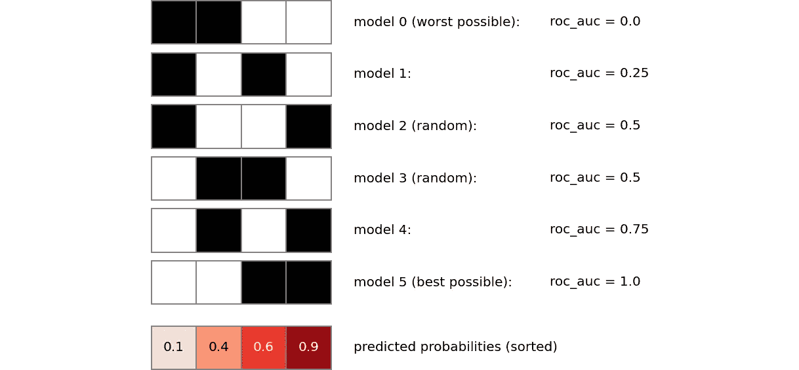
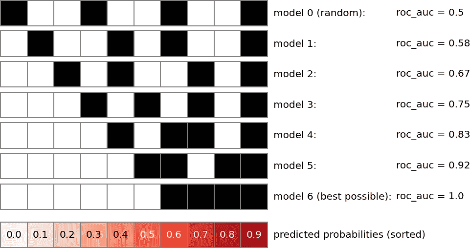
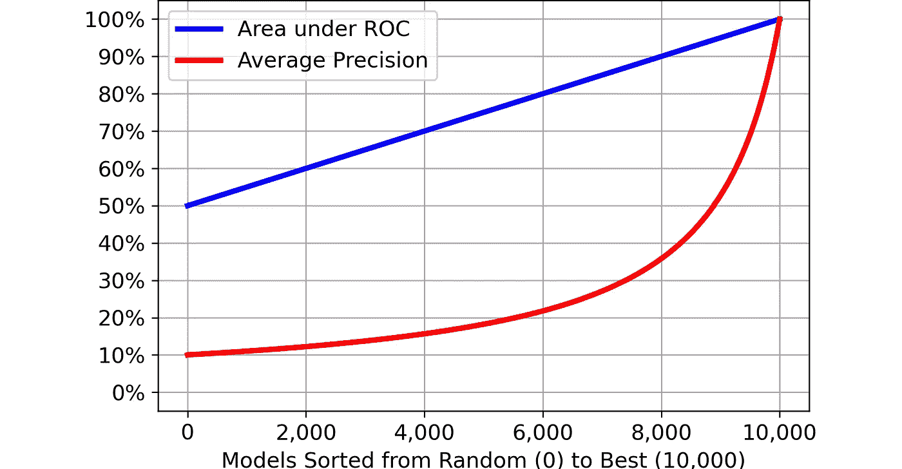
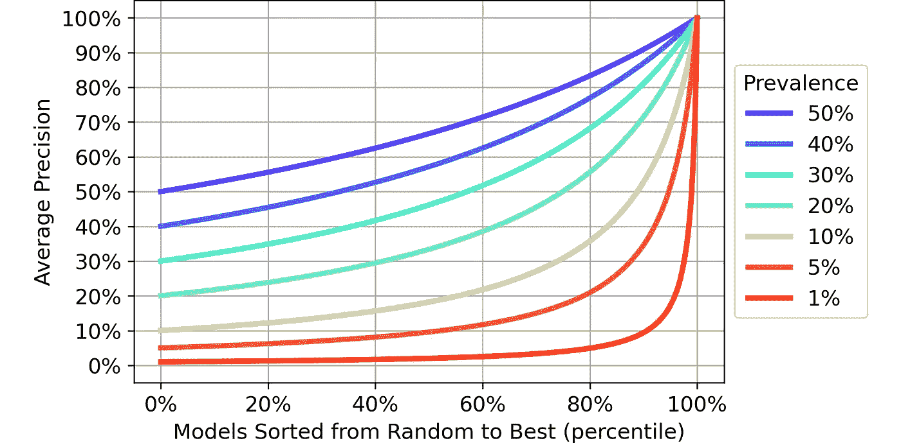
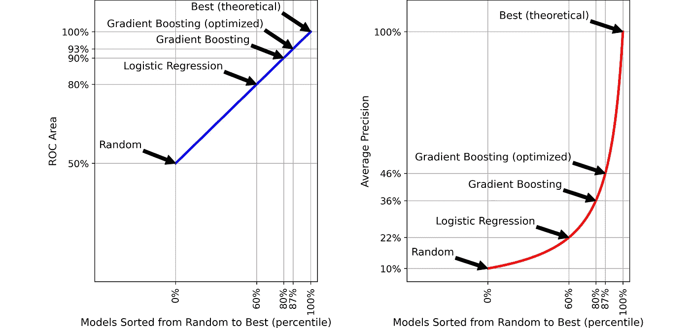

# 为什么你应该停止使用 ROC 曲线

> 原文：<https://towardsdatascience.com/why-you-should-stop-using-the-roc-curve-a46a9adc728?source=collection_archive---------10----------------------->

## 最受欢迎的指标可能没有你想象的那么有意义

当我开始作为一名数据科学家工作时，我曾经用 ROC 曲线来衡量一个模型的好坏。毕竟这是标准。然后，有一天，一个更有经验的同事告诉我:

> "你应该停止使用 ROC 曲线，而应该使用平均精度."

当场就没多想那句话。我只是听从了同事的建议。毕竟他很有经验，而我是个菜鸟。当然，他一定比我更清楚。

然而，过了一段时间，我开始怀疑是否存在一种令人信服的方法来证明一个指标是否以及为什么比另一个更好。

这有什么关系？因为，**当我们依赖一个指标**——比如 ROC 面积或平均精度——**时，我们假设模型性能的许多方面可以包含在一个数字中**。归根结底，这个数字才是最重要的。因此，我们需要确保我们的选择是明智的。

这篇文章讲述了我如何最终找到证据证明我的同事是对的。

# 0.快速复习… ROC 和平均精度

> 如果你已经对流行率、ROC 曲线和精确回忆曲线等概念有信心，你可以跳过这一段，安全地进入第 1 段。

在本帖中，我们将重点讨论 2 类分类问题。这些是机器学习中最常见的问题，而且非常普遍，因为回归问题和 *n* 类问题也可以追溯到这一类别，但反之则不然。

在 2 类分类问题中，我们有一些观察结果，我们希望创建一个模型，能够将它们分配到两类中的一类(*阳性*和*阴性*)。例如，在欺诈检测中，我们可能希望将一些金融交易分为*阳性*(欺诈)和*阴性*(非欺诈)。

我们需要一些术语表来继续:

*   `n`:观察次数；
*   `n_positives`:阳性数；
*   `n_negatives`:底片数量；
*   `prevalence`:`n_positives`/`n`；
*   `n_predicted_positives`:模型已分类为阳性的观察值的数量；
*   `n_true_positives`:模型*正确*分类为阳性的观察次数；
*   `n_false_positives`:模型将*错误地*归类为阳性的观察次数；
*   `precision`:`n_true_positives`/`n_predicted_positives`；
*   `recall`:`n_true_positives`/`n_positives`；
*   `false_positive_rate`:`n_false_positives`/`n_negatives`；
*   `roc_curve`:给定模型的所有可能对(`false_positive_rate`，`recall`)的集合，取决于概率阈值；
*   `precision_recall_curve`:给定模型的所有可能对(`precision`，`recall`)的集合，取决于概率阈值；
*   `roc_area`:在`roc_curve`下的区域；
*   `average_precision`:位于`precision_recall_curve`下方的区域。

给定一个模型，它的 ROC 曲线和精确召回曲线看起来是这样的:

二元模型的 ROC 曲线和精确回忆曲线

这些曲线的面积(即积分)——分别命名为 ROC 面积和平均精度——具有一些有用的特性:

*   它们被限制在 0 和 1 之间。
*   0 表示最差的分类，1 表示最好的分类。所以，越高越好。
*   对于 ROC-Area，随机分类的得分为 0.5，而对于平均精度，它等于`prevalence`。

由于这些原因，ROC 面积和平均精度通常被用作模型的良好性度量。

这一段只是基本的悬崖笔记。如果你希望加深这些概念，你可以阅读这些文章: [*《理解 AUC-ROC 曲线》*](/understanding-auc-roc-curve-68b2303cc9c5)*by*[*Sarang nark hede*](https://medium.com/u/7fe94d3af4e6?source=post_page-----a46a9adc728--------------------------------)*和* [*《超越准确性:精度与召回》*](/beyond-accuracy-precision-and-recall-3da06bea9f6c)*by*[*Will Koehrsen*](https://medium.com/u/e2f299e30cb9?source=post_page-----a46a9adc728--------------------------------)*。*

# 1.一般化的需要……(也就是寻找模型空间)

> 第 1 段和第 2 段有点理论化。所以如果你想跳到第三段，你会被原谅的。但是如果你和我在一起，你将会获得书呆子奖章。

当我决定我希望弄清楚 ROC-Area 和 Average-Precision 有什么不同时，我意识到我需要把它一般化。事实上，专注于单一模式是没有用的。如果我这样做了，我就只有两个数字可以比较:ROC 面积和平均精度。显然，仅仅下结论是不够的。

我想到的程序如下:

1.  选择一个分类问题(实物大小的问题，不是玩具问题)；
2.  生成 *n* 不同性能的模型(其中 *n* 足够大，像成千上万)**确保它们涵盖广泛的性能**；
3.  计算这些 *n* 模型的 ROC 面积和平均精度，
4.  比较 *n* ROC-Areas 和*n*Average-precision，看看我是否能一劳永逸地评估一个指标是否优于另一个。

我确信你发现了我计划中的漏洞。第二点。的确，**你如何生成成千上万个不同的模型？最重要的是，您如何确保它们以“足够”不同的方式运行？我愣在了那里。直到我开始玩这个想法:**

> 给定一个问题，有没有办法表示与之相关的所有可能的预测模型？换句话说，有没有一种方法来表示一个“模型空间”，即该问题所有可能模型的集合？

为了回答这个问题，我们来看一个小问题:4 个观测值，其中 2 个是*阳性*。

仔细想想，预测概率所假设的实际值是不相关的。毕竟，**任何预测模型的结果都是对观察结果的排序**。

例如，假设我们有两个模型和以下预测概率:

*   模型 1 预测:[.6，. 1，. 9，. 4]，
*   模型 2 预测:[.99，. 8，. 999，. 9]。

模型 1 和模型 2 基本相当(不考虑校准)。事实上，在两个模型中，观察结果的等级是相同的:第三个观察结果风险更大，其次是第一个，然后是第四个，最后是第二个。

因此，一旦对预测的概率进行了排序，不管它们的实际值如何，所有可能的模型都必然属于以下 6 种情况之一:

具有 4 个观测值的二元分类问题的全模型空间，其中 2 个为正

其中白色和黑色瓦片分别代表*阴性*和*阳性*。

所以，**所有可能模型的个数，简单来说就是*正*和*负*** 所有可能排列的个数。在组合学中，这被称为“重复排列”。

总共有`n`个元素，其中`n_positives`个重复(因为它们都是 1)`n_negatives`个重复(因为它们都是 0)，可能的排列数是`n! / n_positives! / n_negatives!`。事实上，在我们的虚拟例子中，我们有`4! / 2! / 2! = 6`可能的模型。如果你想知道我是如何得到这个公式的，看看这个漂亮的解释:[“重复排列”](https://www.ck12.org/probability/permutations-with-repetition/lesson/Permutations-with-Repetition-BSC-PST/)。

这个特殊的公式，即`a! / b! / c!`(其中`a`、`b`、`c`为非负整数，`a = b + c`)被称为[二项式系数](https://en.wikipedia.org/wiki/Binomial_coefficient)，它在数学中经常出现(例如[二项式分布](https://en.wikipedia.org/wiki/Binomial_distribution)就是以它命名的)

因此，更深刻地说，我们可以说:

> 模型空间中存在的模型数量由正负二项式系数给出。

尽管这是一个有趣的结果，但一旦观察次数增加，它很快就变得不可用了。例如，对于 10，000 个观察值和 100 个阳性结果，我们将有大约 6 * 10 ^ 241 个可能的模型！

不用说，我无法计算一些 6 * 10 ^ 241 模型的 ROC 面积和平均精度。所以我不得不放弃使用整个模型空间的想法。

# 2.但是我不想放弃……(也就是缩小的模型空间)

然后，我必须找到一种更聪明的方法，而不仅仅是列出模型空间中存在的所有可能的模型。这意味着**我不得不满足于一个更小的——或者“缩减的”——模型空间。这很好，只要缩减的模型空间能够概括原始的模型空间。**

好的，但是我怎样才能实现它呢？我的意思是，获得完整的模型空间很容易:你只需要列举出所有的积极*和消极*的排列*。但是如何获得一个简化的模型空间呢？这个没有秘方。*

让我们再举一个小例子:10 次观察，其中 4 次是*阳性*。我们知道，完整的模型空间应该由`10! / 4! / 6! = 210`个模型组成。因此，目标是找到 *n* 个模型(其中 *n* 比 210 小得多),这样它们就代表了不同性能的“等级”。

如何实现这一点？经过一些尝试，我想出了一个主意。

具有 10 个观测值的二元分类问题的缩减模型空间，其中 4 个观测值是肯定的

这 7 种型号实际上符合我们的要求，因为:

*   7 远小于 210，
*   这些模型的性能从随机(ROC-Area 为 0.5)到最佳(ROC-Area 等于 1)之间有着完美的“细微差别”。请注意，我们可以安全地忽略比随机模型更差的模型，因为实际上它们并不存在。

现在，你能猜出我用来产生这些组合的模式吗？

我通过一个从0 到`n_negatives`的*循环*得到了这个(在本例中，从 0 到 6)。在每次迭代中:

*   *正数*不允许放在某个位置之前，由迭代器的值给出(从 0 到`n_negatives`)；
*   在这个位置之后，*阳性*被尽可能等距离地放置(为了创建一种“平均”随机放置)

这样，随着迭代器的增加，*正*被越来越多地“推到”最高的概率，这意味着一个逐渐更好的模型。在最后一次迭代中，所有的积极因素都恰好对应于最高的概率，这意味着我们已经达到了可能的最佳模型。通过这个过程，我们得到了一个“浓缩的”模型空间，一个完整模型空间的忠实但较小的复制品。

这是一个非常方便的技巧，因为它极大地减少了我们需要考虑的模型数量，从疯狂的`n! / n_positives! / n_negatives!`到仅仅`n_negatives + 1`。在这个简单的例子中，从 210 到 7。但是增益会随着`n`的增长越来越大。

> 如果想看看算法的 Python 实现，可以[在我的 Github](https://github.com/smazzanti/why_you_should_stop_using_the_roc_curve) 里找。

这个简单的算法使得这项工作对于所有实际大小的分类问题都是可行的！例如，对于一个 100 万个观察值，10，000 个肯定值的问题，缩减的模型空间“仅仅”包含 990，001 个模型。

> 任务完成！

所以我们可以进入有趣的部分，但是在我遵守我的承诺之前…

来源:[滴滴出行](https://dribbble.com/shots/572585--1-Nerd#shot-description)

# 3.现在是有趣的部分……(也就是健身房的数据科学家)

> 如果你通过了第 1 段和第 2 段，你应该得到我所有的感谢。如果你没有，不要担心:有趣的(和相关的)部分来了。

在第 1 段和第 2 段中，我们发现了一种自动生成许多不同模型并确保它们表现不同的方法，探索了两个极端之间所有可能的细微差别:随机模型和完美(理论)模型。这就是我们所说的“缩减”模型空间。

现在，是时候做我们真正感兴趣的事情了:比较模型的 ROC 面积和平均精度，并尝试理解它们的行为。

让我们来看一个分类问题:

*   `n`:11111
*   `prevalence` : 10 %(即`n_positives`:1111 人，`n_negatives`:10000 人)

然后，我们可以用第 2 段中描述的算法获得缩减的模型空间。在这种情况下，我们将获得 10，001 个模型，这些模型的编号从 0(随机)到 10，000(尽可能好)。对于每个模型，计算 ROC 面积和平均精度。

这是结果:

在缩减的模型空间中，所有模型的 Roc 面积和平均精度之间的比较，10%患病率

当我第一次看到这个情节时，我有一个“啊哈”的时刻。

> 我的同事是对的！

**ROC-Area 具有线性行为，而 Average-Precision 具有指数行为。指数行为比线性行为更真实。**为什么？如果你去过健身房，你就已经知道了。

假设你没有参加训练，你决定在这个夏天保持健康。你得到了你的健身房会员资格。第一天可以卧推 50 公斤。然后，经过三个月的艰苦锻炼，你达到 100 公斤。太神奇了！不是吗？

但是我给你个坏消息:三个月后，你就不能卧推 150 公斤了。换句话说，你在卧推上的进步不是线性的。

这正是机器学习所发生的事情。获得一个好的模型是相对简单的，获得一个非常好的模型是极其困难的。

这也是平均精度的情况。获得良好的平均精度相对简单，获得非常好的平均精度却极其困难。

# 4.我看不出这有什么用……(也就是说，我该如何向老板解释？)

卧推隐喻通过平均精度的行为来反映。而在问题比较难的时候更是如此。事实上，让我们来看看不同流行率值的平均精确度是如何变化的。

不同精度级别的缩减模型空间中所有模型的平均精度

如您所见，在 50%的流行率下，平均精度与 ROC-Area 非常相似。但是，患病率越低，学习曲线就“越呈指数增长”。很直观。如他们所说，拥有一个非常低的流行率就像是大海捞针。草堆越大，问题越难。因此，越来越难达到高水平的平均精度。

这正是使用平均精度而不是 ROC 面积的要点。平均精度更现实，并且让您对模型的实际表现有一个公平的想法。

你还不相信吗？让我们回到我们已经在第 3 段看到的例子，10%的流行情况。

假设我们已经训练了 3 个模型，我们希望根据它们在一些测试数据上的表现来比较它们。在括号内，我们显示了模型空间内每个模型的分位数，其中 0%是随机的，100%是可能的最佳(理论)模型。这些是结果:

*   逻辑回归(60%)，
*   普通梯度增强算法(80%)，
*   相同的梯度推进算法，带有一些智能超参数优化(87%)。

到目前为止，这并不奇怪:优化梯度推进比普通梯度推进做得更好，而普通梯度推进又比逻辑回归做得更好。但关键是:

> 有多好？

相信我:这不是哲学。在 Kaggle 挑战中，你可以选择平均精度或 ROC-Area:这没有什么区别，因为越高越好，这是毫无疑问的。

但是**在现实生活中，回答“A 型比 B 型好多少？”至关重要的**。例如:

> 为了 ROC-Area 多 1%，花 10 个小时超参数优化值得吗？平均精度提高 1%呢？

能够回答这些问题是数据科学家最重要的技能之一。这就是为什么平均精度和 ROC 面积之间的区别如此重要。

事实上，让我们来看看这 3 个模型将被放置在哪里，基于它们的百分位数:

基于百分位数的某些模型的 ROC 面积和平均精度方面的性能

让我们先关注 ROC-Area(左图)。通过逻辑回归，你可以达到 80%的 ROC 区域，这已经很不错了。随着梯度推进，你可以达到 90%，这是伟大的。然后，假设经过 10 个小时的超参数优化，您可以使用优化的梯度增强达到 93%的 ROC 面积。此时，你的老板可能会合理地问你:“这真的有必要吗？10 个小时在 ROC 地区获得 3%的收益？为什么我们不满足于 90%？”你的老板说得很有道理。

> 在中华民国地区，从 90%上升到 93%似乎没什么大不了。我们为什么要烦恼呢？

嗯，**如果你看看平均精度，你会得到一个完全不同的画面**。通过从未优化的梯度增强转移到优化的梯度增强，平均精度惊人地提高了 10%:平均精度提高了近三分之一，从 36%提高到 46%!

如果这是一个反欺诈模型，这将意味着在 100 个被标记为潜在欺诈的交易中，优化的梯度增强将比普通的梯度增强平均多猜测 10 个欺诈。

不需要机器学习博士学位就能意识到这有很大的不同。

# 5.总结

在这篇文章中，我们发现了一些关于二类分类问题的有用的东西。特别是，我们有:

*   发现模型空间的维度(即给定问题的所有可能模型的集合)由二项式系数给出:`n! / n_positives! / n_negatives!`；
*   找到了一种算法来获得一个更小的空间，称为“缩减”模型空间，它是完整模型空间的忠实缩影。这是非常有用的，因为它允许与可承受数量的模型一起工作:仅仅是`n_negatives + 1`；
*   比较了 ROC 面积和平均精度，发现 ROC 面积的值随着模型质量的提高而线性增加，而平均精度呈指数增长；
*   我注意到 ROC-Area 的值可能会误导我们，导致我们有时高估，有时低估模型的实际性能。平均精度的行为在了解模型运行情况方面更有表现力，因为它在区分一个好模型和一个*非常*好模型方面更有感觉。此外，它与精确度直接相关:一个人类可以理解的指标。

感谢您的阅读！我希望这篇文章对你有用。

我感谢反馈和建设性的批评。如果你想谈论这篇文章或其他相关话题，你可以发短信给我[我的 Linkedin 联系人](https://www.linkedin.com/in/samuelemazzanti/)。

> 注意:所有用于获得前面图的 Python 代码——包括构建简化模型空间的算法——都可以在这里找到:[https://github . com/smazzanti/why _ you _ should _ stop _ using _ the _ roc _ curve](https://github.com/smazzanti/why_you_should_stop_using_the_roc_curve)