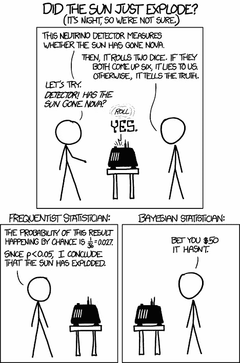
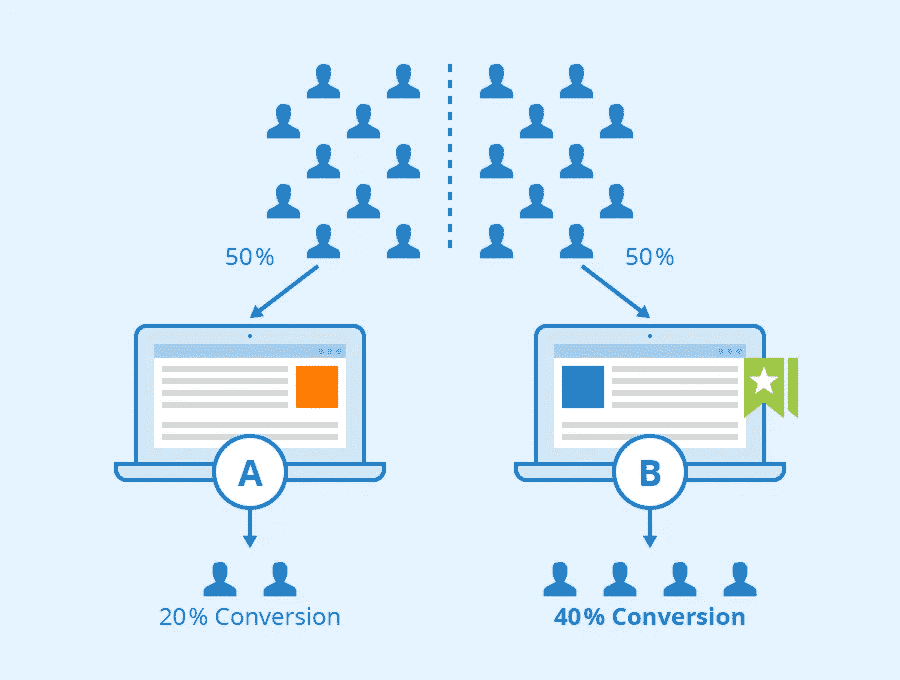

# 为什么你应该尝试贝叶斯方法的 A/B 测试

> 原文：<https://towardsdatascience.com/why-you-should-try-the-bayesian-approach-of-a-b-testing-38b8079ea33a?source=collection_archive---------3----------------------->

## A/B 测试的直观方式。贝叶斯方法的优势以及如何做到这一点。

[【不确定性】](https://www.flickr.com/photos/49970491@N07/5262645427)由 [nicubunu.photo](https://www.flickr.com/photos/49970491@N07) 在 [CC BY-SA 2.0](https://creativecommons.org/licenses/by-sa/2.0/?ref=ccsearch&atype=rich) 下授权

> “批判性思维是一个积极的、持续的过程。它要求我们都像贝叶斯人一样思考，随着新信息的到来更新我们的知识。”
> ― **丹尼尔·j·莱维汀，** [**谎言现场指南:信息时代的批判性思维**](https://www.goodreads.com/work/quotes/48657959)

# 介绍

在我们深入使用贝叶斯估计方法背后的直觉之前，我们需要理解一些概念。这些概念包括:

*   推断统计学
*   贝叶斯 vs 频繁主义者
*   A/B 测试
*   概率分布

## 什么是推断统计学？

**推断统计**是当你*根据总体的**样本**来推断*总体的一些情况，与**描述统计**相对，*描述*总体**的一些情况。**

说到推断统计，主要有两种哲学:频率主义推断和贝叶斯推断。众所周知，频率主义方法是更传统的统计推断方法，因此在大多数统计课程(尤其是入门课程)中被研究得更多。然而，许多人会认为贝叶斯方法更接近人类自然感知概率的方式。

[PhilWolff](https://www.flickr.com/photos/35237091731@N01) 的【1132 —常客 vs . Bayesian s】获得了 [CC BY-SA 2.0](https://creativecommons.org/licenses/by-sa/2.0/?ref=ccsearch&atype=rich) 的许可

贝叶斯方法包括基于新的证据更新一个人的信念。例如，你在看医生，因为你感觉不舒服，你认为你得了某种疾病。几个医生给你做了检查，他们对你的病情有不同的看法。这些被称为先验信念(先验概率)。在你接受检查后，他们会对你进行血液测试。根据测试，他们已经排除了一些他们最初预期的可能疾病，并根据结果更新了他们的信念。这种新的信念被称为后验信念(后验概率)。

## 贝叶斯方法:

1.  探索观察到的数据。
2.  选择一个概率分布来表示数据。这是你的**可能性**函数。
3.  考虑你对似然函数参数的主观信念，选择一个**先验分布**。
4.  使用贝叶斯方法用你的观察数据更新先验分布，得到一个**后验分布**。后验分布是一种概率分布，它描述了观察数据后您对参数的更新信念。

我知道，我知道，很多术语，但我会尝试解释例子中的一切。

## 贝叶斯方法什么时候更好？

随着证据实例的数量接近无穷大(即样本量越大)，贝叶斯结果与频率主义者结果越一致。随着证据实例的数量变少(即样本量越小)，推论变得越不稳定。这导致 frequentist 估计有更多的差异，从而更大的置信区间。然而，由于贝叶斯方法包含了先验和返回概率，我们可以保留不确定性。先验越恰当，结果偏差越小。此外，频率估计经常导致不收敛，不允许的参数解决方案，和不准确的估计。此外，频率主义方法假设概率是事件的长期频率，因此依赖于[渐近理论](https://en.wikipedia.org/wiki/Asymptotic_theory_(statistics))【1】。

如前所述，贝叶斯哲学接近人类的思维方式，这意味着推理更容易理解。我们将通过一个 A/B 测试的例子来展示贝叶斯方法的直观性。

AB 测试—作者:Seobility —许可: [CC BY-SA 4.0](https://www.seobility.net/en/wiki/Creative_Commons_License_BY-SA_4.0)

# A/B 测试示例

A/B 测试是一种广泛使用的研究方法，用于比较单个变量的两个变量(A 和 B)并找出差异。它有许多应用，但最受欢迎的是比较网站、应用程序等的布局..frequentist 方法包括进行假设检验、计算 Z 值、p 值等..

在本例中，我们将对一款流行的手机益智游戏 Cookie Cats 进行 A/B 测试。你可以在这里找到数据集[。在这个游戏中，玩家通过关卡前进，有时他们会到达一个大门，迫使玩家等待一定的时间或进行应用内购买。该应用程序的创建者希望根据两种不同的关卡放置位置来查看用户的保留率:30 级的关卡和 40 级的关卡。](https://www.kaggle.com/yufengsui/mobile-games-ab-testing)

游戏截图。

我们通过绘制数据(数据已经是干净的)并查看响应变量的分布图来开始分析。我们将分别分析两个响应变量。答案是 1 天和 7 天的保留率。当用户对于变体 *A* 玩了 30 轮或更多轮游戏时，1 天保留为真，否则为假。对于变体 *B，*当用户玩了 40 轮或更多轮游戏时，1 天保留为真，否则为假。这种保留可能性可以表示为[伯努利分布](https://en.wikipedia.org/wiki/Bernoulli_distribution)，可以认为是返回布尔值(是或否)的任何单个试验的一组可能结果的分布。

## 现在选择先验分布

选择你以前的发行版可能很棘手。一般来说，样本量越小，为了获得更准确的结果，先前的分布应该提供更多的信息。例如，如果您有非常大的样本量，您可以选择弱信息先验分布，并获得与选择强信息先验分布类似的结果。

有不同类型的[先验](https://en.wikipedia.org/wiki/Prior_probability)可供选择:

*   **信息性先验**表达了关于变量的明确信息，当你有确凿的证据时可以使用。 [**共轭先验**](https://en.wikipedia.org/wiki/Conjugate_prior#Table_of_conjugate_distributions) 与后验分布属于相同的概率分布族，并且这些也用作信息先验[2]。
*   **弱信息先验**表达了关于变量的部分信息，用于将推断保持在合理的范围内(可以将其视为防止过度拟合)。
*   **无信息先验**表达了关于变量的模糊信息，会增加欠拟合的机会。

这些先验应该根据可获得的证据水平来选择。*这非常直观，因为一般来说，你掌握的证据越多，你就越不依赖最初的假设。*

1.  获取变量的样本大小。
2.  然后我们需要得到每个变量的观察值；这存储为 0 和 1 的数组。
3.  假设两个变量的保留率的真实概率。你的先验越强，信息越丰富，你的假设就越不可靠。后验概率主要由证据决定，而不是由任何原始假设决定，前提是原始假设承认证据所暗示的可能性。在这个例子中，我使用了不太可能是真实概率的值(因为它们不同于样本均值)
4.  使用 [pyMC](https://docs.pymc.io/) 3 创建一个模型，并假设不同变量的先验分布(这些先验分布可以互不相同)。在本例中，我们使用贝塔分布作为先验，因为它是伯努利和二项式似然函数的共轭先验。贝塔分布的参数越大，你应该越有信心。参数是成功和失败。可以使用的弱信息先验的例子是具有参数[0，1]的均匀分布。您可以对两者进行测试，并看到由于我们的大样本量，最终结果大致相同。
5.  定义确定性 delta 函数。这就是利益的未知。
6.  以各自的先验分布为参数，定义两个变量的似然函数。
7.  使用 MCMC 算法对 20，000 次(或任意多次)迭代进行采样，并丢弃前 1000 次迭代，因为这些迭代通常与我们感兴趣的最终分布无关。

## 结果

在图中，我们可以看到变量的后验分布和变量的差异。分布越广，我们对 p(A)和 p(B)的真实值就越不确定。真实变量的不确定性与样本大小成正比。使用贝叶斯方法的好处是，现在我们可以量化不确定性。此外，我们可以看到，delta 后验概率的大部分分布在 delta = 0 以上，这意味着变体 *A* 可能比变体 *B.* 更好

我们还可以计算变量的相对性能，并绘制它们。在图中，您可以看到变体 *A.* 可能有 1–3%的改进

# 结论

使用贝叶斯方法进行 A/B 测试有很多原因。然而，“天下没有免费的午餐”这句话适用于任何事情。最重要的是，你可以将这两种方法应用到 A/B 测试中，看看它们是如何比较的，以及每种方法的可解释性。

**贝叶斯方法的优势在于:**

*   样本大小并不重要
*   你可以量化不确定性
*   它非常直观，也非常容易理解
*   没有愚蠢的 p 值或 Z 值
*   这是自然的

*免责声明:事实上，我对贝叶斯估计非常陌生，遗憾的是，我主要是以传统方式学习的。*

 [## 迈克尔·拉曼/贝叶斯 _ A-B _ 测试

### 贝叶斯方法是进行 A/B 测试的一种非常直观的方法。与频率主义方法不同，它不包括…

github.com](https://github.com/michaelarman/Bayesian_A-B_testing) 

## 参考

c .戴维森-皮隆(2016 年)。*黑客的贝叶斯方法:概率编程和贝叶斯推理*。

Sanne C. Smid，Daniel McNeish，Milica mio EVI & Rens van de Schoot(2020)小样本背景下结构方程模型的贝叶斯与频率主义估计:系统综述，结构方程建模:多学科杂志，27:1，131–161，DOI:[10.1080/10705511 . 2019 . 1577140](https://doi.org/10.1080/10705511.2019.1577140)[1]

古铁雷斯-佩纳、爱德华多和皮埃特罗·穆里埃。"共轭先验代表了强有力的实验前假设."英国牛津 OX4 2DQ 加辛顿路 9600 号布莱克威尔出版社，2004。[2]