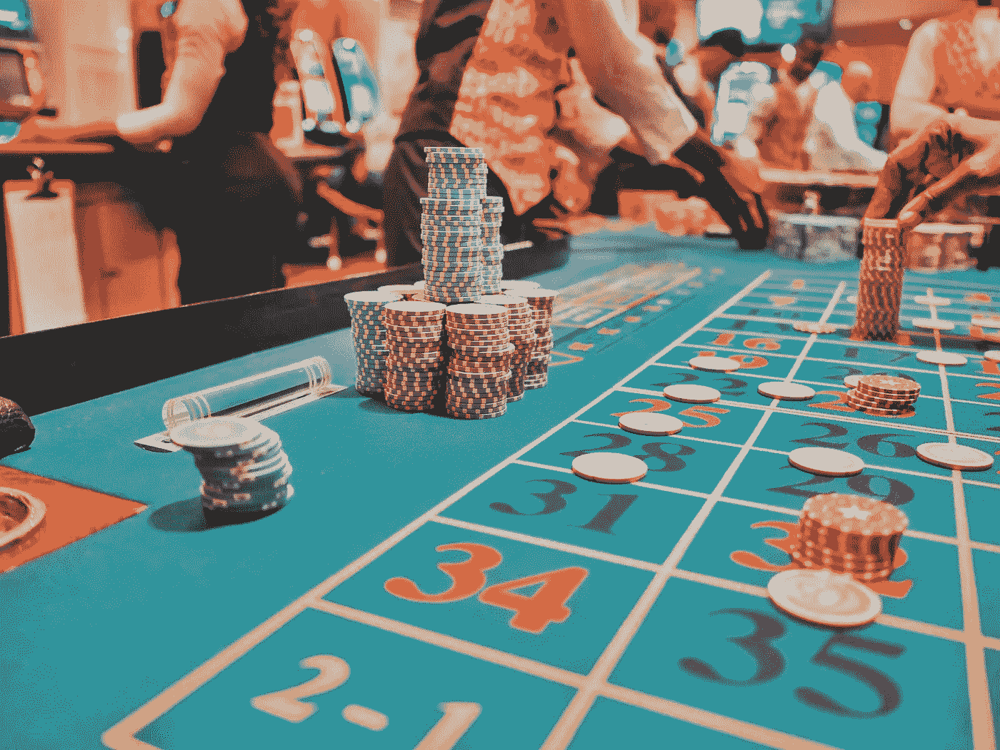
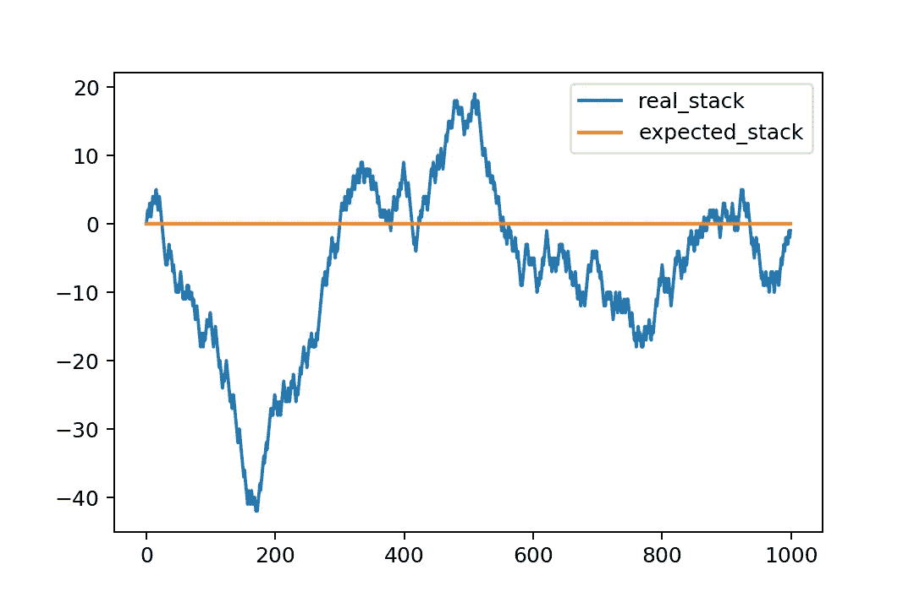
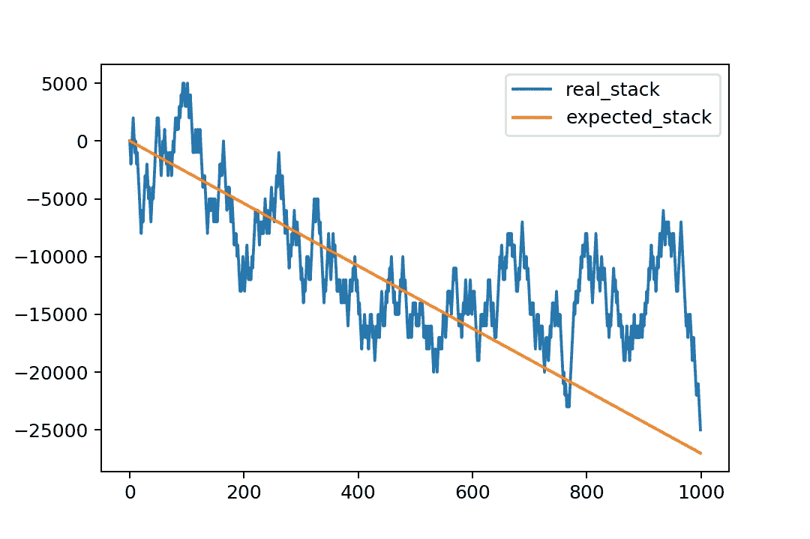

# 为什么你不应该去赌场(3 个统计概念)

> 原文：<https://towardsdatascience.com/why-you-shouldnt-go-to-casinos-3-statistical-concepts-a3b600086463?source=collection_archive---------0----------------------->

## 庄家总是赢家。我们都知道这句话。但这不仅仅是一句话。这是一个简单的，数学证明的事实。你只需要知道三个统计学概念就能明白为什么赌场总是赢。

由[凯](https://unsplash.com/@kaysha?utm_source=unsplash&utm_medium=referral&utm_content=creditCopyText)在 [Unsplash](https://unsplash.com/s/photos/casino?utm_source=unsplash&utm_medium=referral&utm_content=creditCopyText) 上拍摄

你在赌场。轮盘赌的轮盘在旋转，球在弹跳。蹦，蹦，蹦，你笑:*“红了！”*然后再弹一次。不，是黑色的！你又失去了一切，空着口袋回家。

嗯，我希望你不会——因为你不去赌场，不买刮刮乐，不玩彩票或任何赌博游戏。

为什么？因为这些游戏是为了让你赔钱而设计的。

在这篇文章中，我会告诉你为什么。(查看 [**播客**](https://anchor.fm/data-science-podcast/episodes/Why-You-Shouldnt-Go-to-Casinos----3-Statistical-Concepts-eju3im) **或** [**视频**](https://www.youtube.com/watch?v=MkfPALtnDG8) **版本吧！)**

庄家总是赢。我们都知道这个短语。但这不仅仅是一句话。这是一个简单的，数学证明的事实。你只需要知道三个统计学概念就能明白为什么赌场总是赢。

这三个统计概念也经常出现在数据科学项目中。因此，如果您想知道我为什么在数据科学频道上谈论赌博，请放心，您也可以在您的数据科学职业生涯中利用这些知识。

总之，三个统计学概念。

这些是:

*   **生存偏差**
*   **预期值**
*   **和热手谬误**

先说第一个。

# 生存偏差

每个人都喜欢好故事！一个好故事会流传下来。

我敢打赌，你也有一个朋友——或者朋友的朋友——在体育赌博中赢了大钱，或者从拉斯维加斯带着 10，000 美元回家，或者用刮刮卡赢得了去马耳他的梦幻之旅……所以赢了大钱。

诀窍在于，在赌博中，好故事总是以大赢而告终。有道理。我奶奶从来不谈论她上周是如何在彩票上玩家庭号码，又是第 200 次，什么也没中。但是她永远不会忘记 2003 年她赢得 6000 美元的时候。

这是为什么呢？

因为输了没意思。是日常。每个人都会这样。获胜是令人兴奋的，这是一个有趣的故事，即使是在多年以后。

赢大 ***的故事熬过了*** 无聊的过滤。

这就是为什么这个统计概念被称为*存活率* *偏差*。在这种情况下，获胜的故事就是*幸存*的事情。而为什么是 ***偏差呢？***

因为这里发生了什么？

我的大脑听到一个胜利的故事。这是一个数据点。然后它听到另一个，然后另一个，然后另一个。有时它也会听到失败的故事…但远没有现实中那么多。所以我可怜的大脑会有一个不成比例的大样本量的成功故事和相对较少的失败故事。它无意识地从扭曲的数据中创造出虚假的统计数据——因此它认为我获胜的机会比真实的大得多。

我愚蠢的大脑就是这样工作的。好吧，好吧，坏消息是不仅仅是我的大脑，你的也是。其实是每个人的大脑:人类就是这样被创造出来的。我们本能地认为，我们在游戏中获胜的机会比实际情况更大。因为生存偏差。

哦，当然，几乎所有的赌场和在线博彩公司都尽可能地放大这种效应。

不管怎样，如果没有生存偏见，我们会更理性地看待赌博的机会，可能我们都不会去赌场。因此，如果你听到一个好的获胜故事，你应该永远记住，这不是完整的画面…在完整的尺度上，**房子总是赢**。

我一直这么说，顺便说一句:*房子总是赢*。但是我还没有解释它背后的数学原理。所以让我们继续讨论这个问题，并转向第二个统计学概念。

# 预期值

这里，我就不赘述期望值计算本身的细节了。但是可以看看这篇文章了解更多:[期望值公式。](https://data36.com/expected-value-formula/)

但是，让我们回来，让我谈一点关于期望值的问题。

**期望值显示了如果你无限次下同样的赌注*你会得到的*平均值*结果。***

*我知道，这听起来有点棘手，所以让我举一个简单的例子来说明这一点。*

**抛硬币。**

*抛硬币通常是一个公平的游戏。当你抛硬币时，有 50%-50%是正面或反面。假设你下注，如果是反面，你的钱翻倍，如果是正面，你的钱输光。如果你反复这样做几次，比如说 1000 轮，你的赢和输就会互相抵消。你的平均利润将是 0 美元。这意味着这个博弈的***期望值*正好是 0 美元。***

**

*期望值-硬币投掷模拟(图片由作者提供)*

*在*轮盘*中，有一个非常类似于抛硬币的赌注。那就是赌红对黑。但是在轮盘赌中，你赢的几率比掷硬币要低一点点。当你把 10 美元押在黑色时，你的期望值不是 0。每回合负 0.27 美元。同样，我不会在这里进入数学，看看我提到的文章。但关键是，在你玩的每一轮中，你平均输 27 美分。这似乎是很小的一笔钱。但是超过 1000 回合，加起来，你的损失大约是 270 美元。*

**

*期望值—轮盘模拟(图片由作者提供)*

*我的意思是，当然，期望值是一个理论值，但它总会在长期中表现出来。换句话说:玩的越多，输的越多。*

*重点是:轮盘赌是一种期望值为负的游戏——因为它的概率是以一种你长期会输的方式设计的。这并不是什么大秘密，赌场里的每一场游戏都是以负期望值设计的。*

*这就是为什么房子总是赢。*

*这是第二个统计学概念，期望值。*

***先说第三个统计学概念:***

# *热手谬论*

***这是另一个偏见，它解释了为什么当人们在一个系列赛中获胜时，他们不会退出比赛。***

*首先，你必须知道概率是很微妙的。它的工作方式对人脑来说很难解释。有些事件极不可能发生。就像你掷硬币时连续得到 10 个正面的机会。出现这种情况的概率不到 0.1%。尽管如此，在足够大的样本量中，假设你投掷硬币 100，000 次，这将不可避免地发生，甚至多次。*

*同样的事情也会发生在你身上。例如，如果你玩 1000 轮轮盘赌，你很有可能会走运。*

**

*期望值—轮盘模拟—有幸运跑！(图片由作者提供)*

*当一个人处于好运中时，很容易感觉到她有一手*好牌*。所以她提高了标准，下了更大的赌注——希望从这些获胜系列中获得最大收益。但事实是，这些系列赛的胜利只不过是盲目的运气，从统计上来说，每个人都会时不时地遇到这种情况。*

*在赌博中，没有热手这回事。在赌场里，就像你赢得东西的速度一样快，你失去它的速度也一样快。".再说一次，你无法摆脱统计规律——你玩得越多，失去的机会就越大。记住，庄家永远是赢家。所以不要被热手谬论所迷惑。如果你去赌场玩(违反常识)并且赢了(赔率很低)，你能做的最好的事情就是立即离开，并为自己的幸运而高兴！*

# *结论*

*那么你为什么不应该去赌场呢？*

*因为 3 个简单的统计概念:*

*   ***生存偏差***
*   ***期望值***
*   ***和热手谬误***

*而且不要误会，赌不赌是你自己的选择。我明白了。玩的时候很好玩，运气好很好玩，赢了也很好玩。*

*我只是想让你理解赌博背后的数学原理，让你更现实地了解你的机会，以及为什么赌场总是赢。*

*data36.com 的孙铁麟·梅斯特*