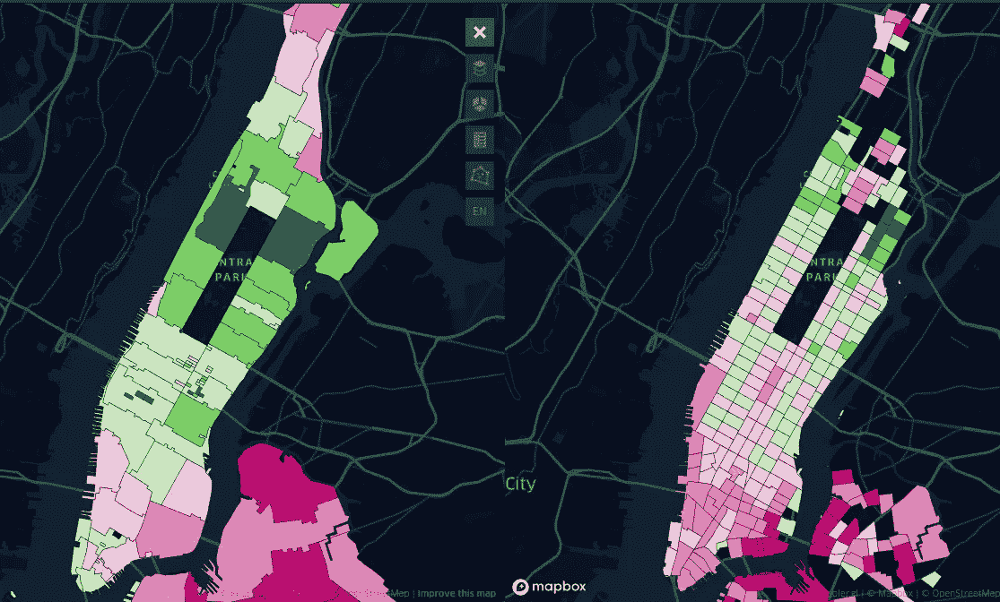
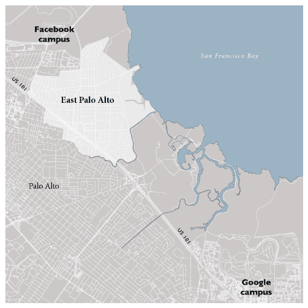
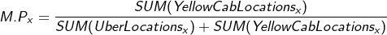
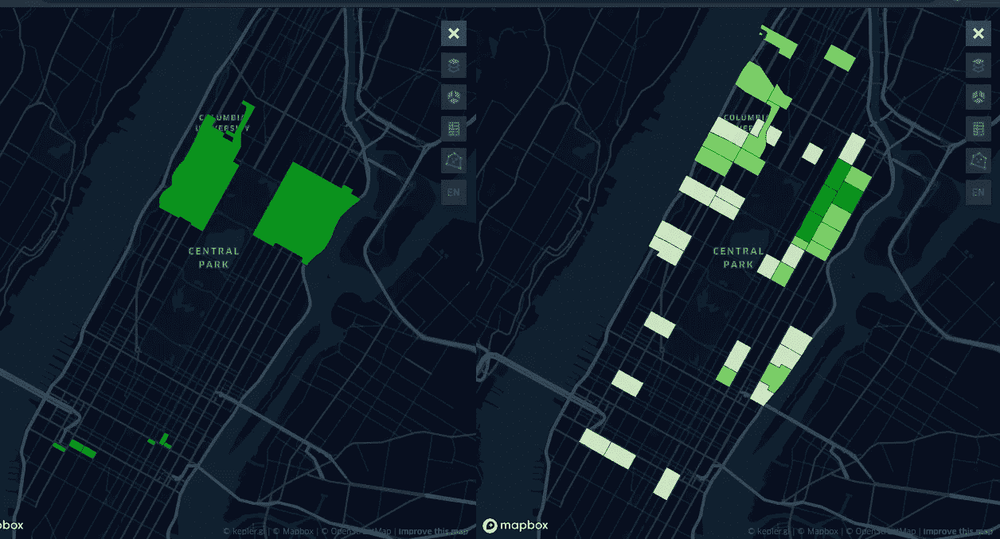
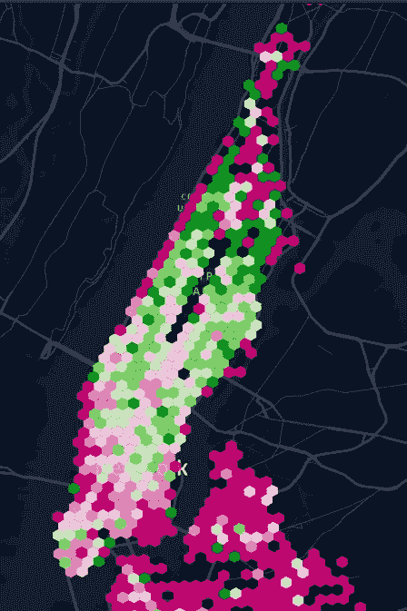
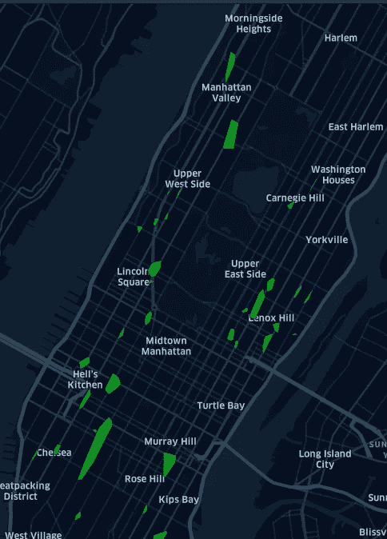

# 为什么您不应该使用邮政编码进行超本地和最后一英里分析

> 原文：<https://towardsdatascience.com/why-you-shouldnt-use-zip-codes-for-your-hyperlocal-last-mile-analysis-3b9f8613bcc1?source=collection_archive---------85----------------------->

## 邮政编码和区域边界忽略了它们内部属性的细微差别！探索地理空间 ***数据科学中可修改的面积单位问题。***

合著者:[里沙卜·贾因](https://www.linkedin.com/in/rishabh-jain-2b0377b6/)

当用不同的区域定义计算时，纽约市各区域的市场潜力存在显著差异。

# 介绍

在 [Locale.ai](https://www.locale.ai/) ，我们与许多最后一英里、超本地和移动公司合作。对于这些公司中的大多数来说，地理空间分析是至关重要的，通常，他们在 BI 平台上或内部使用开源工具构建内部仪表盘。

他们使用我们产品的原因之一是为了强调应该关注哪些领域，以及如何将他们的策略与这些领域联系起来。这里需要注意的是，这些区域不是我们传统定义的城市区域或邮政编码区域。在本帖中，我们将深入探讨为什么使用传统的区域定义不是进行地理空间分析的好主意。

# 地图并不总是说实话！

基于直觉逻辑，公司要么用邮政编码边界，要么用一些手绘的街区边界来绘制他们最关键的指标，如市场潜力、利用率、平均客户价值等。这些构成了决策的重要组成部分，如扩展到哪些领域、进行促销或提供更多供应。

现在，如果你是一家很少或没有同城业务的企业，这种差异对你来说可能并不显著。但是，如果你在最后一英里或超本地级别提供服务，洞察力的差异会对企业和城市团队的决策产生重大影响。

*这让我想到了下一个问题:* ***为什么这种差异如此显著？***

经常发生的情况是邮政编码或任意定义的街区边界，不同地区描述的细微差别往往会消失。

> *换句话说，我们视为一个大单元进行分析的邮政编码由许多更小的单元组成，这些单元在人口统计或经济潜力方面没有任何相似性。*

来源:维基百科

举例来说，如果你住在帕洛阿尔托，你就是世界上最重要的创新中心的一部分，支付的房价中位数为 118 万美元。然而，就在火车轨道对面，18%的东帕洛阿尔托居民生活在贫困线以下，人均年收入为 18385 美元。

> *这两个领域的特征行为会非常不同，虽然它们会出现在你收集的数据中，但往往不容易挖掘出来。*

在下一部分中，我们将向您展示地图是多么容易说谎，以及为什么您团队中的不同成员会根据相同的指标集推荐一个城市中完全不同的区域！

# 纽约城市管理者的悲哀

让我们假设你是优步的城市经理，想在你有高市场潜力或市场份额的地区开展有针对性的促销和打折活动。在这个练习中，我们使用了可用的优步出租车数据集[这里](https://www.kaggle.com/fivethirtyeight/uber-pickups-in-new-york-city#uber-raw-data-apr14.csv)和可用的纽约市黄色出租车数据集[这里](https://data.cityofnewyork.us/Transportation/2014-Yellow-Taxi-Trip-Data/gn7m-em8n)。现在，我们可以简单地将市场潜力定义为

对于我们的区域定义，我们选择纽约市住宅区和[纽约市邮政编码区](https://geodata.lib.berkeley.edu/download/file/nyu-2451-34509-geojson.json)。使用这两个区域定义，我们计算市场潜力，这是曲线图:

左边和右边分别显示了邮政编码和居住区

对优步来说，更环保意味着更大的市场潜力，而 pinker 则意味着它在该领域已经做得很好了。当我们尝试根据 M.P 大于 70%的区域进行筛选，以确定开展促销活动的主要区域时，我们看到了以下区域:

市场潜力大于 70%的领域

我们得到的区域完全不同！

# 可修改的面积单位问题

因此，可以有把握地得出结论，基于我们用于分析的一组边界，决策完全改变了。这是地理空间数据科学中的一个经典问题，称为*可修改面积单元问题* (MAUP)。

> *由于 MAUP 问题，我们的决策变得依赖于区域的形状和大小，而不是其中用户的实际特征。*

理想的区域应该有理想的形状和大小。让我们考虑找到理想的形状。我们可以将地理平面分成同样大小的正方形，或者三角形、五边形或其他形状！我们在现场使用六边形而不是任何其他形状，你可以在这里一瞥为什么:

 [## 空间建模花絮:蜂巢还是渔网？

### 为什么我们 Locale.ai 喜欢六边形网格？

medium.com](https://medium.com/locale-ai/spatial-modelling-tidbits-honeycomb-or-fishnets-68a453ac455e) 

让我们使用 hexes 来绘制纽约市的 MP。优步有一个非常合适的库，可以将 lat，longs 转换成给定大小的 hex。你可以在这里找到更多相关信息[。](https://eng.uber.com/h3/)

从可视化中，我们可以看到整个城市的市场潜力分布非常均匀。我们可以根据市场潜力筛选这些六边形，以获得开展促销活动的最佳区域。

六边形区域的市场潜力

减少更多偏差的另一种方法是不要将位置绑定到区域，这将引出我们的下一节。

# 进入，地理空间聚类！

这个想法是让数据决定 MP 应该理想地被计算的重要区域。像 DBSCAN 这样简单的基于密度的聚类算法可能是一个很好的起点！如果您想了解其他类型的集群，我们已经写过了:

 [## 地理空间聚类:类型和用例

### 深入探究所有不同种类的集群及其用例。

medium.com](https://medium.com/locale-ai/geospatial-clustering-types-and-use-cases-6caedecfc7f0) 

我们根据彼此的接近程度对所有位置进行聚类，从而找到密集的聚类。然后，我们计算这些区域的凸包得到区域边界。现在，我们有了从数据本身生成的区域，适合以减少人为偏差的方式计算 MP。同样，我们根据 M.P .大于 70%的区域进行过滤，得到这些地方:

由我们的算法检测到的具有最高市场潜力的热点。

值得注意的是，由于问题的性质和定义，一个简单的基于密度的方法可以在这里工作。

> 由于我们只考虑位置，所以基于密度的空间聚类提取了在用户行为方面更紧密结合的潜在区域。

为了使这个决策在业务用例中真正可靠，我们不仅仅使用一个指标，而是采用一组在某个领域对用户行为有很大影响的指标。例如，某个地区的上班族和大学生可能会表现出完全不同的出行模式。

现在，正如这里强调的那样，使用我们在 Locale.ai 建立的自动化学习技术进行相似性和聚类分析，我们的算法努力根据你关心的指标(增长潜力、单位经济性、超级用户)找到哪些领域表现相似，并向你展示你的每个业务单位应该关注哪些领域。

这使您能够保存或导出这些 ***区域配置文件*** ，并在不同种类的分析中重复使用它们，然后跟踪它们以最大化您在这些区域中的收入、需求和盈利能力，而不是使用任意定义的边界。

## *完整的实验连同代码可在* [*这里*](https://github.com/localeai/Modifiable-Areal-Unit-Problem) *。请随意尝试一些其他数据集！*

*还有，如果你对执行有什么建议、疑惑或者反馈，可以在这里找我:*[*LinkedIn*](https://www.linkedin.com/in/himansh005/)

如果您已经了解到这一点，这里可以先睹为快，了解为什么这是我们整个平台的基础，以及我们在此基础上开发的所有技术:

## 相似性分析和特征重要性

我们的地理空间模型不仅发现具有独特特征的区域群，还告诉我们为什么该区域是独特的。因此，在根据指标组合识别区域集群的同时，它还可以确定对这些指标有最大影响的因素。

> 两个不同的区域不一定要靠得很近才能表现相似。你可以把其中一个作为试验区，在不同的城市观察和应用同样的策略。

## 通过异常检测进行实时监控

仅仅知道仅在班加罗尔或 SFO 没有满足 SLA 是不够的，这没有意义。了解哪里的订单被延迟或取消，或者某个地区异常高的延迟是否是由于下雨导致供应突然下降引起的，这些都是非常有价值的。

> *添加位置背景和异常情况可以使我们的洞察力变得非常可行，并使决策变得非常简单。*

在现场，我们正在构建一个分析和可视化产品，以帮助城市和业务团队准确、实时地了解他们的运营情况，而没有任何妥协和依赖。如果您想要一个演示，*然后访问我们的网站了解更多详情或通过*[*LinkedIn*](https://www.linkedin.com/in/aditi-sinha-6b774ba9/)*或*[*Twitter*](https://twitter.com/aditi1002)*与我们联系。*

最初发布于此:

 [## 为什么您不应该使用邮政编码进行超本地和最后一英里分析

### 合著者:Rishabh Jain 在 Locale.ai，我们与许多最后一英里和超本地以及移动公司合作。对于…

blog.locale.ai](https://blog.locale.ai/why-you-shouldnt-use-zip-codes-for-your-hyperlocal-last-mile-analysis/) 

# 阅读相似:

 [## 空间自相关:空间对象如何影响附近的其他空间对象

### 深入探讨空间自相关及其行业使用案例

medium.com](https://medium.com/locale-ai/spatial-autocorrelation-how-spatial-objects-affect-other-nearby-spatial-objects-e05fa7d43de8)