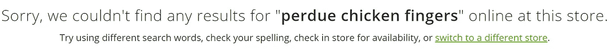
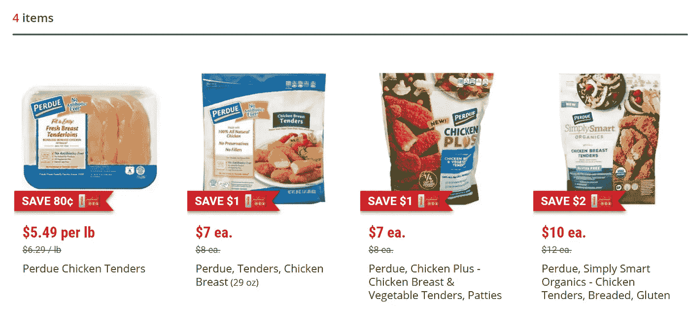
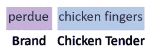
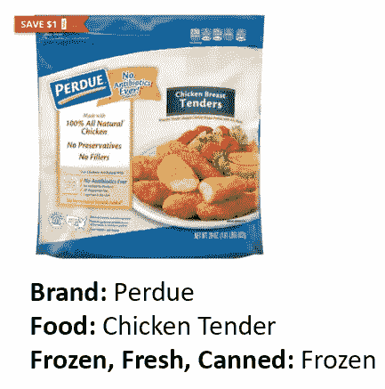

# 为什么您的公司应该关注命名实体识别

> 原文：<https://towardsdatascience.com/why-your-company-should-care-about-named-entity-recognition-e00de2f45700?source=collection_archive---------54----------------------->

## 命名实体识别的一个用例，展示了它为什么如此有用。

来源: [PhotoMIX 公司](https://www.pexels.com/@wdnet)来自 [Pexels](https://www.pexels.com/photo/vegetables-stall-868110/) (CC0)。

命名实体识别是将文本分类成实体的任务，例如人、地点和日期。例如，对于句子`On April 30, 1789, George Washington was inaugurated as the first president of the United States`，该句子可以用以下实体来标记:

图片来自 Zach Monge

你可能会想，这到底有什么用？嗯，命名实体识别有许多潜在的用途，但其中一个是能够使数据库易于搜索。您可能会想，为什么我需要标记实体来使数据库易于搜索呢？我不能用简单的字典查找来精确匹配术语吗？嗯，是的，你可以，但这远远不是理想的，只是为了向你展示没有命名实体识别的搜索是多么无效，让我们通过一个真实的例子。

# 例子

最近，我在当地的杂货店 [Weis Markets](https://www.weismarkets.com/) 点餐，并试图将濮培德冷冻鸡爪加入我的购物车。所以我在搜索栏里输入:

Zach Monge 从 [Weis Markets](https://www.weismarkets.com/) 拍摄的图片

令我失望的是，我的搜索没有产生任何结果:

Zach Monge 从 [Weis Markets](https://www.weismarkets.com/) 拍摄的图片

起初我以为他们可能没货了，但在搜索了几个其他项目后，我一直没有结果。过了一段时间，我开始怀疑 Weis 的搜索引擎只能找到几乎与产品标签完全匹配的搜索词(注意:我实际上并不知道 Weis 搜索引擎背后的机制)。所以我在谷歌上查找我想要的鸡爪的确切名称，我意识到它们被称为鸡*嫩*而不是*手指*(当然！).于是我在搜索框里输入`perdue chicken tenders`成功了！然后，我成功地将鸡腿添加到我的购物车中。

Zach Monge 从 [Weis Markets](https://www.weismarkets.com/) 拍摄的图片

Zach Monge 从 [Weis Markets](https://www.weismarkets.com/) 拍摄的图片

我很高兴我能够将鸡腿添加到我的购物车中，但这是一项很大的工作，只是找到一个项目，我对其他几个项目也有同样的问题。这让 Weis 的网购几乎无法使用！从那以后，我再也没有在这家商店网购过食品——这实在是太麻烦了。

# 解决方案

幸运的是，对于 Weis Market 来说，有一个简单的方法可以解决他们的搜索引擎问题，那就是使用命名实体识别。通过命名实体识别，搜索引擎应该自动标记每个实体。例如，当我输入`perdue chicken fingers`时，它应该将`Perdue`标记为品牌，将`chicken fingers`标记为鸡肉嫩(我不是食品类别的专家，所以我实际上不知道鸡肉嫩是否是一个有用的类别)。

图片来自 Zach Monge

然后，这将搜索一个数据库，其中每个项目都已事先标记。所以我想要的实际鸡爪可能之前已经被贴上了以下类别的标签:**品牌**=濮培德；**美食**=鸡嫩；**冷冻、新鲜、罐装**:冷冻。

图片来自 Zach Monge

通过使用这些实体和一个结构化的数据库，我对`perdue chicken fingers`的搜索将会匹配到作为品牌的`Perdue`和作为食物的`chicken tender`，并且可能会在搜索结果中包含我想要的鸡爪。

# 结论

如你所见，命名实体识别非常有用，而且对某些产品来说几乎是必不可少的。除了为杂货店创建搜索引擎之外，您还可以想象所有其他可能的用途(例如，基于标记的实体推荐类似的在线文章，创建易于搜索的采访记录数据库等)。).我在这篇文章中没有提到的是机器学习方法，它可能被用来实际执行命名实体识别任务(在这个例子中，是在搜索中标记实体的任务`perdue chicken fingers`)。这是关于命名实体识别的一系列博客文章的第一部分，下一篇文章将更深入地讨论技术细节。最后，如果您认为您的公司可以从命名实体识别中受益，请随时联系我——我的联系信息可以在我的[网站](https://zachmonge.github.io/)上找到。