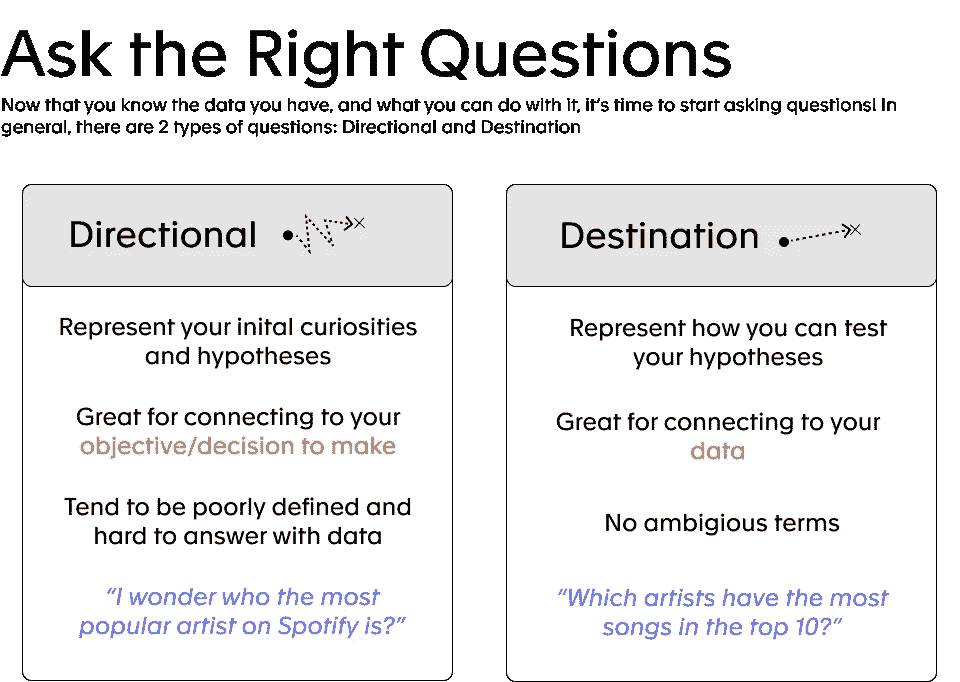

# 为什么您的数据素养培训不起作用

> 原文：<https://towardsdatascience.com/why-your-data-literacy-training-isnt-working-374ed74ee919?source=collection_archive---------26----------------------->

## 以及如何修复它

如果我们真的想让每个人都可以使用数据，我们需要重新思考我们进行数据培训的方式。

来自 2019 年 StackOverflow 黑客马拉松的照片

> “我们预计，到 2020 年，80%的组织将在数据素养领域开始有意的能力发展，承认他们的极端不足。”— [Alan D. Duncan](http://www.gartner.com/analyst/51402/Alan-D.-Duncan) ，Gartner 副总裁

最近大数据和数据科学的兴起受到了数据专家的极大欢迎。但是对于那些没有受过正式训练的人来说，使用数据仍然像以前一样难以捉摸和令人生畏。

因此，毫不奇怪，伟大的公司(例如 [AirBnB](https://medium.com/airbnb-engineering/how-airbnb-is-boosting-data-literacy-with-data-u-intensive-training-a6399dd741a2) 、 [NYT](https://open.nytimes.com/how-we-helped-our-reporters-learn-to-love-spreadsheets-adc43a93b919) )现在正把目光转向利用数据让公司的其他部分变得更好。这种趋势被称为“提高数据素养”，甚至是“建立数据文化”。

不管我们叫它什么，两者都是试图解决同一个问题:我如何让我的员工更好地使用数据[以便我的数据团队有时间做更有价值的事情]？

## 我们的研究

在过去的两年里，我们一直在询问公司如何让他们的数据更易访问。作为一个团队，我们有自己的战斗恐惧，因为我们在大大小小、高科技和低科技的公司中捍卫数据。从所有的研究和经验中，我们发现大多数数据训练程序看起来都是一样的:

*   1-2 周的强化训练
*   这涵盖了特定的工具，如 SQL、Excel 和/或 Python
*   使用演示数据(公司数据，如果适用)

这些会议的目标是让人们能够自己查询数据源并获得他们需要的信息。不幸的是，*实际的*结果是在几个月内:

1.  参加者已经忘记了培训，因为他们没有练习
2.  数据结构发生了重大变化(或者业务的大多数部分都无法访问)
3.  最初教授的工具已被其他东西取代

因此，大多数与会者最终还是回到了几个月前的老地方，只是每个人都变得更加愤世嫉俗了。

# 我们认为还有另一种方法。

在过去的 6 个月里，我们一直在开展自己的数据培训课程。超过 500 人接受了培训，其中许多人将材料带回了自己的公司，我们整理了一些可以让您的数据培训计划坚持下去的东西:

# 1.设定正确的基调

不要说“我来教你……”而是说“我能帮你什么吗？”

通过启动“数据素养计划”，你让你的同事觉得这都是他们的错。你实际上是在说“如果你们对数据多了解一点，一切都会变得更好”，虽然这可能是真的，但并不特别鼓舞人心。(如果有人在某件事上叫你*文盲*，你会有什么反应？)

您公司中的大多数人都会同意他们喜欢用数据做更多的事情，并可能强烈地感觉到他们应该为自己的职业生涯做更多的事情。因此，不要把重点放在弥补不足上，而是要关注更多地了解数据所带来的好处和机遇。

突然，会议的基调从“你必须学会这个”变成了“让我们看看我们能一起做些什么。”这是一个简单但强大的变化，甚至可以让最凶猛的数据守财奴上船。

# 2.设定正确的目标

*与其开一个关于如何编写 SQL 的培训会议，不如开一个关于问数据驱动问题的培训会议。*

你不会让公司里的每个人都像你一样热爱数据。你甚至无法让人们停止一直向你索要报告。

但是，如果你专注于它，你*可以*做出重大改变。显然每个公司都会有自己的举措，但有一条我觉得每个公司都应该有的是:**问好问题**。而不是得到类似“你能把上个月的销售数据发给我吗？”，你会收到更多可操作的、有针对性的问题，比如，“我想看看我们新的社交媒体活动是否达到了销售线索同比增长 10%的目标。”前者含糊不清，没有任何商业意义。后者是具体的，表明请求者确切地知道他们在寻找什么。更重要的是，分析师可以通过推荐数据考虑事项或帮助分析来增加第二个陈述的价值。

底线是:最好的公司问最好的问题。

摘自我们的数据培训演示

# 3.缓慢而稳定

尝试每周一次的午餐学习会，而不是两周的强化学习。

当考虑这种类型的培训时，为期一周的强化课程肯定是有吸引力的——它们创造了一个专注的环境，几乎总能交付切实的成果。然而，如果不进行常规的文化变革，这些项目的长期效果就会降低。

这种类型的会议带来的机会不仅仅是让业务用户更有能力处理数据，而是让**业务更好地处理数据**。这意味着数据团队和业务团队合作的时间越长越好。

为此，我们建议让数据成为人们生活中更值得期待的一部分。进行季度 KPI 评审，或者可选的午餐和学习会议，人们可以在会上提出他们的数据问题。要有创意，但要持久！

# 那现在怎么办？

让您公司的数据更易访问，这对于转变您的业务有着不可思议的潜力，我们相信这绝对值得投资。在你开始设计一个项目之前，考虑你的公司和你的参与者的目标，并找到实现他们的最佳方式。挑战自己，让它不仅仅是一门两周的 SQL 课程，而是对你的公司和文化产生持久影响的东西。

# 关于我们

在过去的两年里，我们一直致力于让每个人都能更方便地访问数据。我们正在开发一些我们认为会有帮助的技术和培训材料。如果你对获取培训材料感兴趣，你可以在这里注册更新[！](https://counthq.typeform.com/to/MFg4IU)

## 资源

[1] S. Hippold，[CDO 必须带头提高数据素养](https://www.gartner.com/smarterwithgartner/cdos-must-take-the-lead-to-improve-data-literacy/) (2019)，Gartner

[2] J. Stober，[Airbnb 如何通过“Data U Intensive”培训提升数据素养](https://medium.com/airbnb-engineering/how-airbnb-is-boosting-data-literacy-with-data-u-intensive-training-a6399dd741a2) (2018)，Medium

[3] L.R .库克，[我们如何帮助我们的记者学会热爱电子表格](https://open.nytimes.com/how-we-helped-our-reporters-learn-to-love-spreadsheets-adc43a93b919) (2019)，中型