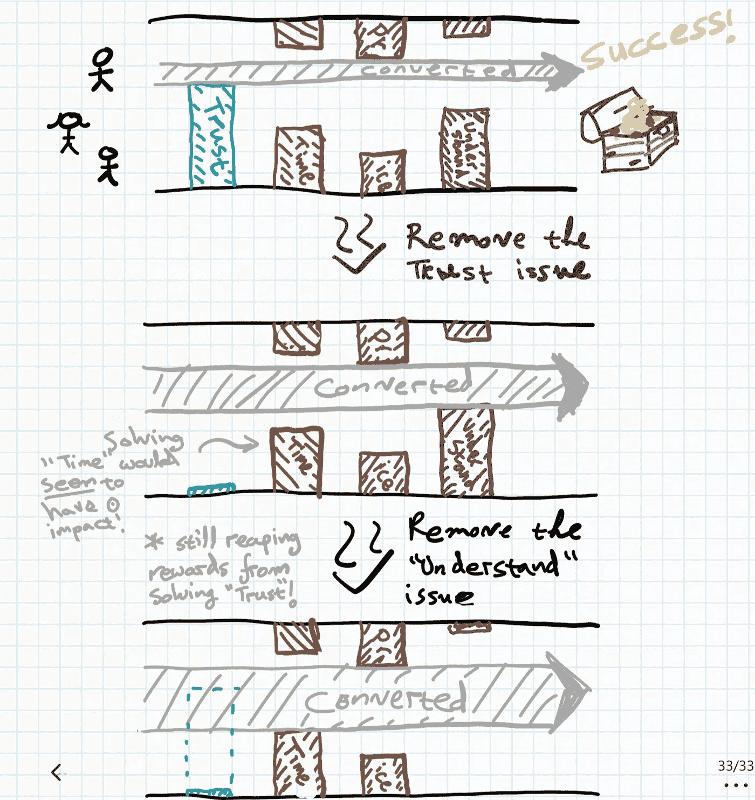

# 为什么你的实验的影响比你想象的要大

> 原文：<https://towardsdatascience.com/why-your-experiments-impact-is-greater-than-you-think-a02828896252?source=collection_archive---------54----------------------->

当我们进行实验时，我们试图解决我们认为阻碍(或促成)转化成功的假设。例如，如果你的服务注册表格转化了 65%，可以想象有 35%没有转化的用户会遇到很多阻碍:

*   他们不理解报价；
*   他们不信任你；
*   太长了，填不完；
*   它要求他们不愿提供的细节；
*   他们无法回答其中一个问题(有一个答案你没有考虑过)；
*   太慢了；
*   这是错误的；
*   他们觉得完成这个阶段对他们来说没有价值；
*   …

当我们进行实验时，我们会尝试解决一个这样的阻塞并将其移除。让我们假设我们相信(或者使用[定性研究](https://www.educated-guess.com/posts/the-false-dichotomy-of-quant-qual-analysis)来发现)有些人觉得表格太长。您尝试删除一些字段，但是发现它只能提高 0.5%的转化率。这是否意味着这个问题的解决方案只是 0.5%用户的问题？号码

多个拦截器将导致最初的几个修复影响较小，随着我们对同一拦截器的工作越来越多，影响越来越大，直到它达到稳定状态。实际情况是，大多数人在完成一个过程/漏斗时，并不仅仅受到一个阻碍因素的影响。他们可能都觉得时间太长了*和*不信任这个过程，或者不信任这个过程*和*不明白我们在问什么。因此，当你开始解决“信任”问题时，如果你还没有接触任何其他东西，你只能影响那些*只有*有信任问题的人。即使您完全“修复”了信任，对于其他人来说，仍然存在阻止者。当你移除下一个障碍，比如说“理解”，你现在收获了预先解决信任问题和理解障碍的回报。该图说明了这里的动态，假设称为“信任”、“时间”(我没有时间填写)、“价格”和“理解”(我不明白为什么我需要它)。

转化率的瓶颈模型。图片作者。

你可以看到许多动态都是可能的，包括你认为已经解决的事情(不再是瓶颈)在其他事情解决后再次成为瓶颈。用户/客户也会改变偏好，或者用户的受众会改变，我们会接触到具有不同偏好组合的人，从而改变“屏蔽者”。

所有这些都是为了说明，重新审视你认为你以前已经解决的假设是很重要的，承认你不会立即看到所有努力的所有成果也是很重要的，但有时成功地“清除”用户成功的道路实际上依赖于许多以前的障碍，这些障碍以一种不可能衡量的方式被清除。本质上——每个实验的影响都被其他问题所篡改，所以你只能看到它的一部分效果。