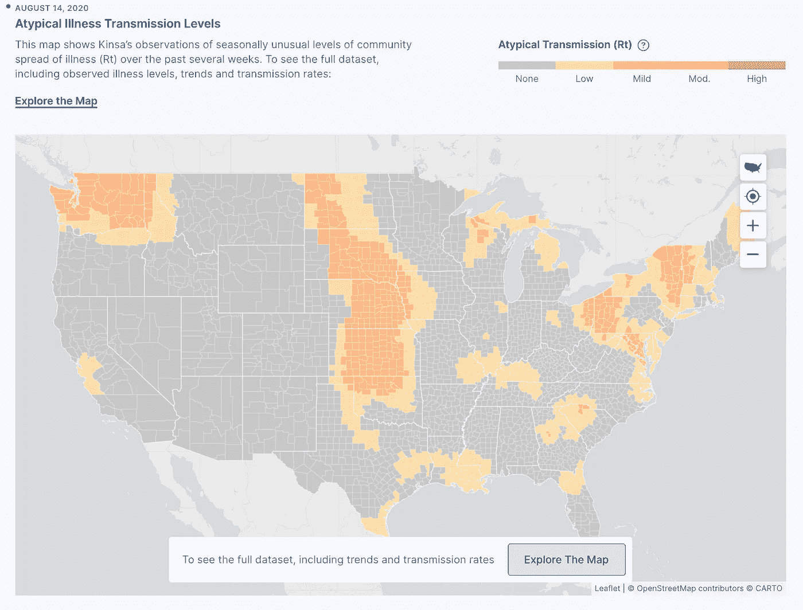
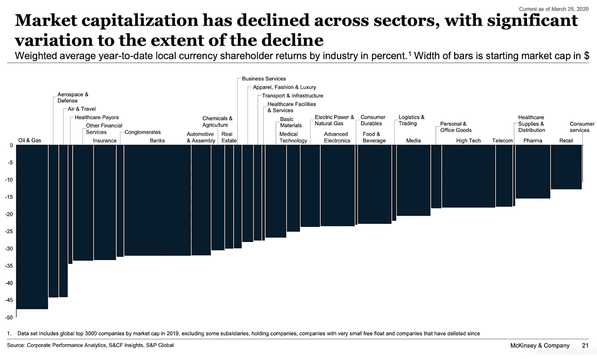

# 为什么你的创业公司需要数据科学来度过这场危机

> 原文：<https://towardsdatascience.com/why-your-startup-needs-data-science-to-survive-this-crisis-d04500df6c2a?source=collection_archive---------65----------------------->

## 新冠肺炎影响了每一个行业。以下是数据如何帮助你变得更加强大和繁荣

冠状病毒的传播给全球经济带来了巨大的打击。封锁和在家工作的限制已经迫使成千上万的初创公司停止扩张计划，取消服务，并宣布裁员。

该病毒也对初创企业融资和交易活动产生了影响，种子阶段的交易在本季度受到了严重打击。很明显，创业社区现在面临着，并且在未来的几个月里还将继续面临生存危机。

为了继续经营，创始人正在寻找保持流动性的方法，更好地了解他们的供需情况，确定远程员工的运营效率，并寻找机会进行调整。

如果说数据是每个企业的命脉，那么对于希望度过低迷时期的初创公司来说，它就更加重要。以下是初创公司如何利用数据和分析来度过当前危机的方法。

*照片由* [*尼克菲宁*](https://unsplash.com/@jannerboy62?utm_source=unsplash&utm_medium=referral&utm_content=creditCopyText) *上* [*下*](https://unsplash.com/photos/2qMg2gXYKvo?utm_source=unsplash&utm_medium=referral&utm_content=creditCopyText)

## ***1。数据显示客户的购买模式如何变化***

麦肯锡发现美国消费者正在彻底改变他们的消费和行为，尽管他们对经济表示乐观。调查发现，43%的人由于不确定性而推迟购买。

尽管短期内消费转向家庭必需品和远程渠道，但消费者行为预计将永久性地转向在线消费。创业公司必须把握消费者情绪变化的脉搏。

尽管市场研究报告和调查分享了有用的见解，但它们充其量只是滞后指标。寻找可以给你实时或早期信号的替代公共数据源。例如，Kinsa Health 发现他们的在线设备上的数字温度计读数提供了对新冠肺炎在各个城市的进展的[洞察](https://www.nytimes.com/2020/03/30/health/coronavirus-restrictions-fevers.html)。

*来源:*[*health weather*](https://healthweather.us/)*图由金萨洞见*

在线餐馆聚合网站 OpenTable 发布的数据显示，外出就餐预订需求下降。谷歌上的公共搜索查询揭示了一个地理区域内数百万消费者现在想要什么。

例如，大多数美国人想知道迪斯尼什么时候重新开放，任天堂 Switch 多快会有货。除了卫生纸的供应，他们同样担心 Roblox 的永久关闭。

*来源:* [*谷歌*](https://www.google.com/) *搜索*

## 2. ***数据帮助你了解你的员工如何应对危机***

随着员工被要求在家工作，数百万人被抛入他们不习惯的工作环境，承受着前所未有的压力。虽然干扰和技术挑战是短期的刺激因素，但最大的心理健康风险[是由于孤独和倦怠。](https://www.forbes.com/sites/onemind/2020/03/17/when-home-becomes-the-workplace-mental-health-and-remote-work/#435a4c731760)

在这样的不确定时期，数据可以帮助公司了解他们的员工如何应对危机。自然语言可以为员工福利提供重要线索，而不是等待员工调查或传统的反馈方式。

奥斯汀德克萨斯大学的社会心理学家 James W. Pennebaker 发现，我们言语中的被动部分反映了我们的精神状态。例如，不太快乐的人倾向于更多地使用人称代词，即“我”或“我”，而不是“他”或“她”。

StatusToday 已经建立了一个人工智能解决方案，它可以连接到公司的电子邮件、聊天和通信系统，以识别员工是否处于倦怠的边缘。不用说，侵犯隐私和确保员工福利的洞察力之间只有一线之隔。组织需要信任他们的团队，并对如何使用这些见解保持透明，以避免增加被监控的额外压力。

## 3. ***数据帮助您提高效率并调整您的业务产品***

新冠肺炎危机毫无例外地冲击了每个行业。然而，在 2021 年之前，航空航天、旅游、保险、石油和天然气等行业可能不会反弹。在受影响的行业中，基于产品、商业模式以及销售和消费渠道，存在相当大的差异。

*资料来源:* [*麦肯锡&公司*](https://www.mckinsey.com/business-functions/marketing-and-sales/our-insights/global-surveys-of-consumer-sentiment-during-the-coronavirus-crisis) 全球消费者情绪调查

面对不确定性，数据有助于提高业务效率。莱德利和莱德曼[建议](https://hbr.org/2020/03/use-data-to-accelerate-your-business-strategy)通过采用六种数据价值模式来使用结构化的问题解决方法。

这些价值模式是涵盖商业价值链最关键方面的场景——产品丰富、市场情报、竞争地位、人员能力、流程改进和风险管理。

该框架通过推动与利益相关方的正确对话，让您能够识别数据对您业务的潜力和限制。例如，当一家地区性银行失去了许多高财富客户时，它转向了数据价值模式。

通过系统地收集和分析数据，该银行发现客户对他们的交易执行和报告不满意。通过调查两种价值模式，该银行推出了流程改进，从而恢复了市场份额。

如果你的业务需要一个根本性的改变来度过当前的危机呢？这是数据可以帮助你的另一个领域。在当前的经济低迷时期，有些公司通过调整商业模式留住了客户或获得了新客户。

随着家庭消费的强劲增长，企业正在尝试快速采用在线渠道。

克里斯·蒙哥马利在 [Unsplash](https://unsplash.com/collections/9920464/virtual-events?utm_source=unsplash&utm_medium=referral&utm_content=creditCopyText) 上的照片

例如，健身工作室和健身房正在与 T5 竞争，通过数字化来保持相关性。此类企业采用传统的内部模式，他们需要新的功能来远程吸引和留住客户。他们必须学会接受数据并使用分析来衡量[客户体验](https://insidebigdata.com/2019/03/20/how-ai-can-transform-customer-experience-by-listening-better-to-the-voice-of-customers/)并提高在线参与水平。

初创公司可以向网飞这样的数字本土公司学习，他们围绕用户分析开展业务。网飞一直在通过持续的数字创新巩固其领导地位。最近，它推出了[网飞派对](https://www.netflixparty.com/)，这是一种在社交距离中一起看电影的有趣方式，以弥补与朋友错过的电影之夜。

克里斯·蒙哥马利在 [Unsplash](https://unsplash.com/collections/9920464/virtual-events?utm_source=unsplash&utm_medium=referral&utm_content=creditCopyText) 上拍摄的照片

## ***采用数据驱动的方法，从危机中走出来变得更强***

当您评估和响应不断变化的业务优先级时，请将内部数据洞察与来自公共数据源的情报相结合。

利用数字工具和推断信号来支持和授权您的团队。使用六种数据价值模式框架来定义数据如何帮助调整您的业务战略。为了从数据计划中获得最佳结果，请确保您拥有一个平衡的[数据科学团队](https://techhq.com/2019/12/a-complete-data-science-team-requires-more-than-just-data-scientists/)，并促进与业务利益相关方的协作。

> 幸存下来的物种既不是最强壮的，也不是最聪明的。它是最能适应变化的。

查尔斯·达尔文的进化论给希望度过这场危机的公司上了重要的一课。幸存下来的物种既不是最强壮的，也不是最聪明的。它是最能适应变化的。那些能够快速利用数据洞察来应对、适应和发展创业公司的创业者将会变得更加强大。

*这篇文章最初是由《分析》杂志上的***发表的。增加了插图。标题照片由* [*大卫·克洛德*](https://unsplash.com/@davidclode?utm_source=unsplash&utm_medium=referral&utm_content=creditCopyText) *上* [*下*](https://unsplash.com/?utm_source=unsplash&utm_medium=referral&utm_content=creditCopyText)*