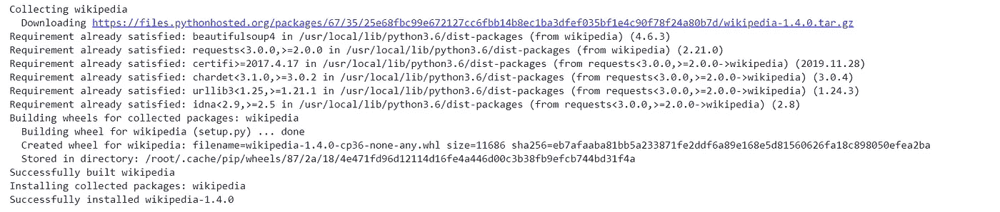

# Python 的维基百科 API

> 原文：<https://towardsdatascience.com/wikipedia-api-for-python-241cfae09f1c?source=collection_archive---------6----------------------->

## 在本教程中，让我们了解维基百科 API 的用法。


图片来源:[乌勒斯](https://www.google.com/url?sa=i&url=https%3A%2F%2Furelles.com%2Fen%2Fis-the-number-one-online-knowledge-source-wikipedia-sexist%2F&psig=AOvVaw2Y1wx1XvhImBJGfmpexGKJ&ust=1583109863425000&source=images&cd=vfe&ved=0CAMQjB1qFwoTCPiYsYWG-OcCFQAAAAAdAAAAABAO)

# 介绍

维基百科，世界上最大的免费百科全书。这是一片充满信息的土地。我的意思是谁会在一生中使用维基百科(如果你没有使用过，那么很可能你在撒谎)。名为`Wikipedia`的 python 库允许我们轻松访问和解析来自维基百科的数据。换句话说，你也可以把这个库当作一个小刮刀，在这里你只能从维基百科上刮取有限的信息。我们将在今天的教程中了解如何做到这一点。此外，本教程的完整代码可以在我的 [**GitHub 资源库**](https://github.com/Tanu-N-Prabhu/Python/blob/master/Wikipedia_API_for_Python.ipynb) 下面找到:

[](https://github.com/Tanu-N-Prabhu/Python/blob/master/Wikipedia_API_for_Python.ipynb) [## 塔努-北帕布/Python

### permalink dissolve GitHub 是 4000 多万开发人员的家园，他们一起工作来托管和审查代码，管理…

github.com](https://github.com/Tanu-N-Prabhu/Python/blob/master/Wikipedia_API_for_Python.ipynb) 

# 装置

使用 API 的第一步是手动安装它。因为，这是一个外部 API，它不是内置的，所以只需键入以下命令来安装它。

*   如果你正在使用一个 [jupyter 笔记本](https://colab.research.google.com/notebooks/intro.ipynb)，那么确保你使用了下面的命令(带“！”mark——这样做的原因是它告诉 jupyter notebook 环境正在键入一个命令(又名**命令模式**)。

```
!pip install **wikipedia**
```

*   如果您正在使用任何 IDE，例如[Microsoft Visual Studio Code](https://code.visualstudio.com/)、 [PyCharm](https://www.jetbrains.com/pycharm/) 甚至 [Sublime Text](https://www.sublimetext.com/3) ，那么请确保在终端中输入以下命令:

```
pip install **wikipedia**
```

输入上述命令后，在上述两种情况下，都会出现如下所示的成功消息提示。这表明库已成功安装。



库安装成功

# 搜索和建议

现在让我们看看 Wikipedia API 提供的一些内置方法。第一个是搜索和建议。我很确定你们可能知道这两种方法的用法，因为它的名字。

## 搜索

search 方法返回查询的搜索结果。就像其他搜索引擎一样，维基百科也有自己的搜索引擎，你可以在下面看看:

 [## 搜索

### 维基百科(一个基于 wiki 技术的多语言的百科全书协作计划ˌ也是一部用不同语言写成的网络百科全书ˌ 其目标及宗旨是为全人类提供自由的百科全书)ˌ开放性的百科全书

en.wikipedia.org](https://en.wikipedia.org/w/index.php?search) 

现在让我们看看如何使用 python 检索查询的搜索结果。我将使用**冠状病毒**作为今天教程的主题，因为大家都知道它正在全球流行和传播。在开始使用 API 之前，你首先需要导入它。

```
import wikipediaprint(wikipedia.search("**Coronavirus**"))
```

当我们执行这段代码时，我们得到如下所示的列表形式的结果:

```
[**'Coronavirus',  
 '2019–20 coronavirus pandemic',  
 '2020 coronavirus pandemic in the United States',  
 'Severe acute respiratory syndrome coronavirus 2',  
 '2019–20 coronavirus pandemic by country and territory',  
 'Middle East respiratory syndrome-related coronavirus',  
 '2020 coronavirus pandemic in Italy',  
 '2020 coronavirus pandemic in Europe',  
 'Timeline of the 2019–20 coronavirus pandemic',  
 'Timeline of the 2019–20 coronavirus pandemic in February 2020'**]
```

以上是一些在维基百科上被搜索最多的问题，如果你不相信我，去我给的上面的链接，搜索这个话题，比较结果。搜索结果可能每小时都在变化。

你可以通过使用搜索参数来过滤搜索结果，比如**结果**和**建议**(我知道不用担心拼写)*。* 结果返回结果和建议的最大数量如果为真，返回结果和建议(如果有的话)的一个元组。

```
print(wikipedia.search("**Coronavirus**", results = **5**, suggestion = **True**))
```

在执行上述代码时，您将获得仅有的 5 个搜索结果，这些结果将存储在一个元组中，如下所示:

```
([**'Coronavirus',   
  '2019–20 coronavirus pandemic',  
  'Severe acute respiratory syndrome coronavirus 2',  
  'Severe acute respiratory syndrome-related coronavirus',   
  '2019–20 coronavirus pandemic by country and territory'], 
   None**)
```

## 建议

现在，顾名思义，建议返回查询的建议维基百科标题，如果没有得到任何标题，则不返回。

```
print(wikipedia.suggest('**Coronavir**'))
```

你可能已经在许多搜索引擎中注意到了这一点，当你开始输入的时候，搜索引擎会自动向你推荐一些主题。在这种情况下，**建议方法**返回“**冠状病毒**”作为建议。

```
‘coronavirus’
```

# 摘要

要获取文章摘要，请使用“**摘要**”方法，如下所示:

```
print(wikipedia.summary("**Coronavirus**"))
```

通过执行这行代码，您可以获得您正在寻找的文章的摘要。该方法的返回类型是**字符串** 'str '

```
'**Coronaviruses are a group of related viruses that cause diseases in mammals and birds. In humans, coronaviruses cause respiratory tract infections that can be mild, such as some cases of the common cold (among other possible causes, predominantly rhinoviruses), and others that can be lethal, such as SARS, MERS, and COVID-19\. Symptoms in other species vary: in chickens, they cause an upper respiratory tract disease, while in cows and pigs they cause diarrhea. There are yet to be vaccines or antiviral drugs to prevent or treat human coronavirus infections. \nCoronaviruses constitute the subfamily Orthocoronavirinae, in the family Coronaviridae, order Nidovirales, and realm Riboviria. They are enveloped viruses with a positive-sense single-stranded RNA genome and a nucleocapsid of helical symmetry. The genome size of coronaviruses ranges from approximately 27 to 34 kilobases, the largest among known RNA viruses. The name coronavirus is derived from the Latin corona, meaning "crown" or "halo", which refers to the characteristic appearance reminiscent of a crown or a solar corona around the virions (virus particles) when viewed under two-dimensional transmission electron microscopy, due to the surface being covered in club-shaped protein spikes.**'
```

但是有时候要小心，你可能会碰到一个`DisambiguationError`。意为**同字异义**。例如，单词“ **bass** ”可以代表一条鱼或节拍或更多。这时，summary 方法抛出一个错误，如下所示。

> 提示:方法要具体

```
print(wikipedia.summary("**bass**"))
```

当您执行上面的代码行时，会出现如下所示的错误消息提示您:

```
DisambiguationError                Traceback (most recent call last)[<ipython-input-34-d1d15ef541d1>](/<ipython-input-34-d1d15ef541d1>) in <module>()
----> 1 wikipedia.summary("bass")[/usr/local/lib/python3.6/dist-packages/wikipedia/wikipedia.py](/usr/local/lib/python3.6/dist-packages/wikipedia/wikipedia.py) in __load(self, redirect, preload)
 **391**       may_refer_to = [li.a.get_text() for li in filtered_lis if li.a]
 **392** 
--> 393       raise DisambiguationError(getattr(self, 'title', page['title']), may_refer_to)
 **394** 
 **395**     else:DisambiguationError: "**Bass**" may refer to:**Bass (fish)
Bass (sound)
Acoustic bass guitar
Bass clarinet
cornett
Bass drum
Bass flute
Bass guitar
Bass recorder
Bass sarrusophone
Bass saxophone
Bass trombone
Bass trumpet
Bass violin
Double bass
Electric upright bass
Tuba
Bass (voice type)
Bass clef
Bass note
Bassline
Culture Vulture (EP)
Simon Harris (musician)
Simon Harris (musician)
Tubular Bells 2003
Bass Brewery
Bass Anglers Sportsman Society
G.H. Bass & Co.
Bass (surname)
Bass Reeves
Chuck Bass
Bass Armstrong
Bass Monroe
Mega Man characters
Bass Strait
Bass Pyramid
Bass, Victoria
Division of Bass
Division of Bass (state)
Electoral district of Bass
Shire of Bass
Bass, Alabama
Bass, Arkansas
Bass, Casey County, Kentucky
Bass, Missouri
Bass, West Virginia
Nancy Lee and Perry R. Bass Performance Hall
Bass, Hansi
Bass River (disambiguation)
Bass Rock
Basses, Vienne
Bass diffusion model
Beneath a Steel Sky
Buttocks
BASS
USS Bass
Bas (disambiguation)
Base (disambiguation)
Bass House (disambiguation)
Basse (disambiguation)
Bassline (disambiguation)
Drum and bass
Figured bass
Miami bass
Ghettotech
Sebastian (name)**
```

此外，维基百科 API 给了我们一个选项来改变我们想要阅读文章的语言。你所要做的就是把语言设置成你想要的语言。房子里的任何法国读者，我都会用法语作为参考。

```
wikipedia.set_lang("**fr**")wikipedia.summary("**Coronavirus**")
```

现在，正如我所承诺的，上述文章的全部内容将被翻译成法语，如下所示:

```
"**Coronavirus ou CoV (du latin, virus à couronne) est le nom d'un genre de virus correspondant à la sous-famille des orthocoronavirinæ  (de la famille des coronaviridæ). Le virus à couronne doit son nom à l'apparence des virions sous un microscope électronique, avec une frange de grandes projections bulbeuses qui ressemblent à la couronne solaire.  \nLes coronavirus sont munis d'une enveloppe virale ayant un génome à ARN de sens positif et une capside (coque) kilobases, incroyablement grosse pour un virus à ARN. Ils se classent parmi les Nidovirales, puisque tous les virus de cet ordre produisent un jeu imbriqué d'ARNm sous-génomique lors de l'infection. Des protéines en forme de pic, enveloppe, membrane et capside contribuent à la structure d'ensemble de tous les coronavirus. Ces virus à ARN sont monocaténaire (simple brin) et de sens positif (groupe IV de la classification Baltimore). Ils peuvent muter et se recombiner. \nLes chauves-souris et les oiseaux, en tant que vertébrés volants à sang chaud, sont des hôtes idéaux pour les coronavirus, avec les chauves-souris et les oiseaux, assurant l'évolution et la dissémination du coronavirus.\nLes coronavirus sont normalement spécifiques à un taxon animal comme hôte, mammifères ou oiseaux selon leur espèce ; mais ces virus peuvent parfois changer d'hôte à la suite d'une mutation. Leur transmission interhumaine se produit principalement par contacts étroits via des gouttelettes respiratoires générées par les éternuements et la toux.\nLes coronavirus ont été responsables des graves épidémies de SRAS de 2002-2004, de l'épidémie de MERS et de la pandémie de Covid-19 en 2020\.  chez l'homme des graves épidémies de syndrome respiratoire aigu sévère (SRAS) en 2002/2003 et du syndrome respiratoire du Moyen-Orient (MERS) à partir de 2012, ainsi que la pandémie de Covid-19 de 2020, causée par le coronavirus SARS-CoV-2, contre lequel on ne dispose pas encore de vaccin ni de médicament à l'efficacité prouvée.**"
```

# 支持的语言

现在让我们看看维基百科支持哪些语言，这可能是人们经常问的一个问题。现在答案来了。目前，维基百科支持 **444 种不同的语言**。要找到它，请参见下面的代码:

```
wikipedia.languages()
```

这里列出了维基百科支持的所有语言，所有语言都以键值对的形式存储在字典中。

```
{'aa': '**Qafár a**f',  'ab': '**Аҧсшәа**',  'abs': '**bahasa ambon**',  'ace': '**Acèh**',  'ady': '**адыгабзэ**',  'ady-cyrl': '**адыгабзэ**',  'aeb': '**تونسي/Tûnsî**',  'aeb-arab': '**تونسي**',  'aeb-latn': '**Tûnsî**',  'af': '**Afrikaans**',  'ak': '**Akan**',  'aln': '**Gegë**',  'als': '**Alemannisch**',  'am': '**አማርኛ**',  'an': '**aragonés**',  'ang': '**Ænglisc**',  'anp': '**अङ्गिका**',  'ar': '**العربية**',  'arc': '**ܐܪܡܝܐ**',  'arn': '**mapudungun**',  'arq': '**جازايرية**',  'ary': '**Maġribi**',  'arz': '**مصرى**',  'as': '**অসমীয়া**',  'ase': '**American sign** **language**',  'ast': '**asturianu**',  'atj': '**Atikamekw**',--------------}
```

要检查是否支持某种语言，请编写如下所示的条件:

```
'**en**' in wikipedia.languages()
```

这里' **en** 代表'**英语**，你知道上面代码的答案。它显然是“**真**或“**假**”，这里是“**真**

```
**True**
```

此外，要获得可能的语言前缀，请尝试:

```
wikipedia.languages()['**en**']
```

结果将是所需的语言:

```
**English**
```

# 页面访问

该 API 还让我们可以完全访问维基百科页面，在它的帮助下，我们可以访问完整页面的标题、URL、内容、图像和链接。为了访问该页面，您需要首先加载该页面，如下所示:

**提醒一下，在本例中，我将使用单篇文章主题(冠状病毒)作为参考:**

```
covid = wikipedia.page("**Coronavirus**")
```

**标题**

要访问上述页面的标题，请使用:

```
print(covid.title)'**Coronavirus**'
```

**网址**

要获取页面的 URL，请使用:

```
print(covid.url)**'**[**https://en.wikipedia.org/wiki/Coronavirus**](https://en.wikipedia.org/wiki/Coronavirus)**'**
```

**内容**

要访问页面内容，请使用:

```
print(covid.content)'**Coronaviruses are a group of related viruses that cause diseases in mammals and birds. In humans, coronaviruses cause respiratory tract infections that can be mild, such as some cases of the common cold (among other possible causes, predominantly rhinoviruses), and others that can be lethal, such as SARS, MERS, and COVID-19.----------------**'
```

> **提示**:使用上述方法可以得到整个页面的内容

**图像**

是的，你说得对，我们可以从维基百科的文章中获取图片。但这里的要点是，我们不能在这里渲染整个图像，但我们可以将它们作为如下所示的 URL:

```
print(covid.images)[**'**[**https://upload.wikimedia.org/wikipedia/commons/8/82/SARS-CoV-2_without_background.png**](https://upload.wikimedia.org/wikipedia/commons/8/82/SARS-CoV-2_without_background.png)**',
  '**[**https://upload.wikimedia.org/wikipedia/commons/9/96/3D_medical_animation_coronavirus_structure.jpg**](https://upload.wikimedia.org/wikipedia/commons/9/96/3D_medical_animation_coronavirus_structure.jpg)**', 

'**[**https://upload.wikimedia.org/wikipedia/commons/f/f4/Coronavirus_replication.png**](https://upload.wikimedia.org/wikipedia/commons/f/f4/Coronavirus_replication.png)**',** **'**[**https://upload.wikimedia.org/wikipedia/commons/e/e5/Coronavirus_virion_structure.svg**](https://upload.wikimedia.org/wikipedia/commons/e/e5/Coronavirus_virion_structure.svg)**',** **'**[**https://upload.wikimedia.org/wikipedia/commons/d/dd/Phylogenetic_tree_of_coronaviruses.jpg**](https://upload.wikimedia.org/wikipedia/commons/d/dd/Phylogenetic_tree_of_coronaviruses.jpg)**',** **'**[**https://upload.wikimedia.org/wikipedia/commons/7/74/Red_Pencil_Icon.png**](https://upload.wikimedia.org/wikipedia/commons/7/74/Red_Pencil_Icon.png)**',  '**[**https://upload.wikimedia.org/wikipedia/commons/8/82/SARS-CoV-2_without_background.png**](https://upload.wikimedia.org/wikipedia/commons/8/82/SARS-CoV-2_without_background.png)**',** **---**]
```

**链接**

同样，我们可以从不同的网站或研究中获得维基百科用作参考的链接等。

```
print(covid.links)[**'2002–2004 SARS outbreak',  '2012 Middle East respiratory syndrome coronavirus outbreak',  '2015 Middle East respiratory syndrome outbreak in South Korea',  '2018 Middle East respiratory syndrome outbreak',  '2019–2020 coronavirus pandemic',  '2019–20 coronavirus pandemic',  'Acute bronchitis',  'Adenoid',  'Adenoviridae',  'Adenovirus infection',  'Adult T-cell leukemia/lymphoma',  'Alpaca',  'Alphacoronavirus',  'Anal cancer',------**]
```

好了，你到了 **Wikipedia API for Python 教程的末尾。**了解更多方法请访问 [**维基百科**](https://wikipedia.readthedocs.io/en/latest/code.html#api) API。我希望你们在学习和实现的过程中有很多乐趣。如果你们有任何意见或担忧，请通过下面的评论区告诉我。在那之前再见

# 注意安全。