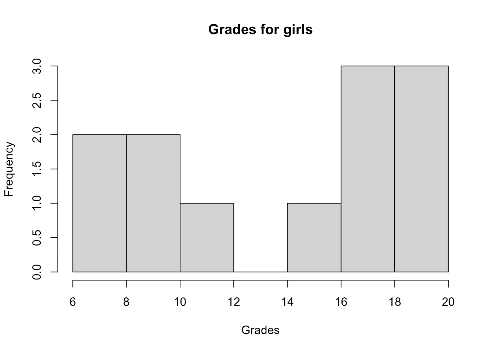
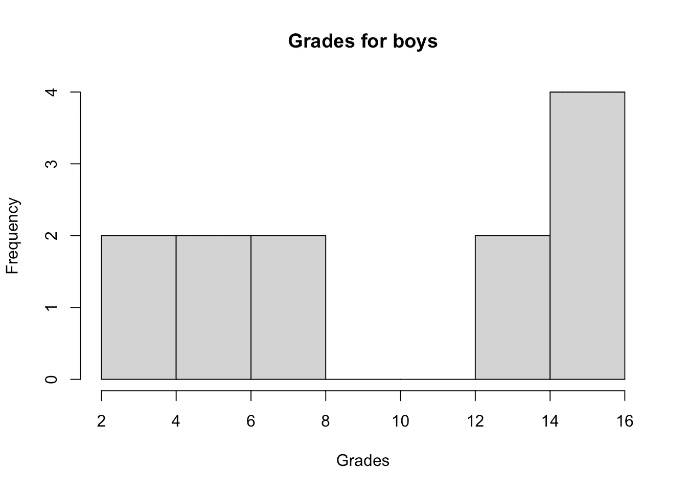
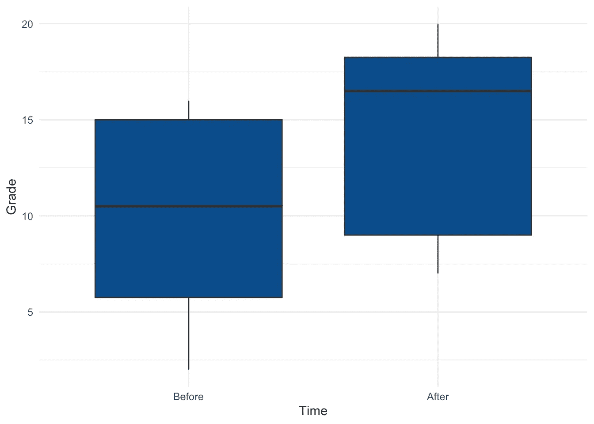

# R 中的 Wilcoxon 检验:如何在非正态假设下比较两组

> 原文：<https://towardsdatascience.com/wilcoxon-test-in-r-how-to-compare-2-groups-under-the-non-normality-assumption-6fb7f9e92400?source=collection_archive---------44----------------------->

## 了解如何在 R 中执行学生 t 检验的非参数版本


安妮·斯普拉特的照片

# 介绍

在之前的一篇文章中，我们展示了[如何使用学生的 t 检验](https://statsandr.com/blog/student-s-t-test-in-r-and-by-hand-how-to-compare-two-groups-under-different-scenarios/)在不同场景下比较两组。学生的 t 检验要求当存在小样本时，分布遵循[正态分布](https://statsandr.com/blog/do-my-data-follow-a-normal-distribution-a-note-on-the-most-widely-used-distribution-and-how-to-test-for-normality-in-r/)。 [1](https://statsandr.com/blog/wilcoxon-test-in-r-how-to-compare-2-groups-under-the-non-normality-assumption/#fn1) 在本文中，我们将使用 **Wilcoxon 检验**展示如何**在违反正态假设**的情况下比较两组。

Wilcoxon 检验是一种**非参数检验**，这意味着它不依赖于属于任何特定概率分布参数族的数据。非参数测试和参数测试有着相同的目标。然而，它们比参数测试有一个优势:它们**不需要假设分布的正态性**。例如，学生的 t 检验仅适用于数据为高斯分布或样本量足够大的情况(通常 n≥30)。在其他情况下，应该使用非参数。

有人可能会问，为什么我们不总是使用非参数检验，这样我们就不用担心正态性检验了。原因是当正态假设成立时，非参数检验通常不如相应的参数检验有效。因此，在其他条件相同的情况下，如果数据遵循正态分布，那么在非参数测试中，当[零假设](https://statsandr.com/blog/hypothesis-test-by-hand/#step-1-stating-the-null-and-alternative-hypothesis)为假时，您不太可能拒绝该假设。因此，当假设得到满足时，最好使用统计检验的参数版本。

在本文的剩余部分，我们将给出 Wilcoxon 测试的两个场景，以及如何通过两个例子在 R 中执行它们。

# 两种不同的场景

至于学生的 t 检验，Wilcoxon 检验用于比较两组，看它们彼此之间是否有显著差异。

要比较的两个组是:

1.  独立，或
2.  成对的(即从属的)

实际上有两种版本的 Wilcoxon 测试:

1.  当样本独立时，执行**曼-威-威检验**(也称为威-威秩和检验)(因此该检验是非参数的，相当于学生对独立样本的 t 检验)。
2.  当样本成对/相关时，执行 **Wilcoxon 带符号秩**检验(有时也称为成对样本的 Wilcoxon 检验)(因此该检验是非参数的，相当于学生对成对样本的 t 检验)。

幸运的是，这两个测试可以用相同的函数在 R 中完成:`wilcox.test()`。它们将在以下章节中介绍。

# 独立样本

对于独立样本的 Wilcoxon 检验，假设我们想要检验统计考试中男女学生的成绩是否不同。

我们收集了 24 名学生(12 名女生和 12 名男生)的成绩:

```
dat <- data.frame(
  Sex = as.factor(c(rep("Girl", 12), rep("Boy", 12))),
  Grade = c(
    19, 18, 9, 17, 8, 7, 16, 19, 20, 9, 11, 18,
    16, 5, 15, 2, 14, 15, 4, 7, 15, 6, 7, 14
  )
)dat##     Sex Grade
## 1  Girl    19
## 2  Girl    18
## 3  Girl     9
## 4  Girl    17
## 5  Girl     8
## 6  Girl     7
## 7  Girl    16
## 8  Girl    19
## 9  Girl    20
## 10 Girl     9
## 11 Girl    11
## 12 Girl    18
## 13  Boy    16
## 14  Boy     5
## 15  Boy    15
## 16  Boy     2
## 17  Boy    14
## 18  Boy    15
## 19  Boy     4
## 20  Boy     7
## 21  Boy    15
## 22  Boy     6
## 23  Boy     7
## 24  Boy    14
```

以下是按性别划分的成绩分布(使用`[{ggplot2}](https://statsandr.com/blog/graphics-in-r-with-ggplot2/)`):

```
library(ggplot2)ggplot(dat) +
  aes(x = Sex, y = Grade) +
  geom_boxplot(fill = "#0c4c8a") +
  theme_minimal()
```


我们首先通过直方图和夏皮罗-维尔克检验来检查这两个样本是否遵循正态分布:

```
hist(subset(dat, Sex == "Girl")$Grade,
  main = "Grades for girls",
  xlab = "Grades"
)
```



```
hist(subset(dat, Sex == "Boy")$Grade,
  main = "Grades for boys",
  xlab = "Grades"
)
```



```
shapiro.test(subset(dat, Sex == "Girl")$Grade)## 
##  Shapiro-Wilk normality test
## 
## data:  subset(dat, Sex == "Girl")$Grade
## W = 0.84548, p-value = 0.0323shapiro.test(subset(dat, Sex == "Boy")$Grade)## 
##  Shapiro-Wilk normality test
## 
## data:  subset(dat, Sex == "Boy")$Grade
## W = 0.84313, p-value = 0.03023
```

直方图显示两种分布似乎都不符合正态分布，夏皮罗-维尔克检验的 *p* 值证实了这一点(因为我们在 5%的显著性水平上拒绝了两种分布的正态性的零假设)。

我们刚刚表明两组都违反了正态假设，所以现在是时候看看如何在 R. [2](https://www.statsandr.com/blog/wilcoxon-test-in-r-how-to-compare-2-groups-under-the-non-normality-assumption/#fn2) 中执行 Wilcoxon 检验了。记住，Wilcoxon 检验的无效假设和替代假设如下:

*   H0:两组是相似的
*   H1:两组是不同的

```
test <- wilcox.test(dat$Grade ~ dat$Sex)
test## 
##  Wilcoxon rank sum test with continuity correction
## 
## data:  dat$Grade by dat$Sex
## W = 31.5, p-value = 0.02056
## alternative hypothesis: true location shift is not equal to 0
```

我们获得检验统计量、*p*-值和被检验假设的提示。 [3](https://www.statsandr.com/blog/wilcoxon-test-in-r-how-to-compare-2-groups-under-the-non-normality-assumption/#fn3)

*p*-值为 0.021。因此，在 5%的显著性水平上，我们拒绝零假设，我们得出结论，女生和男生的成绩有显著差异。

从上面按性别显示成绩的箱线图可以看出，女生似乎比男生表现得更好。这可以通过在`wilcox.test()`函数中添加`alternative = "less"`参数来正式测试: [4](https://www.statsandr.com/blog/wilcoxon-test-in-r-how-to-compare-2-groups-under-the-non-normality-assumption/#fn4)

```
test <- wilcox.test(dat$Grade ~ dat$Sex,
  alternative = "less"
)
test## 
##  Wilcoxon rank sum test with continuity correction
## 
## data:  dat$Grade by dat$Sex
## W = 31.5, p-value = 0.01028
## alternative hypothesis: true location shift is less than 0
```

*p*-值为 0.01。因此，在 5%的显著性水平上，我们拒绝零假设，我们得出结论，男孩的表现明显差于女孩(这相当于得出结论，女孩的表现明显好于男孩)。

# 成对样品

对于第二个场景，假设我们在学期开始时对一个 12 人的班级进行了一次数学测试，并在学期结束时对完全相同的学生进行了一次类似的测试。我们有以下数据:

```
dat <- data.frame(
  Beginning = c(16, 5, 15, 2, 14, 15, 4, 7, 15, 6, 7, 14),
  End = c(19, 18, 9, 17, 8, 7, 16, 19, 20, 9, 11, 18)
)dat##    Beginning End
## 1         16  19
## 2          5  18
## 3         15   9
## 4          2  17
## 5         14   8
## 6         15   7
## 7          4  16
## 8          7  19
## 9         15  20
## 10         6   9
## 11         7  11
## 12        14  18
```

我们转换数据集，使其具有[整齐的格式](https://www.statsandr.com/blog/how-to-import-an-excel-file-in-rstudio/#introduction):

```
dat2 <- data.frame(
  Time = c(rep("Before", 12), rep("After", 12)),
  Grade = c(dat$Beginning, dat$End)
)
dat2##      Time Grade
## 1  Before    16
## 2  Before     5
## 3  Before    15
## 4  Before     2
## 5  Before    14
## 6  Before    15
## 7  Before     4
## 8  Before     7
## 9  Before    15
## 10 Before     6
## 11 Before     7
## 12 Before    14
## 13  After    19
## 14  After    18
## 15  After     9
## 16  After    17
## 17  After     8
## 18  After     7
## 19  After    16
## 20  After    19
## 21  After    20
## 22  After     9
## 23  After    11
## 24  After    18
```

学期开始和结束时的成绩分布:

```
# Reordering dat2$Time
dat2$Time <- factor(dat2$Time,
  levels = c("Before", "After")
)ggplot(dat2) +
  aes(x = Time, y = Grade) +
  geom_boxplot(fill = "#0c4c8a") +
  theme_minimal()
```



(参见`[{esquisse}](https://www.statsandr.com/blog/rstudio-addins-or-how-to-make-your-coding-life-easier/)` [和](https://www.statsandr.com/blog/rstudio-addins-or-how-to-make-your-coding-life-easier/) `[{questionr}](https://www.statsandr.com/blog/rstudio-addins-or-how-to-make-your-coding-life-easier/)` [附加模块](https://www.statsandr.com/blog/rstudio-addins-or-how-to-make-your-coding-life-easier/)帮助您重新排列因子变量的级别，并使用`[{ggplot2}](https://www.statsandr.com/blog/graphics-in-r-with-ggplot2/)` [包](https://www.statsandr.com/blog/graphics-in-r-with-ggplot2/)轻松绘制图表。)

在这个例子中，很明显两个样本不是独立的，因为同样的 12 名学生在学期前后参加了考试。假设正态假设被违反，我们因此对**成对样本**使用 Wilcoxon 检验。

该测试的 R 代码与独立样本的代码相似，除了我们将`paired = TRUE`参数添加到`wilcox.test()`函数中，以考虑 2 个样本之间的相关性:

```
test <- wilcox.test(dat2$Grade ~ dat2$Time,
  paired = TRUE
)
test## 
##  Wilcoxon signed rank test with continuity correction
## 
## data:  dat2$Grade by dat2$Time
## V = 21, p-value = 0.1692
## alternative hypothesis: true location shift is not equal to 0
```

我们获得了检验统计量、 *p* 值和被检验假设的提示。

*p*-值为 0.169。因此，在 5%的显著性水平上，我们不拒绝学期前后成绩相近的零假设。

# 等方差假设

正如文章开头所写的，Wilcoxon 检验不需要正态假设。

关于等方差假设，这个假设可能需要，也可能不需要，这取决于你的目标。如果你只想比较两组，你不必测试方差的相等性，因为两个分布不必有相同的形状。然而，如果您的目标是**比较两组的中位数**，那么您将需要确保两个分布具有相同的形状(因此，具有相同的方差)。 [5](https://statsandr.com/blog/wilcoxon-test-in-r-how-to-compare-2-groups-under-the-non-normality-assumption/#fn5)

所以你的方差相等测试的结果将改变你的解释:两组“分布”的差异或两组“中位数”的差异。在这篇文章中，我不想比较中位数，我只想通过确定两组的分布是否有差异来比较两组。这就是我不测试方差相等的原因。

请注意，当执行 Kruskal-Wallis 检验以比较三组或更多组(即 [ANOVA](https://statsandr.com/blog/anova-in-r/) 的非参数版本)时，这是等效的:如果您只想检验各组之间是否存在差异，则不需要同质异方差，而如果您想要比较中位数，则必须满足此假设。

感谢阅读。我希望这篇文章能帮助你使用 Wilcoxon 检验比较 R 不服从正态分布的两组。如果您需要执行 Wilcoxon 检验的参数版本，请参见[学生 t 检验](https://statsandr.com/blog/student-s-t-test-in-r-and-by-hand-how-to-compare-two-groups-under-different-scenarios/)，如果您需要比较 3 组或更多组，请参见 [ANOVA](https://statsandr.com/blog/anova-in-r/) 。

和往常一样，如果您有与本文主题相关的问题或建议，请将其添加为评论，以便其他读者可以从讨论中受益。

1.  记住，正态性假设可以通过 3 种互补的方法来检验:(1)直方图，(2)QQ 图和(3)正态性检验(最常用的是夏皮罗-维尔克检验)。如果需要刷新，请参见[如何确定分布是否遵循正态分布](https://www.statsandr.com/blog/do-my-data-follow-a-normal-distribution-a-note-on-the-most-widely-used-distribution-and-how-to-test-for-normality-in-r/)。 [↩︎](https://www.statsandr.com/blog/wilcoxon-test-in-r-how-to-compare-2-groups-under-the-non-normality-assumption/#fnref1)
2.  注意，为了使用学生的 t 检验(Wilcoxon 检验的参数版本)，要求**两个样本都遵循正态分布**。因此，即使一个样本服从正态分布(另一个不服从正态分布)，也建议使用非参数检验。 [↩︎](https://www.statsandr.com/blog/wilcoxon-test-in-r-how-to-compare-2-groups-under-the-non-normality-assumption/#fnref2)
3.  请注意，相等元素(平局)的存在阻止了精确的 *p* 值计算。这可以通过使用`{coin}`包中的`wilcox_test()`函数:`wilcox_test(dat$Grade ~ dat$Sex, distribution = exact())`或`wilcox_test(dat$Grade ~ dat$Sex)`计算精确的或渐近的 Wilcoxon-Mann-Whitney 检验来解决。在我们的情况下，结论保持不变。 [↩︎](https://www.statsandr.com/blog/wilcoxon-test-in-r-how-to-compare-2-groups-under-the-non-normality-assumption/#fnref3)
4.  我们加上`alternative = "less"`(而不是`alternative = "greater"`)是因为我们想测试男生的分数比女生的分数少**。使用`"less"`或`"greater"`可以从数据集中的参考电平中扣除。 [↩︎](https://www.statsandr.com/blog/wilcoxon-test-in-r-how-to-compare-2-groups-under-the-non-normality-assumption/#fnref4)**
5.  **关于 Wilcoxon 检验中的等方差假设，更详细的讨论见这三篇文章: [1](https://statistics.laerd.com/statistical-guides/mann-whitney-u-test-assumptions.php) ， [2](https://influentialpoints.com/Training/Wilcoxon-Mann-Whitney_U_test_use_and_misuse.htm) & [3](https://influentialpoints.com/Training/Wilcoxon_matched_pairs_signed_rank_test_use_and_misuse.htm) 。 [↩︎](https://statsandr.com/blog/wilcoxon-test-in-r-how-to-compare-2-groups-under-the-non-normality-assumption/#fnref5)**

# **相关文章**

*   **[一次比例和拟合优度测试(R 和手动)](https://www.statsandr.com/blog/one-proportion-and-goodness-of-fit-test-in-r-and-by-hand/)**
*   **[如何在 R 中一次对多个变量进行 t 检验或方差分析，并以更好的方式传达结果](https://www.statsandr.com/blog/how-to-do-a-t-test-or-anova-for-many-variables-at-once-in-r-and-communicate-the-results-in-a-better-way/)**
*   **[如何手动执行单样本 t 检验，并对一个平均值进行 R:检验](https://www.statsandr.com/blog/how-to-perform-a-one-sample-t-test-by-hand-and-in-r-test-on-one-mean/)**
*   **[学生的 R 和手工 t 检验:如何在不同场景下比较两组](https://www.statsandr.com/blog/student-s-t-test-in-r-and-by-hand-how-to-compare-two-groups-under-different-scenarios/)**
*   **[R 中独立性的卡方检验](https://www.statsandr.com/blog/chi-square-test-of-independence-in-r/)**

***原载于 2020 年 6 月 7 日 https://statsandr.com**T21*[。](https://statsandr.com/blog/wilcoxon-test-in-r-how-to-compare-2-groups-under-the-non-normality-assumption/)**