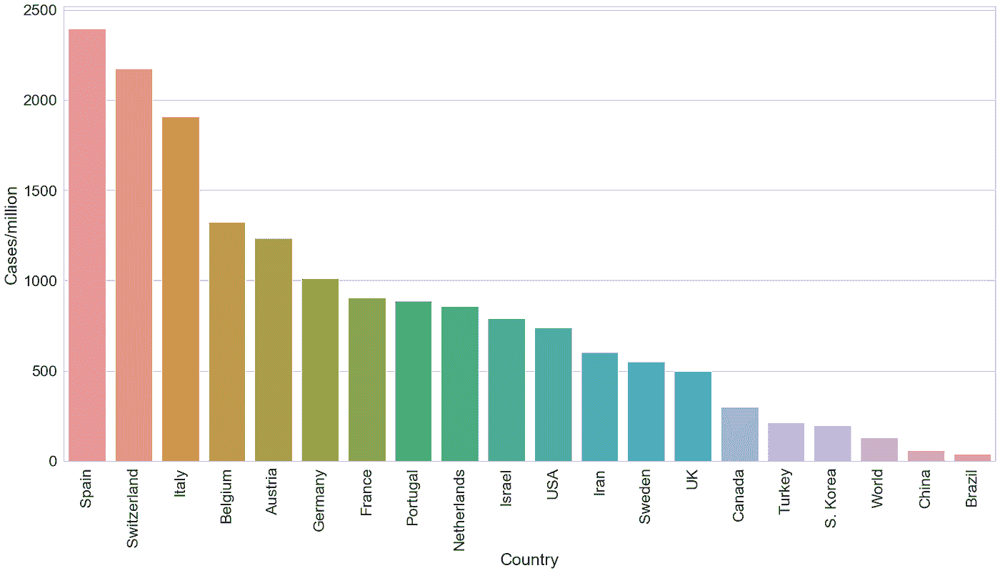
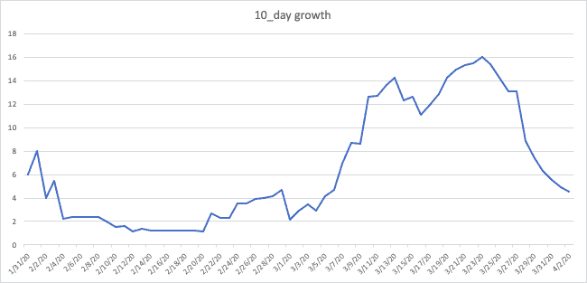
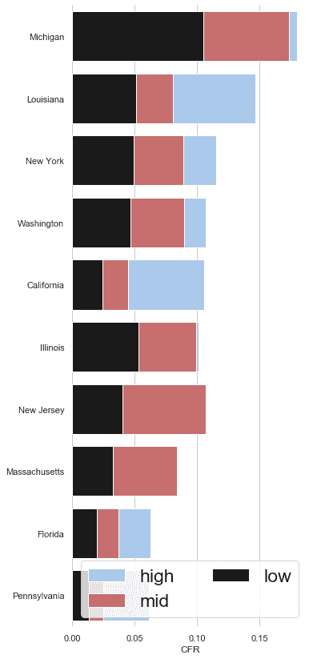
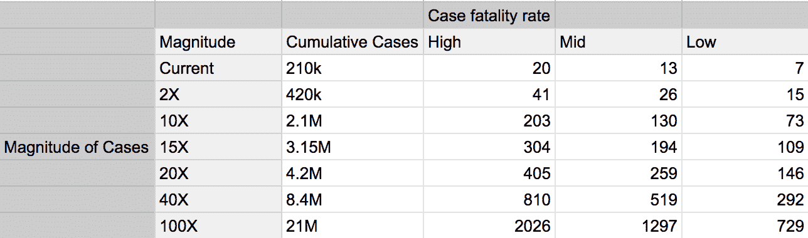

# 20 万美国人会死于新冠肺炎吗？

> 原文：<https://towardsdatascience.com/will-200-000-americans-die-from-covid-19-742290262668?source=collection_archive---------38----------------------->

## 数字显示这很有可能。

[疾控中心](https://unsplash.com/@cdc?utm_source=medium&utm_medium=referral)在 [Unsplash](https://unsplash.com?utm_source=medium&utm_medium=referral) 拍摄的照片

# 语境

几天前，白宫冠状病毒特别工作组事实上的发言人安东尼·福奇引起了全国的关注，当时他[说](https://www.npr.org/sections/coronavirus-live-updates/2020/03/29/823517467/fauci-estimates-that-100-000-to-200-000-americans-could-die-from-the-coronavirus)“10 万到 20 万”美国人可能死于新冠肺炎。来自美国最重要的传染病专家的如此可怕的预测让许多人怀疑:这真的可能吗？这是最好还是最坏的情况？在本文中，我将解决这些问题，并讨论这种情况发生的条件。

# 方法

要获得死亡人数，我们需要两样东西:病死率的范围和病例数。

## 估计病死率

我们使用一种基于队列的方法计算了美国至少有 25 人死亡的每个州的 CFR，我在这里详细描述了这种方法。我们将数学模型与队列分析方法相结合，以确定病死率(CFR)的范围。我们使用一个逻辑函数来描述依赖于三个参数的新冠肺炎病死率的指数增长和随后的平坦化:最终病死率(l)、病死率增长率(k)和发病至死亡间隔(t₀).使用具有特定参数(l、k 和 t₀)的逻辑斯谛模型，我们计算每个队列每天的死亡人数。我们建立了一个目标函数，使累积死亡的实际值和预测值之间的均方根误差最小化，并通过改变三个参数进行了多次模拟。使用所有这些值，我们可以找出与实际死亡人数相比，哪组参数返回的误差最小。然后，我们找到在 R 的前 1%内的参数范围。通过分析高斯核密度估计(参见*图 3，4*此处，我确定了最可能的 CFR 估计和最高/最低的可能 CFR。

## 预测病例数

我们没有使用模型来预测数量，而是通过改变人群中的渗透深度来探索美国的多个病例总数。

图 1:按国家分列的人均病例。选择的国家是截至 1 月 4 日确诊病例最多的 19 个国家

*图 1* 显示了许多国家每百万居民的病例数。对于美国近期可能遭遇的案例数量而言，这是一个合理的基准。它表明，随着疫情的增长，美国每百万人中可能有多达 2500 例病例(约 82.5 万例)，这大约是目前数量的三倍。请注意，这些国家中的大多数疫情仍在继续增长，最终的每百万病例数将显著增加。

图 2:病例的 10 天增长

此外，我们可以分析美国目前的轨迹。*图 2* 描绘了病例 10 天增长的倍增因素。也就是 10 天内病例数翻了多少倍。在过去的几周里，它已经减少了，这是一个好的迹象。然而，由于指数增长的性质，即使低因素也是高度危险的；我们目前处于 4 左右。按照这种速度，**到 3 月 1 日，美国很可能会出现 200 万个病例。**

为了进行这一分析，我研究了多个范围—从当前(截至 4 月 1 日)的 210，000 到 2100，000 例。

# 结果

我首先分析计算了至少有 25 人死亡的不同州的低、中、高范围。

图 3:病例最多的 10 个州的病死率。

*图 3* 揭示了病死率最高的 10 个州。这表明密歇根州、路易斯安那州和纽约州的病死率最高。大多数州的“高”CFR 低于 20%。在低/中档，各州的 CFR 主要低于 10%。

我用 CFR 乘以一些场景下的死亡人数来计算死亡人数。表 1 显示了在低病死率、最可能的病死率和高病死率下，如果病例总数比 4 月 1 日的病例数多 2-100 倍，可能导致的死亡人数。

参考*表 1，*让我们看看美国可能出现 10 万到 20 万人死亡的情况。要做到这一点，我们至少需要大约 200 万个案例，这大约是我们目前拥有数量的 10 倍。但是我们能到达那里吗？是的，按照目前的轨迹，我们将在月底到达那里。

表 1:作为病例数函数的预测死亡数。注意死亡人数以千计。

如果我们达到 200 万例，表 1 告诉我们，我们将看到至少 73，000 例死亡，在较高的一端多达 203，000 例；福奇的估计很可能会实现。

# 其他影响

*   美国每百万人大约有 2900 张病床，其中许多将被非新冠肺炎患者占据。如果我们看到百万分之 2500 以上的病例(这是非常可能的)，医疗保健系统将承受巨大的压力。事实上，美国缺少医务工作者的个人防护装备。
*   实施封锁/就地安置令、社会距离指导方针、关闭不必要的企业，对于阻止疫情蔓延和防止最糟糕的情况发生至关重要。

# **注意事项**

*   进一步的封锁可能会大幅减缓增长。虽然我们每 10 天增长 4 倍，但随着越来越多的人遵守社交距离，这个数字肯定会继续下降。
*   [这是 CFR，不是 IFR 或死亡率](/why-testing-completely-skews-coronavirus-case-fatality-rates-c7cbf53ac4c8)；它非常依赖于测试。我假设每个州的人均测试费用和当前的费用大致相同。如果检测率发生变化，病死率将受到影响。这还只考虑了确认感染的人。还有很多其他人没有症状，没有检测过，等等。因此，我们不能对整个人口的死亡率下任何结论。
*   如果医疗基础设施变得不堪重负，CFR 很可能会与我们最糟糕的估计相似。发病到死亡的时间间隔将决定死亡发生的确切时间，以及对医院的影响。“曲线变平”肯定会导致死亡人数减少。

# 结论

如果美国达到 300 万例，死亡人数可能达到 20 万。大多数州的病死率约为 10%，高于中国湖北省。接下来的几天将会告诉我们这种情况会变得有多糟糕。当事情发生实质性变化时，我将更新这一分析。

***编者按:*** [*走向数据科学*](http://towardsdatascience.com/) *是一份以数据科学和机器学习研究为主的中型刊物。我们不是健康专家或流行病学家，本文的观点不应被解释为专业建议。想了解更多关于疫情冠状病毒的信息，可以点击* [*这里*](https://www.who.int/emergencies/diseases/novel-coronavirus-2019/situation-reports) *。*