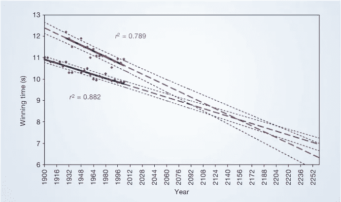
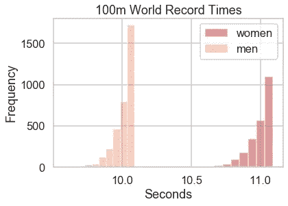
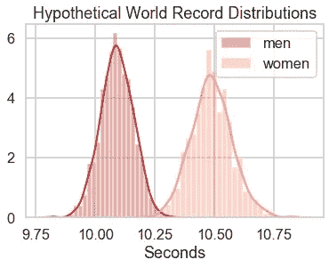

# 女人会是最快的人类吗？

> 原文：<https://towardsdatascience.com/will-a-woman-be-the-fastest-human-502be89e0060?source=collection_archive---------11----------------------->

## 一项研究表明答案是肯定的

由 [sporlab](https://unsplash.com/@sporlab?utm_source=medium&utm_medium=referral) 在 [Unsplash](https://unsplash.com?utm_source=medium&utm_medium=referral) 上拍摄的照片

*注:数据来自 alltime-athletics.com*

我喜欢径赛——男子*和女子*。我认为 100 米短跑是对人类运动能力最纯粹的展示。顺便说一句，在搜索短跑记录的历史数据时，我看到了 Tala 研究小组的一篇论文，其中他们研究了男子和女子的 100 米获胜时间。他们推测，到 2156 年奥运会，一名女子可能会在 100 米短跑中超过一名男子。尽管他们的方法存在潜在的问题，但这是一个不可思议的想法，如果这真的发生，我希望我能活着见证！他们甚至说，“这是 2156 年奥运会项目的获胜者，他的名字将永远铭刻在体育史上，因为这可能是第一次在比男子项目更快的时间内赢得比赛。”虽然引人注目，但他们作为支持显示的线性回归缺乏说服力。

图 1:男子(蓝色)和女子(红色)赢得 100 米冲刺时间。来源 TALA 研究小组

这些预测正好在 2156 年奥运会之前交叉，届时女子 100 米短跑的 8.079 秒将比男子的 8.098 秒快。*由于多种原因，两性都不可能达到这样的速度，但下面会讨论一些。* **在谈到我认为他们的分析中遗漏了什么之后，我将转向我认为更有趣的假设——什么(似是而非的)假设会导致女子的未来世界纪录比男子的历史世界纪录快？**

# 这项研究没有考虑到的是

女子田径运动取得了长足的进步。直到 1972 年，第九章才由国会颁布并签署成为法律。"第九章禁止在接受任何类型的联邦财政资助的任何教育项目或活动中的性别歧视."即使在那之后，进步也不是一帆风顺的——NCAA 在 1976 年挑战了宪法第九条的合法性。我的观点是，女性在参与体育运动和最大限度地发挥她们的才能方面一直面临着障碍。幸运的是，像大多数形式的歧视一样，随着社会的进步，壁垒会随着时间的推移而降低。如果你看看图 1 中的女性散点图，你会看到两个明显的趋势——1970 年前和 1970 年后。我的感觉是，1970 年以前更陡的斜率与获得培训的进步有关。*随着女性被允许和鼓励最大限度地发挥她们的才能，获胜的次数自然会增加。*然而，1970 年后，我们看到了一个变平的斜坡。如果你去掉弗罗伦斯·格里菲斯·乔依娜(弗洛霍)令人难以置信的时间，自从她在 80 年代公布以来，还没有女性短跑运动员挑战过这个时间，回归线的斜率几乎是平的。*更直接地说，1970 年后，男性和女性回归线之间的差距实际上扩大了，而不是缩小了(特别是在对弗洛霍进行调整后)。*

男人和女人的时间差距比看起来要大。看着男子和女子的赛道时间，人们很容易认为男子最快的时间(乌塞恩·博尔特在 2009 年跑出的 9.58 秒)只比女子最快的时间(弗罗伦斯·格里菲斯·乔依娜在 1988 年跑出的 10.49 秒)快 8.7%，但这将是一个错误。这有几个原因:

*   **速度很大程度上是** [**两个变量**](http://www.thepostgame.com/features/201107/usain-bolt-case-study-science-sprinting) **:** 跑者在地面上施加的力和跑者施加该力的时间的乘积。“在一次全速冲刺中，普通人施加的力大约是 500 到 600 磅。一个奥运短跑运动员可以施加 1000 多磅的力。”与直觉相反，跑步者之间没有太多的失误差异。正如南卫理公会大学(Southern Methodist University)的科学教授彼得·韦安德(Peter Weyand)所说，“普通人的脚着地时间约为 0.12 秒，而奥运会短跑运动员的脚着地时间仅为 0.08 秒——相差 33%……不管你跑得快还是慢，腿在空中的时间为 0.12 秒。”*简单来说，短跑速度是力量的函数，男性短跑运动员往往更有优势。*
*   每十分之一秒都来之不易。尤塞恩·博尔特以 0.14 秒(快了 1.4%)的优势打破了之前的男子纪录，这是一个巨大的壮举。"这是自电子计分技术问世以来，任何其他短跑运动员打破的世界纪录的两倍。"*换个角度来看，8.7%(一名女子需要提高弗洛霍的女子纪录以赶上男子世界纪录的百分比)比有记录的径赛历史上最伟大的壮举的时间差大 6 倍。*我几乎会用“数量级”来描述这种时间差，因为所需的机制和多剃十分之一秒之间的关系不是线性的。
*   **另一个女人能打破弗罗伦斯·格里菲斯·乔依娜的记录的可能性很小。**同样，也不太可能有人能和乌塞恩·博尔特的记录相提并论。这篇文章的作者说，“没有迹象表明男女运动员在 100 米短跑记录中已经达到了一个平台期。”然而，跑得最快的女性没能打破弗洛霍 30 多年前创下的纪录。事实上，前三名由弗洛霍保持，卡尔梅利塔·杰特尔排名第四(比女子世界纪录落后 0.15 秒)。如果弗洛乔今天公布了她的纪录，超过了第二快的女子短跑运动员，她将打破女子纪录，比尤塞恩·博尔特打破男子纪录的差距更大(这就是她有多不寻常)。此外，模拟 100，000 个样本记录的随机正态分布，平均值等于平均女性记录的次数，标准差等于迄今为止记录的变化，仅产生三个小于或等于 10.65 秒的记录，没有一个低于 10.6 秒(与 FloJo 相差甚远)。男子方面，只有一项纪录打破了 9.72 秒(与乌塞恩相差甚远)。

图 2:从 alltime-athletics.com 刮来的日期

在上面的练习中，我模拟了一个正态分布，这可能是慷慨的。打破世界纪录的事件是罕见的，并且遵循泊松过程，事件之间的时间由指数函数表示。记录的权重越大，因此记录落在均值尾部的可能性就越小，正如正态分布所暗示的那样。*即使使用正态分布(从最快的记录时间中过度采样),当前的世界记录男子和女子时间也是如此异常，以至于他们无法通过模拟 100，000 个记录时间来实现。*

# 什么是可能的

图 3

鉴于男女世界记录时间不太可能趋同，那么如何才能让未来最快的女性打破男子的 T2 历史记录呢？这只是一个思维练习，并不科学，但如果女性能够达到超越弗洛霍记录的速度，并最终使她的记录时间成为女性记录中的平均值，如果女性的记录时间保持其历史方差，未来的女性记录时间(尽管概率很低)可能会突破模拟正态分布的右尾，其中最高男性记录时间是平均值。男子分布的平均值(男子最高记录时间)仍然很遥远，但这将是有趣的。此外，新的女子世界纪录保持者可能比 T4 和一些男子奥运短跑运动员跑得更快，这将改变人们的话题。

## 参考

[1] A. Tatem，C. Guerra，P. Atkinson，S. Hay，[2156 年奥运会上的重大冲刺？](https://www.researchgate.net/publication/8258751_Momentous_sprint_at_the_2156_Olympics) (2004)，自然。431.525.10.1038/431525a

[2]工作人员，[史题九(2019)](https://www.womenssportsfoundation.org/advocacy/history-of-title-ix/) ，女子体育基金会。

[3] J. Hart，[尤塞恩·博尔特:短跑科学案例研究](http://www.thepostgame.com/features/201107/usain-bolt-case-study-science-sprinting) (2011)，ThePostGame。