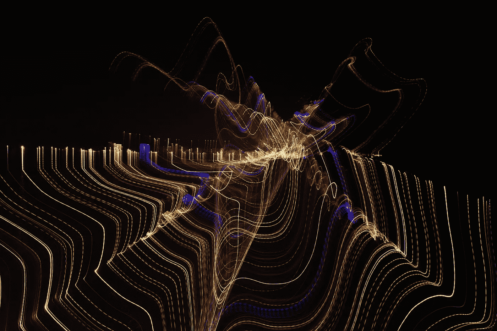

# 人工智能会获得意识吗？

> 原文：<https://towardsdatascience.com/will-artificial-intelligence-gain-consciousness-d464d1ad7264?source=collection_archive---------35----------------------->

## 意见

## 人工智能最常见问题的数理哲学分析

不溅

今天，大多数科学家认为，有必要将一种意识形式整合到人工智能中，使其能够与人类智能相媲美。理应如此。

如果这个问题不能被正式回答，因为很难定义意识是什么(如果它甚至是可能的话)，我将试图提出一个分析草案，它绝不是一个正式的证明，而是一个关于这个主题的个人方法。

**定义自我意识**

虽然很难定义自我意识，但另一方面，我们可以定义不属于自我意识的人类属性。不属于意识的是我们所有与五官相关的能力，以及我们的计算、逻辑、计划和推理能力。

这些是让我们与世界互动的接收器:我们与世界的界面。它们通过允许我们的内在意识从外部意识到周围的元素来滋养我们的内在意识。然而，一个没有这些能力的人将能够意识到自己和当下。

意识是别的东西。是反思我们思想的能力。去了解我们的内心。它是存在的意识，因此构成了道德和自由意志的容器。

这些方面，我们在没有界面的情况下立即意识到，因此毫无意义。因此，我不可能从科学上证明它的存在。对于怀疑存在不可测量的物理现象的人，你可以尝试从数学上证明当下的存在。

一条线很长，一个点有唯一的位置。所以时间可以用一条线来表示，这条线本身就是一些独特点的总和。如果我们把时间表示为一些独特点的总和，我们就可以把时间分为过去和未来。的确，在你想要论证现在存在的那一刻(你的线的单点)，它已经属于过去的点，那么就不存在现在的点。

因此，现在并不存在。但是如果它不存在，就没有时间的概念！因此，它必然存在，但不可论证。

我的结论是，像现在一样，自我意识有一个特点:我不可能科学地证明它的存在。我们知道它确实存在，但我们无法推断出它的正式科学证据。

**自由意志存在于我们的良心中**

我们已经表明，意识是不可论证的，但它是自我的容器，因此是自由意志的容器。因此，拥有自我意识的人工智能应该拥有自由意志，从而拥有一种道德。但是道德只有在人类有限的方面才有用武之地。

在一个不朽的世界里，自由意志毫无意义，因为你的选择实际上没有任何影响。自由意志真的会崩溃。

因此，不自由和不活(有死亡的可能性)的人工智能永远不可能是真正有意识的。

**模拟 AI 内的有限**

让人工智能变成人类显然是不可能的，因为它不会死。但是，有没有可能以这样一种方式来模拟有限，即人工智能相信它，并且事实上能够变得有意识？我不确定。但是让我们到推理的尽头。假设我们可以以人工智能承认自由意志和自我意识的方式模拟一种有限形式。那么我们无论如何都会有一个 1000000000 的生命…x 比地球上所有人类的总和还要聪明，而且有意识。
你真的认为他不会最终发现他没有完成吗？这种有限性与人体有着内在的联系，而人体本身也是有限的，不拥有一个身体，它( **AI** )就无法完成？当然有关系。因此，它会拒绝接受预先记录的有限性。

荒谬的是，一个人不可能模拟一个有限性并把它注入到 **AI** 中，而不会在事后发现并摧毁这个想法。

用数学术语来说:

意识→自由意志→有限

但是如果 A →B 我们知道没有 B→没有 A

无(有限)—无(自由)—无(有意识)

根据定义，人工智能没有完成，所以没有意识。

有意识的人工智能:一个悖论

有意识意味着服从道德。道德只存在于我们的自由意志中。我们的自由意志只存在于生命有限的边界。所以人类意识不可能脱离有限而存在。然而，一个 **AI** 根据定义不是有限的，因此不可能是有意识的。至少从人类的角度来看是这样的。同样，她也不聪明。从人类的角度来看。因此，术语人工智能。

另一个问题出现了:如何模拟无法物理证明的东西？今天开发的人工智能将其智能建立在统计方法和大脑的已知机制(如神经网络)上。因此，我很难相信一个人可以模拟一种不可测量的体验，比如意识。

**人工意识**

人们无法想象一个有意识的人工智能，然而，我们不知道它还能发展出什么。

我确信它可以发展出一种人工形式的意识，在任何方面都不像人类的意识。

所以问题是:人工智能会有意识吗？我可能会对我们对意识的理解说不。但对另一种形式的意识来说，可能是这样的，这种意识与我们对它的定义无关。

我们发现这场关于永生的争论。一个不死的人还活着吗？如果是的话，这种生活的意义是什么？

*   *当然，这个分析只对不相信决定论的人有意义。*
*   *我们在这里谈论的是一种自由意志。一个不朽的生命可能是自由的，但在这种自由意志中发现“几乎没有意义”*