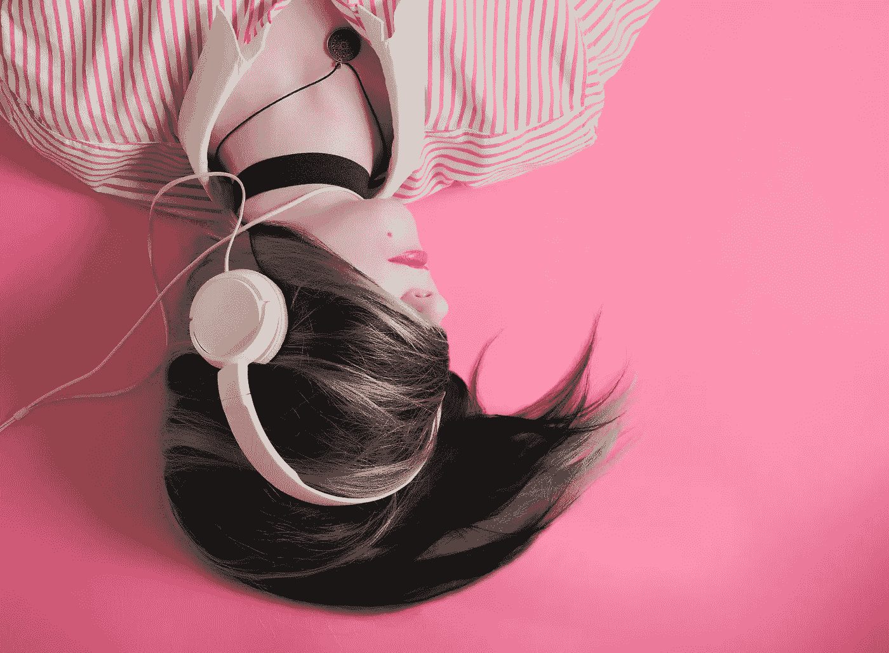
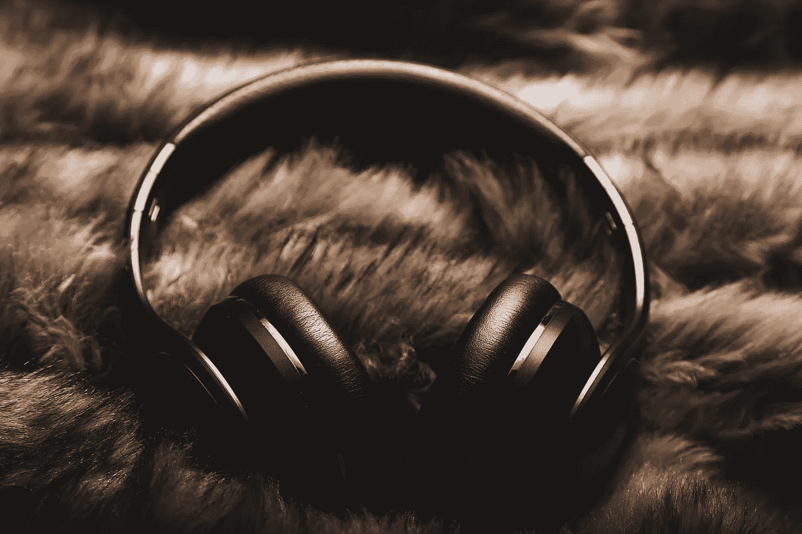
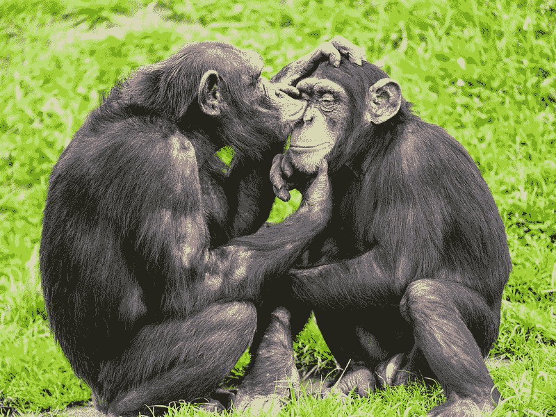
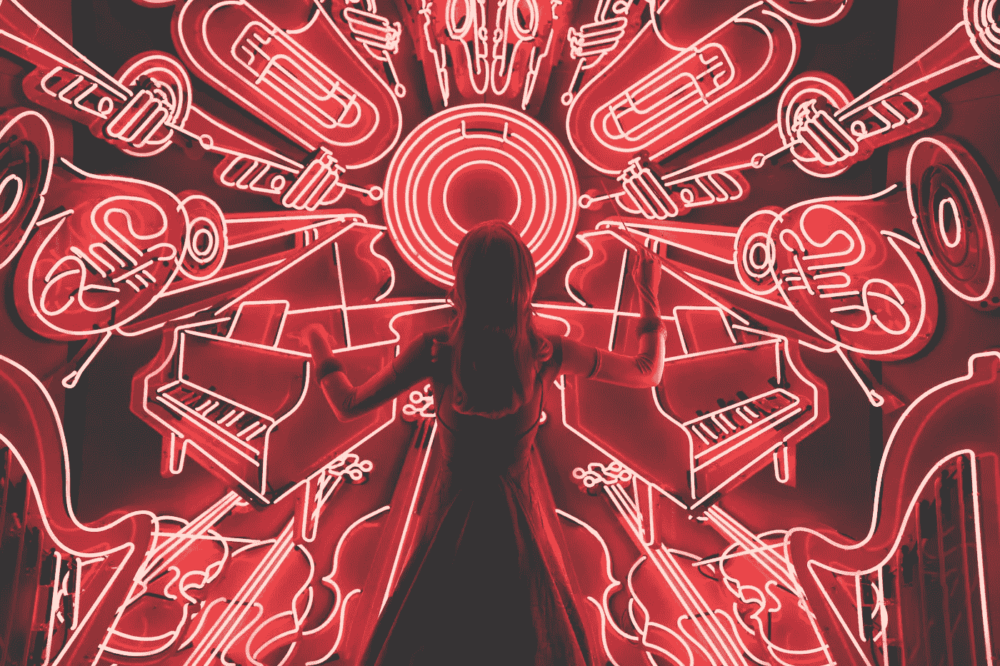

# ASMR 会在机器学习中幸存吗？

> 原文：<https://towardsdatascience.com/will-asmr-survive-machine-learning-490119a1c4d3?source=collection_archive---------70----------------------->

## 孕育了一种亲密艺术形式的快感可以让技术深入我们的皮肤

照片由[埃利斯·摩尔](https://unsplash.com/@alicemoore?utm_source=unsplash&utm_medium=referral&utm_content=creditCopyText)在 [Unsplash](https://unsplash.com/s/photos/music?utm_source=unsplash&utm_medium=referral&utm_content=creditCopyText) 拍摄

我错过了什么吗？我正在努力赶上 ASMR 艺术的发展水平，而且我在家工作也是一件好事。ASMR 世界中最大的 YouTubers 似乎已经融合成一个单一的缥缈的女神，所有的液体眼线，樱桃嘴唇和涂漆指甲。她似乎有意轻咬我的耳朵。

# 什么是 ASMR？

自主感觉经络反应——[ASMR](https://medium.com/@writerfox2/explaining-the-misunderstood-and-not-so-creepy-world-of-asmr-a476092d3127)——给一个古老的现象起了一个新名字。有些人会经历狂喜的刺痛，通常从头皮开始，由某些安静的声音引起，如新倒啤酒的嘶嘶声，梳子刮过头发，或指甲轻敲 Formica。互联网上的讨论让那些获得这种感觉的人找到了彼此，但是像“大脑按摩”和“大脑高潮”这样的术语没有切中要害。因此，ASMR，一个听起来很临床的名字，[是为互联网社区](https://asmruniversity.com/2016/05/17/jennifer-allen-interview-coined-asmr/)创造的。

> 研究表明，ASMR 是真实的，有生理学基础

ASMR 的视觉和听觉纹理。 [Malte Wingen](https://unsplash.com/@maltewingen?utm_source=unsplash&utm_medium=referral&utm_content=creditCopyText) 在 [Unsplash](https://unsplash.com/s/photos/headphones-fur?utm_source=unsplash&utm_medium=referral&utm_content=creditCopyText) 上拍照。

人们在听到安静、近在咫尺的声音时会感到兴奋，这应该不会让任何人感到惊讶。在我们最亲密的育儿、浪漫和友谊的时刻，人类使用安静的讲话、耳语和触摸来抚慰、安抚和平静。ASMR 甚至可能与一些音乐听众经历的令人兴奋的“皮肤高潮”分享感官和心理路径，但这仍有争议。

科学进步的车轮转得远远慢于在线视频和音频流的迅猛趋势。对 ASMR 进行科学研究的少数尝试表明，体验 ASMR [会降低心率](https://www.ncbi.nlm.nih.gov/pmc/articles/PMC6010208/)，[会暂时缓解抑郁和慢性疼痛](https://www.ncbi.nlm.nih.gov/pmc/articles/PMC4380153/)。不是每个人都能感受到 ASMR 的刺激。T4 对那些感到刺痛和不感到刺痛的人进行了比较，发现大脑区域之间的联系模式有些不同。虽然还处于早期阶段，但是研究表明 ASMR 是真实存在的，并且有生理学基础。

# 亲密，提炼

作为 21 世纪第一种新艺术形式的实践者，艺术家是抽象表现主义者的听觉等价物。他们挖掘新发现的 ASMR“触发器”母矿，并以更加巧妙的方式呈现出来。他们的影响最终可能会超越马克·罗斯科、海伦·佛兰肯瑟勒和杰森·布拉克。

最成功的 ASMRtists 将他们的作品发布在 YouTube、 [Twitch](https://www.twitch.tv/directory/game/ASMR) 和 [Spotify](https://open.spotify.com/playlist/37i9dQZF1DX7T277XorTyv?si=7ooukmaaR0SrrVSVBCC7CQ) 上。超过 860 万 YouTube 用户经常观看和收听 SAS-ASMR 吃各种有趣的食物。超过 4300 万的观众听过她咀嚼粘粘的蜂巢长达 12 分钟。自 2016 年以来，22 岁的泰勒·达林(又名[ASMR·达林](https://www.youtube.com/watch?v=JCgtuBxi1Zw))已经拥有超过 240 万名订户，并对着双耳麦克风低语、抓挠和敲击。

> 抽象主义者在听觉上等同于抽象表现主义者。

根据早期的科学研究之一，AMSR 的触发因素“通常是社会性的，几乎是亲密的，在本质上”。事实上，[亲密关系经常出现在对 ASMR 的描述中，为它唤起的感觉的力量提供了线索。这些声音定义了我们紧密的社交世界，以及人类用来联系我们最亲密的朋友和家人的互动。](https://www.wired.com/story/asmr-erotica/)

对话[是从梳理毛发的行为](https://journals.sagepub.com/doi/10.1037/1089-2680.8.2.100)进化而来的，很像类人猿的行为。我们的祖先在照顾彼此的皮肤和头发、喃喃细语、一起进餐时，形成了义务的联盟和网络。进化出说话和理解他人话语的能力只会增加我们亲密关系的内容。

两只黑猩猩互相梳理毛发。在 [Flickr](https://www.flickr.com/photos/tambako/15117673210) 上由美洲豹 Tambako 拍摄的照片。许可证:CC BY-ND 2.0

ASMR 世界的大部分超越了人与人之间的亲密关系，进入了一种更深、更色情的亲密关系。这让我想起了轻咬我耳朵的仙女。许多最受欢迎的广告人，如[弗里沃卢斯福克斯](https://www.youtube.com/channel/UCoNfsDH8sZe13u7rSxaEBkw)、[佩拉吉亚 ASMR](https://www.youtube.com/channel/UCNlMeUt5nOTQ-yfjXzRKVKA) 和 [ASMR 切里美眉](https://www.youtube.com/watch?v=ZSifhZafa48)，都融合了以“口型声音”蓬勃发展的风格，包括亲吻、轻咬和吮吸双耳麦克风。伴随的视觉效果包括特写的嘴唇、母鹿的眼睛和轻柔抚摸的手部动作。

ASMR 樱桃粉碎照顾你的耳朵。来自 [Youtube](https://www.youtube.com/embed/ZSifhZafa48) 的视频。

不可否认，这种次类型从它的情色潜力中汲取了一些力量，并被一种慵懒、从容的表达方式放大了。这种潜在的色情会导致不受欢迎的关注，而这种关注在互联网上看起来是如此可靠。 [Cherry Crush](https://www.youtube.com/watch?v=ZSifhZafa48) 在她的 YouTube 频道上强调，她的 ASMR“*不是为了性化目的的拜物教*”。然而，并不需要过于活跃的想象力就能明白为什么这样的免责声明可能会变得值得张贴。

ASMR 和 ASMR 的亲密关系，不仅仅是这种特殊形式的性爱。《短命裂痕》的黑暗实验触发器和[晚安月亮的](https://www.youtube.com/channel/UClMJgjg2z_IrRm6J9KrhcuQ)古怪的故事讲述背离了性别色彩浓厚的耳语亲密关系，这种亲密关系目前似乎主导着艺术形式。

短暂裂缝的 Clemmons 教授将触发刺痛，而他对待你就像一个植物人的混血儿。

# 听觉色情

性感的口型和轻咬耳朵广告的成功引起了色情电影制作者的注意。他们擅长利用几乎所有色情渠道赚钱，正在向 ASMR 投入他们的资源和最优秀的人才。他们重新利用露骨的视频，重新混合配乐，以传递 ASMR 的刺激和另一种刺激。安琪拉·薇蒂为这一类型拍摄了新的性爱镜头。在另一个视频中，一个赤裸的 Rockey Emerson 赤裸上身，吃着一包马卡龙。

尽管许多生锈的 ASMR 粉丝抗议，但普通的和 X 级的 ASMR 对许多听众来说几乎没有区别。配乐在色情电影中发挥了巨大的作用，从身体聚集在一起的声音到夸张的喘息声、叹息声和“*哦，我的上帝！”*表演者的表情。每天都有像 Brasileira [Maru Karv](https://twitter.com/oieusoumaru?lang=en) 这样的新艺术家出现来填补这一空白，他们主演露骨的个人视频，这些视频将 ASMR 触发器置于性行为本身之上。

# 机器学习的沃土

当艺术家们开始感受到大型色情作品的威胁时，对他们艺术形式的更大挑战可能来自另一个方向。人工智能，尤其是机器学习，似乎非常适合探索和创造 ASMR。这样一来，它可能会让叮叮一代在很大程度上成为计算机驱动的追求。

> 艺术家和业余爱好者很可能只开采了 ASMR 触发器的表层沉积物

近年来，在人工智能的帮助下制作的音乐从未来的预测跃升为可听见的现实。像谷歌的 [Magenta](https://magenta.tensorflow.org/) 和 OpenAI 的 [MuseNet](https://openai.com/blog/musenet/) 这样的项目引领着公众对基于人工智能的音乐创作的冲锋。目前，ML 算法从人类作曲家和音乐家已经创作的大量音乐中学习。他们发现音乐中的模式，并学会预测可能跟随他人的和弦和音符，有时会偶然发现从未听过的旋律。

艺术家和业余爱好者可能只开采了 ASMR 触发器的表层沉积物。他们的发现被记录并发布在互联网上，适合机器学习。ASMR 音乐的结构比音乐简单，听众的反应也很容易测量。在“刺痛科学”网站上，用户可以在这种感觉持续的时候按住一个按钮来记录他们对 ASMR 视频的回应。通过现有的智能手表跟踪心率或皮肤电导应该不难，可以产生大量数据。任何这样的措施都为机器学习提供了极好的数据。

人工智能生成的 ASMR 触发器没有理由继续局限于自然声音的世界。根据现有声音的数据，算法应该能够预测——并尝试——更有效地引出 ASMR 的新声音。根据这些声音以及人们对这些声音的反应，机器学习 ASMR 可以一步一步地走进人类耳朵从未听到过的声音的*未知领域*，极大地扩展了 ASMR 的曲目。

这可能会导致[超正常刺激](https://www.sparringmind.com/supernormal-stimuli/)，全新的声音，唤起比现在的 ASMR 更强更可靠的反应。被赋予了侵入我们的亲密路径的能力，获得 ASMR 机器学习的平台几乎肯定会比我们今天现有的技术更有效地控制人类的注意力范围，通过满足我们的兴奋来保持我们的倾听和参与。

ASMR 可能比音乐更适合数字颠覆。照片由[斯潘塞·因布罗克](https://unsplash.com/@spencerimbrockphoto?utm_source=unsplash&utm_medium=referral&utm_content=creditCopyText)在 [Unsplash](https://unsplash.com/s/photos/music?utm_source=unsplash&utm_medium=referral&utm_content=creditCopyText) 上拍摄