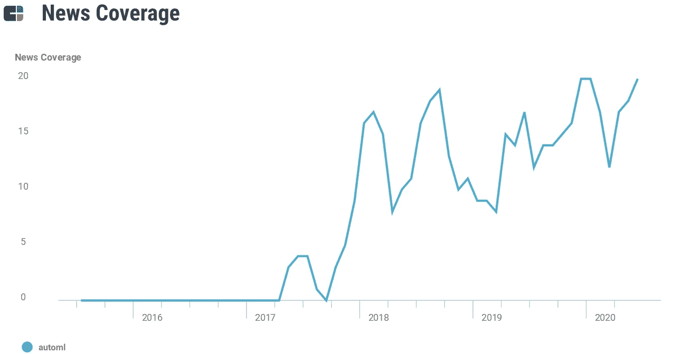
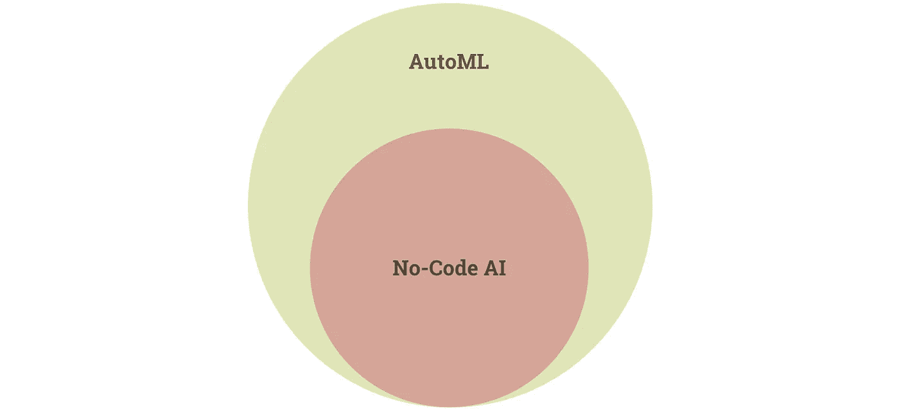

# AutoML 会是数据科学家的末日吗？

> 原文：<https://towardsdatascience.com/will-automl-be-the-end-of-data-scientists-9af3e63990e0?source=collection_archive---------0----------------------->

## AutoML 越来越受欢迎。这就是事情的变化。

阿尔瓦罗·雷耶斯在 [Unsplash](https://unsplash.com?utm_source=medium&utm_medium=referral) 上拍摄的照片

# 背景

2012 年，一份关于 *Auto-WEKA* 的 arXiv 报告发布，描述了一种选择机器学习算法、功能和超参数的自动化方法，希望它能“帮助”该领域的“非专家用户”。

 [## Auto-WEKA:分类算法的组合选择和超参数优化

### 存在许多不同的机器学习算法；考虑到每个算法的超参数，有一个

arxiv.org](https://arxiv.org/abs/1208.3719) 

最近，AutoML 大受欢迎，所有大型技术公司都进入了这个领域。

[CBInsights](https://www.cbinsights.com/) 对“automl”的新闻报道。

2016 年 4 月，脸书宣称 AutoML 是其人工智能的“骨干”。2018 年[1 月](https://www.blog.google/products/google-cloud/cloud-automl-making-ai-accessible-every-business/)，谷歌宣布 Cloud AutoML。2018 年 8 月，Salesforce 开源其[爱因斯坦 AutoML 库](https://venturebeat.com/2018/08/16/salesforce-open-sources-transmogrifai-the-machine-learning-library-that-powers-einstein/)。一个月之后，微软将 AutoML 引入其 Azure AI 平台。今年早些时候，亚马逊推出了另一个开源 AutoML 工具包 AutoGluon。

# 汽车的现状

CB Insights 今天列出了 40 多家汽车公司，当然还有更多。以下是几个例子:

[Accern](https://accern.com/) ， [Aible](https://www.aible.com/) ， [AIgatha](https://www.aigatha.com/) ， [Aito](https://aito.ai/) ，[舒适性分析](https://www.amenityanalytics.com/)，[奥格](https://auger.ai/)， [BACC](https://bacc.top/) ， [beynd](https://beynd.com/) ，[考萨伦斯](https://causalens.com/)， [CybordIntell](https://cyborgintell.com/) ，[达尔维奈](https://darwinai.ca/)，[深蓝科技【T23](https://deepblueai.com/) [飞轮](https://flywheel.io/)， [H2O.ai](https://h2o.ai/) ， [henQ](https://henq.nl/) ， [Hiretual](https://hiretual.com/) ，[工业分析](https://industrial-analytics.io/)，[浪潮集团](https://inspur.com/)， [Intento](https://intento.ch/) ， [MAANA](https://maana.io/) ， [Marlabs](https://marlabs.com/) ， [MindsDB](https://mindsdb.com/) ， [Monitor](https://letsmonitor.com/) ，

如果我们看看像 YCombinator 的[创业学校论坛](https://www.startupschool.org/)、 [/r/startups](http://reddit.com/r/startups) 这样的地方，或者仅仅是 Twitter，我们会发现创始人正在大量生产新的 AutoML 和无代码人工智能项目，就像没有明天一样。

## 无代码人工智能:自动语言的子集

作为 AutoML 子集的无代码人工智能。作者可视化。

值得注意的是“无代码 AI”和 autoML 的区别。autoML 通常是无代码或低代码的，但也有代码量大或技术复杂的 AutoML 解决方案，如 Auto-WEKA(查看其密集的 [15 页手册](https://www.cs.ubc.ca/labs/beta/Projects/autoweka/manual.pdf))。)

像 [Apteo](http://apteo.co) 这样的无代码人工智能和分析解决方案旨在尽可能简化 autoML，消除任何进入的技术障碍。

 [## 走向无代码分析:让每个人都成为数据科学家

### Wix 让每个人都成为网站建设者，Canva 让每个人都成为设计师。现在，是时候让每个人都成为数据科学家了。

towardsdatascience.com](/towards-no-code-analytics-making-everyone-a-data-scientist-f7693bd0abfd) 

# AutoML 有什么用

所有的 AutoML 宣传都有一个很好的理由:AutoML 是许多组织的必备工具。

我们以 Salesforce 为例。他们[解释说](https://engineering.salesforce.com/open-sourcing-transmogrifai-4e5d0e098da2)他们的“客户希望预测一系列结果——从客户流失、销售预测和潜在客户转化到电子邮件营销点击率、网站购买、报价接受、设备故障、延迟付款等等。”

简而言之，ML 无处不在。然而，为了让 ML 对每个独特的客户都有效，他们将“必须建立和部署数以千计的个性化机器学习模型，这些模型是根据每个单独客户针对每个用例的数据进行训练的”，“在不雇佣大量数据科学家的情况下实现这一点的唯一方法是通过自动化。”

虽然许多人认为 AutoML 是给 ML 带来易用性和效率的一种方式，但现实是对于许多企业应用程序来说，没有其他方法可以做到这一点。像脸书或 Salesforce 或谷歌这样的公司无法雇用数据科学家为他们数十亿用户中的每一个人建立定制模型，所以他们改为自动化 ML，实现大规模的独特模型。

自动化的 ML 组件的数量取决于平台，但使用 Salesforce，它包括功能推断、自动化功能工程、自动化功能验证、自动化模型选择和超参数优化。

那是一口。

这意味着数据科学家可以在生产中部署成千上万的模型，减少繁重的工作和手动调整，大大减少周转时间。

通过将工作从数据处理转向更有意义的分析，AutoML 实现了更具创造性、以业务为中心的数据科学应用。

# AutoML 的不足之处

鉴于廉价、高效和简单的 AutoML 工具的激增，我们可能会期望 AutoML 将取代数据科学家。

然而，AutoML 有几个缺点。

## 前言

为了说明这些缺点，请注意它们与 AutoML 的准确性或可用性无关。

例如，一些人声称 AutoML 无法处理强化学习，AlphaZero 的例子证明了这一点，alpha zero 是一个在没有领域知识的情况下开始的模型，它在自我游戏中达到了超人的水平。

此外，一些人声称 AutoML 不能在无监督的学习上工作，这[也是不真实的](https://hub.packtpub.com/create-machine-learning-pipelines-using-unsupervised-automl/)。

最后，有些人声称 AutoML 不能进行特征工程，这被我们早先的 Salesforce 的 AutoML 的例子所反驳，它在自动化特征工程之后进行了数十亿次预测。

## 缺点

AutoML 最大的缺点就是没有商业直觉。AutoML 会让你更快地得到一个生产就绪的模型，但是它不会告诉你*为什么*使用 ML 或者*商业理由是什么*，更不用说从大量可用的机会中选择一个合理的问题来尝试解决。

现在，假设您使用直觉(而不是数据科学家)来选择问题，并以某种方式协调所有利益相关者(即使没有数据科学家参与)，您仍然需要找到正确的训练数据。

AutoML 首先没有选择数据的能力——您需要弄清楚您有哪些数据可以表明您正在尝试解决的问题。

假设我们选择一个问题，联合利益相关者，并找到指示性数据。在建立了我们的模型之后，我们很容易遇到偏差的问题。

人类天生就有偏见，这种偏见反映在我们输出的数据中。如果我们盲目地根据有偏差的数据训练模型，那么我们的模型很可能会有偏差。这在亚马逊的性别歧视招聘算法或谷歌的种族主义图像分类算法中可以清楚地看到。

此外，一旦我们的模型制作完成，它仍然需要由软件工程师集成到平台的其余部分。然而，软件工程师通常不理解人工智能的局限性，因为这样做不是他们的工作。你可能最终实现一个错误的模型。

最后，假设您已经将模型投入生产。数据科学家最有可能看到模型的附加值，因为他们是人工智能实施的倡导者。如果没有任何数据科学家，您可能会错误地推广该功能，并且不了解它真正在哪些用例中大放异彩。

# 结论

AutoML 是一个快速发展的领域，这是有充分理由的。它支持大规模定制 ML 模型，无需大量数据科学家即可生成数十亿个预测。

然而，AutoML 并不意味着数据科学家的终结，因为它不会“自动选择”要解决的业务问题，它不会自动选择指示性数据，它不会自动调整利益相关者，它不会在面对潜在偏见时提供自动伦理，它不会提供与产品其余部分的自动集成，并且它不会提供事后自动营销。

在这些领域，数据科学家都可以提供帮助。

最终，AutoML 是在您的组织中有意义地实现 AI 的一块拼图。