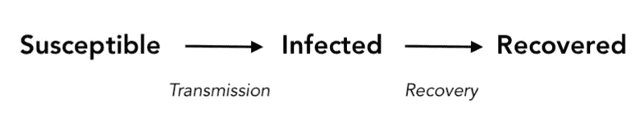
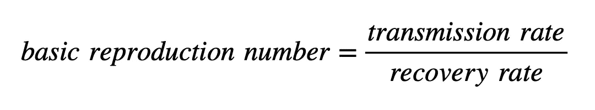
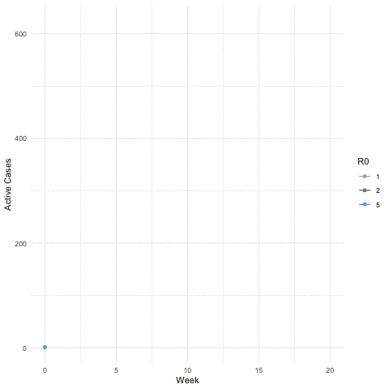
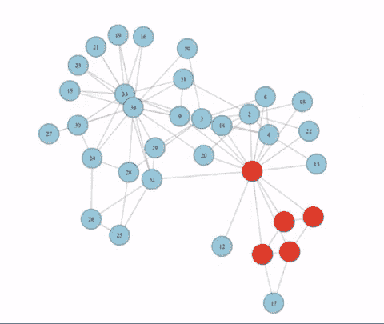
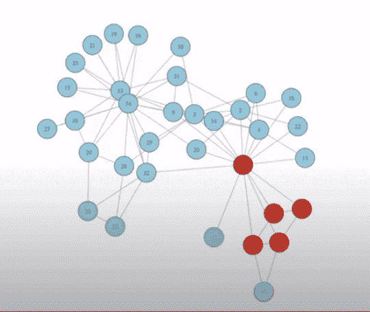

# 新冠肺炎会压垮我们的医疗系统吗？

> 原文：<https://towardsdatascience.com/will-covid-19-overwhelm-our-healthcare-systems-f5bc49bc77a2?source=collection_archive---------58----------------------->

## 基本生殖数字对新冠肺炎和医疗保健意味着什么

在 [Unsplash](https://unsplash.com?utm_source=medium&utm_medium=referral) 上由 [Ani Kolleshi](https://unsplash.com/@anikolleshi?utm_source=medium&utm_medium=referral) 拍照

[报道](https://ourworldindata.org/grapher/total-cases-covid-19?time=2020-04-01..&country=OWID_WRL)显示，新冠肺炎确诊病例持续上升。随着活跃病例数量的增加，我们的医疗保健系统面临更大的压力。更多的病床、更多的医护人员和更多的设备都将成为需求。随着资源的稀缺，我们的医疗保健系统面临不堪重负的威胁。

我们正在接近临界点吗？如果有，什么时候来？德国总理安格拉·默克尔提供了一些见解:

安格拉·默克尔解释冠状病毒模型及其对医疗保健能力的影响——2020 年 4 月 15 日

*【再现系数】*，或 ***基本再现数*** ，在考虑这些问题时起着重要的作用。本文将探讨基本再生数的概念，它对新冠肺炎的传播意味着什么，以及它对我们的医疗保健系统的影响。

> 注意:我们这里的重点是解开繁殖数的概念，因为它与传染病模型有关。为了便于说明，我们以新冠肺炎为例。

# 首先，简单介绍一下背景

在我们深入研究繁殖数的细节之前，我们需要了解分室流行病学模型是如何工作的。阅读这篇文章可以获得简单但更详细的解释。

 [## 预测新冠肺炎的顶峰

### 流行病传播建模的简单指南

towardsdatascience.com](/when-will-covid-19-peak-96a41939ac33) 

为了简洁起见，我们在这里略述一下 [SIR 模型](/when-will-covid-19-peak-96a41939ac33)的相关假设。

## 模型的规则

*   人们一次可以分为三类。**易感**、**感染(I)** 或**痊愈(R)** 。
*   易感者会从被感染者那里感染疾病。那些已经康复的人被认为已经建立了免疫力，不能再感染任何人或被再次感染。
*   人们按顺序经历这些阶段。

## 模拟感染传播的速度

决定感染传播速度的两个关键因素:

*   ***传染率*** 模拟有多少人因接触到活跃的确诊病例而被感染。
*   ***恢复速度*** 模型显示一个人从被感染到恢复状态需要多长时间。

SIR 模型状态图

# 基本复制数

背景碍事，我们现在可以看一看 ***再现号*** 。

## 这是什么？

正如安格拉·默克尔所说:

> *“*我们现在的繁殖系数是 1，所以一个人正在感染另一个人。我只能说，对于一个传染链，如果一个人会传染给另一个人。这是一个人感染另一个人的平均值。”

换句话说，我们可以把 ***基本繁殖数*** 想象成一个感染者把疾病传给的人数。例如，如果每个被感染的人感染另一个人，那么我们的基本再生数为 1(安格拉·默克尔描述的感染链)。如果每个感染者感染另外两个人，那么我们的基本繁殖数就是 2，以此类推。

## 我们如何建模？

使用[传输和恢复速率](/when-will-covid-19-peak-96a41939ac33)计算再现数量。如果传染率告诉我们一个活跃的病例将把疾病传给多少人，而恢复率告诉我们那个人将保持传染性多长时间，那么我们可以如下计算基本繁殖数:

## 这是一件大事

基本再生数对任何传染病模型的结果都有很大的影响。我们可以想象，从第一例确诊病例开始，这种疾病会以感染波的形式传播。

让我们假设我们的基本再生数是 1。在这种情况下，感染的传播会是这样的:

R₀ = 1，每个人感染一个人

在这种情况下，这种连锁反应一直持续到人群中的所有人都被感染。每个人在康复前都会将感染传给另一个人。随着每一波新的感染，感染人数保持不变。这使得我们的医疗保健系统更易于管理。持续繁忙，但更易于管理，因为每波感染的活跃病例数量保持稳定。

现在，让我们想象我们的繁殖数是 2，这意味着每个人在自己从感染中恢复之前，会将感染传给另外两个人。现在的结果看起来像这样。

R₀ = 2，每个人感染其他五个人

现在，我们看到，随着每一波新的感染，受感染人数都在增加。这意味着，随着每一波浪潮的到来，活跃病例的数量越来越接近我们医疗系统的能力极限。

如果我们把复制数定为 5:

R₀ = 5，每个人感染其他五个人

这份世卫组织报告表明，对于新冠肺炎的严重或危急病例，需要 3 到 6 周才能康复。在下图中，我们假设 5 周恢复，所以每一波感染间隔 5 周。在这里，我们可以看到更高的繁殖数的影响。

活动案例数量的增长，不同复制数量的比较

繁殖数是模拟流行病传播的一个关键变量。

## 这是一件敏感的事情

安格拉·默克尔继续说道:

> “如果我们达到每个人感染 1.1 人的程度，那么到 10 月份，我们将达到我们的医疗保健系统的容量，以及假定的重症监护床位数。如果我们达到 1.2 人，那么每个人都多感染 20%。[其中]五个人中，一个感染两个，另一个感染一个，那么我们将在七月达到我们医疗系统的极限。如果上升到 1.3 人，那么到 6 月份，我们的医疗体系将达到极限。”

默克尔继续描述目前的局势为*【脆弱】**【如履薄冰】*。生殖数量 0.1 的变化可能会在达到医疗保健能力的时间表中造成 3 个月的差异。

# 会传染给所有人吗？

这取决于复制数量。有 **3** 种情况需要考虑:

## 情况 1:复制数大于 1

如果复制数大于 1，那么使用这个模型，答案是肯定的。由于每个人会感染更多的人，病例数会随着每一波疫情而增加，直到大多数人被感染。感染在人群中传播的速度将取决于易感人群的数量。通过这些模型，我们预计感染率在达到临界点后会放缓，但模型仍然显示每个人都会在某个时候感染。

这里有一个简单的网络模拟来说明这种情况。蓝色节点表示易感人群，红色表示感染，绿色表示恢复(或从人群中移除)。

来源:高等经济学院；[流行病的数学建模。第二讲:网络上的流行病](https://www.youtube.com/watch?v=GVTDWQEXZj0)

在这种情况下，疾病不只是感染每个人，它随着每一波快速增长，并在人群中传播。

## 情况 2:复制数小于 1

小于 1 的繁殖数意味着，平均而言，大多数人不会将这种感染传递下去。如果繁殖数是 0.5，那就意味着一半被感染的人不会再感染其他人，所以活跃病例总数随着每一波都减半。这种情况一直持续到疾病最终消失。这是一个模拟的样子，使用相同的网络，但是复制数小于 1。

来源:高等经济学院；流行病的数学模型。第二讲:网络上的流行病

最终，我们会到达一个点，在传染给任何人之前，感染者会康复。在这种情况下，它没有获得足够的动力来感染大多数人群，并随着时间的推移而消失。

## 情况 3:复制数等于 1

这是第二个最好的情况，因为在每一波感染中，感染人数保持不变。

在这种情况下，我们预计这种疾病最终会在整个人群中传播。然而，这是医疗保健行业第二好的情况，因为在任何给定时间活跃病例的数量保持不变。

# 结束语

几个重要的注意事项:

1.  本文的目的是解释在流行病学模型中再生数的含义。不提供任何关于何时将达到容量或多少人将被感染的预测。
2.  这些模型并不完美，而且带有相当多的假设。[经济学人信息部估计](https://www.cnbc.com/2020/03/18/coronavirus-will-infect-half-the-global-population-eiu-predicts.html)全球一半的人口将被感染。这些估计可能是考虑了更多变量的更复杂模型的结果。简单房室模型的一些局限性在这里 [**提到**](/when-will-covid-19-peak-96a41939ac33) 。

关于 ***繁殖数*** 更详细的数学解释，我推荐斯坦福大学人类科学系的[这篇论文](https://web.stanford.edu/~jhj1/teachingdocs/Jones-on-R0.pdf)。如果您对本文有任何问题或意见，请随时留言或联系我们。

***编者按:*** [*走向数据科学*](http://towardsdatascience.com/) *是一份以数据科学和机器学习研究为主的中型刊物。我们不是健康专家或流行病学家，本文的观点不应被解释为专业建议。想了解更多关于疫情冠状病毒的信息，可以点击* [*这里*](https://www.who.int/emergencies/diseases/novel-coronavirus-2019/situation-reports) *。*