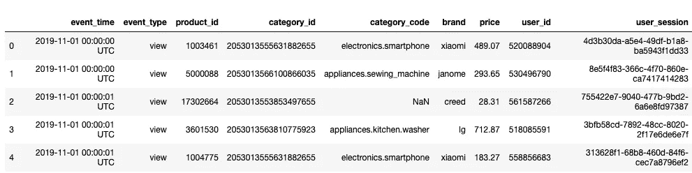
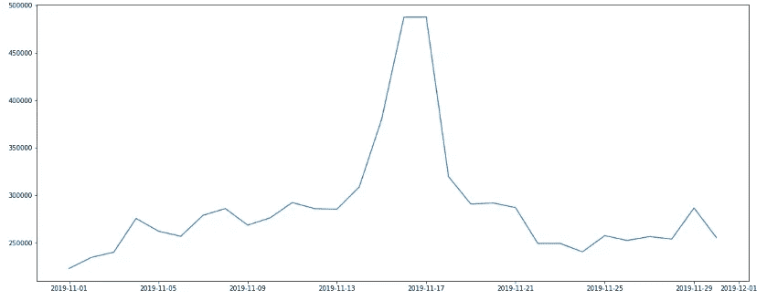
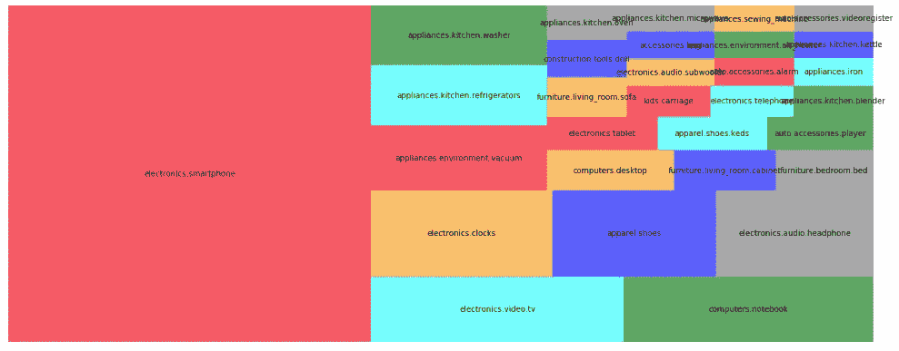
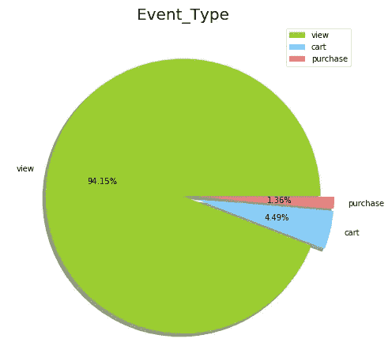
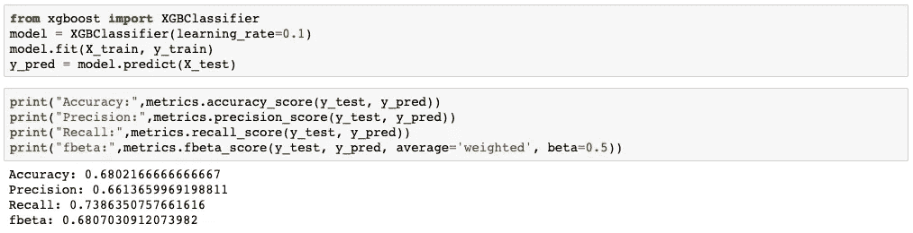
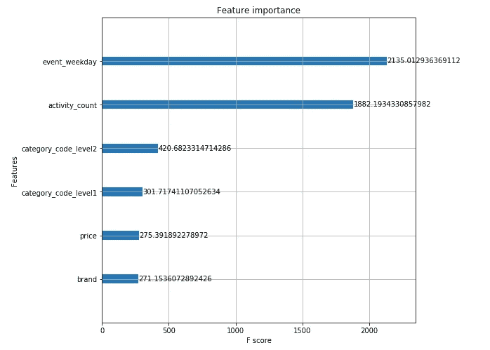

# 顾客会购买购物车中的产品吗？

> 原文：<https://towardsdatascience.com/will-customers-buy-the-products-in-their-cart-b8ac5e30f3?source=collection_archive---------28----------------------->

## 使用 XGB 分类器来预测一旦客户将商品添加到购物车中，他们最终是否会购买。

图片来源:[https://www . the south African . com/life style/black-Friday-deals-in-south-Africa-tips-2019/](https://www.thesouthafrican.com/lifestyle/black-friday-deals-in-south-africa-tips-2019/)

了解客户购买行为的关键驱动因素始终是电子商务行业的圣杯。这些知识可用于改善购物流程，最终提高销售额和客户满意度。在这个项目中，我选择了来自 [Kaggle 的 2019-11 月数据——来自一家多品类商店](https://www.kaggle.com/mkechinov/ecommerce-behavior-data-from-multi-category-store)的电子商务行为数据，来演示我如何通过 XGBoost 分析和建立一个基本的预测模型。

# 了解你的客户

在我们致力于特性工程和构建模型之前，退一步进行 **EDA** (探索性数据分析)总是好的。通常，我们会发现一些有用的信息，有助于后面的过程——数据准备、特征工程和建模。

数据如下所示，有关每个属性的详细信息，请查看此处的:

数据来源:【Kaggle 的 REES46 营销平台

在检查了基本的描述性分析之后，有一些问题可能值得进一步探讨。知道数据集包含时间、产品信息和价格，我在考虑一些业务问题，我可以从当前的数据集得到答案。

1.  **11 月日流量？**

11 月份的总客户访问量为 3，696，117，但他们不太可能平均访问该网站。

我们可以在 11 月 16 日和 17 日左右看到一个大高峰，我猜这将是一个促销活动。如果我们检查一种产品的价格的每日价格趋势(例如:*product _ id*=*1003461，小米*或 *1005115，苹果*)，这可以进一步证明，并且在 16 日和 17 日期间该产品的价格总是较低。

**2。什么产品类别和品牌最受欢迎？**

人们查看的前 5 个类别是“*电子产品.智能手机*”、“*电子产品.视频.电视*”、“*电脑.笔记本*”、“*电子产品.钟表*”和“*服装.鞋子*”，如下图所示。当我从那些购买事件数据中查看品牌时，最受欢迎的品牌是*三星*、*苹果*、*小米*，以及其他品牌的电子产品。显而易见，大多数顾客是来购买电子产品的。因此，对于经理来说，这将是一个开放性的战略问题，他们是否应该专注于这一特定类别，而不是成为一个多类别商店，或者包括其他类别是否有益？以防这种现象也能从其他月份的数据中观察到。

前 30 个类别的树形图

**3。客户的购买之旅是否就像典型的漏斗(view = > cart = > purchase)？**

虽然饼图显示只有一小部分人真正将商品放入购物车，但一旦商品被顾客放入购物车，大约有 30% (1.36%除以 4.49%)的购买转化率。虽然转换漏斗的每一步都可以优化，但在这个项目中，我将重点放在购物车到购买的转换上。

# 客户会在将产品添加到购物车的同时购买它们吗？

现在，我将构建预测模型。对于这个用例，我只使用了“*购物车”*和“*购买”*数据。此外，我还通过引入一些新功能重新设计了数据结构:

*   类别 _ 代码 _ 级别 1:类别
*   类别 _ 编码 _ 级别 2:子类别
*   事件 _ 工作日:事件的工作日
*   activity_count:会话中活动数量，包括所有事件类型
*   is_purchased:放入购物车的商品是否被购买

多了两个特征，'*品牌*'和'*价格*'，从原始数据来看，还不错。如果你对数据清理和特征工程过程感兴趣，请在这里查看代码。

**建模**

在我的分析中，我使用 XGB 分类器。XGBoost 是一个具有良好性能的梯度提升决策树的实现。考虑到数据量，我还对原始数据进行了随机下采样(每个类 500，000 条记录:购买和不购买)，以避免类不平衡的问题。我的目标是快速查看结果，然后思考模型改进和调整的下一次迭代。

Fbeta 显示 0.68，Recall 是 0.74，对于第一个简单的模型还行。但是，我更好奇的是，什么特征对预测购买起着重要作用。

根据数据集，Feature_importance 给了我们一些见解，event_weekday 和 activity_count 似乎在预测中占主导地位。当查看日常流量时，我可以看到在周末和假期有一些增加。消费者在这些日子里花更多时间购物是有道理的。然而，也可能是因为一些隐含的原因，比如我之前提到的促销——人们在特定日期购买是因为价格而不是他们的习惯。为了验证这个假设，我需要更多的商店背景。Activity_count 是我计算特定用户会话的总事件记录的指标，作为客户参与度的代理。因此，客户和网站之间的互动才真正显示出意义。这可能是因为顾客通常花时间比较他们的商品和收集信息来做出购买决定。如果在这种情况下，使用户界面友好或引入一些功能，如“最低价格保证”，或“其他人也看看”，以帮助客户加快他们的购买决策过程，最终将推动转换。

# 结论和未来工作

查看结果，现在我们知道网站上的客户活动是决定客户是否购买的关键驱动因素。通过分析，我们可以重新考虑我们的策略，以进一步开发我们的模型。例如，为了通过探索个人购买体验来增强预测能力，我们可能需要更多事件类型的点击流数据，如客户点击了哪个组件。我们可能还需要获取客户的个人资料数据，这样我们就可以相应地对客户类型进行聚类，这将有助于改进产品推荐系统。因为购买行为是非常个人化的，从各个方面获得数据可以让我们更好地分析哪些特征和功能是重要的。

除了获取更多的数据点之外，尝试其他分类器和调整模型参数也是有用的。为了扩展这一点，最好建立一个训练管道，让我们更快地进行实验，并为我们的下一个模型选择最佳性能结果。在我的另一个[项目——寻找捐赠者](https://github.com/andypwyu/finding_donors/blob/master/finding_donors.ipynb)中，我展示了如何构建管道，以便你可以有效地尝试许多不同的分类器和参数设置。

一旦模型准备好预测客户购买，它就可以用作可操作的营销工具，在客户似乎改变主意时，我们有赢回的方法，这是我们可以从预测中获得的真正商业价值！

要了解更多关于这个分析的内容，请点击这里查看我的 Github 链接[。](https://github.com/andypwyu/eCommerce-behavior/blob/master/eCommerce%20behavior%20data%20from%20multi%20category%20store.ipynb)