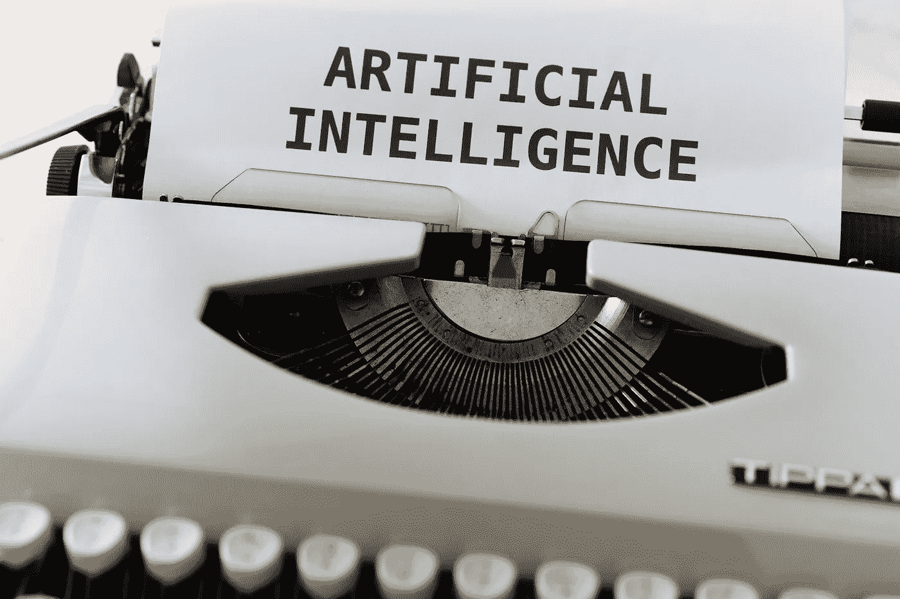

# 数据科学会自动化吗？

> 原文：<https://towardsdatascience.com/will-data-science-become-automated-407f32270de6?source=collection_archive---------35----------------------->

## 意见

## 全自动数据科学平台的利与弊。

照片由[晨酿](https://unsplash.com/@morningbrew?utm_source=unsplash&utm_medium=referral&utm_content=creditCopyText)在[Unsplash](https://unsplash.com/s/photos/robot?utm_source=unsplash&utm_medium=referral&utm_content=creditCopyText)【1】上拍摄。

# 目录

1.  介绍
2.  数据科学自动化
3.  利弊
4.  摘要
5.  参考

# 介绍

随着数据科学越来越受欢迎，公司正在计算一个团队需要多少数据科学家才能制造出成功的产品或成功解决业务问题。虽然公司专注于雇用数据科学家，但他们很可能已经注意到，他们可以雇用一个平台，或者以其他方式执行数据科学，而不是雇用人员来执行数据科学，以便在他们的公司中使用数据科学。最终，数据科学可以自动化，就像大多数技术流程一样，这是一个开端。然而，问题变成了，它应该自动化吗？当它被工具或平台自动化时，数据科学的表现如何？下面我将通过强调自动数据科学和/或机器学习的利弊来讨论这些问题。

# 数据科学自动化

像生活中的大多数事情一样，适度是关键，所以淘汰人类数据科学家并用一种工具取代他们可能会导致一些混乱和困惑——首先。就像教育一样，一个在线平台可以教会许多人在学术领域取得成功，自动化数据科学平台也是如此。人类可以从机器那里学习数据科学。但是，当你在数据科学领域历史的早期进行自动化时(*是的，我知道它并不像许多人认为的那样是一个新领域*，你可能会遇到一些严重的问题。相反，你会遇到一些很棒的职业选手。

# 利弊

凡事都有利弊，自动化数据科学也不例外。我不打算详细介绍具体的工具/公司，它们的主要产品是数据科学自动化，但是您可以预期这些工具的一些优点和缺点。

> 赞成的意见

*   **易于使用**

自动化数据科学平台的主要功能是让用户更容易在其业务中实施数据科学。因此，拥有数据分析或产品管理背景的人可以很容易地使用一个平台，比如说，对图像进行分类。

*   **便宜**

尽管雇用数据科学家可能会让公司在工资和入职成本上花费超过 10 万美元，但自动化平台的成本甚至可能远远低于一名数据科学家的成本——需要注意的是，一些公司有不止一名数据科学家。

*   **强大的**

众所周知，数据科学本身是一种强大的工具，可以对公司或业务产生重大影响。数据科学和机器学习已经引领了无数的产品，并以某种方式服务于几乎每一个人。今天用手机吗？是 iPhone 吗？你用了 Face ID 吗？那么你很可能已经使用了机器学习，甚至没有意识到这一点(除非你现在是一名数据科学家，已经知道了)。也许你使用了网飞的推荐算法来推荐一个节目或电影。这些是你会遇到的一些日常机器学习的例子。还有无数更多，一个公司可以真正受益于数据科学对其业务的影响，无论是内部还是外部。

> 骗局

> 接下来我将强调缺点，因为我认为它们更重要，并且比优点更重要(从现在开始——这可能会很快改变)。

*   **难以解释**

缺点是它变得棘手。由于用户没有正确使用平台和/或不正确地解释结果和模型，这些点真的会把公司搞得一团糟。很难解释复杂数据科学模型的结果。现在想象一下，你不是数据科学家，也没有各种机器学习算法的学术背景。你必须解释这些平台模型的结果，并实现关于你公司整合的建议或预测(*有时是*)，这可能会被证明是耗时且困难的。

*   **误导结果**

因为您没有自己构建模型，所以您可能不知道需要调整的可能参数。此外，您可能不知道您需要使用肘图来查找无监督分割算法的最佳聚类数。所有这些不从头理解模型的复杂性可能会导致最没有意义的结果。也许您使用逻辑回归来预测接下来几个月的温度，但后来意识到最好将该算法用作分类模型，尽管其名称自相矛盾。一些细微的差别累积起来可能会导致一些严重的错误。

# 摘要

照片由[马库斯·温克勒](https://unsplash.com/@markuswinkler?utm_source=unsplash&utm_medium=referral&utm_content=creditCopyText)在[Unsplash](https://unsplash.com/s/photos/robot?utm_source=unsplash&utm_medium=referral&utm_content=creditCopyText)【2】上拍摄。

最终，这取决于数据科学是否将*完全自动化。当然，如果您的团队中已经有一名数据分析师，请使用自动化数据科学平台。或者，使用自动化解决方案进行预测，即使不正确也不会造成伤害。对衣服分类不正确并不是最糟糕的事情，但当你在卫生或金融行业对疾病或大笔资金分类不正确时，其危害是不可否认的。*

*弄清楚你是什么公司，你的目标，权衡利弊，从那里，你可以决定自动化数据科学是否适合你。也就是说，数据科学已经在自动化，但未来将面临试图完全自动化整个过程的平台。*

*希望这篇文章能带来一些有趣的讨论。当然，我有偏见，更喜欢把数据科学家留在身边；然而，我知道通过导入预先保存的流行库，已经有多少数据科学实现了自动化。解决方案可能是你可以使用*人在回路*方法:自动化你能做的，然后提供检查和平衡来解决模型错误。*

**下面随意评论下来。感谢您的阅读！**

# *参考*

*[1]照片由[晨酿](https://unsplash.com/@morningbrew?utm_source=unsplash&utm_medium=referral&utm_content=creditCopyText)在[Unsplash](https://unsplash.com/s/photos/robot?utm_source=unsplash&utm_medium=referral&utm_content=creditCopyText)(2020)拍摄*

*[2]马库斯·温克勒[在](https://unsplash.com/@markuswinkler?utm_source=unsplash&utm_medium=referral&utm_content=creditCopyText) [Unsplash](https://unsplash.com/s/photos/robot?utm_source=unsplash&utm_medium=referral&utm_content=creditCopyText) 上拍摄的照片，(2020)*