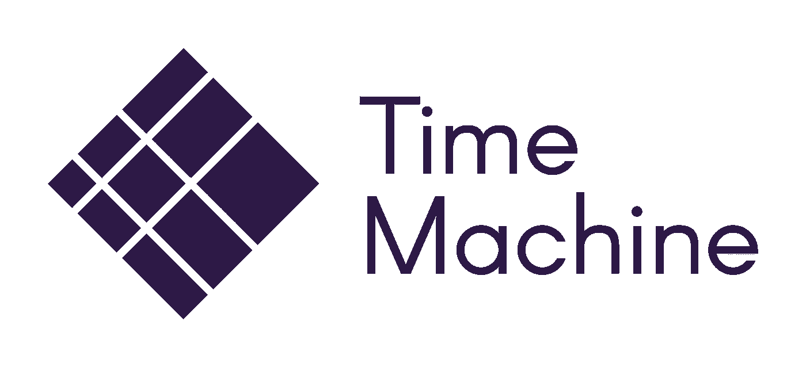
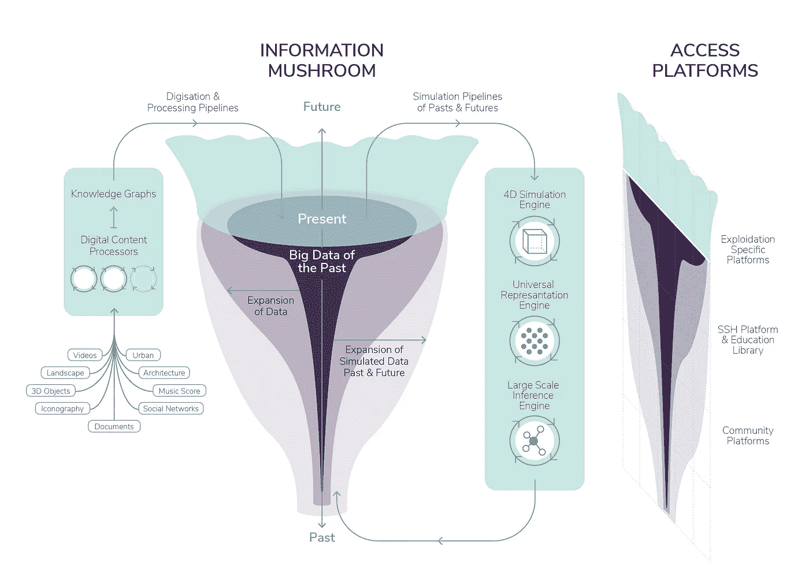

# 机器学习和混合现实会实现虚拟时间旅行吗？

> 原文：<https://towardsdatascience.com/will-machine-learning-and-virtual-reality-enable-time-travel-b66eb1c848ca?source=collection_archive---------49----------------------->

## 欧洲时间机器项目开启了历史和文化遗产的新视角

欧洲时光机项目的横幅。图片:[欧洲时光机项目](http://www.timemachine.eu/)

时光旅行一直是人类的梦想。想象一下，能够亲身体验古罗马，或者回到我们祖先的时代，体验当时人们的生活方式。显然，这样的时间旅行远远超出了我们今天的身体限制。

尽管不可能实现实时旅行，来自 32 个国家的超过 225 个欧洲研究机构组成的联盟正计划建造一个虚拟的[时间机器](http://www.timemachine.eu/)。这个时间机器是一个大型数据库，能够存储、解释和连接各种历史信息，从地图和 3D 模型上的文本和图像到音乐和其他感官信息。时间机器的作用是将所有这些信息联系起来，重建过去看似合理的观点。最后，它应该允许我们浏览所有这些数据，以便像我们今天在互联网上一样容易地在时间和空间中移动。

欧洲时间机器项目旨在建立一个过去的虚拟镜像世界。视频由[欧洲时间机器项目](http://www.timemachine.eu/)提供。

为了实现这一宏伟目标，必须取得许多突破。因此，这些研究人员正在组成一个财团，以创建一个巨大的欧洲大规模研究倡议(LSRI)。此类项目过去一直由欧洲委员会资助，并得到大量资源的支持。先前资助的一个例子是[人类大脑项目](https://www.humanbrainproject.eu/)，其目的是建立一个人类大脑的电子复制品。

研究人员面临的主要挑战可以分为三类:数据和数字化，知识提取和建模，以及这种数字认识论的局限性和机遇。显然，在通往这样一台时间机器的道路上还有很多挑战，比如许可和法律问题，这些都远远超出了本文的范围。因此，在这一点上，我们将只研究上面的主要挑战。

我们越深入过去，可用的数字信息就越少。为了更深入，我们将不得不依靠对过去的模拟。视频由[欧洲时间机器项目](http://www.timemachine.eu/)提供。

对于现代数据和信息，我们有一个巨大的优势，几乎所有的信息都可以通过电子方式获得。然而，我们越是回到过去，越是无法获得电子格式的信息，而这种电子格式适合作为时间机器处理的输入。即使是文化遗产，也就是我们认为对我们的文化身份非常重要的信息，[目前也只有 15%以数字格式提供](https://pro.europeana.eu/resources/statistics/enumerate)。对于档案馆和图书馆，这一比例甚至更低。因此，一个最初的目标是大规模数字化。与涉及翻页的传统扫描仪相比，这一过程可以使用体积采集技术(如[计算机断层扫描](https://www.nature.com/articles/s41598-018-33685-4))以大幅提高的速度完成。诸如 scan tent 之类的移动扫描仪也将在该领域的高质量数字化中发挥重要作用。此外，[在装配线上对 3D 物体进行大规模扫描](https://www.fraunhofer.de/en/research/current-research/preserving-cultural-heritage/3d-digitalization.html)在今天已经在我们的技术范围之内。

[书本 CT](https://www.nature.com/articles/s41598-018-33685-4) 允许在不打开书本的情况下阅读页面。可视化:克劳斯·恩格尔

然而，这些海量数据也需要长期存储方法，能够将这些信息保存数千年。Twist Bioscience 的研究人员正在开发在 DNA 链中存储数字信息的技术，这是人类已知的最紧凑的信息表示，因为分子本身携带的信息比当今使用的任何数字存储器都要紧凑几个数量级。请注意，这种类型的存储也适合长期保存，因为我们知道 DNA 发现的例子已经存在了 10，000 年甚至更长时间而没有丢失数据。

Time Machine 将支持使用各种访问平台访问过去的大数据，并使用模拟和推理引擎处理数据。图片:[欧洲时光机项目](http://www.timemachine.eu/)

即使我们设法数字化并存储我们可以从 2000 多年的欧洲历史中恢复的所有数据，我们也会立即遇到两个额外的问题:我们必须能够处理数据，以及大量数据无法在如此长的时间内保存下来。对于数据处理挑战，我们必须统一处理文本、图像、音频、地图、3D 对象及其解释。今天，用于此目的的大多数系统采用图形和符号表示，但我们已经看到，深度学习的能力在许多应用中能够胜过任何符号系统，正如最近在[语言翻译](https://www.wired.co.uk/article/google-ai-language-create)任务中所证明的那样。因此，这个项目的一个目标是创造一个通用的表现空间，使我们能够将以上所有的东西相互转换。然而，这样一个系统有一个很大的缺点，那就是它不允许把观察结果和推理链联系起来，就像我们在符号演绎中能够做到的那样。另一个重要的目标是融合基于符号图和基于模糊神经网络的方法。基于这些进展，我们仍然需要能够生成历史重建。传统方法使用计算机图形来实现这些目的，然而，机器和深度学习也在这个学科中兴起。因此，我们需要能够从相当简单的描述中生成复杂场景的方法。后续的信息解释和分析仍将由与时间机器互动的人类来完成。通过这样做，从历史专家到公民科学家以及非专业用户的用户将能够为他们的目的操作时间机器。

时间机器项目将使用链接的开放数据来连接过去的见解，并使它们可以访问。视频由[欧洲时间机器项目](http://www.timemachine.eu/)提供。

时间机器的第三个重要方面是它如何被用来产生新的见解。在所有观察中，必须确定信息内容以及是否信任它。这需要扩展的认识论方法——数字认识论——能够同时处理不同版本的历史真相。事实上，能够轻松地对过去进行不同的重建需要仔细的思考，因为结果可能会被产生并用于推动某种当今的政治观点。这种尝试在历史上是众所周知的，也是解释历史知识如此困难的主要原因。此外，所有对过去的重建——包括传统方法——通常都有特定的目的，因此，在审视这些重建时，必须牢记初衷。例如，考古学家可能希望通过使用柔和的灰色来清楚地表明寺庙的原始颜色是未知的。相比之下，为了给观众创造一个更加身临其境的体验，旅游办公室更喜欢对同一座寺庙进行可信且细节丰富的重建。新的历史洞察力也是对数据的解释，因此必须与原始数据和导致这种洞察力的观察链相联系。在人文和哲学领域，这已经通过文本和语言的方式进行了几个世纪。然而，我们必须建立一个数字工作流程来做同样的事情，以便允许更高程度的合作，并使科学能够更快地进步。通用人工智能也将是时间机器成功的一个重要因素，因为它将允许创建虚拟代理，这些代理可以驻留在我们过去的虚拟图像中。此外，劳动密集型任务，如数据库查询，将由现代人工智能方法处理，旨在自动回答问题和语言解释。

随着[时间机器项目](http://www.timemachine.eu/)，我们会很快拥有虚拟时间旅行吗？来自 [Pexels](https://www.pexels.com/photo/close-up-video-of-clock-ticking-856199/?utm_content=attributionCopyText&utm_medium=referral&utm_source=pexels) 的 [Pixabay](https://www.pexels.com/@pixabay?utm_content=attributionCopyText&utm_medium=referral&utm_source=pexels) 的视频。

该项目旨在以目前未知的详细程度再现过去。正因如此，像育碧这样以[刺客信条系列](https://www.ubisoft.com/de-de/game/assassins-creed/)而闻名的主要产业玩家加入这个财团并非巧合。在他们对时间机器——Animus——的设想中，他们已经非常接近时间机器项目的目标，因为 Animus 通过回到自己祖先的生活来实现沉浸式的过去体验。虽然这个目标今天还远未实现，但时间机器项目的研究人员相信，这样的时间机器将是研究的革命性产品，也将推动历史领域的商业应用。

文章和内容以[知识共享许可 4.0 署名](https://creativecommons.org/licenses/by/4.0/deed.de)发布，并首先出现在 MarkTechPost.com[上](https://www.marktechpost.com/2019/01/30/will-machine-learning-enable-time-travel/)。如果你喜欢这篇文章，也请看看我的 YouTube 频道。