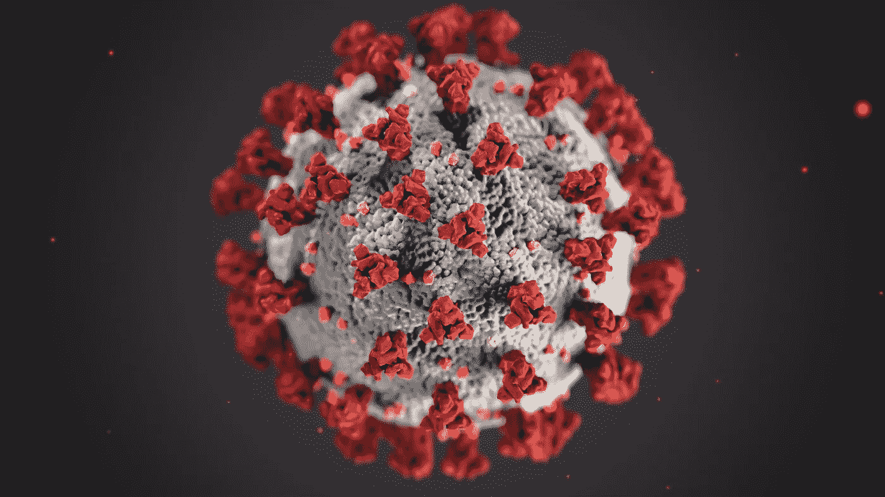

# 这场危机会帮助自主人工智能走上正确的道路吗？

> 原文：<https://towardsdatascience.com/will-the-coronavirus-help-set-autonomous-ai-robotics-on-the-right-course-5082dc2ca58c?source=collection_archive---------37----------------------->

## 新冠肺炎疫情为所有人工智能、机器人和无人驾驶汽车初创公司敲响了警钟:停止构建令人眼花缭乱的演示，停止谈论通用人工智能的未来可能性。相反，专注于部署现实世界的解决方案，这些解决方案可以在最少的人工干预下一天 24 小时运行，并为用户提供真正的价值。

疾控中心在 Unsplash 上的照片

在当前的疫情，数百万美国人开始在家工作。零售商一直在努力应对供应问题，而紧张的消费者正在囤积从卫生纸到洗手液的各种物品。

在全球范围内，中国电子商务巨头京东开始在武汉测试四级自动送货机器人，并全天 24 小时运行其自动化仓库，以应对需求的激增。

突然间，自主机器需要比仅仅证明概念更好。他们不再依赖现场工程支持来应对边缘情况。它们必须足够健壮，能够在各种现实生活环境中独立工作。

在某些方面，这种流行病加速了已经在路上的自动化未来。它暴露了人工智能创业领域长期存在的问题:流行语和炒作蒙蔽了人们的判断，难以看到真正的进展。

该行业需要在以下三个方面对现实世界的自治系统进行急需的改革:

# 1.反思度量标准

随着越来越多的自主 AI 机器部署在现实世界中，速度、周期时间或成功率等传统指标不再能够代表全貌。我们需要在不确定性的情况下，用健壮性指标(比如平均人工干预次数)来衡量系统的可靠性。

我们需要更多的工具和行业标准来评估各种场景下的整体系统性能，因为现实生活与受控环境不同，是不可预测的。

如果送货机器人可以达到最高 4 英里/小时的速度，但没有人类的支持无法完成一次送货，那么机器人就没有为用户创造多少价值。

几年前，为了缩短开发周期并持续交付高质量的软件，DevOps 应运而生。与软件工程相比，人工智能或 ML 要不成熟得多。 [87%](https://venturebeat.com/2019/07/19/why-do-87-of-data-science-projects-never-make-it-into-production/) 的 ML 项目从未投产。然而，最近我们开始看到越来越多的 MLOps 或 AIOps 出现。

这标志着从 AI/ML 研究到每天使用和测试的实际产品的关键过渡。这需要思维模式的重大转变，以专注于质量保证，而不是最先进的 ML 模型。我并不是说我们不能同时拥有两者，但是到目前为止，我们已经看到了对后者的更多强调。

# 2.重新设计错误处理和沟通

最近 Starsky Robotics 的关闭提醒我们，距离完全自主的解决方案还有数年的时间。这并不意味着人工智能机器人不能给人类带来直接的价值。正如我在[以前的一篇文章](https://medium.com/swlh/what-amazon-doesnt-want-you-to-know-about-its-automation-strategy-9046dd9289aa?source=friends_link&sk=321506da4851aef6a57bdcb2f9bf47ae)中提到的，即使人类需要处理 15%的时间，这仍然意味着公司可以减少大量的劳动力和集成成本。

然而，目前，人工智能公司倾向于在建立自主系统上花费更多的资源，而在考虑错误处理和机器与人类之间的无缝交接上花费更少的时间。

我们需要一种更好的方法来处理和交流错误，特别是对于 ML 产品，因为 ML 更具概率性，更不透明。因此，展示模型预测的可信度或者[将你的预测框定为建议](/three-questions-every-ml-product-manager-must-answer-35d73127cd5d?source=friends_link&sk=06eedcb29ba2e727f1689d7c8cbca80f)而不是决策，是赢得用户信任的方法。

我们需要将错误分为不同的级别，相应地设计不同的协议，并优先最小化导致系统停止并需要人工干预的致命错误。如果出现致命错误，系统不再工作，我们能否快速响应并远程排除故障？

最困难的部分是识别系统无法检测的未知错误。因此，进行双向沟通并允许用户标记错误或选择激活之前商定的后备计划也很重要。

# 3.重新定义人机交互

冠状病毒迫使公司更快地采用自动化并转向云。随着越来越少的人控制越来越多的机器人，我们是否有合适的工具和技术将所有相关信息迅速传递给决策者？每个机器人上是否有足够的传感器来提供完整的画面？

今天，我们依靠像电脑或平板电脑这样的触觉输入来控制机器人。在信息量激增而响应时间仍然很短的情况下，这些仍然是最好的界面吗？我们是否应该重新考虑超越触觉的人机界面，例如，语音、VR/AR 或脑机接口？

我们还需要决定应该由谁来控制。随着机器变得越来越聪明，我们应该总是做最后的决定吗？

例如，谁应该控制一个自主机器人？汽车本身？人类安全驾驶员？远程监控机器人轴心舰队的人？乘客呢？什么情况下？还是应该是人和机器双方加权判断的共同决策？有什么伦理寓意？界面能否支持多步共同决策？

最终，我们如何设计以人为中心的人工智能，以确保自主机器让我们的生活变得更好，而不是更糟？我们如何自动化正确的用例来增强人类？我们如何建立一个混合团队来交付更好的结果，并允许[人类和机器相互学习](/why-dont-we-trust-machines-when-we-obviously-should-dede847dde73?source=friends_link&sk=97eb2c6821e9bf37195d2bc980542d11)？

还有很多问题需要我们回答。当前的疫情正敦促我们更快地回答这些问题，以便未来的自治系统能够兑现它们的承诺。如果这些系统的制造商能够专注于我上面概述的三个领域，他们将能够更好地更快地得出关键结论。这将确保我们朝着正确的方向前进。

> *我们连线吧！如果你喜欢读这篇文章，请在这里订阅我的个人博客* [*！*](https://bastiane.substack.com/)

Bastiane Huang 是 OSARO 的产品经理，OSARO 是一家总部位于旧金山的初创公司，致力于打造人工智能定义的机器人。她曾在亚马逊的 Alexa 小组和哈佛商业评论以及该大学的未来工作倡议中工作。她写关于人工智能、机器人和产品管理的文章。跟着她到这里 。

这篇文章发表在 www.productschool.com 的社区上。