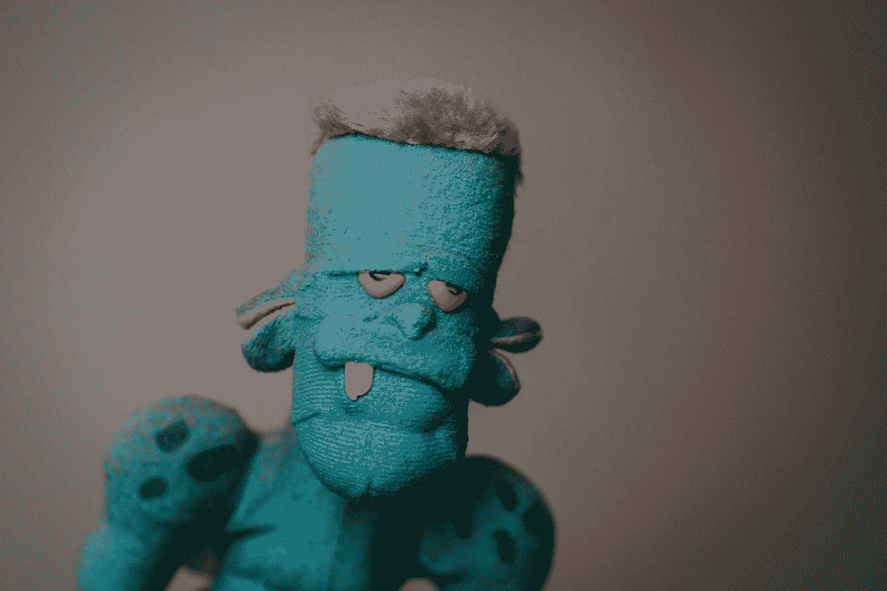
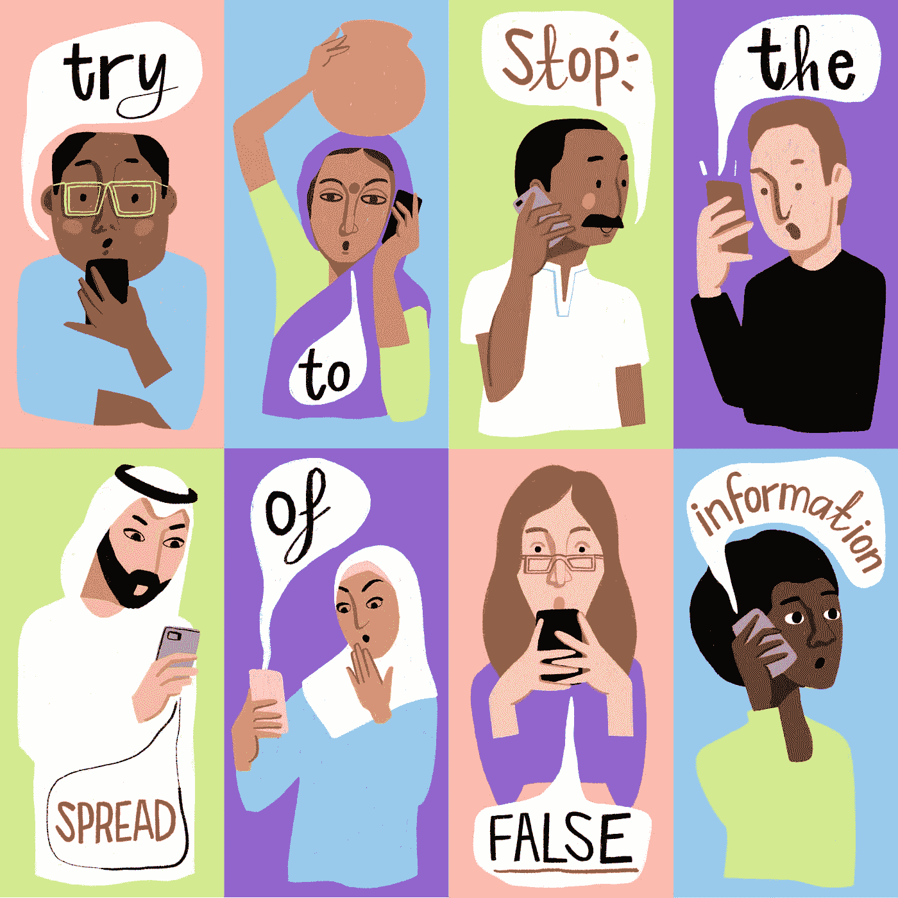

# 新冠肺炎疫苗会改变我的 DNA 并把我和人工智能联系起来吗？

> 原文：<https://towardsdatascience.com/will-the-covid-19-vaccine-alter-my-dna-and-hook-me-to-an-ai-f7d086b94e07?source=collection_archive---------24----------------------->

## 在疫情时代检查你的事实

***编者按:*** [*走向数据科学*](http://towardsdatascience.com/) *是一份以数据科学和机器学习研究为主的中型刊物。我们不是健康专家或流行病学家，本文的观点不应被解释为专业建议。想了解更多关于疫情冠状病毒的信息，可以点击* [*这里*](https://www.who.int/emergencies/diseases/novel-coronavirus-2019/situation-reports) *。*

Ashkan Forouzani 在 [Unsplash](https://unsplash.com?utm_source=medium&utm_medium=referral) 拍摄的照片

信不信由你，这个标题不是我编的。目前互联网上流传最广的假新闻之一是新冠肺炎疫苗将改变接受者的 DNA，把我们变成转基因生物。但是捏造并没有就此停止；他们还声称，这种疫苗将“把我们所有人都连接到人工智能(AI)界面上”。哇，我要说，相当令人兴奋，尤其是对于像我这样在过去二十年里一直从事人工智能工作的人来说。首先是因为技术不存在，其次是因为为什么会有人这么做？因此，除非你是黑客帝国的粉丝，否则我无法理解为什么一个高度智能的人工智能有机体(尚不存在)会想把人类变成非常低效的电池。

别再说这些垃圾了。首先，让大家放心。据世界卫生组织(世卫组织)称，我们的 DNA 不会受到这些疫苗的影响。第二，现有的人工智能没有能力(或渴望)吸取我们的能量。这条新闻只是假新闻。

近年来，我们看到假新闻大量增加。这样的新闻是故意耸人听闻的；事实上，为产生流量的网站增加流量是很经济的。通过这样做，他们通过广告赚钱。这是一个简单明了的模型，运行良好。它利用了人们的恐惧，这样一来，他们就成了传播假新闻的帮凶。与分享真实新闻的人相比，70%的人分享这样的故事，正因为如此，它的传播速度快了 20%。AI 算法在这种情况下也充当帮凶。我们估计，在互联网上，有一支机器人大军(大约 2 亿)在传播假新闻。这些机器人是生活在互联网上的计算机程序，其工作是传播新闻。有些是故意设计来散布错误信息的。其他机器人不会故意这样做，但由于它们学会了传播最具病毒式的消息，在大多数情况下，这些消息都是假的。

照片由[联合国新冠肺炎回应](https://unsplash.com/@unitednations?utm_source=medium&utm_medium=referral)在 [Unsplash](https://unsplash.com?utm_source=medium&utm_medium=referral)

所以百万美元的问题是如何检测假新闻？我们可以通过以下三个简单的步骤做到这一点:分析语言，分析事实，分析来源。不用担心；比你想的简单多了。让我来解释一下。

首先，这些假新闻大多使用一种不同于真实新闻的语言。标题通常给出了一个很好的指示，因为这些故事试图使用点击诱饵格式来耸人听闻、误导和危言耸听。其中一个这样的主张是下面这个被近 100 万个人分享的主张；“教皇方济各震惊世界，支持唐纳德·特朗普”。它通过设计吸引注意力，试图吸引用户跟随链接并消费内容。所以，当你读到一些使用夸张的词语，看起来好得令人难以置信的东西时，警钟应该开始敲响了。

第二，一旦你阅读了文件，不要停留在那里，而是提取事实。问问你自己，这篇文章的主要内容是什么？在关于新冠肺炎疫苗的文章中，我们可以确定两种说法；“新冠肺炎疫苗改变了我的 DNA”和“新冠肺炎疫苗将把我和人工智能联系起来”。检验这些是否正确的最好方法是使用一个叫做谷歌的老朋友。只要将这些陈述粘贴到搜索引擎中，看看会出现什么。如果像世界卫生组织这样的权威机构发表了这些声明，那么你可以把它们当作事实；否则，它们很可能是假新闻。这些故事也倾向于引用不知名的科学家。为了检查科学家的工作，谷歌提供了另一项名为谷歌学术的免费服务。所以你要做的就是去谷歌学术核实这些声明的真实性。

第三，如果你仍然有疑问，检查来源的真实性。像 Breaking-CNN.com、CBSnews.com.co 和 cnn-trending.com 这样的网站旨在把你搞混。他们给人的印象是，他们隶属于像 CNN 或 CBS 这样受人尊敬的新闻网络。他们甚至复制他们的网站布局和标志。所以当你有疑问的时候，最好的方法是去原始网站寻找那个故事。如果你找不到它，那么它可能只不过是一个骗局。

[engin akyurt](https://unsplash.com/@enginakyurt?utm_source=medium&utm_medium=referral) 在 [Unsplash](https://unsplash.com?utm_source=medium&utm_medium=referral) 上拍摄的照片

我明白辨别真假新闻并不总是那么容易。当你有疑问时，即使经历了以上三个步骤，最好还是忽略这个新项目，而不是分享它。请记住，通过在社交媒体上分享一些东西，你也在分享这条信息的责任。一些人仅仅因为这个原因被传唤到法庭，因为实际上，他们是他们社交媒体个人资料的编辑。股票通常被认为是对这个故事的认可。虽然其中一些故事可能很有趣，但其他的可能是致命的。就在今年，假冠状病毒新闻的传播(例如喝漂白剂或吃牛粪来治愈病毒)导致数百人死亡。所以不要成为帮凶，检查新闻，通知自己，如果有疑问，选择不要分享可能伤害他人的东西。

如果你喜欢这篇文章，并想与我联系，请这样做🐦[推特](https://twitter.com/alexieidingli)，🔗 [LinkedIn](https://www.linkedin.com/in/alexieidingli/) ，📷 [Instagram](https://www.instagram.com/alexieidingli/) 或者😊[脸书](https://www.facebook.com/alexieidingli/)

 [## 游戏新冠肺炎:让我们通过玩游戏打败病毒！

### 在一个封闭的世界里，无助感可能会压倒一切，但我们都可以用我们的电脑来打败…

towardsdatascience.com](/gaming-covid-19-lets-defeat-the-virus-by-playing-a-game-f8433805fe7d)  [## 中国是如何用科技钉死冠状病毒的！

### 中国高科技系统对抗 COVD-19 的案例研究

towardsdatascience.com](/how-china-nailed-the-coronavirus-using-technology-77703dc94a37)  [## 冠状病毒的多米诺效应

### 新冠肺炎如何对我们的经济产生负面影响以及可能的解决方案

towardsdatascience.com](/the-domino-effect-of-the-coronavirus-66fdd72fc9fd) 

[**阿列克谢·丁力教授**](http://www.dingli.org/) 是马耳他[大学](https://www.um.edu.mt/)的 AI 教授。二十多年来，他一直在人工智能领域进行研究和工作，协助不同的公司实施人工智能解决方案。他的工作被国际专家评为世界级，并赢得了几个当地和国际奖项(如欧洲航天局、世界知识产权组织和联合国等)。他已经出版了几本同行评审的出版物，并成为马耳他[的一员。由马耳他政府成立的人工智能特别工作组，旨在使马耳他成为世界上人工智能水平最高的国家之一。](https://malta.ai/)