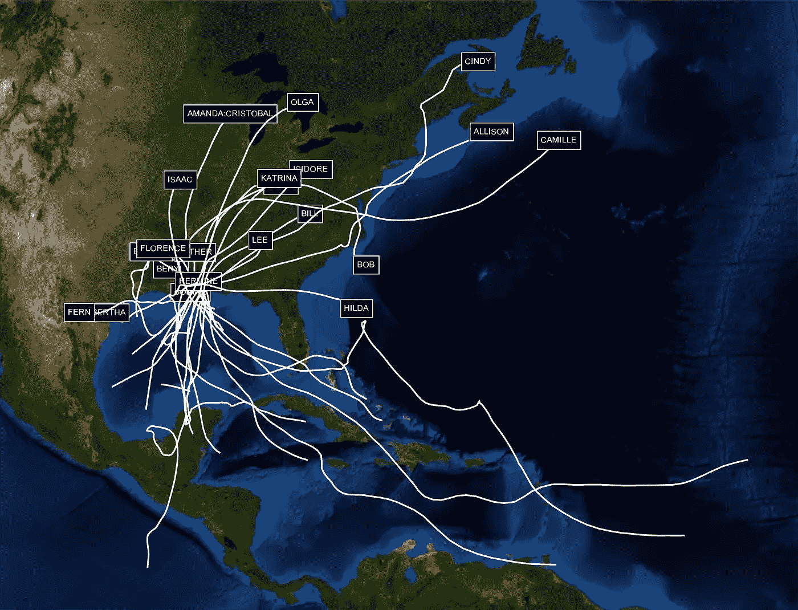
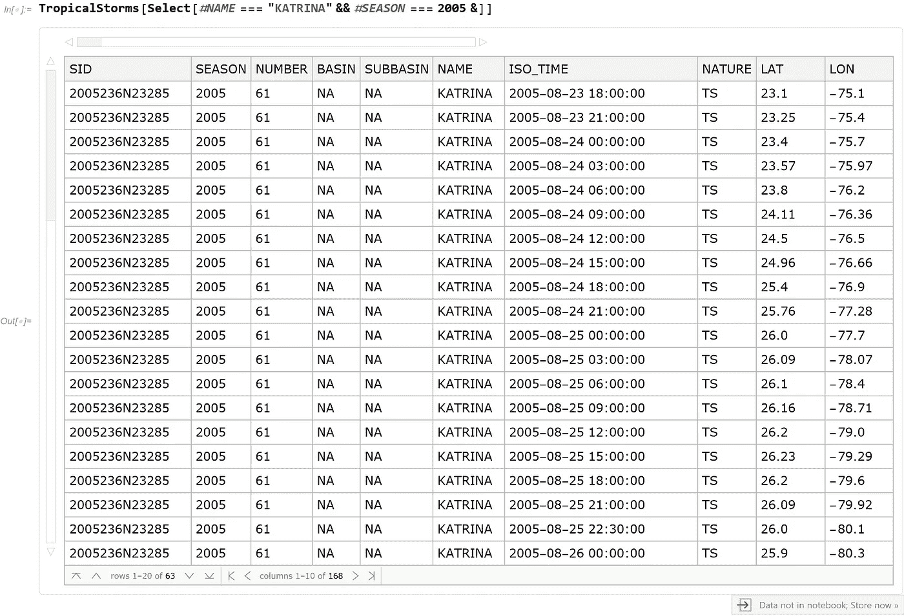
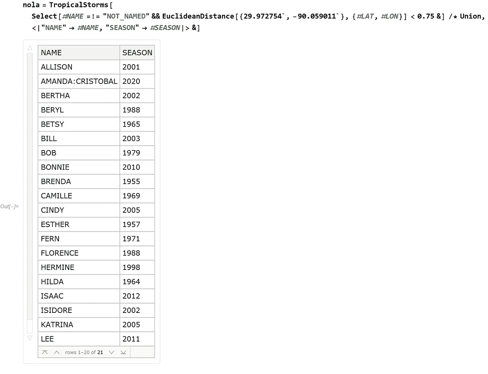
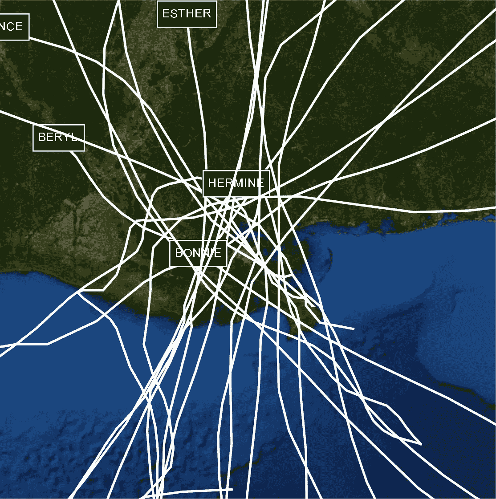
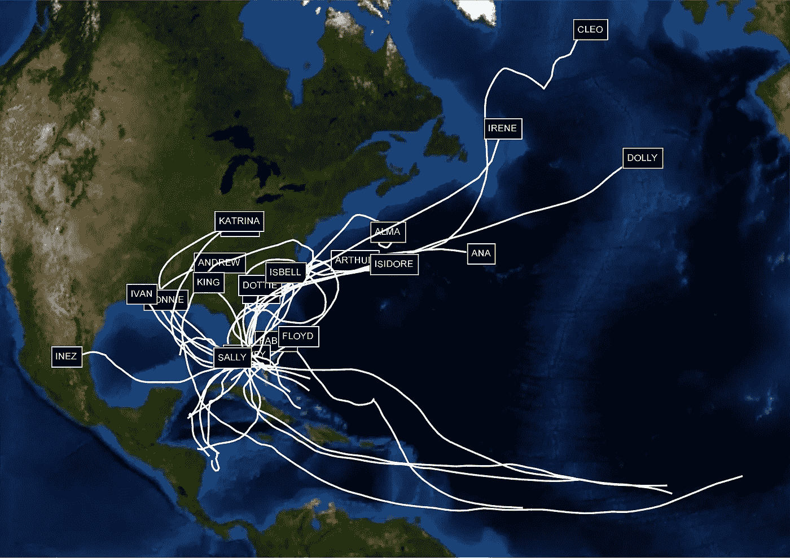

# 下一次飓风会袭击我的家吗？

> 原文：<https://towardsdatascience.com/will-the-next-hurricane-hit-my-home-a1348c0a6db9?source=collection_archive---------46----------------------->

## 基于历史风暴轨迹的数据分析


由 [Unsplash](https://unsplash.com/s/photos/hurricane?utm_source=unsplash&utm_medium=referral&utm_content=creditCopyText) 上的 [Shashank Sahay](https://unsplash.com/@shashanksahay?utm_source=unsplash&utm_medium=referral&utm_content=creditCopyText) 拍摄的照片

我们正处于一个非常活跃的飓风季节，昨晚莎莉飓风登陆，其他几个热带风暴正在大西洋酝酿。每个人心中的大问题总是:“下一场飓风会不会袭击我家附近？”。尽管气象学取得了许多卓越的进展，热带风暴仍然很难预测。在风暴的一生中，路径和强度都会发生显著的变化。

人们可能会问的另一个问题是:在过去所有穿过一个地理区域(比如一个城市)的热带风暴中，路径看起来像什么？换句话说，以一个像新奥尔良这样的城市为例，画出所有经过它或非常接近它的飓风的地理图:



(图片由作者提供)

为了全面回答这个问题，我们需要一个尽可能完整和准确的所有热带风暴的数据集。NOAA 维护这样一个[数据集作为 shape file](https://www.ncdc.noaa.gov/ibtracs/index.php?name=ib-v4-access)的集合，Wolfram 语言可以很容易地导入它。将来自 NOAA 的原始数据转换成 Wolfram 语言的可计算数据集的代码。它可以像任何旧数据集一样被查询。例如，我在这里查询“2005”季节中名为“KATRINA”的风暴，它返回所有相关的行:



(图片由作者提供)

要获取靠近新奥尔良的所有风暴，我们可以查找该城市的纬度和经度，并选择具有匹配坐标的数据集行:

```
Interpreter["City"]["New Orleans, Louisiana"]["Position"]
```

这会返回**地理位置[{29.9728，-90.059}]** 。接下来，我们可以寻找接近该位置的路径，并返回命名的风暴和季节的列表。生成的数据集列出了经过新奥尔良的所有风暴:



(图片由作者提供)

有了这些名字，你就可以为每个风暴绘制路径。这就是这个故事开头的图像中显示的内容。一张放大的地图显示了有多少风暴经过新奥尔良:



(图片由作者提供)

当然，从这些数据中无法得出简单的结论。袭击新奥尔良的一些风暴起源于非常遥远的大西洋。但是更多的开始于加勒比海和墨西哥湾。

该代码可以很容易地适用于任何地点，如迈阿密。在那种情况下，地理情节如下:



(图片由作者提供)

要获取完整代码，可以在云端打开[这个 Wolfram 笔记本](https://www.wolframcloud.com/obj/arnoudb/Published/TropicalStorms-01.nb)。


由[摩根·彼得罗斯基](https://unsplash.com/@morgpetphoto?utm_source=unsplash&utm_medium=referral&utm_content=creditCopyText)在 [Unsplash](https://unsplash.com/s/photos/new-orleans?utm_source=unsplash&utm_medium=referral&utm_content=creditCopyText) 上拍摄的照片

*   数据来源:[美国国家海洋与大气管理局的国际气候管理最佳跟踪档案(IBTrACS)数据](https://www.ncdc.noaa.gov/ibtracs/index.php)，于*【2020–09–16】*访问
*   使用的想法和代码来自 Marco Thiel 的《马修飓风和历史上的热带风暴》。