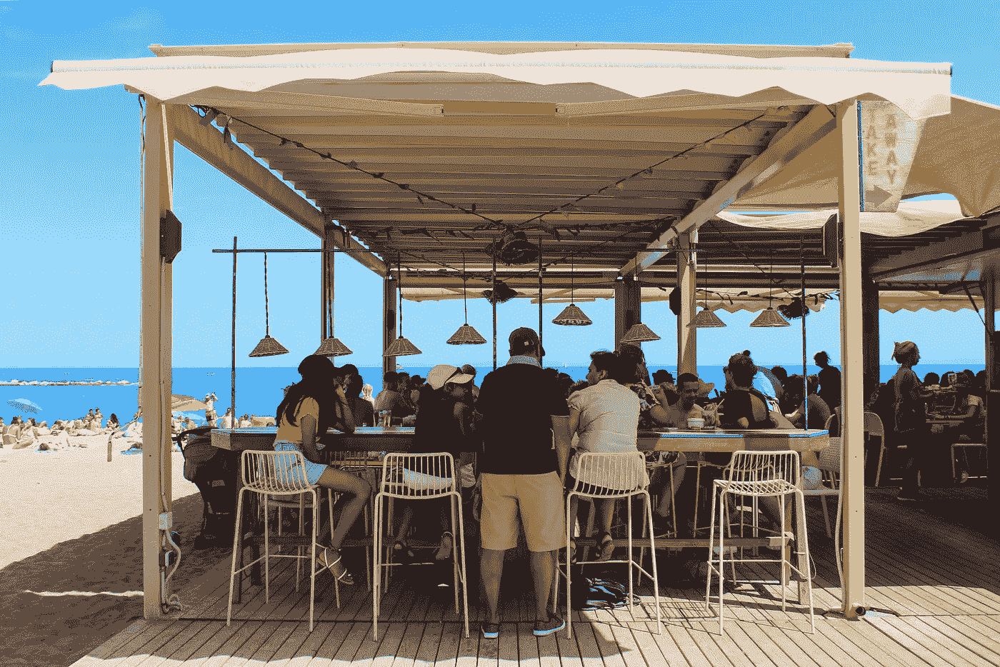
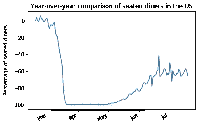
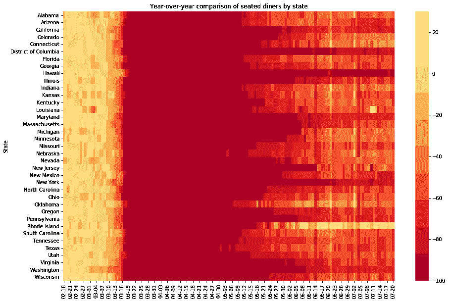
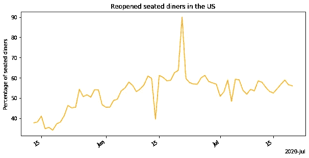
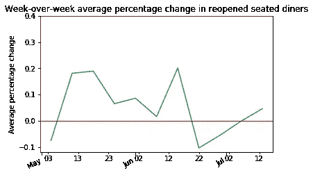
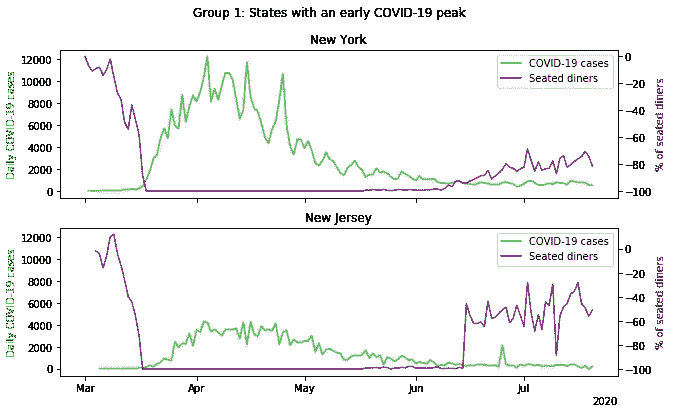
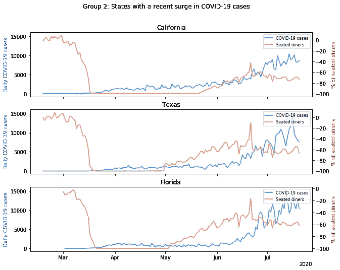
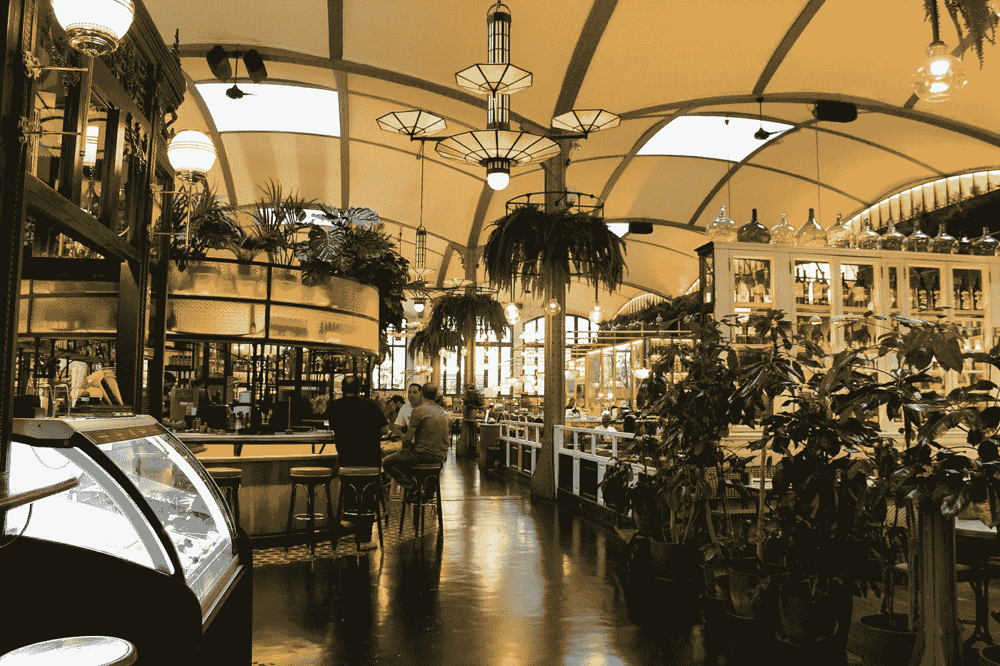

# 餐饮业能在疫情生存下来吗？

> 原文：<https://towardsdatascience.com/will-the-restaurant-industry-survive-the-pandemic-133404883f1c?source=collection_archive---------35----------------------->

## 看看新冠肺炎中部的美国餐饮业。

作者图片

在过去的两年里，我有机会住在美食爱好者的三大目的地:纽约、巴黎和波哥大。无论是巴黎的羊角面包，纽约的披萨片，还是波哥大的 *Ajiaco* ，探索这座城市的美食总是我最想做的事情。可悲的是，疫情在几周内就把事情搞得天翻地覆，和朋友在当地咖啡店喝杯咖啡或和家人出去吃午饭的日常计划成了遥远的记忆。疫情爆发后不久，许多成功的餐馆老板看到他们毕生的梦想破灭了。

我和我的家人一直在尽可能地通过订购外卖来支持当地的餐馆。然而，尽管我们热衷于支持餐饮业，但我们对近期去餐馆就餐犹豫不决。听说我过去常去的餐馆已经关门或不得不裁员以求生存，这促使我更多地了解行业状况，评估复苏前景，并了解市场对餐馆重新开业的反应。

我使用了来自 [OpenTable](https://www.opentable.com/state-of-industry) 和[纽约时报](https://github.com/nytimes/covid-19-data)的公开数据，对美国餐饮业的现状进行了全面的分析。这项研究的目的是为餐馆老板和利益相关者提供一个清晰而深刻的行业发展方向，并激励消费者寻找支持该行业的方法。

## 疫情对行业的影响程度如何？

OpenTable 的第一个数据集是美国就餐人数的年度对比。样本人口仅包括 2019 年和 2020 年 OpenTable 网络中拥有 50 家以上餐厅的大都市或州。年度对比意味着，例如，如果在 2019 年和 2020 年的某一天，餐厅的就餐人数相同，我们将得到 0%的值。在 3 月份之前，入座用餐者的比例在零附近波动，这意味着 2020 年的用餐者人数大于或等于 2019 年的人数。然而，3 月上半月，全国范围内的入座食客数量骤降至-100%。上面的线图说明了顾客数量的急剧下降——近两个月来，这个行业完全不活跃。

单独评估每个州，我们看到 3 月 15 日左右，所有州的用餐人数骤降至-100%，这与美国疫情的爆发相吻合。然而，用餐人数回升的时间因州而异。德克萨斯州和佛罗里达州等几个州在 5 月初重新开放，而纽约、哥伦比亚特区和华盛顿等其他州在晚些时候以更温和的速度重新开放。

## 复苏开始成形了吗？

我们使用来自 OpenTable 的第二个数据集，其中只包括选择重新开业的餐馆的数据。在这种情况下，如果 2019 年和 2020 年在一家餐厅有相同数量的入座用餐者，我们将获得 100%的值。在 5 月中旬之前，没有可用的数据，表明大多数餐馆在那之前都是关闭的。在整个五月和七月，用餐人数逐渐增加，然而，曲线远未达到疫情之前的数字。

## *重新开业的餐厅的用餐人数增长有多快？*

在接下来的分析中，我们关注八个州:德克萨斯州、佛罗里达州、新泽西州、加利福尼亚州、纽约州、伊利诺伊州、宾夕法尼亚州和马萨诸塞州。我们计算了每个州就餐人数的每周百分比变化，并绘制了平均值。与去年相比，所有八个州重新开业的餐厅的用餐人数保持在 50-60%以下。随着时间的推移，坐在座位上的食客数量没有明显增长，周环比变化率不超过 2%，甚至下降到了-1%。

## **市场对美国不同的重新开放政策和新冠肺炎曲线反应如何？**

我们使用《纽约时报》的数据绘制了八个州的每日新冠肺炎病例曲线和就餐人数随时间变化的曲线，并根据感染曲线的行为将它们分为三类。

首先，在这项分析研究的八个州中，纽约州和新泽西州是新冠肺炎病例最引人注目和最早达到高峰的州，也是用餐人数最近回升的州。餐饮业直到感染曲线变平后才重新活跃起来，坐着用餐的比例一直保持在-60%以下，这表明将会有一个缓慢的复苏。

第二，加利福尼亚州、得克萨斯州和佛罗里达州的新冠肺炎案例曲线非常相似:直到 6 月份左右是一个适度平坦的曲线，随后是一个剧烈的倾斜。佛罗里达州和德克萨斯州的餐饮业很早就开始复苏，那里的就餐人数在 5 月初开始上升——至少比大多数州早一个月——并达到-10%的峰值。然而，随着 6 月下旬这三个州出现明显的新冠肺炎病例激增，餐饮业似乎再次放缓。

最后，从疫情爆发到今天，伊利诺伊州、马萨诸塞州和宾夕法尼亚州的曲线保持相对平坦。6 月初，就餐人数开始上升，这似乎是餐馆重新开业的谨慎时机。目前，坐着用餐者的曲线似乎呈上升趋势，达到了-50%左右。这三个州没有像纽约和新泽西那样出现戏剧性的高峰，但似乎正在以更快的速度复苏。

## 这个行业会回到“正常”状态吗？

似乎急于重振经济、回归“正常”生活的各州正在看到其政策的后果，这反映在最近报道的新冠肺炎病例激增上——显然导致这些州的餐饮业复苏放缓。另一方面，那些已经设法使曲线变平并控制住病毒传播的州似乎正在经济复苏的轨道上。尽管餐饮业远未达到疫情疫情前的水平，但在病毒得到控制的各州，上升趋势是显而易见的。

作者图片

我们都梦想着那些日子，那时我们必须排队才能在我们最喜欢的餐馆得到一个座位，不需要戴面具或保持社交距离。如果我们想拯救这个行业，我们不仅应该支持我们当地的餐馆，而且还应该通过采取预防措施来照顾自己和他人，例如戴上口罩来控制病毒的传播，并确保我们能够尽早在餐馆或酒吧享受夜晚。

> 你正在做些什么来支持你当地的餐馆并遏制病毒的传播？

这项研究的源代码和数据文件可以在 GitHub 上找到:[https://GitHub . com/manuela rod/restaurant-industry-imya-covid 19](https://github.com/manuelarod/restaurant-industry-amidst-covid19)