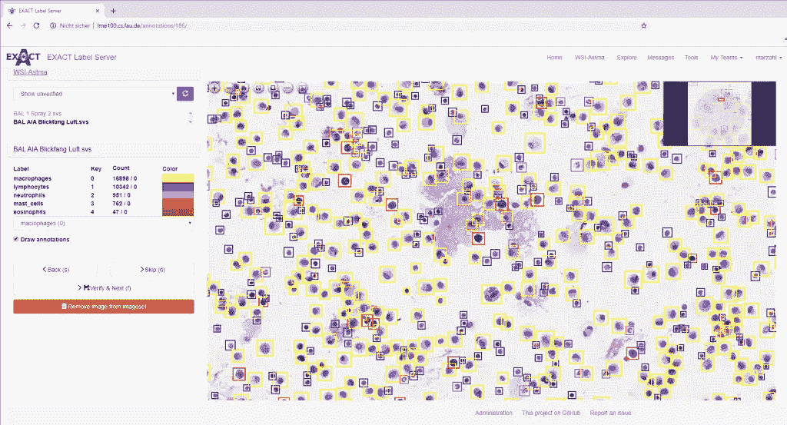
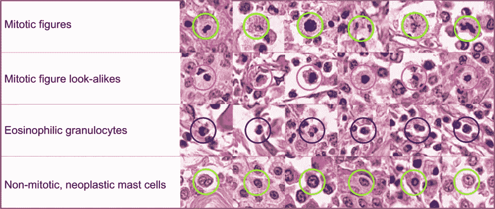
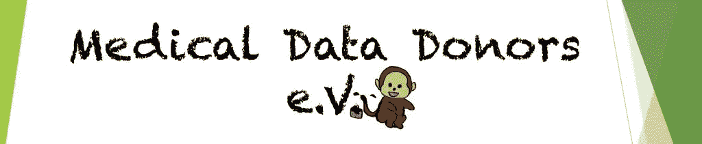
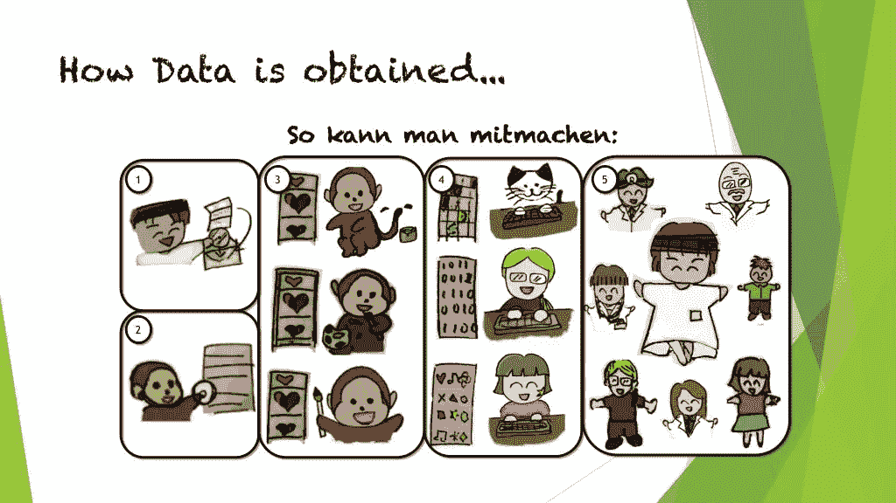

# 我们能解决医疗应用中的数据短缺问题吗？

> 原文：<https://towardsdatascience.com/will-we-ever-solve-the-shortage-of-data-in-medical-applications-70da163e2c2d?source=collection_archive---------34----------------------->

医疗数据是医学中新的深度学习应用的基本要求。照片由[皮查拜](https://www.pexels.com/@pixabay?utm_content=attributionCopyText&utm_medium=referral&utm_source=pexels)从[派克斯](https://www.pexels.com/photo/blue-and-silver-stetoscope-40568/?utm_content=attributionCopyText&utm_medium=referral&utm_source=pexels)拍摄。

在深度学习时代，数据成为构建强大智能系统的重要资源。在几个领域，我们已经看到，构建竞争性系统所需的数据量如此之大，以至于新的参与者几乎不可能进入市场。例如，Google 或 Nuance 等主要公司提供的最先进的大词汇量语音识别系统经过了长达 100 万小时的语音训练。有了如此大量的数据，我们现在能够训练语音到文本系统，准确率高达 99.7%。这接近甚至超过了人类的表现，因为该系统不需要休息、睡眠或尝试。

除了集合之外，数据也需要被注释。对于语音示例，一个小时的语音数据需要大约 10 个小时的人工劳动来写下每个单词和非语言事件，例如咳嗽或大笑。因此，即使我们有 100 万小时的演讲，忽略实际软件开发成本的转录本身——假设每小时 5 美元——就相当于 5000 万美元的投资。因此，大多数公司更愿意从当前的软件供应商那里获得最先进的语音识别系统的许可。

如果数据没有被分配到类别中，它对于机器学习来说通常是无用的。照片由[马库斯·斯皮斯克](https://www.pexels.com/@markusspiske?utm_content=attributionCopyText&utm_medium=referral&utm_source=pexels)从[派克斯](https://www.pexels.com/photo/crowd-reflection-color-toy-1679618/?utm_content=attributionCopyText&utm_medium=referral&utm_source=pexels)拍摄。

对于医疗数据的情况，事情就更复杂了。患者健康数据受到患者数据法的良好保护，这是有充分理由的。不幸的是，各国的标准差异很大，这使得问题更加复杂。最近，几家大医院、[公司](https://deepmind.com/research/open-source/open-source-datasets/)和[卫生当局](https://www.kaggle.com/nih-chest-xrays/data)以匿名方式公开数据，以推动深度学习研究向前发展。然而，这些数据集仅达到从几十到几千的计数，并且与[相关联的注释通常显示出显著的变化](https://arxiv.org/abs/1803.04565)，因为每个数据集通常仅进行一次注释。

Exact 是一个用于医学图像数据注释的开源工具。在 [Github](https://github.com/ChristianMarzahl/Exact) 上找到源代码。图片:[来源](https://github.com/ChristianMarzahl/Exact)。

特别是在医学图像分析中，这些公共数据集对于推动当前的研究非常有用。正如我们在语音处理中看到的，这种较小的数据集(大约 600 小时的语音)适合于开发良好的软件来完成任务。在语音处理方面，这些系统能够识别 90–95%的口语单词。然而，让 99.7%成为可能的游戏规则改变者是 100 万小时的语音数据。

这种观察导致了这样一种需求，即在某个时候，我们将需要数百万张经过良好注释的训练图像来构建最先进的医学分析系统。实际实现这一目标的方法很少:大型行业参与者的大量投资、通过政府机构的组织或非政府组织。一个例外可能是数字病理学，其中[公共数据可以从动物标本中生成](https://www.nature.com/articles/s41597-019-0290-4)。

动物数据在细胞水平上与人类数据非常相似，并且[可以帮助解决患者隐私限制](https://link.springer.com/chapter/10.1007/978-3-658-29267-6_1)。图片:[来源](https://www.nature.com/articles/s41597-019-0290-4)。

虽然语音和其他机器学习训练数据已经主要由行业控制，但有人可能会问，我们是否希望同样的事情发生在我们的医疗记录上。这些数据得到了很好的保护，例如不会在我们不知情的情况下出售给保险公司，这是有充分理由的。因此，我们每个人都应该问问她或他自己，这是否是一个合理的解决方案。

一些国家实际上已经开始在政府控制的数据库中处理医疗数据，允许访问研究人员和工业发展。丹麦是一个已经走上这条道路的例子。看到丹麦和其他国家未来的发展会很有趣。

[医疗数据捐赠者](https://www.medicaldatadonors.org/)的目标是在严格的道德约束下，特别是在医疗程序后获得患者完全同意的情况下，在全球范围内共享医疗研究数据。图片:[医疗数据捐赠者](https://www.medicaldatadonors.org/)。

就在今年，一个名为“医疗数据捐赠者 e.V. ”的小型非营利组织在德国成立。他们遵循第三条道路，要求患者捐献图像数据用于研发。遵循新的欧洲数据保护准则，他们实施了高道德标准。即使在这种强有力的监管框架下，他们也能够在全球范围内收集和共享数据。虽然这种努力才刚刚开始，而且这个组织还很小，但是看看他们能走多远将会很有趣。这特别有趣，因为他们试图通过游戏化来解决注释问题。游戏的故事板已经可以使用了。因此，他们不仅收集数据，还生成高质量的注释。

数据捐赠允许对医学图像的大规模注释使用众包。这是长期获取高质量医疗数据的策略吗？图片:[医学数据捐赠者](https://www.medicaldatadonors.org/index.php/how-to-donate/)。

就在最近，医疗数据捐赠者发表了更多关于数据注释的实际游戏的想法。他们采用常见的游戏，如以器官轮廓为目的的比赛或糖果粉碎来给图像分配标签。特别地，[奥丁之眼](https://www.medicaldatadonors.org/index.php/odins-eye/)似乎是一种用于眼科图像数据的人群注释的令人兴奋的方法。

[奥丁之眼](https://www.medicaldatadonors.org/index.php/odins-eye/)旨在利用糖果粉碎的游戏原理进行医学影像分类。

综上，我们看到医疗数据问题远未解决。我们确定了三种不同的可行解决方案来解决这个问题:工业投资、国家控制或非政府组织。虽然所有这些都有可能，但我们必须问自己更喜欢哪一种。无论如何，这个问题很紧迫，需要解决，以便推动医学领域的深度学习研究。

如果你喜欢这篇文章，你可以看看[我的 YouTube 频道](https://www.youtube.com/channel/UCoiMqX5FHfk_KDow7xSe7pg)。这篇文章最初出现在 MarkTechPost.com 的[上](https://www.marktechpost.com/2018/12/15/will-we-ever-solve-the-shortage-of-data-in-medical-applications/)，以[知识共享 4.0 归属许可](https://creativecommons.org/licenses/by/4.0/deed.de)发布。