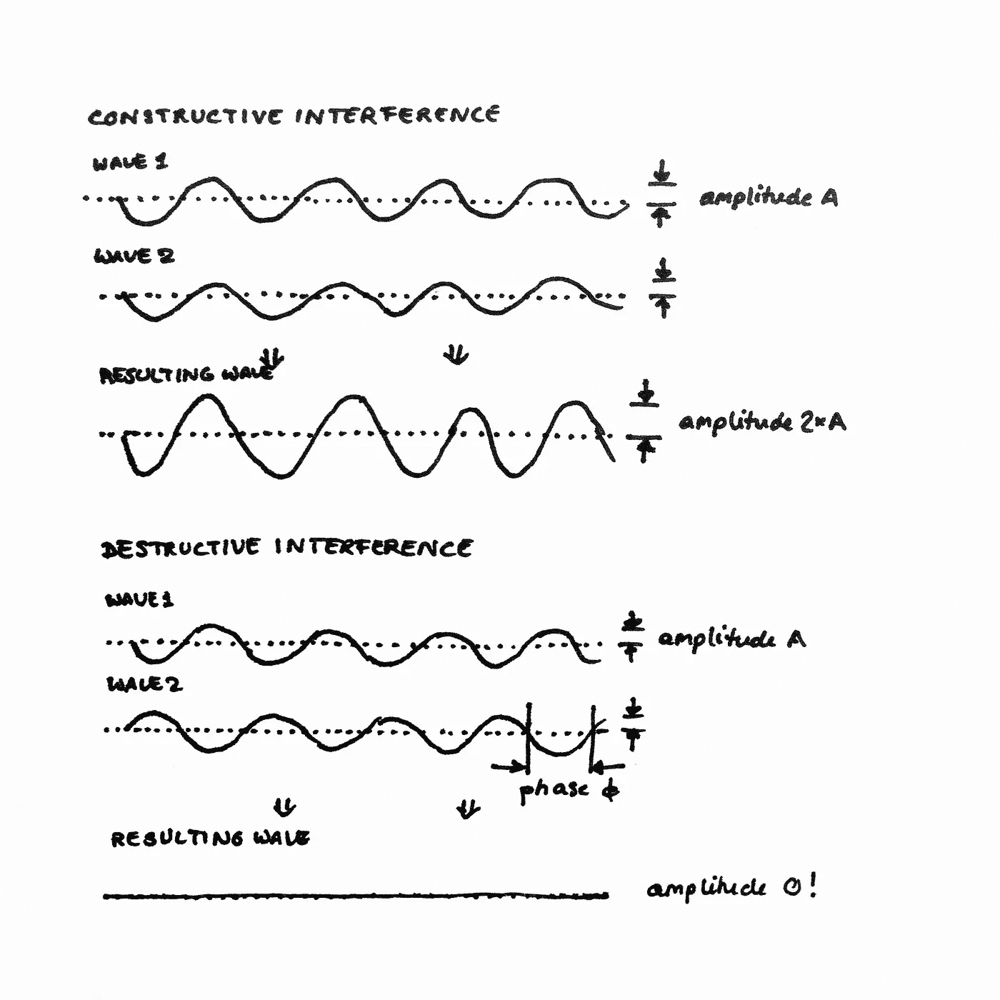

# 我们会看到量子计算革命吗？

> 原文：<https://towardsdatascience.com/will-we-see-a-quantum-computing-revolution-a16b6d677308?source=collection_archive---------50----------------------->

## 在技术成熟的边缘，初创公司正在将量子计算推向下一个阶段。但这是一场革命还是泡沫？

不断变化的计算世界可能正处于下一次革命的边缘。Avi Richards 在 [Unsplash](https://unsplash.com/s/photos/computer?utm_source=unsplash&utm_medium=referral&utm_content=creditCopyText) 上拍摄的照片

 在2019 年末，[谷歌](https://www.nature.com/articles/s41586-019-1666-5)建造了一台量子计算机，可以在三分钟内进行一次计算。这听起来可能不多——你可以用手机在更短的时间内订购外卖晚餐——但同样的任务需要一台经典计算机至少 1000 年。这是量子计算机发展的又一个里程碑。从该领域初创公司的数量以及数百万美元的资金来看，量子计算似乎是科技领域的下一件大事。

专家的预测支持这一观点:到 2025 年，量子计算市场[预计](https://www.statista.com/statistics/1067216/global-quantum-computing-revenues/#statisticContainer)将达到 7.7 亿美元。光是量子密码术[就可能价值](https://www.marketsandmarkets.com/PressReleases/quantum-cryptography.asp)2 . 14 亿美元，因为它提供了从根本上不可破解的连接，可以在从金融到医疗保健的所有领域增加额外的安全层。

鉴于这一信息，可以理解的是，投资者正在寻求向从事量子计算的初创公司注入现金。在 2017 年至 2018 年期间，[投资者向量子计算投入了超过 4.5 亿美元](https://www.nature.com/articles/d41586-019-02935-4)。这是两年前投资额的四倍多。

目前还没有人能回答的问题是，这种投资激增是否会导致泡沫。一旦泡沫破裂，市场可能会降温，并导致“量子冬天”，类似于[人工智能冬天](https://www.investopedia.com/terms/a/ai-winter.asp):投资活动的干旱在过去几十年中多次减缓了人工智能的增长。

目前的繁荣是否是一个泡沫，在这个领域有许多含义。在这个时间点上，投资一家量子计算初创公司或在那里工作，意味着为自己设定一个不确定的未来。这并不意味着量子计算从长远来看不会成功，但在做出决定之前，你需要一些更深入的知识。

由于其令人难以置信的计算能力，量子世界可能有助于带来新的科学突破，发现拯救生命的药物，开发新材料以建造更高效的设备和建筑，发明财务策略以在退休后生活得更好，并找到新的算法来快速引导资源或管理供应链。然而，就目前而言，在我们真正谈论“量子革命”之前，仍有一些挑战需要克服。

 [## 量子计算的需求、前景和现实

### 尽管给我们带来了人类历史上最壮观的技术革新浪潮，但仍有一些…

towardsdatascience.com](/the-need-promise-and-reality-of-quantum-computing-4264ce15c6c0) 

# 量子计算的关键概念

简而言之，与传统计算机相比，量子计算机可以在更少的处理器上存储和处理更多的数据。传统的处理器将所有信息编码成 0 和 1 的序列，0 或 1 的每一个实例都是一位。量子处理器以量子位的形式存储信息，量子位是位的量子类似物。然而，不同之处在于每个量子位可以同时是 0 和 1。

把它想象成一枚硬币:躺在桌子上时，不是正面就是反面。但是如果你旋转它，没有办法判断它是正面还是反面；从某种意义上说，两者都是。取决于它如何旋转，例如，一旦硬币静止，你有 70%的机会得到正面，30%的机会得到反面。这种同时处于两种状态的概念叫做叠加。

由于许多量子位相互作用，你最终会得到一组通过测量 0 和 1 的组合而得到的概率。这导致了比传统比特更大的计算能力。例如，你在屏幕上看到的每个字母都被编码成一个由 8 个 0 和 1 组成的序列，或者说是 8 个经典位。然而，八个量子位相当于 2⁸，或 256 个经典位，因为每个量子位有两种可能的状态。因此，在一台八量子位的量子计算机上，你可以写 32 个字母，而不是一个字母。

*量子位的行为可以用波来描述，就像旋转硬币上的一个点。作者配图。*

目前的技术水平是 50 量子位，由于功率呈指数增长，这种处理能力意味着你可以一次进行千万亿次计算，即 1000 万亿次计算。在过程的最后，你只需测量最终结果，即测量每个量子位的最终状态，你的工作就完成了。即使是最大的超级计算机[也不能做那](https://ai.googleblog.com/2019/10/quantum-supremacy-using-programmable.html)多的处理。

然而，让 50 个或更多的量子位发挥作用并不像听起来那么简单。干涉是一个非常基本的现象，它使得量子位非常容易出错。之前，我把量子位和它们的叠加描述成旋转的硬币。现在想象一下，两个量子位像桌子上的硬币一样嗖嗖地旋转。如果你在每个时间点观察其中一个硬币上的点的位置，它看起来像一个波(见图)。就像声音和水一样，这些波以一定的振幅和波长在空间和时间中传播。

有时，两个波会相消干涉，结果，你什么也测量不到。你可以用两个硬币来思考这个问题:想象它们都在桌面上以相同的速度旋转，比方说，顺时针旋转。进一步想象我们聚焦在每枚硬币的同一点上，但是一枚硬币总是落后于另一枚半圈(见下图中的“相消干涉”一节)。在量子计算中，我们通常不能分开两种测量，所以基本上我们是在测量一种波中的两种波。但是在这种情况下，我们不会测量任何东西，因为硬币的位置抵消了！

这种现象被称为退相干，它是两个波相消干涉的直接结果。目前，这是一个尚未完全解决的问题。退相干会导致错误，当我们构建可能对人类生活产生巨大影响的软件时，我们显然不希望出现这种情况。

量子计算的第三个也是最后一个关键概念是纠缠。这个概念在经典计算世界中没有类比，但当两个量子粒子纠缠在一起时，它们在被测量时总是返回相同的状态。这就好像你有两枚神奇地联系在一起的硬币。因此，如果你能让一枚硬币在东京停止旋转，让另一枚在伦敦停止旋转，只要你同时进行测量，它们都会返回完全相同的结果，正面或反面。

这种现象对量子加密极其重要:在不久的将来，我们也许能够在一台计算机上存储一个量子粒子，并在另一台计算机上将其与一个量子粒子纠缠在一起。这两个粒子之间的连接从根本上来说是安全的，因为任何破坏都可以立即检测到。量子纠缠还意味着我们可以在计算机之间进行即时数据传输，这可能会在未来几十年内产生量子互联网。

*相消干涉仍然是量子计算工作需要解决的一个问题。作者配图。*

# 关于量子计算的三个神话

## **1。我们已经可以建造一台完美的量子计算机。**

当今的量子计算机在任何时候都只有大约 50 个无错量子位，尽管计算机包含更多的量子位。目前，干涉对扩展量子计算系统构成了如此大的挑战，以至于很难让更多的量子位工作。当然，解决这个问题的努力是值得的，因为每个无错误的量子位将使机器的计算能力翻倍！但是，由于科学家们仍在研究如何绕过干扰和退相干，我们距离所谓的容错(即无错误)量子计算机还有很长的路要走。

此外，量子计算机目前难以长时间存储数据，因为量子位退化得相当快。因为没有一台计算机的速度是无限快的，如果一个计算步骤的结果在计算机下一步使用它们之前丢失了，它将不得不再次执行整个计算。就像最终会在桌面上停止旋转的硬币一样，科学家们还没有找到让量子位更长时间保持叠加状态的方法。一旦量子比特的叠加结束，它基本上就是一个经典比特。

 [## 量子计算解释！

### 在亚原子水平上，我们所知道的关于经典物理学的每一件事都破裂了，不仅仅是小幅度的破裂，而是…

towardsdatascience.com](/quantum-computing-explained-a114999299ca) 

## **2。五年后，我们将能够解决所有棘手的计算问题。**

许多公司已经在研究将在量子计算机上工作的算法，我将在下面详细阐述。然而，目前大多数算法都是为具有数百万量子位的容错系统设计的，我们根本还没有达到那个阶段。

此外，我们不太可能很快在家里或办公室里拥有量子计算机。我们将通过远程会话连接到它们，但我们仍然没有弄清楚如何使用经典计算机与量子计算机通信的所有细节。这一领域在学术界和工业界得到了大力发展。尽管如此，到目前为止，像 QCL 这样的量子计算语言仍然是相对基础的。

最后，现在的量子计算机和它们的算法都专注于解决一个问题。例如，谷歌对“量子优势”的证明涉及专门解决一个数学问题的算法，而不能用于其他任何事情。眼下的情况类似于上个十年初机器学习的状态，我们要实现通用量子计算还有很长的路要走。

## **3。很快，我们就能破解任何密码了。**

根据目前的建议，密码应该很长，包含大小写字母、数字和特殊字符。这样，即使是非常强大的计算机也无法破解您的密码。但是有一天，量子计算机也许能够做到这一点。

这听起来很危险，但是 T2 的专家们、T4 的专家们、T7 的专家们、T8 的专家们、T9 的专家们断言，在我们到达那个阶段之前，我们还有很长的路要走。鉴于上述问题，这似乎是可能的。

此外，一旦量子密码破解成为可能，量子加密也应该成为可能。因此，最有可能的情况是，随着量子系统变得越来越强大，我们将看到从经典密码到量子加密的逐渐过渡。

量子计算机已经可以用于商业用途，程序员可以在远程会话中使用它们。伊利亚·安东内尔在 [Unsplash](https://unsplash.com/s/photos/computer?utm_source=unsplash&utm_medium=referral&utm_content=creditCopyText) 上拍摄的照片

# 初创公司如何将量子计算推向市场

虽然有许多重叠的领域，但量子创业公司可以根据其关注的领域大致分为五类:

*   **仪器**包括技术组件和控制平台，帮助其他公司建造量子计算机。
*   量子软件涵盖了从数据分析到网络安全的不同编程语言。
*   **传感器**可用于改善成像，从考古遗址到身份证照片。
*   计算领域的公司为终端用户构建实际的量子处理器和操作平台。
*   **量子通信**处理密码学、网络安全，甚至加密货币。

接下来，我想简要介绍一下这个领域的顶尖玩家，以及他们目前吸引的资金数量。由于资金是投资者对技术信心的有力指标，这可能会导致对量子创业公司未来的有用见解。

## 仪器仪表、工具和服务

量子仪器领域最著名的初创公司之一是总部位于澳大利亚的 [Q-CTRL](https://q-ctrl.com/company/) 。他们的服务面向量子硬件和传感器制造商、量子算法开发者和商业顾问。他们正在通过开发处理退相干和错误的技术来拓展量子计算的边界。可能的应用包括航空航天和医疗保健。Q-CTRL 得到了红杉资本(Sequoia Capital)和 Horizons Ventures 等公司的支持。

这一类别中其他著名的公司包括 [ColdQuanta](https://www.coldquanta.com/#) 和 [Quantum Machines](https://www.quantum-machines.co/team/) 。ColdQuanta 专注于量子技术的冷却系统。这是极其重要的，因为量子位四处移动，当它们变热时变得不可控制。量子机器专注于量子操作系统，也就是说，他们提供硬件来控制量子位。对于今天的计算机，这是一个可能但困难的壮举，尤其是当你在处理大规模的问题时。

 [## 量子编程导论

### 从量子位到运行真实程序的量子编程演练！

towardsdatascience.com](/introduction-to-quantum-programming-a19aa0b923a9) 

## 量子计算机软件

在从富士通、安联和埃森哲获得 4500 万美元的 B 轮融资后，加拿大初创公司[1 qpit](https://1qbit.com/news/1qbit-raises-45m-series-b-round/)似乎正在掌握用量子计算解决真正困难问题的艺术。这包括更准确的飓风及其轨迹的[预测](https://1qbit.com/forecasting-the-weather-using-quantum-computers/)，以及更好地检测新冠肺炎感染后可能发生的肺部异常的[算法](https://1qbit.com/news/1qbit-saskatchewan-health-authority-announce-xrai-chest-radiography-tool-deployment-unprecedented-health-canada-regulatory-approval/)。事实不言自明:根据 1QBit 的网站，它正在与财富 500 强公司合作，并被世界经济论坛确认为技术先锋。

在霍尼韦尔风投和 IBM 的支持下，英国的剑桥量子计算公司是另一家拓展量子软件边界的创业公司，尤其是在化学、网络安全和机器学习领域。他们还建造了一个量子编译器，这是量子软件的重要组成部分，可以将人类制造的代码翻译成计算机可以理解和执行的电路。在这个时候，量子编译器比经典编译器更难构建，但这家初创公司已经接受了挑战。

加拿大初创公司 [ISARA](https://www.isara.com/) 全是量子加密软件。他们的服务范围从防范解密攻击到评估你在量子威胁下的安全程度。其他值得注意的初创公司包括 [QC Ware](https://qcware.com/) 和 [Zapata Computing](https://www.zapatacomputing.com/) ，它们专注于金融、医疗和交通等各种应用的量子软件。

## 超精密传感器和智能材料

瑞士初创公司 Qnami 旨在利用单电子的量子反应实现超精确测量，特别是在物理和纳米技术的科学研究中。凭借强大的合作伙伴，如法国 CNRS 研究中心和卢森堡数字机构 Nvision，他们正在加强未来几年的市场地位。

英国初创公司 [QLM 科技](https://www.qlmtec.com/)采取了略有不同的方法，专注于超精密传感器，这些传感器可以检测气体分子，以监控气体产量，检测气体储层的泄漏，并防止不必要的温室气体排放。其合作伙伴包括石油和天然气供应和服务公司。

另一家英国初创公司 [Quantum Base](https://quantumbase.com/) 拥有完全不同的目标群体:例如，它的光学传感器有助于识别指纹和信用卡的真实性。它还推动了随机数生成领域的发展，这对于密码学和其他软件应用程序来说是非常重要的。

顶级投资者相信量子计算的未来。照片由[布鲁克·卡吉尔](https://unsplash.com/@brookecagle?utm_source=unsplash&utm_medium=referral&utm_content=creditCopyText)在 [Unsplash](https://unsplash.com/s/photos/computer?utm_source=unsplash&utm_medium=referral&utm_content=creditCopyText) 拍摄

## 量子计算的核心

加拿大初创公司 [D-Wave](https://www.dwavesys.com/) 正在提议一项访问量子计算机的云服务，并特别关注优化、机器学习和材料科学方面的问题。高盛公司和不列颠哥伦比亚省发现基金等机构总共出资超过 2 亿美元，它是量子计算领域的巨头之一。

美国初创公司 Rigetti 是 D-Wave 最大的竞争对手之一，也得到了安德森·霍洛维茨(Andreessen Horowitz)和 YCombinator 等公司类似数额的资金。与 D-Wave 一样，它为其量子计算机提供了云平台，目前该计算机以 31 个量子位运行。

虽然 D-Wave 和 Rigetti 依赖于半导体，但 IonQ 和 T2【PsiQuantum】分别采用捕获的离子和光子，采取了略有不同的方法。尽管这些技术没有半导体那么成熟，但它们可能更不容易出错，因此从长远来看对量子计算更有利。然而，就目前而言，预测哪种技术将获胜还为时过早，但 PsiQuantum 的巨额 5 亿美元资金可能是投资者所相信的一个迹象。

## 量子通信和加密

瑞士初创公司 [ID Quantique](https://www.idquantique.com/) 不仅专注于量子安全加密，还致力于随机数生成和量子传感。与其他一些公司相比，它还向市场推出了一款产品，没有任何量子技术知识的人可以使用——一款配备量子随机数生成器的 5G [智能手机](https://www.idquantique.com/id-quantique-and-sk-telecom-announce-the-worlds-first-5g-smartphone-equipped-with-a-quantum-random-number-generator-qrng-chipset/)。这将使安全协议更难被破解，从而使智能手机更加安全。

中国初创公司 QuantumCTek 在 7 月份首次公开募股后股价飙升了 900%以上。它将纠缠用于量子密钥分发，以提供不可破解的安全性。同样活跃在量子安全领域的另一家中国初创公司 [Qasky](http://www.qasky.com/EN/) 可能会朝着类似的方向发展，尽管融资金额仍未披露。

一些荣誉奖包括英国初创公司 [Post-Quantum](https://www.post-quantum.com/) 和澳大利亚初创公司[quintesselabs](https://www.quintessencelabs.com)，它们都在研究量子加密。

 [## 量子计算和人工智能喜结连理

### 2018 年，量子技术人员和大胆的开发人员正在使用量子算法来改造人工领域…

towardsdatascience.com](/quantum-computing-and-ai-tie-the-knot-d4440267451b) 

# 泡沫还是不是泡沫？这是个问题。

投资者是否过度炒作量子计算？作为一名训练有素的物理学家，我毫不怀疑量子是未来，但在这些早期阶段投资它可能还为时过早。毕竟，让每个人都能使用量子计算的公司可能还不存在。此外，一个超级波之后是一个或多个“量子冬天”，这对量子技术的发展可能弊大于利。

另一方面，已经有几个面向研究人员和开发人员的量子云平台。两个例子是由[里盖蒂](https://docs.rigetti.com/en/)和 [IBM](https://www.ibm.com/quantum-computing/technology/experience/) 提出的。前面提到的 ID Quantique 的量子安全智能手机是第一批产品之一，最终用户不需要了解量子计算就可以受益于其中的技术。这些都是充满希望的信号，表明现在仍然是小众现象的量子计算可能在未来十年左右跃入主流技术。

就我个人而言，我不会建议你现在就把钱和时间投入到量子技术中，除非你有坚实的量子物理学背景，以及超出本文范围的专业知识。即使你现在还没有买入，我相信，在未来，初创公司的创始人、员工和投资者仍将获得巨大的利润空间。我会继续关注市场，一旦我觉得某个产品可能真的很快会成为主流，我可能会抓住机会。

【Builtin.com】这个故事最初出现在**上。**