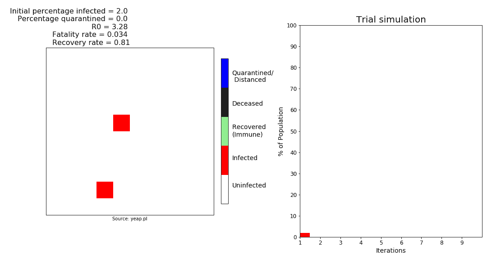
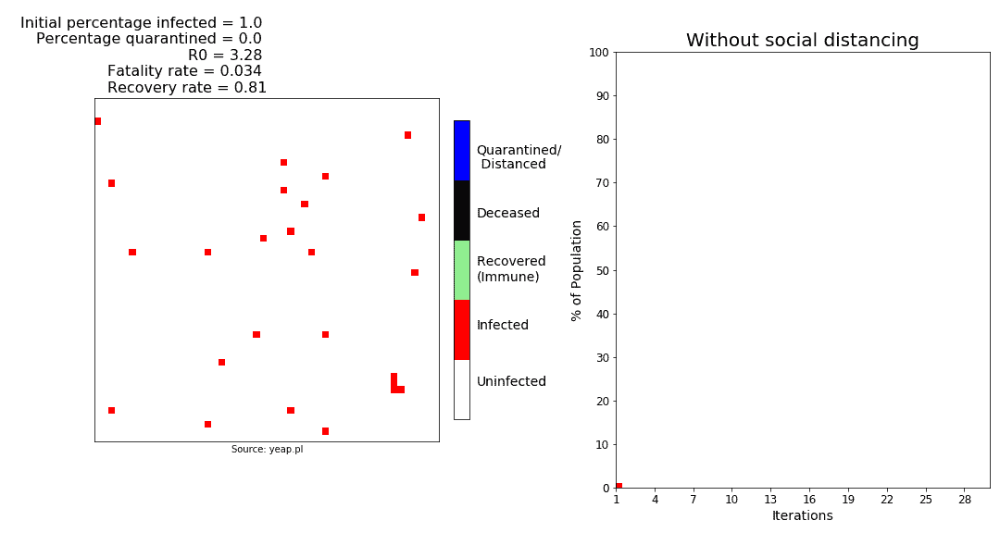
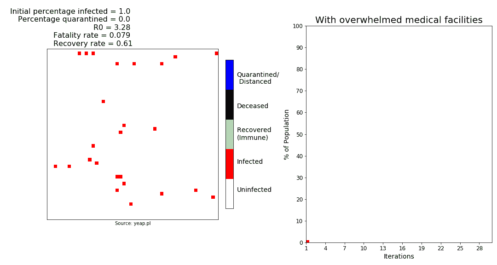
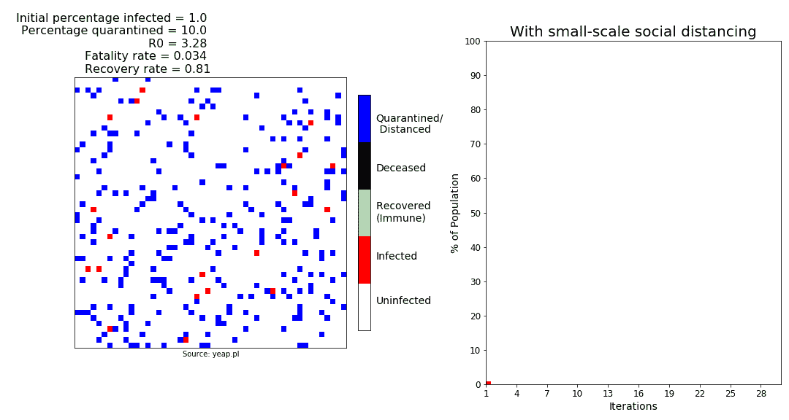
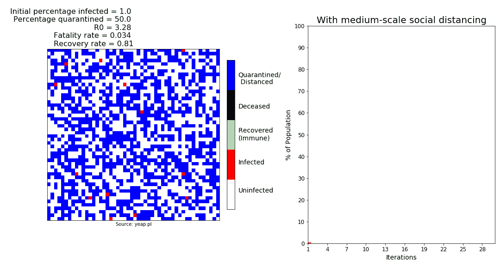
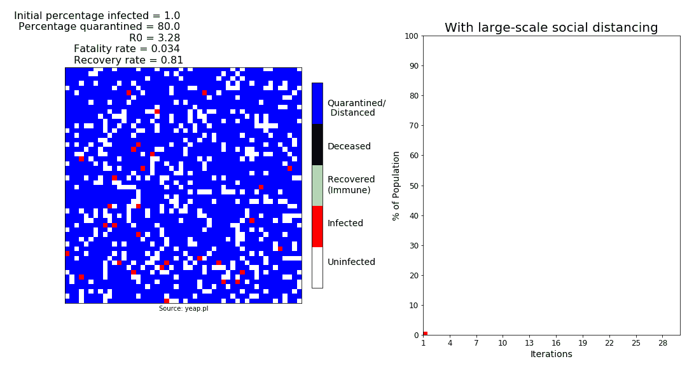

# 我们能在新冠肺炎疫情幸存下来吗？

> 原文：<https://towardsdatascience.com/will-we-survive-the-covid-19-pandemic-d86e8f3c1846?source=collection_archive---------12----------------------->

## 可视化疾病如何在社区中传播的 Python 模拟。

除非你生活在岩石下，否则你可能已经被新冠肺炎疫情的新闻包围了。但是人们、政府、媒体、甚至医疗专家对疫情将如何成功做出了如此多相互矛盾的声明(*哈！*)，很容易迷失在所有的喧嚣中。

所以我想，为什么不利用现有的数据来模拟这种病毒的传播呢？

## **矩阵的规则**

在这里，我使用康威的游戏板来模拟 Python 上的二维细胞群体。一定比例的人口被随机感染。根据目前对不同速率的估计，一个被感染的细胞可以(I)感染邻近的细胞，(ii)恢复，或(iii)死亡。随着模拟的重复，感染会在人群中“传播”。

新冠肺炎的基本再生产数字，或称 *R0* ，随着许多因素而变化；在这个模拟中，我使用的[估计值](https://www.channelnewsasia.com/news/commentary/covid-19-coronavirus-uk-nhs-herd-immunity-policy-boris-johnson-12542820?cid=FBcna&fbclid=IwAR1vwOL04yzteBcMTWKpcsi3KT1jkjdpA0e2_BohWkGVdQgLr5sfmw5tog4)为 3.28。这意味着一个被感染的细胞可以直接感染 3.28 个其他邻近细胞。被感染细胞感染相邻细胞的概率为 *R0* 与相邻细胞数量的比值，即 3.28 / 8 = 0.41。

使用的另外两个比率是死亡率和恢复率。致死率取自死亡率——已知死亡人数除以确诊病例总数。根据世卫组织的统计，截至 3 月 3 日，全球死亡率为 3.4%。康复率被认为是 81%，因为如果给予积极治疗，大多数病例最终会康复。

TL；DR —在此模拟中，一个被感染的细胞感染 8 个相邻细胞的概率为 0.41，恢复的概率为 0.81，死亡的概率为 0.034。

100 个细胞的试验模拟。被感染的细胞(红色)可以感染其他细胞，恢复(绿色)，或者死亡(黑色)。未感染的细胞为(白色)。

## 我们可能会挺过来。

如果这些假设是正确的，大多数人类将在这次疫情中幸存下来。在这个 2500 个细胞的模拟中，感染被允许自由传播(顺便说一下，这是英国计划用其群体免疫策略做的事情)。

2500 个细胞的群体，其中 1%最初被感染。

在这里，大多数细胞最终恢复，但这肯定不是一个理想的结果。几乎整个 T2 的 T3 人群最终都会被感染，在现实世界中，他们中的许多人可能会遭受一些健康或财务并发症的困扰。

还有大约 5%的人口死于感染。英国人口约 6800 万，这一数字相当于 300 多万人。

在感染高峰期，大约 20%的人口同时被感染。对于一大群人来说，这是*很多人*，这可能会让医疗系统不堪重负。这就引出了下一点。

## 医疗保健至关重要。

3.4%的致死率和 81%的恢复率是基于这样的假设，即所有受感染的病例在感染后都得到及时和充分的医疗保健。这并不总是正确的，尤其是当医疗系统不堪重负的时候。在这个模拟中，我使用了意大利 7.94%的[死亡率](https://www.businessinsider.sg/coronavirus-death-rate-by-country-current-fatalities-compared-to-cases-2020-3?op=1&r=US&IR=T)以及更低的恢复率。

使用较高的死亡率和较低的恢复率来模拟不堪重负的医疗保健系统。

当然，人类不会灭绝，但在高峰期，四分之一的人口被感染，超过 10%的人口最终死亡。我们当然不想走上这条道路。那么我们该怎么办呢？

## 社交距离很有用。

社交距离包括人们避免聚会或大型活动，以减缓疾病的传播。这意味着人们不应该聚集在一起，即使他们正在祈祷消灭病毒。

在这个模拟中，当一个细胞被隔离或隔离时，它被认为是未被感染的，也不会被其他细胞感染。

小范围的社交距离。被隔离或隔离的细胞(蓝色)被认为未被感染，也不会被感染。

随着小规模的隔离(10%的人口被隔离)，感染峰值已经下降到 10%左右。曲线明显变平，一些人群甚至可以免受感染。

中等规模的社交距离。感染被控制在可控制的水平。

随着 50%的群体被拉开距离，距离较远的细胞(蓝色)明显减缓了传播。感染被控制在可管理的水平，医疗保健系统没有受到损害。

大规模的社交距离。疾病消失了。

随着 90%的人口远离，这种疾病迅速消亡。这可能就是为什么此次疫情的源头武汉能够将国内新增感染人数降至零(T1)。

## 最后

这些模拟会错吗？绝对的。这些只是建立在有限的输入和可疑的假设上的简单的计算机模型，由那些有太多时间练习社交距离的人建立。但是我想它们仍然可以作为一种替代的可视化工具。

所以伙计们，保持距离。

*免责声明:作者对本次模拟练习的完整性、可靠性和准确性不做任何保证。你对这篇文章的信息采取的任何行动完全是你自己的风险。*