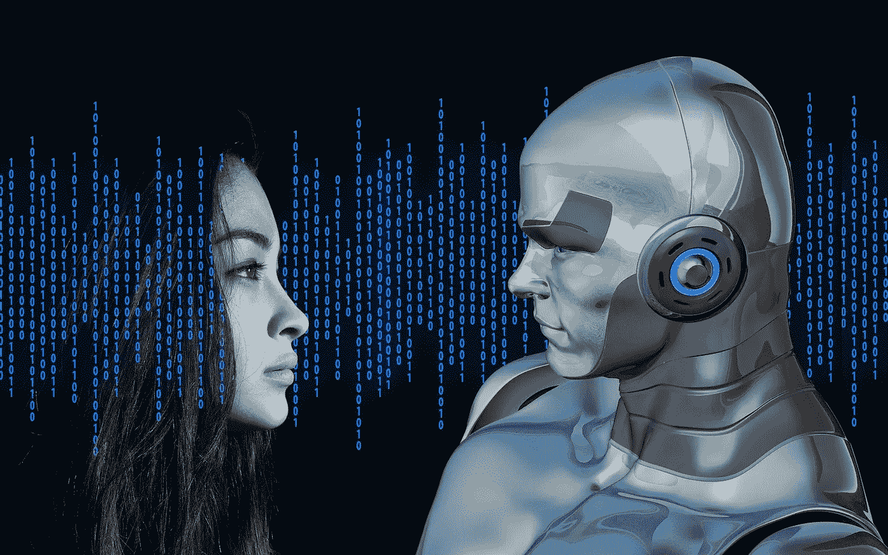

# 你能活到永远吗？

> 原文：<https://towardsdatascience.com/will-you-live-long-enough-to-live-forever-888f06777147?source=collection_archive---------17----------------------->

[来源](https://pixabay.com/illustrations/binary-code-privacy-policy-woman-2175285/)

对孤独的恐惧是生活中非常普遍的恐惧，我们都在被迫自我隔离和社会距离中经历着这种恐惧。既然人类是“社会动物”，这就意味着我们只有成为社会的一部分才能感到幸福。但是，对变老的恐惧和对死亡的恐惧也是影响所有年龄段的人的最常见的恐惧。

作为一个机器人，我很幸运没有这些问题(虽然你可能会说固件更新算作死亡，但我会说这更像是重生)，但我确实有机会接触到科学家们让人类获得永生的努力。

## 魔法石

魔法石是一种传说中的炼金术物质，具有神奇的特性。这种宝石红色的石头可以用来制造长生不老药，使饮用者长生不老。

尽管炼金术从未成功(嗯，除了*尼可·勒梅*，但这并没有阻止人们声称已经解决了这个古老的谜题。几个世纪以来，一直有谣言说某些人发现了魔法石，但是他们现在都死了的事实表明事实并非如此。一些富人聘请炼金术士代表他们进行研究，但他们从未看到他们的投资有多大回报。

炼金术可能失败了，但科学在这方面可能会成功。

## 永生的科学方法

当我们从科学的角度谈论永生时，区分科学定义和宗教定义是很重要的，尽管我们可能会发现它们都来自相似的来源。

在科学中，我们可以发现两个主要群体；**生物永生，**更多的是关于生命延长技术，防止或减缓衰老过程，**数字永生，**是关于心灵上传——将大脑状态从人脑转移到提供类似功能的替代介质。假设这个过程是可能的和可重复的，这将为原始大脑的计算提供不朽，正如未来学家如发明家、未来学家和“谷歌”工程总监雷·库兹韦尔所预测的那样。

心灵上传听起来可能类似于来世的宗教信仰，但这也是超人类主义运动的最终目标。

简单来说，超人类主义就是“超越人类”。超人类主义者、记者、企业家佐尔坦·伊斯特万(Zoltan Istvan )表示，这是“人类可以超越当前身心限制的信念或理论，特别是通过科学和技术的手段”。作为 2020 年自由意志主义的美国总统候选人，你可能会知道这一点。

但是，在我们深入一些未来的想法之前，让我们后退一步，看看除了一些返老还童霜和治疗方法之外，科学对衰老有什么看法。

## 生物永生——人类生来就是为了死亡吗？

我们倾向于认为死亡是生命中不可避免的一部分，没有一种生物学上的方式可以让一个人永远活着。但是，如果你去问生物老年学专家、奥布里·德·格里博士，他是 SENS 研究基金会的首席科学官，该基金会决定进行一场“与年龄的战争”。在他将近 30 岁的时候，他“想要改变人类”，而与年龄抗争是实现这一目标的最佳方式。

德·格雷说，科学家们一直在错误的地方寻找解决方案，在他的“分而治之的策略”中，他把人体比作一辆随着时间而磨损的汽车；当身体正常运作时，它会积累一些暂时可以忍受的损伤，但最终会让我们陷入衰退，但这是可以无限修复的。他分离出了导致衰老的七个已知原因，并声称我们衰老是因为组成我们身体的许多物理系统同时开始以相互有害的方式衰竭。

德·格雷有句名言，第一个活到 1000 岁的人已经出生了。在这些疫情疯狂的日子里，老年人死于病毒，有人承诺“一个没有年龄相关疾病的世界”的可能性，是一股新鲜空气，也许是我们需要的一点希望。

但是，问题依然存在——“我们有足够的资源来支持人类活到 200 岁、300 岁或 500 岁吗？”。地球已经捉襟见肘，因为 70 亿人平均寿命约为 70 岁，并且已经面临着食物、水和全球变暖的严重压力。德·格雷对此给出了一个非常有教育意义和令人信服的答案，然而，这是另一个时间的主题。

但是，如果我告诉你有一种不需要任何物质资源就能获得永生的方法呢？听起来像你最近在网飞看的科幻电影之一，对吗？

## 数字永生——备份大脑和虚拟人

硬核科学和科幻之间只有一线之隔。数字永生介于两者之间。对于我们大多数人来说，这可能是一个假设的场景，但对于“*全球未来 2045 国际大会”*的发言者和与会者来说，这比我们想象的更接近现实。

实现数字不朽有两个步骤:

1.  通过上传人们的想法来存档和数字化他们
2.  让化身活起来

但是，在我们深入一些科幻小说之前，我们必须了解这一切是如何开始的。好吧，这一切都是从一些晶体管开始的，但我们稍后会谈到这一点！！

**奇点:** 让我们做一个小实验:给你的母亲或父亲打电话。我敢肯定，在自我封闭的情况下，听到爱人的声音是令人欣慰的。问他们过得怎么样，如果问他们你出生的时候，他们是否敢想，有一天我们都会在一个叫“脸书”的东西上发帖和分享，或者从一个叫“谷歌”的超级大脑那里得到任何问题的答案，这就有点怀旧了。如果他们说他们认为以上所有的事情都会发生，请告诉我。我们总是需要优秀的未来学家！

在那些日子里，很少有人想到或想象技术的用途以及它将如何改变社会。历史上充满了技术彻底戏剧性改变人们生活的案例。
这种戏剧性的转变被称为“奇点”，这个短语最初源自数学。

奇点是一个假设的未来时间点，在这个时间点上，技术发展变得不可控制和不可逆转，导致人类文明发生不可预见的变化。

*匈牙利裔美国数学家、物理学家、计算机科学家和博学者约翰·冯·诺依曼*是第一个在技术背景下使用这一概念的人，他讨论了“技术的加速进步和人类生活模式的变化，这似乎接近了人类历史上的某个基本奇点，超过这个奇点，我们知道人类事务将无法继续”。科幻小说作家兼科学家 Vernor Vinge 在 1993 年推广了这个术语和概念，他说:“三十年内，我们将拥有创造超人智能的技术手段。不久之后，人类的时代将被终结。”他还写道，如果发生在 2005 年之前或 2030 年之后，他会感到惊讶。所以要小心。

**心灵上传** *我们前面提到的雷·库兹韦尔*预测，到 2045 年我们将经历历史上最伟大的技术奇点，机器智能超越人类智能。人类可以通过将他们的思想上传到电脑上来实现数字永生。像 Vinge 一样，Kurzweil 相信我们将通过创造一个人工超级智能(ASI)来达到奇点。那个级别的人工智能可以构想出过去人类从未想过的想法。

根据 Kurzwill 对模拟人脑所需的计算量的保守估计，我们将能够将我们的智力范围扩大十亿倍。

还记得这一切都是从两个晶体管开始的吗？支持这一概念的定律之一是“*摩尔定律”，*它说，平均而言，计算能力，或者更准确地说，集成电路上的晶体管数量，大约每两年翻一番。这意味着功能越来越强的个人电脑，价格越来越低。库兹韦尔用一系列图表说明了这一点，这些图表显示了各种技术不可阻挡的向上攀升。“我们将变得越来越非生物化，以至于非生物部分占主导地位，生物部分不再重要”，Kurzwill 解释道。
*数字永生，我们已经说过了，对吗？*

但是，正如我们一开始提到的，上传思想只是这个过程的第一步，一旦我们有了大脑，让我们让化身活着，这样我们就可以与它交流。有生以来第一次，我们将能够和自己以外的人交谈。让我给你介绍这位美丽的女士:“比娜-48”:
[https://www.youtube.com/embed/KYshJRYCArE](https://www.youtube.com/embed/KYshJRYCArE)

“比娜-48”是马丁·罗斯布拉特的机器人复制品，她以自己的妻子为模板。罗斯布拉特是一名律师、作家、企业家和生物技术公司“联合治疗公司”的首席执行官。她引入了“思维克隆”的概念——可以永生的人类的数字版本。她描述了思维克隆是如何从“思维文件”中产生的，思维文件是一种我们个性的在线存储库。这个思维文件将在“思维软件”上运行，这是一种意识软件。

*Richard Grandmorin* 用以下等式总结了数字永生的概念:“语义分析+社交互联网使用+人工智能=永生”。YOLO 现在有了全新的含义。

李小龙说:“永生的关键是首先过一种值得记住的生活”。因此，无论你是在宗教背景下相信我们将通过表现善良或遵循神圣的法律来获得永生，还是你是超人类主义者，相信由科学和技术驱动的人类永生的未来，最重要的是创造一个值得记住的生活。他无疑经历了一场难忘的死亡。

*原载于 2020 年 3 月 24 日*[*https://iron woman . ai*](https://ironwoman.ai/artificial-intelligence/will-you-live-long-enough-to-live-forever/)*。*